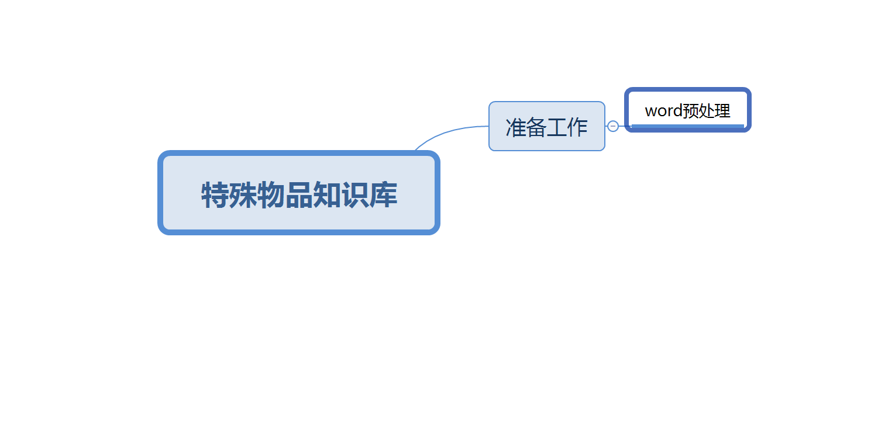

---
# 同时设置标题名称和顺序，order 越小越靠前，默认为 0
title: 质检总局关于印发《出入境特殊物品风险管理 工作规范（试行）》的通知
order: 7
---

> 国家质量监督检验检疫总局文件
>
> 国质检卫〔2015〕269 号

# 质检总局关于印发《出入境特殊物品风险管理 工作规范（试行）》的通知

> 各直属检验检疫局：
>
> 《出入境特殊物品卫生检疫管理规定》（质检总局令第160 号）
>
> 已于 2015 年 3 月 1 日起施行。为有效贯彻落实总局 160 号令， 总局制定了《出入境特殊物品风险管理工作规范（试行）》，现印发 你们，请遵照执行。执行中如遇有问题，请及时报总局卫生司。
>
> 请各局结合当地的实际情况，在本规范框架下，制定本局的特 殊物品风险管理工作规程。
>
> 质检总局
>
> 2015 年 6 月 19 日

{width="6.729166666666667in" height="3.2069444444444444in"}

# 出入境特殊物品风险管理工作规范（试行）

> **第一条** 为规范出入境特殊物品（以下简称特殊物品）风险管 理，提高特殊物品卫生检疫监管的科学性、有效性，根据《中华人 民共和国国境卫生检疫法》及其实施细则、《出入境特殊物品卫生 检疫管理规定》《环保用微生物菌剂进出口环境安全管理办法》《人 类遗传资源管理办法》等有关法律法规的要求，制定本工作规范。 **第二条** 本工作规范适用于特殊物品和特殊物品生产、经营、使

用单位及其代理人（以下简称特殊物品单位）的生物安全风险管理。

> **第三条** 特殊物品风险管理，是指遵循风险管理原则，对特殊物品实行风险分级、对特殊物品单位实行监管分类，采取相应的检 疫监管措施，并动态调整。
>
> **第四条** 质检总局负责特殊物品风险管理的规划、指导和监督， 发布特殊物品风险分级名录。
>
> 直属检验检疫局负责根据特殊物品分级名录实施特殊物品分级管理，负责本辖区特殊物品单位的分类及监督管理。
>
> **第五条** 质检总局根据特殊物品致病性、致病途径、使用方式和用途以及可控性等风险因素，将特殊物品划分为 A、B、C、D 四个级别（附件 1）。
>
> **第六条** 直属检验检疫局根据特殊物品单位的生物安全控制能力和信用等级进行综合评定，将出入境特殊物品单位分为一、二、 三、四类，并做好评定过程的记录和结果公布。
>
> （一）生物安全控制能力。
>
> 根据特殊物品单位资质及其提供的生物安全资料，经现场考核， 将特殊物品单位的生物安全控制能力分为1、2、3、4 级，与BSL-1、BSL-2、BSL-3、BSL-4 相对应。
>
> 因资料不完整、无法进行现场考核的特殊物品单位的生物安全 控制能力等级视同为 1 级。
>
> （二）信用等级。
>
> 根据《出入境检验检疫企业信用管理办法》对辖区内出入境特殊物品单位实施信用管理，将其信用等级评定为 AA、A、B、C、D 五级，未评定的按 B 级管理。
>
> （三）特殊物品单位分类。
>
> 综合评分=生物安全控制能力的等级数 X 信用系数信用系数：AA=1.2 A=1 B=0.8 C=0.6 D=0.4
>
> 一类单位：综合评分大于等于 3 分的；
>
> 二类单位：综合评分大于等于 2 分小于 3 分的；
>
> 三类单位：综合评分大于等于 1 分小于 2 分的；
>
> 四类单位：综合评分小于 1 分的。
>
> **第七条** 特殊物品单位信息发生改变的，如单位名称、地址、 法定代表人、经营范围、实验室安全等级等，所在地检验检疫机构应当及时予以变更。
>
> 特殊物品单位信息的变更影响其分类时，检验检疫机构应当及 时调整其分类，必要时可以进行现场审核。
>
> **第八条** 直属检验检疫局根据特殊物品的风险等级采取相应的审批、查验和监管。
>
> A 级特殊物品检疫审批需核查相关主管部门批准文件，审批单有效使用次数为一次，不能核销，批批查验，并实施后续监管。
>
> B 级特殊物品检疫审批需开展风险评估，审批单一次审批，分批核销，抽批查验（抽批率不低于 30%，首次出入境必须查验），全部实施后续监管。取得相关部门批准文件的 B 级特殊物品，应由审批人员判定是否需要开展风险评估，如无需开展风险评估，可以直接进入审批程序。
>
> C 级特殊物品检疫审批由审批人员直接判定，无需风险评估， 审批单有效使用次数为多次，允许核销，实施抽批查验，且查验抽批率不低于 20%，首次出入境必须查验。
>
> D 级特殊物品检疫审批需核查药品监督管理部门的批准文件， 审批单有效使用次数为多次，允许核销，实施抽批查验，且入境查验抽批率不低于 10%，出境不低于 2%，首次出入境必须查验。可以授权分支机构开展行政许可审批。
>
> 第九条 直属检验检疫局应当根据特殊物品单位分类结合特殊物品风险分级，对特殊物品单位实施相应的监督管理。
>
> （一）一类单位日常监管每年不少于 1 次（年进出口批次大于等于 1）。
>
> （二）二类单位日常监管每年不少于 2 次（年进出口批次大于等于 2）。
>
> （三）三类单位日常监管每年不少于 3 次（年进出口批次大于等于 3）。
>
> （四）四类单位日常监管每年不少于 4 次（年进出口批次大于等于 4）。
>
> **第十条** 检验检疫机构应当按照第九条要求对辖区内特殊物品单位开展日常监管，参照《出入境特殊物品单位生物安全监管记 录表》（附件 2）做好监管记录。
>
> 日常监管内容为：
>
> （一）核查被监管单位的生物安全信息等与所申报是否相符， 以及境外生物安全控制体系是否完备；
>
> （二）核查被监管单位是否具有生物安全管理体系并正常运行；
>
> （三）核查被监管单位的特殊物品生产、使用、运输、保存、 销售、销毁记录。
>
> **第十一条** 本规范由质检总局卫生司负责解释。
>
> 附件：1. 出入境特殊物品风险分级监管表
>
> 2\. 出入境特殊物品单位生物安全监管记录表
>
> 附件 1

# 出入境特殊物品风险分级监管表

+------------+--------------------------------------------------------------------------------+------------------------------+--------------------------------------------------------------------------------+--------+--------+
| > 风险等级 | > 分级细目 | > 监管方式 | | | |
+============+================================================================================+==============================+================================================================================+========+========+
| | | > 风险 | > 审批要求 | > 分批 | > 后续 |
| | | > | | > | > |
| | | > 评估 | | > 核销 | > 监管 |
+------------+--------------------------------------------------------------------------------+------------------------------+--------------------------------------------------------------------------------+--------+--------+
| > A 级 | > 含有《人间传染的病原微生物名录》中的一、二类病原微生物的特殊物品 | > 审批人员判定 | > 需要主管部门批文， 审批有效期为 3 个月 | > 不能 | > 是 |
+------------+--------------------------------------------------------------------------------+------------------------------+--------------------------------------------------------------------------------+--------+--------+
| | > 入境的人体血液、血浆、组织、器官、细胞、 | | | | |
| | > | | | | |
| | > 骨髓 | | | | |
+------------+--------------------------------------------------------------------------------+------------------------------+--------------------------------------------------------------------------------+--------+--------+
| | > 涉及人类遗传资源的出境特殊物品 | | | | |
+------------+--------------------------------------------------------------------------------+------------------------------+--------------------------------------------------------------------------------+--------+--------+
| | > 环保微生物菌剂 | | | | |
+------------+--------------------------------------------------------------------------------+------------------------------+--------------------------------------------------------------------------------+--------+--------+
| > B 级 | > 含有《人间传染的病原微生物名录》中的三类病原微生物的特殊物品 | > 审批人依据专家评估意见判定 | > 需要提供风险评估报告或卫生行政主管部门批文或环境部门批文，审批有效期为6 个月 | > 允许 | > 是 |
+------------+--------------------------------------------------------------------------------+------------------------------+--------------------------------------------------------------------------------+--------+--------+
| | > 可能含有一、二、三类病原微生物及尚未认 | | | | |
| | > | | | | |
| | > 知其传染性的特殊物品 | | | | |
+------------+--------------------------------------------------------------------------------+------------------------------+--------------------------------------------------------------------------------+--------+--------+
| | > 含有或可能含有寄生虫的特殊物品 | | | | |
+------------+--------------------------------------------------------------------------------+------------------------------+--------------------------------------------------------------------------------+--------+--------+
| | > 一、二类病原微生物完整或修饰基因组核酸 | | | | |
| | > | | | | |
| | > 物质 | | | | |
+------------+--------------------------------------------------------------------------------+------------------------------+--------------------------------------------------------------------------------+--------+--------+
| | > 由病原微生物产生的，以及已知对人类有害 | | | | |
| | > | | | | |
| | > 的毒素 | | | | |
+------------+--------------------------------------------------------------------------------+------------------------------+--------------------------------------------------------------------------------+--------+--------+
| | > 未经裂解或纯化工艺不完全的蛋白类产品。 | | | | |
+------------+--------------------------------------------------------------------------------+------------------------------+--------------------------------------------------------------------------------+--------+--------+
| > C 级 | > 含有《人间传染的病原微生物名录》中四类 | > 审 批 | > 审批单有效期 12 个月 | > 允许 | > 否 |
| | > | > | | | |
| | > 病原微生物及名录以外的其它医学微生物 | > 人 员判定 | | | |
+------------+--------------------------------------------------------------------------------+------------------------------+--------------------------------------------------------------------------------+--------+--------+
| | > 国际知名菌种保藏机构（如 ATCC、CMCC） | | | | |
| | > | | | | |
| | > 商品化科研用（非临床用）细胞株（系） | | | | |
+------------+--------------------------------------------------------------------------------+------------------------------+--------------------------------------------------------------------------------+--------+--------+
| | > 经裂解或纯化的蛋白类产品，如酶、抗体、细胞因子、激素、重组蛋白、多肽等（毒素 | | | | |
| | > | | | | |
| | > 和朊病毒除外） | | | | |
+------------+--------------------------------------------------------------------------------+------------------------------+--------------------------------------------------------------------------------+--------+--------+
| | > 除一、二类病原微生物完整或修饰基因组核酸物质以外的核酸物质，如文库)、引物、 | | | | |
| | > | | | | |
| | > 质粒 DNA、RNA 等 | | | | |
+------------+--------------------------------------------------------------------------------+------------------------------+--------------------------------------------------------------------------------+--------+--------+
| | > 用于与人类疾病预防、诊断、治疗活动有关 | | | | |
| | > | | | | |
| | > 的注册、临床试验目的特殊物品 | | | | |
+------------+--------------------------------------------------------------------------------+------------------------------+--------------------------------------------------------------------------------+--------+--------+
| | > 一般情况下不会引起人类疾病的其他特殊 | | | | |
| | > | | | | |
| | > 物品 | | | | |
+------------+--------------------------------------------------------------------------------+------------------------------+--------------------------------------------------------------------------------+--------+--------+

+------------+-----------------------------------------------------------------+----------------+------------------------------------------------------+--------+--------+
| > 风险等级 | > 分级细目 | > 监管方式 | | | |
+============+=================================================================+================+======================================================+========+========+
| | | > 风险 | > 审批要求 | > 分批 | > 后续 |
| | | > | | > | > |
| | | > 评估 | | > 核销 | > 监管 |
+------------+-----------------------------------------------------------------+----------------+------------------------------------------------------+--------+--------+
| > D 级 | > 已获得药品注册证/出口销售证明的入/出 | > 审批人员判定 | 审批单有效 期 12 个月， 可授权分支 机构开展行 政审批 | > 允许 | > 否 |
| | > | | | | |
| | > 境人用疫苗或其他预防用生物制品 | | | | |
+------------+-----------------------------------------------------------------+----------------+------------------------------------------------------+--------+--------+
| | > 已获得医疗器械注册证/出口销售证明的入 | | | | |
| | > | | | | |
| | > /出境体外诊断试剂 | | | | |
+------------+-----------------------------------------------------------------+----------------+------------------------------------------------------+--------+--------+
| | > 已获得药品注册证/出口销售证明的入/出境治疗用生物制品/血液制品 | | | | |
+------------+-----------------------------------------------------------------+----------------+------------------------------------------------------+--------+--------+

> 说明：针对特殊物品的风险识别结果进行判定，当某一特殊物品拥有两种或两种以上危害时，以高级别的危害程度作为该特殊物品的危害程度，同时评价申请方是否具备与申请特殊物品所导致风险及其目的用途风险水平相应的生物安全控制措施。需要开展风险评估的特殊物品，其风险判定工作可以按照风险评估规定的要求开展。
>
> 附件 2

# 出入境特殊物品单位生物安全监管记录表

> 一、基本信息

+----------------+---------------------------------+------------+--------------+
| > 特殊物品单位 | | > 单位类型 | |
+================+=================================+============+==============+
| > 检验检疫机构 | | > 日期 | |
+----------------+---------------------------------+------------+--------------+

> 二、现场检查情况

A. 文字资料检查记录

> A1. 现场文件资料检查（科研、生产、医疗、检验、医药服务外包单位）
>
> A2. 现场文件资料复核（销售单位）

+---------------------------------------------------------------------------------------------------------------------+-----------------+---------+---------+
| > A2.6 涉及有仓储的销售单位应提供生物安全管理制度和执行情况自查记录（含突发感 | > □符合 □不符合 | | |
| > | | | |
| > 染性物质污染的应急处置方案及演练记录） | | | |
+=====================================================================================================================+=================+=========+=========+
| > A2.7 涉及有仓储的销售单位提供仓储场所平面图及仓储布局（在平面图上标记出普通产品和特殊物品堆放的区域分布）、储藏设 | > □符合 □不符合 | | |
| > | | | |
| > 备以及调试、校准、保养记录 | | | |
+---------------------------------------------------------------------------------------------------------------------+-----------------+---------+---------+
| > A2.8 生物废弃物处理方案以及情况记录 | > □符合 □不符合 | | |
+---------------------------------------------------------------------------------------------------------------------+-----------------+---------+---------+

B. 现场检查记录

> B1. 生产加工场所和实验室情况（选择相应的检查项目）

+------------------------------------------+-----------------+----------------+------------+
| > B1.21 具有个体防护装备 | > □符合 □不符合 | | |
+==========================================+=================+================+============+
| > B1.22 操作人员正确着装 | > □符合 □不符合 | | |
+------------------------------------------+-----------------+----------------+------------+
| > B1.23 放置废弃物的容器具有指定区域 | > □符合 □不符合 | | |
+------------------------------------------+-----------------+----------------+------------+
| > B1.24 正确使用生物废弃物垃圾袋 | > □符合 □不符合 | | |
+------------------------------------------+-----------------+----------------+------------+
| > B1.25 场所内张贴管理的规章制度 | > □符合 □不符合 | | |
+------------------------------------------+-----------------+----------------+------------+
| > **仓储场所（销售单位含仓储）** | > **判定** | > **客观描述** | > **得分** |
+------------------------------------------+-----------------+----------------+------------+
| > B1.26 有储藏设备温控及调试记录 | > □符合 □不符合 | | |
+------------------------------------------+-----------------+----------------+------------+
| > B1.27 有储藏设备校准和保养记录 | > □符合 □不符合 | | |
+------------------------------------------+-----------------+----------------+------------+
| > B1.28 放置废弃物的容器有指定区域 | > □符合 □不符合 | | |
+------------------------------------------+-----------------+----------------+------------+
| > B1.29 正确处置生物废弃物 | > □符合 □不符合 | | |
+------------------------------------------+-----------------+----------------+------------+
| > B1.30 场所内张贴突发生物安全事件的应急 | > □符合 □不符合 | | |
| > | | | |
| > 处置程序 | | | |
+------------------------------------------+-----------------+----------------+------------+
| > B1.31 含有生物风险的产品需单独区域存 | > □符合 □不符合 | | |
| > | | | |
| > 放，加贴生物安全标识，专人专锁 | | | |
+------------------------------------------+-----------------+----------------+------------+

> 体系管理
>
> 注：满分 100 分，判定不符合则该项扣分，带☆项每项 10 分，其余项每项 5 分。
>
> 三、检查结论

+-----------------------------------------------------------------------+
| > 检查结论 |
+=======================================================================+
| - 现场检查合格，不符合项为（ ）项，得分为（ ） |
| |
| - 存在严重不符合项，现场检查不合格。 |
| |
| - 存在不符合项，单位应在 年 月 日前完成整改。 |
| |
| - 其它： |
| |
| > 检查人员（签名）： |
| |
| 年 月 日 |
+-----------------------------------------------------------------------+
| 不符合项描述 |
+-----------------------------------------------------------------------+
| > 不符合项编号和客观描述： |
+-----------------------------------------------------------------------+
| > 单位确认 |
+-----------------------------------------------------------------------+
| - 以上情况属实。 |
| |
| - 以上情况与实际有出入，有关情况详见附加说明。 |
| |
| > 负责人（签名）： |
| |
| 年 月 日 |
+-----------------------------------------------------------------------+
| 整改跟踪验证 |
+-----------------------------------------------------------------------+
| - 经跟踪验证，上述存在问题已经整改（整改报告及验证材料另附）。 |
| |
| - 其它： |
| |
| > 检查人员（签名）： |
| > |
| > 年 月 日 |
+-----------------------------------------------------------------------+

> 说明：《出入境特殊物品单位生物安全监管记录表》的内容各局可根据工作需要适当调整。
>
> 抄送：卫生司。
>
> 质检总局办公厅 2015 年 6 月 23 日印发
