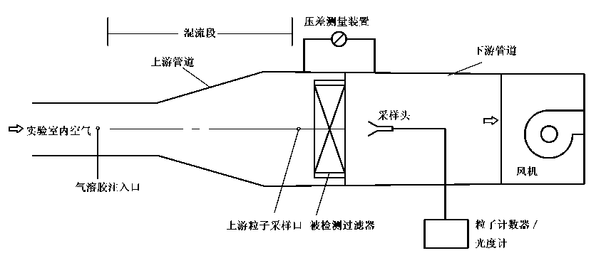

---
# 同时设置标题名称和顺序，order 越小越靠前，默认为 0
title: 实验室  生物安全通用要求
order: 2
# 同时设置导航名称和顺序，order 越小越靠前，默认为 0
nav:
  title: 国内其他部委文件
  order: 3
---

<!-- markdown body -->

# 						                                             中华人民共和国国家标准
​																	 
 GB 19489---2008

 代替 GB 19489---2004

##                                                                    
   实验室  生物安全通用要求

​                                           
  **Laboratories**---**General requirements for biosafety**

2008-12-26 发布                                                                                                                           		2009-07-01 实施 

​													                                                                           	中华人民共和国国家质量监督检验检疫总局发布
​																		                                                                       中国国家标准化管理委员会

##                                                      前 言

本标准的第3. 1. 10,6. 3. 1. 5、6. 3. 10.4,6. 3. 10. 5、6. 5. 1.4和6. 5. 1. 9条为推荐性条款，其余为强 制性条款。

本标准代替GB 19489---2004«实验室生物安全通用要求》。

本标准与GB 19489---2004相比,主要变化如下：

------对标准要素的划分进行了调整，明确区分了技术要素和管理要素2004年版的第6章至第20章, 本版的第5章至第7章）;

------删除了 2004年版的部分术语和定义（2004年版的2.2,2. 3,2. 8和2. 11）;

------修订了 2004年版的部分术语和定义（2004年版的2. 1,2. 4,2. 6,2. 7,2. 9、2. 10、2. 12、2. 13、2.14和 2.15）；

------增加了新的术语和定义（本版的 2. 2,2. 8,2. 9,2. 11,2. 12,2. 14,2. 17,2. 18 和 2. 19）；

------删除了危害程度分级（2004年版的第3章）;

------修订和增加了风险评估和风险控制的要求（2004年版的第4章，本版的第3章）；

------修订了对实验室设计原则、设施和设备的部分要求（2004年版的第6章、第7章和9.3节，本 版的第5章和第6章）；

------增加了对实验室设施自控系统的要求（本版的6. 3. 8）;

------增加了对从事无脊椎动物操作实验室设施的要求（本版的6. 5. 5）;

------增加了对管理的要求（本版的7.4,7. 5,7. 8,7. 9,7. 10,7. 11,7. 12和7. 13）;

------删除了部分与GB 19781---2005《医学实验室 安全要求》重复的内容（2004年版的第3章, 第12章、第13章、第14章、第15章和第17章）;

------增加了附录A、附录B和附录C。

本标准的某些内容可能涉及专利权问题,本标准的发布机构不承担识别这些专利权的责任。

本标准的附录A、附录B和附录C均为资料性附录。

本标准由全国认证认可标准化技术委员会（SAC/TC 261）提出并归口。

本标准起草单位：中国合格评定国家认可中心、国家质量监督检验检疫总局科技司、中国疾病预防 控制中心、中国动物疫病预防控制中心、中国人民解放军军事医学科学院、中国农业科学院哈尔滨兽医 研究所、天津国家生物防护装备工程技术研究中心、中国医学科学院病原生物学研究所、中华人民共和 国珠海出入境检验检疫局、中华人民共和国天津出入境检验检疫局、中华人民共和国公安部消防局。

本标准主要起草人：宋桂兰、吕京、武桂珍、吴东来、王继伟、王宏伟、钱军、祁建城、何兆伟、鹿建春, 薄清如、王健伟、陆兵、魏强、侯艳梅、关云涛、沈纹。

本标准所代替标准的历次版本发布情况为：

------GB 19489---2004。

#                                                 引  言

实验室生物安全涉及的绝不仅是实验室工作人员的个人健康，一旦发生事故，极有可能会给人群、 动物或植物带来不可预计的危害。

实验室生物安全事件或事故的发生是难以完全避免的，重要的是实验室工作人员应事先了解所从事活动的风险及应在风险已控制在可接受的状态下从事相关的活动。实验室工作人员应认识但不应过 分依赖于实验室设施设备的安全保障作用，绝大多数生物安全事故的根本原因是缺乏生物安全意识和 疏于管理。

由于实验室生物安全的重要性，世界卫生组织于2004年出版了第三版《实验室生物安全手册》，世界标准化组织于2006年启动了对ISO 15190---2003《医学实验室安全要求》的修订程序，一些重要的国际专业组织陆续制定了相关的新的文件。

我国于2004年11月12日发布了《病原微生物实验室生物安全管理条例》，明确规定实验室的生物安全防护级别应与其拟从事的实验活动相适应。

经过近5年的实践，国内对生物安全实验室建设、运行和管理的需求及相应要求有了更深入的理解和新的共识。为适应我国生物安全实验室建设和管理的需要，促进发展，有必要修订GB 19489---2004。

# 								实验室生物安全通用要求

## 1 范围

本标准规定了对不同生物安全防护级别实验室的设施、设备和安全管理的基本要求。

第5章以及6. 1和6.2是对生物安全实验室的基础要求，需要时，适用于更高防护水平的生物安全实验室以及动物生物安全实验室。

针对与感染动物饲养相关的实验室活动，本标准规定了对实验室内动物饲养设施和环境的基本要求。需要时，6. 3和6.4适用于相应防护水平的动物生物安全实验室。

本标准适用于涉及生物因子操作的实验室。

## 2 术语和定义

下列术语和定义适用于本标准。

### 2.1

### 气溶胶 aerosols

悬浮于气体介质中的粒径一般为0. 001 μm~100 μm的固态或液态微小粒子形成的相对稳定的分散体系。

### 2.2

### 事故 accident

造成死亡、疾病、伤害、损坏以及其他损失的意外情况。

### 2.3

### 气锁 air lock

具备机械送排风系统、整体消毒灭菌条件、化学喷淋（适用时）和压力可监控的气密室，其门具有互锁功能，不能同时处于开启状态。

### 2.4

### 生物因子 biological agents

微生物和生物活性物质。

### 2.5

### 生物安全柜 biological safety cabinet,BSC

具备气流控制及高效空气过滤装置的操作柜，可有效降低实验过程中产生的有害气溶胶对操作者和环境的危害。

### 2.6

### 缓冲间 buffer room

设置在被污染概率不同的实验室区域间的密闭室，需要时，设置机械通风系统，其门具有互锁功能, 不能同时处于开启状态。

### 2.7

### 定向气流 directional airflow

特指从污染概率小区域流向污染概率大区域的受控制的气流。

### 2.8

### 危险 hazard

可能导致死亡、伤害或疾病、财产损失、工作环境破坏或这些情况组合的根源或状态。

### 2.9

### 危险识别 hazard identification

识别存在的危险并确定其特性的过程。

### 2.10

### 高效空气过滤器（HEPA 过滤器）high efficiency particulate air filter

通常以0. 3 μm微粒为测试物，在规定的条件下滤除效率高于99. 97%的空气过滤器。

### 2.11

### 事件 incident

导致或可能导致事故的情况。

### 2.12

### 实验室 laboratory

涉及生物因子操作的实验室。

### 2.13

### 实验室生物安全 laboratory biosafety

实验室的生物安全条件和状态不低于容许水平，可避免实验室人员、来访人员、社区及环境受到不可接受的损害，符合相关法规、标准等对实验室生物安全责任的要求。

### 2.14

### 实验室防护区 laboratory containment area

实验室的物理分区，该区域内生物风险相对较大，需对实验室的平面设计、围护结构的密闭性、气流**，**以及人员进入、个体防护等进行控制的区域。

### 2.15

### 材料安全数据单 material safety data sheet, MSDS

详细提供某材料的危险性和使用注意事项等信息的技术通报。

### 2.16

### 个体防护装备 personal protective equipment,PPE

防止人员个体受到生物性、化学性或物理性等危险因子伤害的器材和用品。

### 2.17

### 风险 risk

危险发生的概率及其后果严重性的综合。

### 2.18

### 风险评估 risk assessment

评估风险大小以及确定是否可接受的全过程。

### 2.19

### 风险控制 risk control

为降低风险而采取的综合措施。

## 3  风险评估及风险控制

**3.1**  	实验室应建立并维持风险评估和风险控制程序，以持续进行危险识别、风险评估和实施必要的控制措施。实验室需要考虑的内容包括:

**3.1.1** 	当实验室活动涉及致病性生物因子时**，**实验室应进行生物风险评估。风险评估应考虑（但不限于）下列内容:

​	a）生物因子已知或未知的特性，如生物因子的种类、来源、传染性、传播途径、易感性、潜伏期、剂 量-效应（反应）关系、致病性（包括急性与远期效应）、变异性、在环境中的稳定性、与其他生物和环境的交互作用、相关实验数据、流行病学资料、预防和治疗方案等；

​	b） 适用时，实验室本身或相关实验室已发生的事故分析；

​	c） 实验室常规活动和非常规活动过程中的风险（不限于生物因素），包括所有进入工作场所的人员和可能涉及的人员（如：合同方人员）的活动；

​	d） 设施、设备等相关的风险；

​	e） 适用时，实验动物相关的风险；

​	f） 人员相关的风险，如身体状况、能力、可能影响工作的压力等；

​	g） 意外事件、事故带来的风险；

​	h） 被误用和恶意使用的风险；

​	i）风险的范围、性质和时限性；

​	j） 危险发生的概率评估；

​	k） 可能产生的危害及后果分析；

​	l） 确定可接受的风险；

​	m） 适用时，消除、减少或控制风险的管理措施和技术措施，及采取措施后残余风险或新带来风险的评估；

​	n） 适用时，运行经验和所采取的风险控制措施的适应程度评估；

​	o）适用时，应急措施及预期效果评估；

​	P）适用时，为确定设施设备要求、识别培训需求、开展运行控制提供的输入信息；

​	q） 适用时，降低风险和控制危害所需资料、资源（包括外部资源）的评估；

​	r） 对风险、需求、资源、可行性、适用性等的综合评估。

**3.1.2**   应事先对所有拟从事活动的风险进行评估，包括对化学、物理、辐射、电气、水灾、火灾、自然灾害等的风险进行评估。

**3.1.3**    风险评估应由具有经验的专业人员（不限于本机构内部的人员）进行。

**3.1.4**    应记录风险评估过程，风险评估报告应注明评估时间、编审人员和所依据的法规、标准、研究报告、权威资料、数据等。

**3.1.5**	应定期进行风险评估或对风险评估报告复审，评估的周期应根据实验室活动和风险特征而确定。

**3.1.6**	开展新的实验室活动或欲改变经评估过的实验室活动（包括相关的设施、设备、人员、活动范围、 管理等），应事先或重新进行风险评估。

**3.1.7**	操作超常规量或从事特殊活动时，实验室应进行风险评估，以确定其生物安全防护要求，适用时,应经过相关主管部门的批准。

**3.1.8**	当发生事件、事故等时应重新进行风险评估。

**3.1.9**	当相关政策、法规、标准等发生改变时应重新进行风险评估。

**3.1.10	**采取风险控制措施时宜首先考虑消除危险源（如果可行），然后再考虑降低风险（降低潜在伤害发生的可能性或严重程度），最后考虑采用个体防护装备。

**3.1.11**	危险识别、风险评估和风险控制的过程不仅适用于实验室、设施设备的常规运行，而且适用于对实验室、设施设备进行清洁、维护或关停期间。

**3.1.12**	除考虑实验室自身活动的风险外，还应考虑外部人员活动、使用外部提供的物品或服务所带来的风险。

**3.1.13**	实验室应有机制监控其所要求的活动，以确保相关要求及时并有效地得以实施。

**3.2**	实验室风险评估和风险控制活动的复杂程度决定于实验室所存在危险的特性，适用时，实验室不一定需要复杂的风险评估和风险控制活动。

**3.3**	风险评估报告应是实验室采取风险控！!措施、建立安全管理体系和制定安全操作规程的依据。

**3.4**	风险评估所依据的数据及拟采取的风险控制措施、安全操作规程等应以国家主管部门和世界卫生组织、世界动物卫生组织、国际标准化组织等机构或行业权威机构发布的指南、标准等为依据；任何新技 术在使用前应经过充分验证，适用时，应得到相关主管部门的批准。

**3.5**	风险评估报告应得到实验室所在机构生物安全主管部门的批准;对未列入国家相关主管部门发布的病原微生物名录的生物因子的风险评估报告，适用时，应得到相关主管部门的批准。

## 4	实验室生物安全防护水平分级

**4.1**	根据对所操作生物因子采取的防护措施，将实验室生物安全防护水平分为一级、二级、三级和四级，一级防护水平最低，四级防护水平最高。依据国家相关规定：

​	a） 生物安全防护水平为一级的实验室适用于操作在通常情况下不会引起人类或者动物疾病的微生物；

​	b） 生物安全防护水平为二级的实验室适用于操作能够引起人类或者动物疾病，但一般情况下对人、动物或者环境不构成严重危害，传播风险有限，实验室感染后很少引起严重疾病，并且具备有效治疗和预防措施的微生物；

​	c） 生物安全防护水平为三级的实验室适用于操作能够引起人类或者动物严重疾病，比较容易直接或者间接在人与人、动物与人、动物与动物间传播的微生物；

​	d） 生物安全防护水平为四级的实验室适用于操作能够引起人类或者动物非常严重疾病的微生物，以及我国尚未发现或者已经宣布消灭的微生物。

**4.2**	以BSL-1,BSL-2,BSL-3,BSL-4（bio-safety level,BSL）表示仅从事体外操作的实验室的相应生物安全防护水平。

**4.3**	 以 ABSLl、ABSL2、ABSL3、ABSLT（animal biosafety level, ABSL）表示包括从事动物活体操作的实验室的相应生物安全防护水平。

**4.4**	根据实验活动的差异、采用的个体防护装备和基础隔离设施的不同，实验室分以下情况：

**4.4.1**	操作通常认为非经空气传播致病性生物因子的实验室。

**4.4.2**	可有效利用安全隔离装置（如：生物安全柜）操作常规量经空气传播致病性生物因子的实验室。

**4.4.3**	不能有效利用安全隔离装置操作常规量经空气传播致病性生物因子的实验室。

**4.4.4**	利用具有生命支持系统的正压服操作常规量经空气传播致病性生物因子的实验室。

**4.5**	应依据国家相关主管部门发布的病原微生物分类名录，在风险评估的基础上，确定实验室的生物安全防护水平。

## 5	实验室设计原则及基本要求

**5.1**	实验室选址、设计和建造应符合国家和地方环境保护和建设主管部门等的规定和要求。

**5.2**	实验室的防火和安全通道设置应符合国家的消防规定和要求，同时应考虑生物安全的特殊要求； 必要时，应事先征询消防主管部门的建议。

**5.3**	实验室的安全保卫应符合国家相关部门对该类设施的安全管理规定和要求。

**5.4**	实验室的建筑材料和设备等应符合国家相关部门对该类产品生产、销售和使用的规定和要求。

**5.5**	实验室的设计应保证对生物、化学、辐射和物理等危险源的防护水平控制在经过评估的可接受程度，为关联的办公区和邻近的公共空间提供安全的工作环境，及防止危害环境。

**5.6**	实验室的走廊和通道应不妨碍人员和物品通过。

**5.7**	应设计紧急撤离路线，紧急出口应有明显的标识。

**5.8**	房间的门根据需要安装门锁,门锁应便于内部快速打开。

**5.9**	需要时（如：正当操作危险材料时），房间的入口处应有警示和进入限制。

**5.10**	应评估生物材料、样本、药品、化学品和机密资料等被误用、被偷盗和被不正当使用的风险，并采取相应的物理防范措施。

**5.11**	应有专门设计以确保存储、转运、收集、处理和处置危险物料的安全。

**5.12**	实验室内温度、湿度、照度、噪声和洁净度等室内环境参数应符合工作要求和卫生等相关要求。

**5.13**	实验室设计还应考虑节能、环保及舒适性要求，应符合职业卫生要求和人机工效学要求。

**5.14**	实验室应有防止节肢动物和啮齿动物进入的措施。

**5.15**	动物实验室的生物安全防护设施还应考虑对动物呼吸、排泄、毛发、抓咬、挣扎、逃逸、动物实验 （如：染毒、医学检查、取样、解剖、检验等）、动物饲养、动物尸体及排泄物的处置等过程产生的潜在生物 危险的防护。

**5.16**	应根据动物的种类、身体大小、生活习性、实验目的等选择具有适当防护水平的、适用于动物的饲养设施、实验设施、消毒灭菌设施和清洗设施等。

**5.17**	不得循环使用动物实验室排出的空气。

**5.18**	动物实验室的设计，如：空间、进出通道、解剖室、笼具等应考虑动物实验及动物福利的要求。

**5.19**	适用时，动物实验室还应符合国家实验动物饲养设施标准的要求。

## 6 实验室设施和设备要求

### 6.1	BSL-1实验室

**6.1.1**	实验室的门应有可视窗并可锁闭，门锁及门的开启方向应不妨碍室内人员逃生。

**6.1.2**	应设洗手池，宜设置在靠近实验室的出口处。

**6.1.3**	在实验室门口处应设存衣或挂衣装置，可将个人服装与实验室工作服分开放置。

**6.1.4**	实验室的墙壁、天花板和地面应易清洁、不渗水、耐化学品和消毒灭菌剂的腐蚀。地面应平整、 防滑，不应铺设地毯。

**6.1.5**	实验室台柜和座椅等应稳固，边角应圆滑。

**6.1.6**	实验室台柜等和其摆放应便于清洁，实验台面应防水、耐腐蚀、耐热和坚固。

**6.1.7**	实验室应有足够的空间和台柜等摆放实验室设备和物品。

**6.1.8	**应根据工作性质和流程合理摆放实验室设备、台柜、物品等，避免相互干扰、交叉污染，并应不妨 碍逃生和急救。

**6.1.9**	实验室可以利用自然通风。如果采用机械通风，应避免交叉污染。

**6.1.10**	如果有可开启的窗户，应安装可防蚊虫的纱窗。

**6.1.11**	实验室内应避免不必要的反光和强光。

**6.1.12**	若操作刺激或腐蚀性物质，应在30 m内设洗眼装置，必要时应设紧急喷淋装置。

**6.1.13**	若操作有毒、刺激性、放射性挥发物质，应在风险评估的基础上，配备适当的负压排风柜。

**6.1.14**	若使用高毒性、放射性等物质，应配备相应的安全设施、设备和个体防护装备，应符合国家、地方的相关规定和要求。

**6.1.15**	若使用高压气体和可燃气体，应有安全措施，应符合国家、地方的相关规定和要求。

**6.1.16**	应设应急照明装置。

**6.1.17**	应有足够的电力供应。

**6.1.18**	应有足够的固定电源插座，避免多台设备使用共同的电源插座。应有可靠的接地系统，应在关键节点安装漏电保护装置或监测报警装置。

**6.1.19**	供水和排水管道系统应不渗漏，下水应有防回流设计。

**6.1.20**	应配备适用的应急器材，如消防器材、意外事故处理器材、急救器材等。

**6.1.21**	应配备适用的通讯设备。

**6.1.22**	必要时，应配备适当的消毒灭菌设备。

### 6.2 	BSL-2实验室

**6.2.1**	适用时，应符合6.1的要求。

**6.2.2**	实验室主入口的门、放置生物安全柜实验间的门应可自动关闭；实验室主入口的门应有进入控制措施。

**6.2.3**	实验室工作区域外应有存放备用物品的条件。

**6.2.4**	应在实验室工作区配备洗眼装置。

**6.2.5**	应在实验室或其所在的建筑内配备高压蒸汽灭菌器或其他适当的消毒灭菌设备，所配备的消毒灭菌设备应以风险评估为依据。

**6.2.6**	应在操作病原微生物样本的实验间内配备生物安全柜。

**6.2.7**	应按产品的设计要求安装和使用生物安全柜。如果生物安全柜的排风在室内循环，室内应具备通风换气的条件；如果使用需要管道排风的生物安全柜，应通过独立于建筑物其他公共通风系统的管道 排出。

**6.2.8**	应有可靠的电力供应。必要时，重要设备（如：培养箱、生物安全柜、冰箱等）应配置备用电源。

### 6\. 3 	BSL-3实验室

#### 6.3.1	**平面布局**

**6.3.1.1**	实验室应明确区分辅助工作区和防护区，应在建筑物中自成隔离区或为独立建筑物，应有出入控制。

**6.3.1.2**	防护区中直接从事高风险操作的工作间为核心工作间，人员应通过缓冲间进入核心工作间。

**6.3.1.3**	适用于4.4.1的实验室辅助工作区应至少包括监控室和清洁衣物更换间；防护区应至少包括缓冲间（可兼作脱防护服间）及核心工作间。

**6.3.1.4**	适用于4.4.2的实验室辅助工作区应至少包括监控室、清洁衣物更换间和淋浴间；防护区应至少包括防护服更换间、缓冲间及核心工作间。

**6.3.1.5**	适用于4.4.2的实验室核心工作间不宜直接与其他公共区域相邻。

**6.3.1.6**	如果安装传递窗，其结构承压力及密闭性应符合所在区域的要求，并具备对传递窗内物品进行消毒灭菌的条件。必要时，应设置具备送排风或自净化功能的传递窗，排风应经HEPA过滤器过滤 后排出。

#### 6.3.2	**围护结构**

**6.3.2.1**	围护结构（包括墙体）应符合国家对该类建筑的抗震要求和防火要求。

**6.3.2.2**	天花板、地板、墙间的交角应易清洁和消毒灭菌。

**6.3.2.3	**实验室防护区内围护结构的所有缝隙和贯穿处的接缝都应可靠密封

**6.3.2.4**	实验室防护区内围护结构的内表面应光滑、耐腐蚀、防水，以易于清洁和消毒灭菌。

**6.3.2.5**	实验室防护区内的地面应防渗漏、完整、光洁、防滑、耐腐蚀、不起尘。

**6.3.2.6**	实验室内所有的门应可自动关闭，需要时，应设观察窗；门的开启方向不应妨碍逃生。

**6.3.2.7**	实验室内所有窗户应为密闭窗，玻璃应耐撞击、防破碎。

**6.3.2.8**	实验室及设备间的高度应满足设备的安装要求，应有维修和清洁空间。

**6.3.2.9**	在通风空调系统正常运行状态下，采用烟雾测试等目视方法检查实验室防护区内围护结构的严密性时，所有缝隙应无可见泄漏（参见附录A）

#### 6.3.3	**通风空调系统**

**6.3.3.1	**应安装独立的实验室送排风系统，应确保在实验室运行时气流由低风险区向高风险区流动, 同时确保实验室空气只能通过HEPA过滤器过滤后经专用的排风管道排出。

**6.3.3.2	**实验室防护区房间内送风口和排风口的布置应符合定向气流的原则，利于减少房间内的涡流和气流死角；送排风应不影响其他设备（如：**n**级生物安全柜）的正常功能。

**6.3.3.3	**不得循环使用实验室防护区排出的空气。

**6.3.3.4**	应按产品的设计要求安装生物安全柜和其排风管道，可以将生物安全柜排出的空气排入实验室的排风管道系统。

**6.3.3.5**	实验室的送风应经过HEPA过滤器过滤，宜同时安装初效和中效过滤器。

**6.3.3.6	**实验室的外部排风口应设置在主导风的下风向（相对于送风口 ），与送风口的直线距离应大于 12 m,应至少高出本实验室所在建筑的顶部2 m,应有防风、防雨、防鼠、防虫设计,但不应影响气体向上 空排放。

**6.3.3.7**	HEPA过滤器的安装位置应尽可能靠近送风管道在实验室内的送风口端和排风管道在实验室内的排风口端。

**6.3.3.8**	应可以在原位对排风HEPA过滤器进行消毒灭菌和检漏（参见附录A）。

**6.3.3.9	**如在实验室防护区外使用高效过滤器单元，其结构应牢固，应能承受2500 Pa的压力；高效过滤器单元的整体密封性应达到在关闭所有通路并维持腔室内的温度在设计范围上限的条件下，若使 空气压力维持在1000Pa时，腔室内每分钟泄漏的空气量应不超过腔室净容积的0.1%。

**6.3.3.10**	应在实验室防护区送风和排风管道的关键节点安装生物型密闭阀，必要时，可完全关闭。应在实验室送风和排风总管道的关键节点安装生物型密闭阀，必要时，可完全关闭。

**6.3.3.11	**生物型密闭阀与实验室防护区相通的送风管道和排风管道应牢固、易消毒灭菌、耐腐蚀、抗老化，宜使用不锈钢管道；管道的密封性应达到在关闭所有通路并维持管道内的温度在设计范围上限的 条件下，若使空气压力维持在500 Pa时，管道内每分钟泄漏的空气量应不超过管道内净容积的0.2%。

**6.3.3.12**	应有备用排风机。应尽可能减少排风机后排风管道正压段的长度，该段管道不应穿过其他房间。 

**6.3.3.13**	不应在实验室防护区内安装分体空调。

#### 6.3.4	**供水与供气系统**

**6.3.4.1**	应在实验室防护区内的实验间的靠近出口处设置非手动洗手设施;如果实验室不具备供水条件，则应设非手动手消毒灭菌装置。

**6.3.4.2	**应在实验室的给水与市政给水系统之间设防回流装置。

**6.3.4.3**	进出实验室的液体和气体管道系统应牢固、不渗漏、防锈、耐压、耐温（冷或热）、耐腐蚀。应有足够的空间清洁、维护和维修实验室内暴露的管道，应在关键节点安装截止阀、防回流装置或HEPA过滤器等。

**6.3.4.4	**如果有供气（液）罐等，应放在实验室防护区外易更换和维护的位置，安装牢固，不应将不相容的气体或液体放在一起。

**6.3.4.5	**如果有真空装置，应有防止真空装置的内部被污染的措施；不应将真空装置安装在实验场所之外。

#### 6.3.5	污物处理及消毒灭菌系统

**6.3.5.1**	应在实验室防护区内设置生物安全型高压蒸汽灭菌器。宜安装专用的双扉高压灭菌器，其主体应安装在易维护的位置,与围护结构的连接之处应可靠密封。

**6.3.5.2**	对实验室防护区内不能高压灭菌的物品应有其他消毒灭菌措施。

**6.3.5.3	**高压蒸汽灭菌器的安装位置不应影响生物安全柜等安全隔离装置的气流。

**6.3.5.4	**如果设置传递物品的渡槽，应使用强度符合要求的耐腐蚀性材料，并方便更换消毒灭菌液。

**6.3.5.5**	淋浴间或缓冲间的地面液体收集系统应有防液体回流的装置。

**6.3.5.6**	实验室防护区内如果有下水系统，应与建筑物的下水系统完全隔离；下水应直接通向本实验室专用的消毒灭菌系统。

**6.3.5.7	**所有下水管道应有足够的倾斜度和排量，确保管道内不存水；管道的关键节点应按需要安装 防回流装置、存水弯（深度应适用于空气压差的变化）或密闭阀门等；下水系统应符合相应的耐压、耐热、 耐化学腐蚀的要求，安装牢固，无泄漏，便于维护、清洁和检查。

**6.3.5.8	**应使用可靠的方式处理处置污水（包括污物），并应对消毒灭菌效果进行监测，以确保达到排放要求。

**6.3.5.9**	应在风险评估的基础上，适当处理实验室辅助区的污水，并应监测，以确保排放到市政管网之前达到排放要求。

**6.3.5.10**	可以在实验室内安装紫外线消毒灯或其他适用的消毒灭菌装置。

**6.3.5.11**	应具备对实验室防护区及与其直接相通的管道进行消毒灭菌的条件。

**6.3.5.12	**应具备对实验室设备和安全隔离装置（包括与其直接相通的管道）进行消毒灭菌的条件。

**6.3.5.13**	应在实验室防护区内的关键部位配备便携的局部消毒灭菌装置（如：消毒喷雾器等），并备有足够的适用消毒灭菌剂。

#### 6.3.6	**电力供应系统**

**6.3.6.1**	电力供应应满足实验室的所有用电要求，并应有冗余。

**6.3.6.2	**生物安全柜、送风机和排风机、照明、自控系统、监视和报警系统等应配备不间断备用电源，电力供应应至少维持30 min。

**6.3.6.3	**应在安全的位置设置专用配电箱。

#### 6.3.7	**照明系统**

**6.3.7.1**	实验室核心工作间的照度应不低于350 lx,其他区域的照度应不低于200 lx,宜采用吸顶式防水洁净照明灯。

**6.3.7.2**	应避免过强的光线和光反射。

**6.3.7.3**	应设不少于30 min的应急照明系统。

#### 6.3.8	自控、监视与报警系统

**6.3.8.1**	进入实验室的门应有门禁系统，应保证只有获得授权的人员才能进入实验室。

**6.3.8.2**	需要时，应可立即解除实验室门的互锁；应在互锁门的附近设置紧急手动解除互锁开关。

**6.3.8.3**	核心工作间的缓冲间的入口处应有指示核心工作间工作状态的装置（如：文字显示或指示 灯）,必要时，应同时设置限制进入核心工作间的连锁机制。

**6.3.8.4	**启动实验室通风系统时，应先启动实验室排风，后启动实验室送风；关停时，应先关闭生物安全柜等安全隔离装置和排风支管密闭阀，再关实验室送风及密闭阀，后关实验室排风及密闭阀。

**6.3.8.5	**当排风系统出现故障时，应有机制避免实验室出现正压和影响定向气流。

**6.3.8.6	**当送风系统出现故障时，应有机制避免实验室内的负压影响实验室人员的安全、影响生物安全柜等安全隔离装置的正常功能和围护结构的完整性。

**6.3.8.7**	应通过对可能造成实验室压力波动的设备和装置实行连锁控制等措施，确保生物安全柜、负压排风柜（罩）等局部排风设备与实验室送排风系统之间的压力关系和必要的稳定性，并应在启动、运行 和关停过程中保持有序的压力梯度。

**6.3.8.8	**应设装置连续监测送排风系统HEPA过滤器的阻力，需要时，及时更换HEPA过滤器。

**6.3.8.9	**应在有负压控制要求的房间入口的显著位置，安装显示房间负压状况的压力显示装置和控制区间提示。

**6.3.8.10**	中央控制系统应可以实时监控、记录和存储实验室防护区内有控制要求的参数、关键设施设备的运行状态；应能监控、记录和存储故障的现象、发生时间和持续时间；应可以随时查看历史记录。

**6.3.8.11	**中央控制系统的信号采集间隔时间应不超过1 min,各参数应易于区分和识别。

**6.3.8.12	**中央控制系统应能对所有故障和控制指标进行报警，报警应区分一般报警和紧急报警。

**6.3.8.13**	紧急报警应为声光同时报警，应可以向实验室内外人员同时发出紧急警报；应在实验室核心工作间内设置紧急报警按钮。

**6.3.8.14	**应在实验室的关键部位设置监视器，需要时，可实时监视并录制实验室活动情况和实验室周围情况。监视设备应有足够的分辨率，影像存储介质应有足够的数据存储容量。

#### 6.3.9	**实验室通讯系统**

**6.3.9.1	**实验室防护区内应设置向外部传输资料和数据的传真机或其他电子设备。

**6.3.9.2**	监控室和实验室内应安装语音通讯系统。如果安装对讲系统，宜采用向内通话受控、向外通话非受控的选择性通话方式。

**6.3.9.3**	通讯系统的复杂性应与实验室的规模和复杂程度相适应。

#### 6.3.10	**参数要求**

**6.3.10.1	**实验室的围护结构应能承受送风机或排风机异常时导致的空气压力载荷。

**6.3.10.2**	适用于4.4.1的实验室核心工作间的气压（负压）与室外大气压的压差值应不小于30 Pa,与相邻区域的压差（负压）应不小于10 Pa；适用于4.4.2的实验室的核心工作间的气压（负压）与室外大气 压的压差值应不小于40 Pa,与相邻区域的压差（负压）应不小于15 Pa。

**6.3.10.3	**实验室防护区各房间的最小换气次数应不小于12次/h。

**6.3.10.4	**实验室的温度宜控制在18 ℃〜26 ℃范围内。

**6.3.10.5**	正常情况下，实验室的相对湿度宜控制在30%〜70%范围内；消毒状态下，实验室的相对湿度应能满足消毒灭菌的技术要求。

**6.3.10.6**	在安全柜开启情况下，核心工作间的噪声应不大于68 dB（A）。

**6.3.10.7	**实验室防护区的静态洁净度应不低于8级水平。

#### 6\. 4	BSL-4实验室

**6.4.1	**适用时，应符合6.3的要求。

**6.4.2**	实验室应建造在独立的建筑物内或建筑物中独立的隔离区域内。应有严格限制进入实验室的门禁措施，应记录进入人员的个人资料、进出时间、授权活动区域等信息；对与实验室运行相关的关键区 域也应有严格和可靠的安保措施，避免非授权进入。

**6.4.3	**实验室的辅助工作区应至少包括监控室和清洁衣物更换间。适用于4. 4. 2的实验室防护区应至少包括防护走廊、内防护服更换间、淋浴间、外防护服更换间和核心工作间，外防护服更换间应为气锁。

**6.4.4**	适用于4.4.4的实验室的防护区应包括防护走廊、内防护服更换间、淋浴间、外防护服更换间、 化学淋浴间和核心工作间。化学淋浴间应为气锁，具备对专用防护服或传递物品的表面进行清洁和消 毒灭菌的条件，具备使用生命支持供气系统的条件。

**6.4.5	**实验室防护区的围护结构应尽量远离建筑外墙；实验室的核心工作间应尽可能设置在防护区的中部。

**6.4.6**	应在实验室的核心工作间内配备生物安全型高压灭菌器；如果配备双扉高压灭菌器，其主体所在房间的室内气压应为负压,并应设在实验室防护区内易更换和维护的位置。

**6.4.7**	如果安装传递窗，其结构承压力及密闭性应符合所在区域的要求；需要时，应配备符合气锁要求的并具备消毒灭菌条件的传递窗。

**6.4.8	**实验室防护区围护结构的气密性应达到在关闭受测房间所有通路并维持房间内的温度在设计范围上限的条件下，当房间内的空气压力上升到500 Pa后，20 mm内自然衰减的气压小于250 Pa。

**6.4.9**	符合4. 4. 4要求的实验室应同时配备紧急支援气罐，紧急支援气罐的供气时间应不少于 60 min/人。

**6.4.10	**生命支持供气系统应有自动启动的不间断备用电源供应，供电时间应不少于60 mn。

**6.4.11	**供呼吸使用的气体的压力、流量、含氧量、温度、湿度、有害物质的含量等应符合职业安全的要求。 

**6.4.12**	生命支持系统应具备必要的报警装置。

**6.4.13	**实验室防护区内所有区域的室内气压应为负压，实验室核心工作间的气压（负压）与室外大气压的压差值应不小于60 Pa，与相邻区域的压差（负压）应不小于25 Pa。

**6.4.14	**适用于4.4.2的实验室，应在K级生物安全柜或相当的安全隔离装置内操作致病性生物因子； 同时应具备与安全隔离装置配套的物品传递设备以及生物安全型高压蒸汽灭菌器。

**6.4.15	**实验室的排风应经过两级HEPA过滤器处理后排放。

**6.4.16**	应可以在原位对送风HEPA过滤器进行消毒灭菌和检漏。

**6.4.17	**实验室防护区内所有需要运出实验室的物品或其包装的表面应经过可靠消毒灭菌。

**6.4.18	**化学淋浴消毒灭菌装置应在无电力供应的情况下仍可以使用，消毒灭菌剂储存器的容量应满足所有情况下对消毒灭菌剂使用量的需求。

#### 6.5	动物生物安全实验室

##### 6.5.1 ABSL-1 实验室

**6.5.1.1**	动物饲养间应与建筑物内的其他区域隔离。

**6.5.1.2	**动物饲养间的门应有可视窗，向里开；打开的门应能够自动关闭，需要时，可以锁上。

**6.5.1.3**	动物饲养间的工作表面应防水和易于消毒灭菌。

**6.5.1.4	**不宜安装窗户。如果安装窗户，所有窗户应密闭；需要时，窗户外部应装防护网。

**6.5.1.5	**围护结构的强度应与所饲养的动物种类相适应。

**6.5.1.6**	如果有地面液体收集系统，应设防液体回流装置，存水弯应有足够的深度。

**6.5.1.7**	不得循环使用动物实验室排出的空气。

**6.5.1.8	**应设置洗手池或手部清洁装置，宜设置在出口处。

**6.5.1.9**	宜将动物饲养间的室内气压控制为负压。

**6.5.1.10	**应可以对动物笼具清洗和消毒灭菌。

**6.5.1.11**	应设置实验动物饲养笼具或护栏，除考虑安全要求外还应考虑对动物福利的要求。

**6.5.1.12**	动物尸体及相关废物的处置设施和设备应符合国家相关规定的要求。

##### 6.5.2	 **ABSL-**2 实验室

**6.5.2.1**	适用时，应符合6.5.1的要求。

**6.5.2.2**	动物饲养间应在出入口处设置缓冲间。

**6.5.2.3**	应设置非手动洗手池或手部清洁装置，宜设置在出口处。

**6.5.2.4	**应在邻近区域配备高压蒸汽灭菌器。

**6.5.2.5**	适用时，应在安全隔离装置内从事可能产生有害气溶胶的活动；排气应经HEPA过滤器的过 滤后排出。

**6.5.2.6**	应将动物饲养间的室内气压控制为负压，气体应直接排放到其所在的建筑物外。

**6.5.2.7**	应根据风险评估的结果，确定是否需要使用HEPA过滤器过滤动物饲养间排出的气体。

**6.5.2.8**	当不能满足6. 5.2. 5时，应使用HEPA过滤器过滤动物饲养间排出的气体。

**6.5.2.9**	实验室的外部排风口应至少高出本实验室所在建筑的顶部2 m,应有防风、防雨、防鼠、防虫设计，但不应影响气体向上空排放。

**6.5.2.10**	污水（包括污物）应消毒灭菌处理，并应对消毒灭菌效果进行监测，以确保达到排放要求。

##### 6.5.3	**ABSL-**3 **实验室**

**6.5.3.1**	适用时，应符合6.5.2的要求。

**6.5.3.2	**应在实验室防护区内设淋浴间，需要时，应设置强制淋浴装置。

**6.5.3.3	**动物饲养间属于核心工作间，如果有入口和出口，均应设置缓冲间。

**6.5.3.4	**动物饲养间应尽可能设在整个实验室的中心部位，不应直接与其他公共区域相邻。

**6.5.3.5**	适用于4.4. 1实验室的防护区应至少包括淋浴间、防护服更换间、缓冲间及核心工作间。当不能有效利用安全隔离装置饲养动物时，应根据进一步的风险评估确定实验室的生物安全防护要求。

**6.5.3.6**	适用于4.4. 3的动物饲养间的缓冲间应为气锁，并具备对动物饲养间的防护服或传递物品的表面进行消毒灭菌的条件。

**6.5.3.7	**适用于4. 4. 3的动物饲养间，应有严格限制进入动物饲养间的门禁措施（如：个人密码和生物学识别技术等）。

**6.5.3.8	**动物饲养间内应安装监视设备和通讯设备。

**6.5.3.9**	动物饲养间内应配备便携式局部消毒灭菌装置（如：消毒喷雾器等），并应备有足够的适用消毒灭菌剂。

**6.5.3.10	**应有装置和技术对动物尸体和废物进行可靠消毒灭菌。

**6.5.3.11	**应有装置和技术对动物笼具进行清洁和可靠消毒灭菌。

**6.5.3.12**	需要时，应有装置和技术对所有物品或其包装的表面在运出动物饲养间前进行清洁和可靠消毒灭菌。

**6.5.3.13	**应在风险评估的基础上，适当处理防护区内淋浴间的污水，并应对灭菌效果进行监测，以确保达到排放要求。

**6.5.3.14	**适用于4.4.3的动物饲养间，应根据风险评估的结果，确定其排出的气体是否需要经过两级HEPA过滤器的过滤后排出。

**6.5.3.15**	适用于4.4.3的动物饲养间，应可以在原位对送风HEPA过滤器进行消毒灭菌和检漏。

**6.5.3.16	**适用于4.4. 1和4.4.2的动物饲养间的气压（负压）与室外大气压的压差值应不小于60 Pa, 与相邻区域的压差（负压）应不小于15 Pa。

**6.5.3.17	**适用于4.4.3的动物饲养间的气压（负压）与室外大气压的压差值应不小于80 Pa,与相邻区域的压差（负压）应不小于25 Pa。

**6.5.3.18**	适用于4.4. 3的动物饲养间及其缓冲间的气密性应达到在关闭受测房间所有通路并维持房间内的温度在设计范围上限的条件下，若使空气压力维持在250 Pa时，房间内每小时泄漏的空气量应 不超过受测房间净容积的10%。

**6.5.3.19	**在适用于4.4.3的动物饲养间从事可传染人的病原微生物活动时，应根据进一步的风险评估确定实验室的生物安全防护要求;适用时，应经过相关主管部门的批准。

##### 6.5.4 	**ABSL-**4 实验室

**6.5.4.1	**适用时，应符合6.5.3的要求。

**6.5.4.2**	淋浴间应设置强制淋浴装置。

**6.5.4.3**	动物饲养间的缓冲间应为气锁。

**6.5.4.4	**应有严格限制进入动物饲养间的门禁措施。

**6.5.4.5	**动物饲养间的气压（负压）与室外大气压的压差值应不小于100 Pa；与相邻区域的压差（负压）应不小于25 Pa。

**6.5.4.6**	动物饲养间及其缓冲间的气密性应达到在关闭受测房间所有通路并维持房间内的温度在设计范围上限的条件下，当房间内的空气压力上升到500 Pa后,20 mm内自然衰减的气压小于250 Pa。

**6.5.4.7	**应有装置和技术对所有物品或其包装的表面在运出动物饲养间前进行清洁和可靠消毒灭菌。 

##### 6.5.5	对从事无脊椎动物操作实验室设施的要求

**6.5.5.1	**该类动物设施的生物安全防护水平应根据国家相关主管部门的规定和风险评估的结果确定。

**6.5.5.2	**如果从事某些节肢动物（特别是可飞行、快爬或跳跃的昆虫）的实验活动，应采取以下适用的措施（但不限于）：

​	a） 应通过缓冲间进入动物饲养间，缓冲间内应安装适用的捕虫器，并应在门上安装防节肢动物逃逸的纱网；

​	b） 应在所有关键的可开启的门窗上安装防节肢动物逃逸的纱网；

​	c） 应在所有通风管道的关键节点安装防节肢动物逃逸的纱网；应具备分房间饲养已感染和未感染节肢动物的条件；

​	d） 应具备密闭和进行整体消毒灭菌的条件；

​	e） 应设喷雾式杀虫装置；

​	f） 应设制冷装置，需要时，可以及时降低动物的活动能力；

​	g） 应有机制确保水槽和存水弯管内的液体或消毒灭菌液不干涸；

​	h） 只要可行，应对所有废物高压灭菌；

​	i）应有机制监测和记录会飞、爬、跳跃的节肢动物幼虫和成虫的数量；

​	j） 应配备适用于放置装蝉螨容器的油碟；

​	k） 应具备带双层网的笼具以饲养或观察已感染或潜在感染的逃逸能力强的节肢动物；

​	l） 应具备适用的生物安全柜或相当的安全隔离装置以操作已感染或潜在感染的节肢动物；

​	m） 应具备操作已感染或潜在感染的节肢动物的低温盘；

​	n） 需要时，应设置监视器和通讯设备。

**6.5.5.3	**是否需要其他措施，应根据风险评估的结果确定。

## 7	管理要求

### 7.1	组织和管理

**7.1.1**	实验室或其母体组织应有明确的法律地位和从事相关活动的资格。

**7.1.2	**实验室所在的机构应设立生物安全委员会，负责咨询、指导、评估、监督实验室的生物安全相关事宜。实验室负责人应至少是所在机构生物安全委员会有职权的成员。

**7.1.3	**实验室管理层应负责安全管理体系的设计、实施、维持和改进，应负责：

​	a） 为实验室所有人员提供履行其职责所需的适当权力和资源；

​	b） 建立机制以避免管理层和实验室人员受任何不利于其工作质量的压力或影响（如：财务、人事 或其他方面的），或卷入任何可能降低其公正性、判断力和能力的活动；

​	c） 制定保护机密信息的政策和程序；

​	d） 明确实验室的组织和管理结构，包括与其他相关机构的关系；

​	e） 规定所有人员的职责、权力和相互关系；

​	f） 安排有能力的人员，依据实验室人员的经验和职责对其进行必要的培训和监督；

​	g） 指定一名安全负责人，赋予其监督所有活动的职责和权力，包括制定、维持、监督实验室安全计划的责任，阻止不安全行为或活动的权力，直接向决定实验室政策和资源的管理层报告的权力；

​	h）指定负责技术运作的技术管理层，并提供可以确保满足实验室规定的安全要求和技术要求的资源；

​	i）指定每项活动的项目负责人，其负责制定并向实验室管理层提交活动计划、风险评估报告、安全及应急措施、项目组人员培训及健康监督计划、安全保障及资源要求；

​	j）指定所有关键职位的代理人。

**7.1.4	**实验室安全管理体系应与实验室规模、实验室活动的复杂程度和风险相适应。

**7.1.5	**政策、过程、计划、程序和指导书等应文件化并传达至所有相关人员。实验室管理层应保证这些文件易于理解并可以实施。

**7.1.6**	安全管理体系文件通常包括管理手册、程序文件、说明及操作规程、记录等文件，应有供现场工作人员快速使用的安全手册。

**7.1.7	**应指导所有人员使用和应用与其相关的安全管理体系文件及其实施要求，并评估其理解和运用的能力。

### 7.2 	管理责任

**7.2.1	**实验室管理层应对所有员工、来访者、合同方、社区和环境的安全负责。

**7.2.2	**应制定明确的准入政策并主动告知所有员工、来访者、合同方可能面临的风险。

**7.2.3**	应尊重员工的个人权利和隐私。

**7.2.4	**应为员工提供持续培训及继续教育的机会，保证员工可以胜任所分配的工作。

**7.2.5	**应为员工提供必要的免疫计划、定期的健康检查和医疗保障。

**7.2.6**	应保证实验室设施、设备、个体防护装备、材料等符合国家有关的安全要求，并定期检查、维护、 更新，确保不降低其设计性能。

**7.2.7	**应为员工提供符合要求的适用防护用品和器材。

**7.2.8**	应为员工提供符合要求的适用实验物品和器材。

**7.2.9	**应保证员工不疲劳工作和不从事风险不可控制的或国家禁止的工作。

### 7.3	个人责任

**7.3.1**	应充分认识和理解所从事工作的风险。

**7.3.2	**应自觉遵守实验室的管理规定和要求。

**7.3.3	**在身体状态许可的情况下，应接受实验室的免疫计划和其他的健康管理规定。

**7.3.4**	应按规定正确使用设施、设备和个体防护装备。

**7.3.5	**应主动报告可能不适于从事特定任务的个人状态。

**7.3.6**	不应因人事、经济等任何压力而违反管理规定。

**7.3.7	**有责任和义务避免因个人原因造成生物安全事件或事故。

**7.3.8	**如果怀疑个人受到感染，应立即报告。

**7.3.9**	应主动识别任何危险和不符合规定的工作，并立即报告。

### 7.4	安全管理体系文件

#### 7.4.1	实验室安全管理的方针和目标

**7.4.1.1	**在安全管理手册中应明确实验室安全管理的方针和目标。安全管理的方针应简明扼要，至少包括以下内容：

​	a） 实验室遵守国家以及地方相关法规和标准的承诺；

​	b） 实验室遵守良好职业规范、安全管理体系的承诺；

​	c） 实验室安全管理的宗旨。

**7.4.1.2	**实验室安全管理的目标应包括实验室的工作范围、对管理活动和技术活动制定的安全指标，应明确、可考核。

**7.4.1.3	**应在风险评估的基础上确定安全管理目标，并根据实验室活动的复杂性和风险程度定期评审安全管理目标和制定监督检查计划。

#### 7.4.2 	安全管理手册

**7.4.2.1	**应对组织结构、人员岗位及职责、安全及安保要求、安全管理体系、体系文件架构等进行规定和描述。安全要求不能低于国家和地方的相关规定及标准的要求。

**7.4.2.2	**应明确规定管理人员的权限和责任，包括保证其所管人员遵守安全管理体系要求的责任。

**7.4.2.3	**应规定涉及的安全要求和操作规程应以国家主管部门和世界卫生组织、世界动物卫生组织、 国际标准化组织等机构或行业权威机构发布的指南或标准等为依据，并符合国家相关法规和标准的要 求;任何新技术在使用前应经过充分验证,适用时,应得到国家相关主管部门的批准。

#### 7.4.3	程序文件

**7.4.3.1	**应明确规定实施具体安全要求的责任部门、责任范围、工作流程及责任人、任务安排及对操作人员能力的要求、与其他责任部门的关系、应使用的工作文件等。

**7.4.3.2**	应满足实验室实施所有的安全要求和管理要求的需要，工作流程清晰，各项职责得到落实。

#### 7.4.4	说明及操作规程

**7.4.4.1	**应详细说明使用者的权限及资格要求、潜在危险、设施设备的功能、活动目的和具体操作步骤、防护和安全操作方法、应急措施、文件制定的依据等。

**7.4.4.2	**实验室应维持并合理使用实验室涉及的所有材料的最新安全数据单。

#### 7.4.5	安全手册

**7.4.5.1**	应以安全管理体系文件为依据,制定实验室安全手册（快速阅读文件）；应要求所有员工阅读安全手册并在工作区随时可供使用；安全手册宜包括（但不限于）以下内容：

​	a） 紧急电话、联系人；

​	b） 实验室平面图、紧急出口、撤离路线；

​	c） 实验室标识系统；

​	d） 生物危险；

​	e） 化学品安全；

​	f）  辐射；

​	g） 机械安全；

​	h） 电气安全；

​	i）  低温、高热；

​	j）  消防；

​	k） 个体防护；

​	l） 危险废物的处理和处置；

​	m） 事件、事故处理的规定和程序；

​	n） 从工作区撤离的规定和程序。

**7.4.5.2**	安全手册应简明、易懂、易读，实验室管理层应至少每年对安全手册评审和更新。

#### 7.4.6	记录

**7.4.6.1**	应明确规定对实验室活动进行记录的要求，至少应包括：记录的内容、记录的要求、记录的档案管理、记录使用的权限、记录的安全、记录的保存期限等。保存期限应符合国家和地方法规或标准的 要求。

**7.4.6.2**	实验室应建立对实验室活动记录进行识别、收集、索引、访问、存放、维护及安全处置的程序。

**7.4.6.3	**原始记录应真实并可以提供足够的信息，保证可追溯性。

**7.4.6.4	**对原始记录的任何更改均不应影响识别被修改的内容，修改人应签字和注明日期。

**7.4.6.5**	所有记录应易于阅读，便于检索。

**7.4.6.6	**记录可存储于任何适当的媒介，应符合国家和地方的法规或标准的要求。

**7.4.6.7**	应具备适宜的记录存放条件，以防损坏、变质、丢失或未经授权的进入。

#### 7.4.7	标识系统

**7.4.7.1	**实验室用于标示危险区、警示、指示、证明等的图文标识是管理体系文件的一部分，包括用于特殊情况下的临时标识，如"污染"、"消毒中"、"设备检修"等。

**7.4.7.2	**标识应明确、醒目和易区分。只要可行，应使用国际、国家规定的通用标识。

**7.4.7.3	**应系统而清晰地标示出危险区，且应适用于相关的危险。在某些情况下，宜同时使用标识和 物理屏障标示出危险区。

**7.4.7.4**	应清楚地标示出具体的危险材料、危险，包括:生物危险、有毒有害、腐蚀性、辐射、刺伤、电击、 易燃、易爆、高温、低温、强光、振动、噪声、动物咬伤、砸伤等；需要时，应同时提示必要的防护措施*。*

**7.4.7.5**	应在须验证或校准的实验室设备的明显位置注明设备的可用状态、验证周期、下次验证或校 准的时间等信息。

**7.4.7.6	**实验室入口处应有标识，明确说明生物防护级别、操作的致病性生物因子、实验室负责人姓名、紧急联络方式和国际通用的生物危险符号；适用时，应同时注明其他危险。

**7.4.7.7	**实验室所有房间的出口和紧急撤离路线应有在无照明的情况下也可清楚识别的标识。

**7.4.7.8	**实验室的所有管道和线路应有明确、醒目和易区分的标识。

**7.4.7.9	**所有操作开关应有明确的功能指示标识，必要时，还应采取防止误操作或恶意操作的措施。

**7.4.7.10	**实验室管理层应负责定期（至少每12个月一次）评审实验室标识系统，需要时及时更新，以确保其适用现有的危险。

### 7.5	文件控制

**7.5.1	**实验室应对所有管理体系文件进行控制，制定和维持文件控制程序，确保实验室人员使用现行有效的文件。

**7.5.2**	应将受控文件备份存档，并规定其保存期限。文件可以用任何适当的媒介保存，不限定为纸张。

**7.5.3**	应有相应的程序以保证：

​	a） 管理体系所有的文件应在发布前经过授权人员的审核与批准；

​	b） 动态维持文件清单控制记录，并可以识别现行有效的文件版本及发放情况；

​	c） 在相关场所只有现行有效的文件可供使用；

​	d） 定期评审文件，需要修订的文件经授权人员审核与批准后及时发布；

​	e） 及时撤掉无效或已废止的文件，或可以确保不误用；

​	f） 适当标注存留或归档的已废止文件，以防误用。

**7.5.4**	如果实验室的文件控制制度允许在换版之前对文件手写修改，应规定修改程序和权限。修改之处应有清晰的标注、签署并注明日期。被修改的文件应按程序及时发布。

**7.5.5	**应制定程序规定如何更改和控制保存在计算机系统中的文件。

**7.5.6	**安全管理体系文件应具备唯一识别性，文件中应包括以下信息：

​	a） 标题；

​	b） 文件编号、版本号、修订号；

​	c） 页数；

​	d） 生效日期；

​	e） 编制人、审核人、批准人；

​	f） 参考文献或编制依据。

### 7.6	**安全计划**

**7.6.1**	实验室安全负责人应负责制定年度安全计划，安全计划应经过管理层的审核与批准。需要时,，实验室安全计划应包括（不限于）:

​	a） 实验室年度工作安排的说明和介绍；

​	b） 安全和健康管理目标；

​	c） 风险评估计划；

​	d） 程序文件与标准操作规程的制定与定期评审计划；

​	e） 人员教育、培训及能力评估计划；

​	f） 实验室活动计划；

​	g） 设施设备校准、验证和维护计划；

​	h） 危险物品使用计划；

​	i）消毒灭菌计划；

​	j） 废物处置计划；

​	k） 设备淘汰、购置、更新计划；

​	l） 演习计划（包括泄漏处理、人员意外伤害、设施设备失效、消防、应急预案等）;

​	m） 监督及安全检查计划（包括核查表）;

​	n） 人员健康监督及免疫计划；

​	o）审核与评审计划；

​	P）持续改进计划；

​	q） 外部供应与服务计划；

​	r） 行业最新进展跟踪计划；

​	s） 与生物安全委员会相关的活动计划。

### 7.7	**安全检查**

**7.7.1	**实验室管理层应负责实施安全检查，每年应至少根据管理体系的要求系统性地检查一次，对关键控制点可根据风险评估报告适当增加检查频率，以保证：

​	a） 设施设备的功能和状态正常；

​	b） 警报系统的功能和状态正常；

​	c） 应急装备的功能及状态正常；

​	d） 消防装备的功能及状态正常；

​	e） 危险物品的使用及存放安全；

​	f） 废物处理及处置的安全；

​	g） 人员能力及健康状态符合工作要求；

​	h） 安全计划实施正常； 家

​	i） 实验室活动的运行状态正常；

​	j） 不符合规定的工作及时得到纠正；

​	k） 所需资源满足工作要求。

**7.7.2	**为保证检查工作的质量，应依据事先制定的适用于不同工作领域的核查表实施检查。

**7.7.3	**当发现不符合规定的工作、发生事件或事故时，应立即查找原因并评估后果；必要时，停止工作。

**7.7.4	**生物安全委员会应参与安全检查。

**7.7.5	**外部的评审活动不能代替实验室的自我安全检查。

### 7.8	不符合项的识别和控制

**7.8.1**	当发现有任何不符合实验室所制定的安全管理体系的要求时，实验室管理层应按需要采取以下措施（不限于）:

​	a） 将解决问题的责任落实到个人；

​	b） 明确规定应采取的措施；

​	c） 只要发现很有可能造成感染事件或其他损害,立即终止实验室活动并报告；

​	d） 立即评估危害并采取应急措施；

​	e） 分析产生不符合项的原因和影响范围，只要适用，应及时采取补救措施；

​	f） 进行新的风险评估；

​	g） 采取纠正措施并验证有效；

​	h） 明确规定恢复工作的授权人及责任；

​	i） 记录每一不符合项及其处理的过程并形成文件；

**7.8.2**	实验室管理层应按规定的周期评审不符合项报告，以发现趋势并采取预防措施。

### 7.9	**纠正措施**

**7.9.1**	纠正措施程序中应包括识别问题发生的根本原因的调查程序。纠正措施应与问题的严重性及风险的程度相适应。只要适用，应及时采取预防措施。

**7.9.2	**实验室管理层应将因纠正措施所致的管理体系的任何改变文件化并实施。

**7.9.3**	实验室管理层应负责监督和检查所采取纠正措施的效果，以确保这些措施已有效解决了识别出的问题。

### 7\. 10**预防措施**

**7.10.1	**应识别无论是技术还是管理体系方面的不符合项来源和所需的改进，定期进行趋势分析和风险分析，包括对外部评价的分析。如果需要采取预防措施，应制定行动计划、监督和检查实施效果，以减少类似不符合项发生的可能性并借机改进。

**7.10.2**	预防措施程序应包括对预防措施的评价，以确保其有效性。

### 7.11	**持续改进**

**7.11.1	**实验室管理层应定期系统地评审管理体系，以识别所有潜在的不符合项来源、识别对管理体系或技术的改进机会。适用时，应及时改进识别出的需改进之处，应制定改进方案，文件化、实施并监督。

**7.11.2**	实验室管理层应设置可以系统地监测、评价实验室活动风险的客观指标。

**7.11.3**	如果采取措施，实验室管理层还应通过重点评审或审核相关范围的方式评价其效果。

**7.11.4**	需要时，实验室管理层应及时将因改进措施所致的管理体系的任何改变文件化并实施。

**7.11.5	**实验室管理层应有机制保证所有员工积极参加改进活动，并提供相关的教育和培训机会。

### 7\. 12	**内部审核**

**7.12.1	**应根据安全管理体系的规定对所有管理要素和技术要素定期进行内部审核，以证实管理体系的运作持续符合要求。

**7.12.2	**应由安全负责人负责策划、组织并实施审核。

**7.12.3	**应明确内部审核程序并文件化，应包括审核范围、频次、方法及所需的文件。如果发现不足或改进机会，应采取适当的措施，并在约定的时间内完成。

**7.12.4**	正常情况下，应按不大于12个月的周期对管理体系的每个要素进行内部审核。

**7.12.5	**员工不应审核自己的工作。

**7.12.6	**应将内部审核的结果提交实验室管理层评审。

### 7\. 13	**管理评审**

**7.13.1	**实验室管理层应对实验室安全管理体系及其全部活动进行评审，包括设施设备的状态、人员状态 、实验室相关的活动、变更、事件、事故等。

**7.13.2	**需要时，管理评审应考虑以下内容（不限于）：

​	a） 前次管理评审输出的落实情况；

​	b） 所采取纠正措施的状态和所需的预防措施；

​	c） 管理或监督人员的报告；

​	d） 近期内部审核的结果；

​	e） 安全检查报告；

​	f） 适用时，外部机构的评价报告；

​	g） 任何变化、变更情况的报告；

​	h） 设施设备的状态报告；

​	i）管理职责的落实情况；

​	j） 人员状态、培训、能力评估报告；

​	k） 员工健康状况报告；

​	l） 不符合项、事件、事故及其调查报告；

​	m） 实验室工作报告；

​	n） 风险评估报告；

​	o）持续改进情况报告；

​	P）对服务供应商的评价报告；

​	q） 国际、国家和地方相关规定和技术标准的更新与维持情况；

​	r） 安全管理方针及目标；

​	s） 管理体系的更新与维持；

​	t） 安全计划的落实情况、年度安全计划及所需资源。

**7.13.3**	只要可行，应以客观方式监测和评价实验室安全管理体系的适用性和有效性。

**7.13.4	**应记录管理评审的发现及提出的措施，应将评审发现和作为评审输出的决定列入含目的、目标和措施的工作计划中，并告知实验室人员。实验室管理层应确保所提出的措施在规定的时间内完成。

**7.13.5**	正常情况下，应按不大于12个月的周期进行管理评审。

### 7\. 14	**实验室人员管理**

**7.14.1**必要时，实验室负责人应指定若干适当的人员承担实验室安全相关的管理职责。实验室安全管理人员应：

​	a） 具备专业教育背景；

​	b） 熟悉国家相关政策、法规、标准；

​	c） 熟悉所负责的工作，有相关的工作经历或专业培训；

​	d） 熟悉实验室安全管理工作；

​	e） 定期参加相关的培训或继续教育。

**7.14.2**实验室或其所在机构应有明确的人事政策和安排，并可供所有员工查阅。

**7.14.3**应对所有岗位提供职责说明，包括人员的责任和任务，教育、培训和专业资格要求，应提供给相应岗位的每位员工。

**7.14.4**应有足够的人力资源承担实验室疔提供服务范围内的工作以及承担管理体系涉及的工作。

**7.14.5**如果实验室聘用临时工作人员，应确保其有能力胜任所承担的工作，了解并遵守实验室管理体系的要求。

**7.14.6**员工的工作量和工作时间安排不应影响实验室活动的质量和员工的健康，符合国家法规要求。

**7.14.7**在有规定的领域，实验室人员在从事相关的实验室活动时，应有相应的资格。

**7.14.8**应培训员工独立工作的能力。

**7.14.9**应定期评价员工可以胜任其工作任务的能力。

**7.14.10**应按工作的复杂程度定期评价所有员工的表现，应至少每12个月评价一次。

**7.14.11**人员培训计划应包括（不限于）：

​	a） 上岗培训，包括对较长期离岗或下岗人员的再上岗培训；

​	b） 实验室管理体系培训；

​	c） 安全知识及技能培训；

​	d） 实验室设施设备（包括个体防护装备）的安全使用；

​	e） 应急措施与现场救治；

​	f） 定期培训与继续教育；

​	g） 人员能力的考核与评估。

**7.14.12	**实验室或其所在机构应维持每个员工的人事资料，可靠保存并保护隐私权。人事档案应包括 （不限于）：

​	a） 员工的岗位职责说明；

​	b） 岗位风险说明及员工的知情同意证明；

​	c） 教育背景和专业资格证明；

​	d） 培训记录，应有员工与培训者的签字及日期；

​	e） 员工的免疫、健康检查、职业禁忌症等资料；

​	f） 内部和外部的继续教育记录及成绩；

​	g） 与工作安全相关的意外事件、事故报告；

​	h） 有关确认员工能力的证据，应有能力评价的日期和承认该员工能力的日期或期限；

​	i） 员工表现评价。

### 7\. 15	**实验室材料管理**

**7.15.1	**实验室应有选择、购买、采集、接收、查验、使用、处置和存储实验室材料（包括外部服务）的政策

和程序，以保证安全。

**7.15.2	**应确保所有与安全相关的实验室材料只有在经检查或证实其符合有关规定的要求之后投入使用，应保存相关活动的记录。

**7.15.3	**应评价重要消耗品、供应品和服务的供应商，保存评价记录和允许使用的供应商名单。

**7.15.4**	应对所有危险材料建立清单，包括来源、接收、使用、处置、存放、转移、使用权限、时间和数量等内容，相关记录安全保存，保存期限不少于20年。

**7.15.5	**应有可靠的物理措施和管理程序确保实验室危险材料的安全和安保。

**7.15.6**	应按国家相关规定的要求使用和管理实验室危险材料。

### 7\. 16	**实验室活动管理**

**7.16.1	**实验室应有计划、申请、批准、实施、监督和评估实验室活动的政策和程序。

**7.16.2	**实验室负责人应指定每项实验室活动的项目负责人，同时见7.1.3i）。

**7.16.3**	在开展活动前，应了解实验室活动涉及的任何危险，掌握良好工作行为（参见附录B）；为实验人员提供如何在风险最小情况下进行工作的详细指导，包括正确选择和使用个体防护装备。

**7.16.4	**涉及微生物的实验室活动操作规程应利用良好微生物标准操作要求和（或）特殊操作要求。

**7.16.5	**实验室应有针对未知风险材料操作的政策和程序。

### 7.17	**实验室内务管理**

**7.17.1	**实验室应有对内务管理的政策和程序，包括内务工作所用清洁剂和消毒灭菌剂的选择、配制、 效期、使用方法、有效成分检测及消毒灭菌效果监测等政策和程序，应评估和避免消毒灭菌剂本身的风险。

**7.17.2	**不应在工作面放置过多的实验室耗材。

**7.17.3**	应时刻保持工作区整洁有序。

**7.17.4	**应指定专人使用经核准的方法和个体防护装备进行内务工作。

**7.17.5	**不应混用不同风险区的内务程序和装备。

**7.17.6**	应在安全处置后对被污染的区域和可能被污染的区域进行内务工作。

**7.17.7	**应制定日常清洁（包括消毒灭菌）计划和清场消毒灭菌计划，包括对实验室设备和工作表面的消毒灭菌和清洁。

**7.17.8**	应指定专人监督内务工作，应定期评价内务工作的质量。

**7.17.9	**实验室的内务规程和所用材料发生改变时应通知实验室负责人。

**7.17.10	**实验室规程、工作习惯或材料的改变可能对，展人员有潜在危险时，应通知实验室负责人并书面告知内务管理负责人。

**7.17.11**	发生危险材料溢洒时，应启用应急处理程序。

### 7\. 18	**实验室设施设备管理**

**7.18.1	**实验室应有对设施设备（包括个体防护装备）管理的政策和程序，包括设施设备的完好性监控指标、巡检计划、使用前核查、安全操作、使用限制、授权操作、消毒灭菌、禁止事项、定期校准或检定，定 期维护、安全处置、运输、存放等。

**7.18.2	**应制定在发生事故或溢洒（包括生物、化学或放射性危险材料）时，对设施设备去污染、清洁和消毒灭菌的专用方案（参见附录C）。

**7.18.3	**设施设备维护、修理、报废或被移出实验室前应先去污染、清洁和消毒灭菌；但应意识到，可能仍然需要要求维护人员穿戴适当的个体防护装备。

**7.18.4**	应明确标示出设施设备中存在危险的部位。

**7.18.5	**在投入使用前应核查并确认设施设备的性能可满足实验室的安全要求和相关标准。

**7.18.6**	每次使用前或使用中应根据监控指标确认设施设备的性能处于正常工作状态，并记录。

**7.18.7	**如果使用个体呼吸保护装置，应做个体适配性测试，每次使用前核查并确认符合佩戴要求。

**7.18.8	**设施设备应由经过授权的人员操作和维护，现行有效的使用和维护说明书应便于有关人员使用。

**7.18.9**	应依据制造商的建议使用和维护实验室设施设备。

**7.18.10**	应在设施设备的显著部位标示出其唯一编号、校准或验证日期、下次校准或验证日期、准用或停用状态。

**7.18.11**	应停止使用并安全处置性能已显示出缺陷或超出规定限度的设施设备。

**7.18.12**	无论什么原因，如果设备脱离了实验室的直接控制，待该设备返回后，应在使用前对其性能进行确认并记录。

**7.18.13	**应维持设施设备的档案，适用时，内容应至少包括（不限于）：

​	a） 制造商名称、型式标识、系列号或其他唯一性标识；

​	b） 验收标准及验收记录；

​	c） 接收日期和启用日期；

​	d） 接收时的状态（新品、使用过、修复过）;

​	e） 当前位置；

​	f） 制造商的使用说明或其存放处；

​	g） 维护记录和年度维护计划；

​	h） 校准（验证）记录和校准（验证）计划；

​	i） 任何损坏、故障、改装或修理记录；

​	j） 服务合同；

​	k） 预计更换日期或使用寿命；

​	l） 安全检查记录。

### 7\. 19	**废物处置**

**7.19.1**	实验室危险废物处理和处置的管理应符合国家或地方法规和标准的要求，应征询相关主管部门的意见和建议。

**7.19.2	**应遵循以下原则处理和处置危险废物：

​	a） 将操作、收集、运输、处理及处置废物的危险减至最小；

​	b） 将其对环境的有害作用减至最小；

​	c） 只可使用被承认的技术和方法处理和处置危险废物；

​	d） 排放符合国家或地方规定和标准的要求。

**7.19.3**	应有措施和能力安全处理和处置实验室危险废物。

**7.19.4	**应有对危险废物处理和处置的政策和程序，包括对排放标准及监测的规定。

**7.19.5	**应评估和避免危险废物处理和处置方法本身的风险。

**7.19.6**	应根据危险废物的性质和危险性按相关标准分类处理和处置废物。 霸

**7.19.7	**危险废物应弃置于专门设计的、专用的和有标识的用于处置危险废物的容器内，装量不能超过建议的装载容量。

**7.19.8	**锐器（包括针头、小刀、金属和玻璃等）应直接弃置于耐扎的容器内。

**7.19.9**	应由经过培训的人员处理危险废物，并应穿戴适当的个体防护装备。

**7.19.10	**不应积存垃圾和实验室废物。在消毒灭菌或最终处置之前，应存放在指定的安全地方。

**7.19.11	**不应从实验室取走或排放不符合相关运输或排放要求的实验室废物。

**7.19.12**	应在实验室内消毒灭菌含活性高致病性生物因子的废物。

**7.19.13**	如果法规许可，只要包装和运输方式符合危险废物的运输要求，可以运送未处理的危险废物到指定机构处理。

### 7.20	**危险材料运输**

**7.20.1	**应制定对危险材料运输的政策和程序，包括危险材料在实验室内、实验室所在机构内及机构外部的运输，应符合国家和国际规定的要求。

**7.20.2	**应建立并维持危险材料接收和运出清单，至少包括危险材料的性质、数量、交接时包装的状态、 交接人、收发时间和地点等，确保危险材料出入的可追溯性。

**7.20.3**	实验室负责人或其授权人员应负责向为实验室送交危险材料的所有部门提供适当的运输指南和说明。

**7.20.4	**应以防止污染人员或环境的方式运输危险材料，并有可靠的安保措施。

**7.20.5	**危险材料应置于被批准的本质安全的防漏容器中运输。

**7.20.6**	国际和国家关于道路、铁路、水路和航空运输危险材料的公约、法规和标准适用，应按国家或国际现行的规定和标准，包装、标示所运输的物品并提供文件资料。

### 7.21	**应急措施**

**7.21.1	**应制定应急措施的政策和程序，包括生物性、化学性、物理性、放射性等紧急情况和火灾、水灾、 冰冻、地震、人为破坏等任何意外紧急情况，还应包括使留下的空建筑物处于尽可能安全状态的措施，应 征询相关主管部门的意见和建议。

**7.21.2	**应急程序应至少包括负责人、组织、应急通讯、报告内容、个体防护和应对程序、应急设备、撤离计划和路线、污染源隔离和消毒灭菌、人员隔离和救治、现场隔离和控制、风险沟通等内容。

**7.21.3**	实验室应负责使所有人员（包括来访者）熟悉应急行动计划、撤离路线和紧急撤离的集合地点。 

**7.21.4	**每年应至少组织所有实验室人员进行一次演习。

### 7.22	**消防安全**

**7.22.1	**应有消防相关的政策和程序，并使所有人员理解，以确保人员安全和防止实验室内危险的扩散。

**7.22.2	**应制定年度消防计划，内容至少包括（不限于）:

​	a） 对实验室人员的消防指导和培训，内容至少包括火险的识别和判断、减少火险的良好操作规程、失火时应采取的全部行动；

​	b） 实验室消防设施设备和报警系统状态的检查；

​	c） 消防安全定期检查计划； 

​	d） 消防演习（每年至少一次）。

**7.22.3	**在实验室内应尽量减少可燃气体和液体的存放量。

**7.22.4	**应在适用的排风罩或排风柜中操作可燃气体或液体。

**7.22.5	**应将可燃气体或液体放置在远离热源或打火源之处，避免阳光直射。

**7.22.6	**输送可燃气体或液体的管道应安装紧急关闭阀。

**7.22.7	**应配备控制可燃物少量泄漏的工具包。如果发生明显泄漏，应立即寻求消防部门的援助。

**7.22.8**	可燃气体或液体应存放在经批准的贮藏柜或库中。贮存量应符合国家相关的规定和标准。

**7.22.9**	需要冷藏的可燃液体应存放在防爆（无火花）的冰箱中。

**7.22.10	**需要时，实验室应使用防爆电器。

**7.22.11	**应配备适当的设备，需要时用于扑灭可控制的火情及帮助人员从火场撤离。

**7.22.12**	应依据实验室可能失火的类型配置适当的灭火器材并定期维护，应符合消防主管部门的要求。

**7.22.13	**如果发生火警，应立即寻求消防部门的援助，并告知实验室内存在的危险。

### 7.23	**事故报告**

**7.23.1	**实验室应有报告实验室事件、伤害、事故、职业相关疾病以及潜在危险的政策和程序，符合国家和地方对事故报告的规定要求。

**7.23.2**	所有事故报告应形成书面文件并存档（包括所有相关活动的记录和证据等文件）。适用时，报告应包括事实的详细描述、原因分析、影响范围、后果评估、采取的措施、所采取措施有效性的追踪、预防 类似事件发生的建议及改进措施等。

**7.23.3	**事故报告（包括采取的任何措施）应提交实验室管理层和安全委员会评审，适用时，还应提交更高管理层评审。

**7.23.4	**实验室任何人员不得隐瞒实验室活动相关的事件、伤害、事故、职业相关疾病以及潜在危险，应按国家规定上报。

# 																																		附录A

# 																												（资料性附录）

# 						实验室围护结构严密性检测和排风HEPA过滤器检漏方法指南

## **A**.1	**引言**

本附录旨在为评价实验室围护结构的严密性和对排风HEPA过滤器检漏提供参考。

## A.2	围护结构严密性检测方法

### A.2.1	烟雾检测法

**A.2.1.1	**在实验室通风空调系统正常运行的条件下，在需要检测位置的附近，通过人工烟源（如：发烟 管、水雾震荡器等）造成可视化流场，根据烟雾流动的方向判断所检测位置的严密程度。

**A.2.1.2	**检测时避免检测位置附近有其他干扰气流物或障碍物。

**A.2.1.3**	采用冷烟源，发烟量适当，宜使用专用的发烟管。

**A.2.1.4	**检测的位置包括围护结构的接缝、门窗缝隙、插座、所有穿墙设备与墙的连接处等。

### A. 2.2	恒定压力下空气泄漏率检测法

**A.2.2.1	检测过程**

​	a） 将受测房间的温度控制在设计温度范围内，并保持稳定；

​	b） 在房间内的中央位置设置1个温度计（最小示值0.1℃）,以记录测试过程中室内温度的变化；

​	c） 关闭并固定好房间围护结构所有的门、传递窗、阀门和气密阀等；

​	d） 通过穿越围护结构的插管安装压力计（量程可达到500 Pa,最小示值10 Pa）;

​	e） 在真空泵或排风机和房间之间的管道上安装1个调节阀，通过调节真空泵或排风机的流量使房间相对房间外环境产生并维持250 Pa的负压差；测试持续的时间宜不超过10 mm，以避免压力变化及温度变化造成的影响；

​	f） 记录真空泵或排风机的流量，按式（A.1）计算房间围护结构的小时空气泄漏率：

式中：

----- 为房间围护结构的小时空气泄漏率；

----- 真空泵或风机的流量，单位为立方米每小时；

一一房间内的空间体积，单位为立方米；

------房间内物品的体积，单位为立方米。

**A.2.2.2	检测报告**

检测报告的主要内容包括：

a）检测条件

​	1） 检测设备；

​	2） 检测方法；

​	3） 受测房间压力和温度的动态变化；

​	4） 房间内的空间体积及室内物品的体积；

​	5） 房间内的负压差及测试持续的时间；

​	6） 检测点的时间；

​	7） 真空泵或排风机的流量；

b）检测结果

​	1） 受测房间小时空气泄漏率的计算结果；

​	2） 受测房间围护结构的严密性评价。

**A.2.3	压力衰减检测法**

**A.2.3.1	检测过程**

​	a） 将受测房间的温度控制在设计温度范围内，并保持稳定；

​	b） 在房间内的中央位置设置1个温度计（最小示值0.1℃，以记录测试过程中室内温度的变化；

​	c） 关闭并固定好房间围护结构所有的□、传递窗、阀门和气密阀等；

​	d） 通过穿越围护结构的插管安装压力计（量程可达到750 Pa,最小示值10 Pa）;

​	e） 在真空泵或排风机和房间之间的管道上安装1个球阀，以便在达到实验压力后能保证真空泵或排风机与受测房间密封；

​	f） 将受测试房间与真空泵或排风机连接，使房间与室外达到500 Pa的负压差。压差稳定后关闭房间与真空泵或排风机之间的阀门；

​	g） 每分钟记录1次压差和温度，连续记录至少20 min；

​	h） 断开真空泵或鼓风机，慢慢打开球阀，使房间压力恢复到正常状态；

​	i） 如果需要进行重复测试,20 mm后进行。

**A.2.3.2	检测报告**

检测报告的主要内容包括：

a） 检测条件

​	1） 检测设备；

​	2） 检测方法；

​	3） 受测房间压力和温度的动态变化；

​	4） 检测持续的时间；

​	5） 检测点的时间；

b） 检测结果

​	1） 受测房间20 min的压力衰减率；

​	2） 受测房间围护结构严密性的评价。

### A.3	**排风HEPA过滤器的扫描检漏方法**

#### **A**.3.1	**检测条件**

在实验室排风HEPA过滤器的排风量在最大运行风量下，待实验室压力、温度、湿度和洁净度稳 定后开始检测。

#### **A**.3.2	**检测用气溶胶**

检测用气溶胶的中径通常为0.3 μm，所发生气溶胶的浓度和粒径要分布均匀和稳定。可采用癸二酸二异辛酯［di （2 ethylhexyl） sebacate, DEHS］、邻苯二甲酸二辛酯（dioctyl phthalate, DOP）或聚 α 烯 烃（polyaphaolefm,PAO）等物质用于发生气溶胶，应优先选用对人和环境无害的物质。

#### **A**.3.3	**检测方法**

**A.3.3.1**	图A.1为扫描检漏法检测示意图。

​																						图A.1扫描检漏法检测示意图

**A.3.3.2**	检测过程

​	a） 测量过滤器的通风量，取4次测量的均值；

​	b） 测量过滤器两侧的压差，压力测量的断面要位于流速均匀的区域；

​	c） 测量上游气溶胶的浓度，将气溶胶注入被测过滤器的上游管道并保持浓度稳定，采样4次，每 次读数与4次读数平均值的差别控制在15%内；

​	d） 扫描排风HEPA过滤器，采样头距被测过滤器的表面2 cm〜3 cm，扫描的速度不超过5 cm/s，扫 描范围包括过滤器的所有表面及过滤器与装置的连接处，为了获得具有统计意义的结果，需要在下游记录到足够多的粒子。

#### **A**.3.4	**检测报告**

​	检测报告的主要内容包括：

​	a）检测条件

​		  1\)   检测设备；

​		  2\)   检测方法；
​		  3\)   示踪粒子的中径；
​		  4\)   温度和相对湿度；
​		  5\)   被测过滤器通风量

​	b）检测结果

​		1） 过滤器两侧的压差；

​		2） 过滤器的平均过滤效率和最低过滤效率;

​		3） 如果有明显的漏点，标出漏点的位置。

# 附录B

# （**资料性附录**）

# **生物安全实验室良好工作行为指南**

## **B**.1	**引言**

本附录旨在帮助生物安全实验室制定专用的良好操作规程。实验室应牢记，本附录的内容不一定满足或适用于特定的实验室或特定的实验室活动，应根据各实验室的风险评估结果制定适用的良好操作规程。

## B. 2生物安全实验室标准的良好工作行为

**B.2.1**	建立并执行准入制度。所有进入人员要知道实验室的潜在危险，符合实验室的进入规定。

**B.2.2	**确保实验室人员在工作地点可随时得到生物安全手册。

**B.2.3**	建立良好的内务规程。对个人日常清洁和消毒进行要求，如洗手、淋浴（适用时）等。

**B.2.4	**规范个人行为。在实验室工作区不要饮食、抽烟、处理隐形眼镜、使用化妆品、存放食品等；工作前，掌握生物安全实验室标准的良好操作规程。

**B.2.5	**正确使用适当的个体防护装备,如手套、护目镜、防护服、口罩、帽子、鞋等。个体防护装备在工作中发生污染时，要更换后才能继续工作。

**B.2.6	**戴手套工作。每当污染、破损或戴一定时间后，更换手套；每当操作危险性材料的工作结束时，除去手套并洗手；离开实验间前，除去手套并洗手。严格遵守洗手的规程。不要清洗或重复使用一次性 手套。

**B.2.7	**如果有可能发生微生物或其他有害物质溅出，要佩戴防护眼镜。

**B.2.8	**存在空气传播的风险时需要进行呼吸防护，用于呼吸防护的口罩在使用前要进行适配性试验。

**B.2.9	**工作时穿防护服。在处理生物危险材料时，穿着适用的指定防护服。离开实验室前按程序脱下防护服。用完的防护服要消毒灭菌后再洗涤。工作用鞋要防水、防滑、耐扎、舒适，可有效保护脚部。

**B.2.10**	安全使用移液管，要使用机械移液装置。

**B.2.11	**配备降低锐器损伤风险的装置和建立操作规程。在使用锐器时要注意：

​	a） 不要试图弯曲、截断、破坏针头等锐器，不要试图从一次性注射器上取下针头或套上针头护套。 必要时，使用专用的工具操作；

​	b） 使用过的锐器要置于专用的耐扎容器中，不要超过规定的盛放容量；

​	c） 重复利用的锐器要置于专用的耐扎容器中，采用适当的方式消毒灭菌和清洁处理；

​	d） 不要试图直接用手处理打破的玻璃器具等（参见附录C）,尽量避免使用易碎的器具。

**B.2.12	**按规程小心操作，避免发生溢洒或产生气溶胶，如不正确的离心操作、移液操作等。

**B.2.13**	在生物安全柜或相当的安全隔离装置中进行所有可能产生感染性气溶胶或飞溅物的操作。

**B.2.14	**工作结束或发生危险材料溢洒后，要及时使用适当的消毒灭菌剂对工作表面和被污染处进行处理（参见附录C）

**B.2.15	**定期清洁实验室设备。必要时使用消毒灭菌剂清洁实验室设备。

**B.2.16**	不要在实验室内存放或养与工作无关的动植物。

**B.2.17	**所有生物危险废物在处置前要可靠消毒灭菌。需要运出实验室进行消毒灭菌的材料，要置于专用的防漏容器中运送，运出实验室前要对容器进行表面消毒灭菌处理。

**B.2.18	**从实验室内运走的危险材料，要按照国家和地方或主管部门的有关要求进行包装。

**B.2.19**	在实验室入口处设置生物危险标识。

**B.2.20**	采取有效的防昆虫和啮齿类动物的措施，如防虫纱网、挡鼠板等。

**B.2.21	**对实验室人员进行上岗培训并评估与确认其能力。需要时，实验室人员要接受再培训，如长期未工作、操作规程或有关政策发生变化等。

**B.2.22	**制定有关职业禁忌症、易感人群和监督个人健康状态的政策。必要时，为实验室人员提供免疫计划、医学咨询或指导。

## B.3	生物安全实验室特殊的良好工作行为

**B.3.1	**经过有控制措施的安全门才能进入实验室,记录所有人员进出实验室的日期和时间并保留记录。

**B.3.2	**定期采集和保存实验室人员的血清样本。

**B.3.3	**只要可行，为实验室人员提供免疫计划、医学咨询或指导。

**B.3.4**	正式上岗前实验室人员需要熟练掌握标准的和特殊的良好工作行为及微生物操作技术和操作规程。

**B.3.5	**正确使用专用的个体防护装备，工作前先做培训、个体适配性测试和检查，如对面具、呼气防护装置、正压服等的适配性测试和检查。

**B.3.6	**不要穿个人衣物和佩戴饰物进入实验室防护区，离开实验室前淋浴。用过的实验防护服按污染物处理,先消毒灭菌再洗涤。

**B.3.7**	Ⅲ级生物安全柜的手套和正压服的手套有破损的风险，为了防止意外感染事件，需要另戴手套。

**B.3.8	**定期消毒灭菌实验室设备。仪器设备在修理、维护或从实验室内移出以前，要进行消毒灭菌处理。消毒人员要接受专业的消毒灭菌培训，使用专用个体防护装备和消毒灭菌设备。

**B.3.9**	如果发生可能引起人员暴露感染性物质的事件，要立即报告和进行风险评估，并按照实验室安全管理体系的规定采取适当的措施，包括医学评估、监护和治疗。

**B.3.10	**在实验室内消毒灭菌所有的生物危险废物。

**B.3.11	**如果需要从实验室内运出具有活性的生物危险材料，要按照国家和地方或主管部门的有关要求进行包装，并对包装进行可靠的消毒灭菌，如采用浸泡、熏蒸等方式消毒灭菌。

**B.3.12**	包装好的具有活性的生物危险物除非采用经确认有效的方法灭活后，不要在没有防护的条件下打开包装。如果发现包装有破损，立即报告，由专业人员处理。

**B.3.13	**定期检查防护设施、防护设备、个体防护装备，特别是带生命支持系统的正压服。

**B.3.14	**建立实验室人员就医或请假的报告和记录制度，评估是否与实验室工作相关。

**B.3.15**	建立对怀疑或确认发生实验室获得性感染的人员进行隔离和医学处理的方案并保证必要的条件（如：隔离室等）。

**B.3.16	**只将必需的仪器装备运入实验室内。所有运入实验室的仪器装备，在修理、维护或从实验室内移出以前要彻底消毒灭菌，比如生物安全柜的内外表面以及所有被污染的风道、风扇及过滤器等均要 采用经确认有效的方式进行消毒灭菌，并监测和评价消毒灭菌效果。

**B.3.17	**利用双扉高压锅、传递窗、渡槽等传递物品。

**B.3.18**	制定应急程序，包括可能的紧急事件和急救计划，并对所有相关人员培训和进行演习。

## B.4	动物生物安全实验室的良好工作行为

**B.4.1	**适用时，执行生物安全实验室的标准或特殊良好工作行为。

**B.4.2	**实验前了解动物的习性，咨询动物专家并接受必要的动物操作的培训。

**B.4.3	**开始工作前，实验人员（包括清洁人员、动物饲养人员、实验操作人员等）要接受足够的操作训练和演练，应熟练掌握相关的实验动物和微生物操作规程和操作技术，动物饲养人员和实验操作人员要有实验动物饲养或操作上岗合格证书。

**B.4.4**	将实验动物饲养在可靠的专用笼具或防护装置内，如负压隔离饲养装置（需要时排风要通过HEPA过滤器排出）等。

**B.4.5**	考虑工作人员对动物的过敏性和恐惧心理。

**B.4.6	**动物饲养室的入口处设置醒目的标识并实行严格的准入制度，包括物理门禁措施（如：个人密 码和生物学识别技术等）。

**B.4.7	**个体防护装备还要考虑方便操作和耐受动物的抓咬和防范分泌物喷射等，要使用专用的手套、 面罩、护目镜、防水围裙、防水鞋等。

**B.4.8	**操作动物时，要采用适当的保定方法或装置来限制动物的活动性，不要试图用人力强行制服动物。

**B.4.9**	只要可能，限制使用针头、注射器或其他锐器，尽量使用替代的方案，如改变动物染毒途径等。

**B.4.10	**操作灵长类和大型实验动物时，需要操作人员已经有非常熟练的工作经验。

**B.4.11**	时刻注意是否有逃出笼具的动物，濒临死亡的动物及时妥善处理。

**B.4.12	**不要试图从事风险不可控的动物操作。

**B.4.13	**在生物安全柜或相当的隔离装置内从事涉及产生气溶胶的操作，包括更换动物的垫料、清理排泄物等。如果不能在生物安全柜或相当的隔离装置内进行操作，要组合使用个体防护装备和其他的 物理防护装置。

**B.4.14	**选择适用于所操作动物的设施、设备、实验用具等，配备专用的设备消毒灭菌和清洗设备，培训专业的消毒灭菌和清洗人员。

**B.4.15**	从事高致病性生物因子感染的动物实验活动，是极为专业和风险高的活动，实验人员应参加针对特定活动的专门培训和演练（包括完整的感染动物操作过程、清洁和消毒灭菌、处理意外事件等）, 而且要定期评估实验人员的能力，包括管理层的能力。

**B.4.16	**只要可能，尽量不使用动物。

## B.5	生物安全实验室的清洁

**B.5.1	**由受过培训的专业人员按照专门的规程清洁实验室。外雇的保洁人员可以在实验室消毒灭菌后负责清洁地面和窗户（高级别生物安全实验室不适用）

**B.5.2	**保持工作表面的整洁。每天工作完后都要对工作表面进行清洁并消毒灭菌。宜使用可移动或悬挂式的台下柜，以便于对工作台下方进行清洁和消毒灭菌。

**B.5.3	**定期清洁墙面，如果墙面有可见污物时，及时进行清洁和消毒灭菌。不宜无目的或强力清洗， 避免破坏墙面。

**B.5.4**	定期清洁易积尘的部位，不常用的物品最好存放在抽屉或箱柜内。

**B.5.5	**清洁地面的时间视工作安排而定，不在日常工作时间做常规清洁工作。清洗地板最常用的工具是浸有清洁剂的湿拖把；家用型吸尘器不适于生物安全实验室使用；不要使用扫帚等扫地。

**B.5.6**	可以用普通废物袋收集塑料或纸制品等非危险性废物。

**B.5.7	**用专用的耐扎容器收集带针头的注射器、碎玻璃、刀片等锐利性废弃物。

**B.5.8	**用专用的耐高压蒸汽消毒灭菌的塑料袋收集任何具有生物危险性或有潜在生物危险性的废物。

**B.5.9**	根据废弃物的特点选用可靠的消毒灭菌方式，如是否包含基因改造生物、是否混有放射性等其他危险物、是否易形成胶状物堵塞灭菌器的排水孔等，要监测和评价消毒灭菌效果。

# 附录C

# （**资料性附录**）

# **实验室生物危险物质溢洒处理指南**

## **C**.1	**引言**

本附录旨在为实验室制定生物危险物质溢洒处理程序提供参考。溢洒在本附录中指包含生物危险物质的液态或固态物质意外地与容器或包装材料分离的过程。实验室人员熟悉生物危险物质溢洒处理 程序、溢洒处理工具包的使用方法和存放地点对降低溢洒的危害非常重要。

本附录描述了实验室生物危险物质溢洒的常规处理方法，实验室需要根据其所操作的生物因子，制定专用的程序。如果溢洒物中含有放射性物质或危险性化学物质，则应使用特殊的处理程序。

## C.2	溢洒处理工具包

**C.2.1	**基础的溢洒处理工具包通常包括：

​	a） 对感染性物质有效的消毒灭菌液，消毒灭菌液需要按使用要求定期配制；

​	b） 消毒灭菌液盛放容器；

​	c） 镊子或钳子、一次性刷子、可高压的扫帚和簸箕或其他处理锐器的装置；

​	d） 足够的布巾、纸巾或其他适宜的吸收材料；

​	e） 用于盛放感染性溢洒物以及清理物品的专用收集袋或容器；

​	f） 橡胶手套；

​	g） 面部防护装备，如面罩、护目镜、一次性口罩等；

​	h） 溢洒处理警示标识，如"禁止进入"、"生物危险"等；

​	i） 其他专用的工具。

**C.2.2	**明确标示出溢洒处理工具包的存放地点。

## C.3	撤离房间

**C.3.1	**发生生物危险物质溢洒时，立即通知房间内的无关人员迅速离开，在撤离房间的过程中注意防护气溶胶。关门并张贴"禁止进入"、"溢洒处理"的警告标识，至少30 mm后方可进入现场处理溢洒物。

**C.3.2	**撤离人员按照离开实验室的程序脱去个体防护装备，用适当的消毒灭菌剂和水清洗所暴露皮肤。

**C.3.3**	如果同时发生了针刺或扎伤，可以用消毒灭菌剂和水清洗受伤区域，挤压伤处周围以促使血往伤口外流；如果发生了黏膜暴露，至少用水冲洗暴露区域15 mm。立即向主管人员报告。

**C.3.4	**立即通知实验室主管人员。必要时，由实验室主管人员安排专人清除溢洒物。

## C.4	溢洒区域的处理

**C.4.1	**准备清理工具和物品，在穿着适当的个体防护装备（如：鞋、防护服、口罩、双层手套、护目镜、呼吸保护装置等）后进入实验室。需要两人共同处理溢洒物,必要时，还需配备一名现场指导人员。

**C.4.2	**判断污染程度，用消毒灭菌剂浸湿的纸巾（或其他吸收材料）覆盖溢洒物，小心从外围向中心倾倒适当量的消毒灭菌剂，使其与溢洒物混合并作用一定的时间。应注意按消毒灭菌剂的说明确定使用浓度和作用时间。

**C.4.3	**到作用时间后，小心将吸收了溢洒物的纸巾（或其他吸收材料）连同溢洒物收集到专用的收集袋或容器中，并反复用新的纸巾（或其他吸收材料）将剩余物质吸净。破碎的玻璃或其他锐器要用镊子 或钳子处理。用清洁剂或消毒灭菌剂清洁被污染的表面。所处理的溢洒物以及处理工具（包括收集锐 器的镊子等）全部置于专用的收集袋或容器中并封好。

**C.4.4**	用消毒灭菌剂擦拭可能被污染的区域。

**C.4.5	**按程序脱去个体防护装备，将暴露部位向内折，置于专用的收集袋或容器中并封好。

**C.4.6	**按程序洗手。

**C.4.7**	按程序处理清除溢洒物过程中形成的所有废物。

## **C**.5	生物安全柜内溢洒的处理

**C.5.1	**处理溢洒物时不要将头伸入安全柜内，也不要将脸直接面对前操作口，而应处于前视面板的后方。选择消毒灭菌剂时需要考虑其对生物安全柜的腐蚀性。

**C.5.2	**如果溢洒的量不足1 mL时，可直接用消毒灭菌剂浸湿的纸巾（或其他材料）擦拭。

**C.5.3	**如溢洒量大或容器破碎，建议按如下操作：

​	a） 使生物安全柜保持开启状态；

​	b） 在溢洒物上覆盖浸有消毒灭菌剂的吸收材料，作用一定时间以发挥消毒灭菌作用。必要时, 用消毒灭菌剂浸泡工作表面以及排水沟和接液槽；

​	c） 在安全柜内对所戴手套消毒灭菌后，脱下手套。如果防护服已被污染，脱掉所污染的防护服后，用适当的消毒灭菌剂清洗暴露部位；

​	d） 穿好适当的个体防护装备，如双层手套、防护服、护目镜和呼吸保护装置等；

​	e） 小心将吸收了溢洒物的纸巾（或其他吸收材料）连同溢洒物收集到专用的收集袋或容器中，并反复用新的纸巾（或其他吸收材料）将剩余物质吸净；破碎的玻璃或其他锐器要用镊子或钳子 处理；

​	f） 用消毒灭菌剂擦拭或喷洒安全柜内壁、工作表面以及前视窗的内侧；作用一定时间后，用洁净水擦干净消毒灭菌剂；

​	g） 如果需要浸泡接液槽，在清理接液槽前要先报告主管人员；可能需要用其他方式消毒灭菌后再进行清理。

**C.5.4	**如果溢洒物流入生物安全柜内部，需要评估后采取适用的措施。

## C.6	离心机内溢洒的处理

**C.6.1**	在离心感染性物质时，要使用密封管以及密封的转子或安全桶。每次使用前，检查并确认所有密封圈都在位并状态良好。

**C.6.2	**离心结束后，至少再等候5 min打开离心机盖。

**C.6.3	**如果打开盖子后发现离心机已经被污染，立即小心关上。如果离心期间发生离心管破碎，立即关机，不要打开盖子。切断离心机的电源，至少30min后开始清理工作。

**C.6.4	**穿着适当的个体防护装备，准备好清理工具。必要时，清理人员需要佩戴呼吸保护装置。

**C.6.5	**消毒灭菌后小心将转子转移到生物安全柜内，浸泡在适当的非腐蚀性消毒灭菌液内，建议浸泡 60min以上。

**C.6.6	**小心将离心管转移到专用的收集容器中。一定要用镊子夹取破碎物，可以用镊子夹着棉花收集细小的破碎物。

**C.6.7	**通过用适当的消毒灭菌剂擦拭和喷雾的方式消毒灭菌离心转子仓室和其他可能被污染的部位，空气晾干。

**C.6.8**	如果溢洒物流入离心机的内部，需要评估后采取适用的措施。

## C.7	评估与报告

**C.7.1**	对溢洒处理过程和效果进行评估，必要时对实验室进行彻底的消毒灭菌处理和对暴露人员进行医学评估。

**C.7.2	**按程序记录相关过程和报告。

# 										参  考  文  献

​	[1]中华人民共和国国务院.《病原微生物实验室生物安全管理条例》\[国务院令第424号\]，北京: 中华人民共和国国务院,2004-11-12.

​	[2]中华人民共和国农业部.《兽医实验室生物安全管理规范》\[302号公告\],北京：中华人民共和国农业部,2003-10-15.

​	[3]The Minister of Health, Canada. The Laboratory Biosafety Guidelines \[M\]. 3rd ed. Otta­wa： Health Canada, 2004.

​	[4]U. S. Department of Health and Human Services, Centers for Disease Control and Preven­tion, National Institutes of Health. Biosafety in Microbiological and Biomedcal Laboratores \[M\]. 5th ed. Washington: U. S. Government Printing Office, 2007.

​	[5]Standards Australia. AS/NZS 2243. 3-2002 Safety in laboratores---Part 3 : Microbiological aspects and containment facilities \[S\]. New Zealand： Standards Australia, 2002.

​	[6]European Committee for Standardization. EN1822-4(2000) High efficiency air filter (HE- PA and ULPA)---Part 4: Determining leakage of fllter element (Scan method) \[S\]. Brussels: European Commttee for Standardzaton , 2000.

​	[7]European Commtttee for Standardization. CWA 15793: 2008 Laboratory biorisk manage­ment standard [S].Brussels : European Commttee for Standardzaton , 2008.

​	[8]中华人民共和国国家质量监督检验检疫总局，中国国家标准化管理委员会.GB 19781---2005 医学实验室安全要求\[S\].北京：中国标准出版社,2005.

​	[9]Institute of Environmental Scence and Technology. IEST-RP-CC0034. 2 (2005) HEP A and ULPA Filter Leak Tests \[S\]. Arlington Heights Illinois: Institute of Environmental Science and Technology, 2005.

​	[10]International Organization for Standards. ISO 15189-2007 Medical laboratories --- Particular requirements for quality and competence \[S\]. Geneva:International Organization for Standards, 2007.

​	[11]InternatonalOrganzatonforStandards.ISO 10648-2 : 1994 Contanmentenclosures--- Part 2 : Classification according to leak tightness and assocated checking methods \[S\]. Geneva： Inter­national Organization for Standards, 1994.

​	[12]Mani, P. , Langevin, P.,国际兽医生物安全工作组.兽医生物安全设施一设计与建造手册\[M\].中国动物疾病预防控制中心译.北京：中国农业出版社,2007.

​	[13]World Health Organzaton.Laboratorybosafety manual \[M].3rd ed.Geneva :World Health Organzaton , 2004.
