---
# 同时设置标题名称和顺序，order 越小越靠前，默认为 0
title: 《Canadian Biosafety Handbook, Second Edition》
order: 2

# 同时设置导航名称和顺序，order 越小越靠前，默认为 0
nav:
  title: 海外文件
  order:  5
---
# Canadian Biosafety Handbook, Second Edition

As of April 1, 2023, the [*Canadian Biosafety Standard* , Second Edition](https://publications.gc.ca/site/eng/9.629941/publication.html) (CBS2), referenced in this document, is no longer in effect. The *Canadian Biosafety Handbook* is currently being updated to align with the *Canadian Biosafety Standard* , Third Edition. We will communicate the publication of this update through the [Biosafety and Biosecurity for Pathogens and Toxins News](/en/public-health/services/laboratory-biosafety-biosecurity/subscribe-updates.html) .

[ [Next page](/en/public-health/services/canadian-biosafety-standards-guidelines/handbook-second-edition/chapter-6-10.html) ]

Second Edition  
May 26, 2016

[Canadian Biosafety Handbook  
*Second Edition*](/content/dam/phac-aspc/migration/cbsg-nldcb/cbh-gcb/assets/pdf/cbh-gcb-eng.pdf)

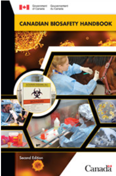

[PDF Document  
52 MB - 366 pages](/content/dam/phac-aspc/migration/cbsg-nldcb/cbh-gcb/assets/pdf/cbh-gcb-eng.pdf)

## Table of Contents

* [**PREFACE**](#pr)
* **[ABBREVIATIONS AND ACRONYMS](#ab)**
* **[CHAPTER 1 - INTRODUCTION](#ch1)** 
*  [1.1 Scope](#s11)
* [1.2 Overview](#s12)
* [1.3 The Canadian Biosafety Standard](#s13)
* [1.4 How to Use the Canadian Biosafety Handbook](#s14)
* [**CHAPTER 2 - BIOLOGICAL MATERIAL**](#ch2) 
*  [2.1 Bacteria](#s21)
* [2.2 Viruses](#s22)
* [2.3 Fungi](#s23)
* [2.4 Parasites](#s24)
* [2.5 Prions](#s25)
* [2.6 Zoonotic Pathogens](#s26)
* [2.7 Toxins](#s27)
* [2.8 Biotechnology](#s28) 
* [2.8.1 Recombinant DNA](#s281)
* [2.8.2 Genetically Modified Organisms](#s282)
* [2.8.3 Viral Vectors](#s283)
* [2.8.4 Synthetic Organisms](#s284)
* [2.9 Cell Lines and Cell Cultures](#s29)
* [**CHAPTER 3 - CONTAINMENT LEVELS AND CONTAINMENT ZONES**](#ch3) 
*  [3.1 Containment Levels](#s31) 
* [3.1.1 Containment Level Categories](#s311) 
*  [3.1.1.1 Containment Level 1](#s3111)
* [3.1.1.2 Containment Level 2](#s3112)
* [3.1.1.3 Containment Level 3](#s3113)
* [3.1.1.4 Containment Level 4](#s3114)
* [3.2 Containment Zones](#s32) 
*  [3.2.1 Containment Zone Work Areas](#s321) 
*  [3.2.1.1 Laboratory Work Area](#s3211)
* [3.2.1.2 Large Scale Production Area](#s3212)
* [3.2.1.3 Animal Work Area](#s3213)
* [3.2.2 Animal Containment Zones](#s322)
* [3.3 Identifying and Accessing a Containment Zone](#s33) 
*  [3.3.1 Containment Zone Perimeter](#s331)
* [3.3.2 Containment Barrier](#s332)
* [3.3.3 Accessing the Containment Zone: Anterooms](#s333) 
*  [3.3.3.1 Anteroom Configurations](#s3331)
* [3.3.3.2 Door Interlocks and Inward Directional Airflow](#s3332)
* [**CHAPTER 4 - RISK FACTORS, RISK GROUPS, AND RISK ASSESSMENTS**](#ch4) 
*  [4.1 Pathogen and Toxin Risk Assessments and Risk Groups](#s41) 
*  [4.1.1 Conducting Pathogen and Toxin Risk Assessments](#s411)
* [4.1.2 Risk Groups](#s412) 
*  [4.1.2.1 Risk Group 1 (RG1; low individual and community risk](#s4121)
* [4.1.2.2 Risk Group 2 (RG2; moderate individual risk, low community risk)](#s4122)
* [4.1.2.3 Risk Group 3 (RG3; high individual risk, low community risk)](#s4123)
* [4.1.2.4 Risk Group 4 (RG4; high individual risk, high community risk)](#s4124)
* [4.2 Containment Assessments](#s42)
* [4.3 Special Considerations](#s43) 
*  [4.3.1 Toxins](#s431) 
*  [4.3.1.1 Risk Factors for Toxin Risk Assessments](#s4311)
* [4.3.2 Prions](#s432)
* [4.3.3 Security Sensitive Biological Agents](#s433)
* [4.3.4 Non-indigenous Animal Pathogens](#s434)
* [4.3.5 Parasites](#s435)
* [4.3.6 Large Scale Work](#s436)
* [4.3.7 Animal Work](#s437)
* [4.3.8 Biotechnology](#s438) 
* [4.3.8.1 Modifications that May Increase the Risk of a Pathogen](#s4381)
* [4.3.8.2 Genetically Modified Organisms](#s4382)
* [4.3.8.3 Viral Vectors](#s4383)
* [4.3.8.4 Synthetic Biological Devices and Systems](#s4384)
* [4.3.9 Infectious RNA](#s439)
* [4.3.10 Cell Lines](#s4310)
* [4.3.11 Primary Specimens](#s4311)
* [4.3.12 Autologous Cells, Tissues, and Specimens](#s4312)
* [4.3.13 Handling Risk Group 1 Biological Material](#s4313)
* [4.4 Risk Management](#s44) 
*  [4.4.1 Local Risk Assessments](#s441) 
*  [4.4.1.1 Identification of Tasks and Procedures](#s4411)
* [4.4.1.2 Break Down Tasks into Steps](#s4412)
* [4.4.1.3 Identify Potential Exposure Risks for Each Step](#s4413)
* [4.4.1.4 Determine Appropriate Mitigation Strategies for Each Risk](#s4414)
* [**CHAPTER 5 - BIOSAFETY PROGRAM MANAGEMENT**](#ch5) 
*  [5.1 Administrative Controls](#s51) 
*  [5.1.1 Biosafety Policy](#s511)
* [5.1.2 Program Intent](#s512)
* [5.1.3 Roles and Responsibilities](#s513)
* [5.1.4 Biological Safety Officer](#s514)
* [5.1.5 Institutional Biosafety Committee](#s515)
* [5.2 Risk Assessments and Planning](#s52) 
*  [5.2.1 Overarching Risk Assessments](#s521)
* [5.3 Implementation of a Biosafety Program](#s53) 
*  [5.3.1 Biosafety Manual](#s531)
* [5.3.2 Biosecurity Plan](#s532)
* [5.3.3 Medical Surveillance and Evaluation Program](#s533)
* [5.3.4 Training Program](#s534)
* [5.3.5 Safe Work Practices and Standard Operating Procedures](#s535)
* [5.3.6 Emergency Response Planning](#s536)
* [5.3.7 Regulatory Compliance](#s537)
* [5.4 Measuring Program Effectiveness](#s54) 
*  [5.4.1 Incident Reporting and Investigations](#s541)
* [5.4.2 Records](#s542) 
*  [5.4.2.1 Authorized Persons](#s5421)
* [5.4.3 Inventories](#s543)
* [5.4.4 Internal Inspections and Audits](#s544)
* [5.4.5 Regulatory Reporting Requirements](#s545)
* [5.5 Continuous Improvement of the Program](#s55)
* [**CHAPTER 6 - BIOSECURITY**](/en/public-health/services/canadian-biosafety-standards-guidelines/handbook-second-edition/chapter-6-10.html) 
*  [6.1 Biosecurity Risk Assessment](/en/public-health/services/canadian-biosafety-standards-guidelines/handbook-second-edition/chapter-6-10.html#s61) 
*  [6.1.1 Identify and Prioritize Assets](/en/public-health/services/canadian-biosafety-standards-guidelines/handbook-second-edition/chapter-6-10.html#s611)
* [6.1.2 Identify and Define Threats and Vulnerabilities](/en/public-health/services/canadian-biosafety-standards-guidelines/handbook-second-edition/chapter-6-10.html#s612)
* [6.1.3 Determine Risk Levels and Mitigation Strategies](/en/public-health/services/canadian-biosafety-standards-guidelines/handbook-second-edition/chapter-6-10.html#s613)
* [6.1.4 Develop Risk Statements and Risk Registers](/en/public-health/services/canadian-biosafety-standards-guidelines/handbook-second-edition/chapter-6-10.html#s614)
* [6.2 Biosecurity Plans](/en/public-health/services/canadian-biosafety-standards-guidelines/handbook-second-edition/chapter-6-10.html#s62) 
*  [6.2.1 Elements of a Biosecurity Plan](/en/public-health/services/canadian-biosafety-standards-guidelines/handbook-second-edition/chapter-6-10.html#s621)
*  [6.2.1.1 Physical Security](/en/public-health/services/canadian-biosafety-standards-guidelines/handbook-second-edition/chapter-6-10.html#s6211)
* [6.2.1.2 Personnel Suitability and Reliability](/en/public-health/services/canadian-biosafety-standards-guidelines/handbook-second-edition/chapter-6-10.html#s6212)
* [6.2.1.3 Accountability of Pathogens and Toxins and Inventory](/en/public-health/services/canadian-biosafety-standards-guidelines/handbook-second-edition/chapter-6-10.html#s6213)
* [6.2.1.4 Information Management and Security](/en/public-health/services/canadian-biosafety-standards-guidelines/handbook-second-edition/chapter-6-10.html#s6214)
* [6.2.1.5 Incident and Emergency Response](/en/public-health/services/canadian-biosafety-standards-guidelines/handbook-second-edition/chapter-6-10.html#s6215)
* [6.3 Human Pathogen and Toxin Act Security Clearances](/en/public-health/services/canadian-biosafety-standards-guidelines/handbook-second-edition/chapter-6-10.html#s63) 
*  [6.3.1 HPTA Security Clearance Process](/en/public-health/services/canadian-biosafety-standards-guidelines/handbook-second-edition/chapter-6-10.html#s631)
* [6.3.2 Exemptions](/en/public-health/services/canadian-biosafety-standards-guidelines/handbook-second-edition/chapter-6-10.html#s632)
* [6.3.3 Validity and Portability](/en/public-health/services/canadian-biosafety-standards-guidelines/handbook-second-edition/chapter-6-10.html#s633)
* [6.3.4 Suspension and Revocation](/en/public-health/services/canadian-biosafety-standards-guidelines/handbook-second-edition/chapter-6-10.html#s634)
* [6.3.5 Notification of Criminal Offences](/en/public-health/services/canadian-biosafety-standards-guidelines/handbook-second-edition/chapter-6-10.html#s635)
* [6.3.6 Accompaniment and Supervision](/en/public-health/services/canadian-biosafety-standards-guidelines/handbook-second-edition/chapter-6-10.html#s636)
* [6.3.7 Shared Facilities](/en/public-health/services/canadian-biosafety-standards-guidelines/handbook-second-edition/chapter-6-10.html#s637)
* [**CHAPTER 7 - MEDICAL SURVEILLANCE PROGRAM**](/en/public-health/services/canadian-biosafety-standards-guidelines/handbook-second-edition/chapter-6-10.html#ch7) 
*  [7.1 Laboratory Exposures and Laboratory Acquired Infections/Intoxications](/en/public-health/services/canadian-biosafety-standards-guidelines/handbook-second-edition/chapter-6-10.html#s71)
* [7.2 Pre-Placement Medical Evaluation](/en/public-health/services/canadian-biosafety-standards-guidelines/handbook-second-edition/chapter-6-10.html#s72)
* [7.3 Vaccinations](/en/public-health/services/canadian-biosafety-standards-guidelines/handbook-second-edition/chapter-6-10.html#s73)
* [7.4 Ongoing Medical Surveillance](/en/public-health/services/canadian-biosafety-standards-guidelines/handbook-second-edition/chapter-6-10.html#s74)
* [7.5 Post-Exposure Response Plan](/en/public-health/services/canadian-biosafety-standards-guidelines/handbook-second-edition/chapter-6-10.html#s75)
* [7.6 Additional Considerations for High Containment](/en/public-health/services/canadian-biosafety-standards-guidelines/handbook-second-edition/chapter-6-10.html#s76)
* [7.7 Emergency Medical Contact Card](/en/public-health/services/canadian-biosafety-standards-guidelines/handbook-second-edition/chapter-6-10.html#s77)
* [**CHAPTER 8 - TRAINING PROGRAM**](/en/public-health/services/canadian-biosafety-standards-guidelines/handbook-second-edition/chapter-6-10.html#ch8) 
*  [8.1 Training Needs and Objectives](/en/public-health/services/canadian-biosafety-standards-guidelines/handbook-second-edition/chapter-6-10.html#s81)
* [8.2 Training Program Content](/en/public-health/services/canadian-biosafety-standards-guidelines/handbook-second-edition/chapter-6-10.html#s82) 
* [8.2.1 Biosecurity Training](/en/public-health/services/canadian-biosafety-standards-guidelines/handbook-second-edition/chapter-6-10.html#s821)
* [8.2.2 Training on Containment Systems and Equipment](/en/public-health/services/canadian-biosafety-standards-guidelines/handbook-second-edition/chapter-6-10.html#s822)
* [8.3 Identification of Trainees](/en/public-health/services/canadian-biosafety-standards-guidelines/handbook-second-edition/chapter-6-10.html#s83) 
* [8.3.1 New Personnel](/en/public-health/services/canadian-biosafety-standards-guidelines/handbook-second-edition/chapter-6-10.html#s831)
* [8.3.2 Existing Laboratory Personnel](/en/public-health/services/canadian-biosafety-standards-guidelines/handbook-second-edition/chapter-6-10.html#s832)
* [8.3.3 Other Personnel](/en/public-health/services/canadian-biosafety-standards-guidelines/handbook-second-edition/chapter-6-10.html#s833)
* [8.3.4 Learning Conditions](/en/public-health/services/canadian-biosafety-standards-guidelines/handbook-second-edition/chapter-6-10.html#s834)
* [8.4 Training Evaluation](/en/public-health/services/canadian-biosafety-standards-guidelines/handbook-second-edition/chapter-6-10.html#s84)
* [8.5 Training Records](/en/public-health/services/canadian-biosafety-standards-guidelines/handbook-second-edition/chapter-6-10.html#s85)
* [8.6 Training Program Review](/en/public-health/services/canadian-biosafety-standards-guidelines/handbook-second-edition/chapter-6-10.html#s86)
* [**CHAPTER 9 - PERSONAL PROTECTIVE EQUIPMENT**](/en/public-health/services/canadian-biosafety-standards-guidelines/handbook-second-edition/chapter-6-10.html#ch9) 
*  [9.1 Types and Selection of Personal Protective Equipment](/en/public-health/services/canadian-biosafety-standards-guidelines/handbook-second-edition/chapter-6-10.html#s91) 
*  [9.1.1 Hand Protection](/en/public-health/services/canadian-biosafety-standards-guidelines/handbook-second-edition/chapter-6-10.html#s911) 
*  [9.1.1.1 Double-Gloving](/en/public-health/services/canadian-biosafety-standards-guidelines/handbook-second-edition/chapter-6-10.html#s9111)
* [9.1.1.2 Protection from Physical Hazards](/en/public-health/services/canadian-biosafety-standards-guidelines/handbook-second-edition/chapter-6-10.html#s9112)
* [9.1.2 Foot Protection](/en/public-health/services/canadian-biosafety-standards-guidelines/handbook-second-edition/chapter-6-10.html#s912)
* [9.1.3 Head Protection](/en/public-health/services/canadian-biosafety-standards-guidelines/handbook-second-edition/chapter-6-10.html#s913)
* [9.1.4 Eye and Face Protection](/en/public-health/services/canadian-biosafety-standards-guidelines/handbook-second-edition/chapter-6-10.html#s914)
* [9.1.5 Body Protection](/en/public-health/services/canadian-biosafety-standards-guidelines/handbook-second-edition/chapter-6-10.html#s915) 
* [9.1.5.1 Additional Layer of Protective Clothing](/en/public-health/services/canadian-biosafety-standards-guidelines/handbook-second-edition/chapter-6-10.html#s9151)
* [9.1.5.2 Positive-Pressure Suits](/en/public-health/services/canadian-biosafety-standards-guidelines/handbook-second-edition/chapter-6-10.html#s9152)
* [9.1.6 Masks and Respiratory Protection](/en/public-health/services/canadian-biosafety-standards-guidelines/handbook-second-edition/chapter-6-10.html#s916) 
*  [9.1.6.1 Respirator Fit](/en/public-health/services/canadian-biosafety-standards-guidelines/handbook-second-edition/chapter-6-10.html#s9161)
* [9.1.6.2 Air Purifying Respirators](/en/public-health/services/canadian-biosafety-standards-guidelines/handbook-second-edition/chapter-6-10.html#s9162)
* [9.1.6.3 Powered Air Purifying Respirators](/en/public-health/services/canadian-biosafety-standards-guidelines/handbook-second-edition/chapter-6-10.html#s9163)
* [9.1.6.4 Atmosphere-Supplying Respirators](/en/public-health/services/canadian-biosafety-standards-guidelines/handbook-second-edition/chapter-6-10.html#s9164)
* [9.2 Key Considerations for the Selection of Personal Protective Equipment](/en/public-health/services/canadian-biosafety-standards-guidelines/handbook-second-edition/chapter-6-10.html#s92)
* [9.3 Use of Personal Protective Equipment](/en/public-health/services/canadian-biosafety-standards-guidelines/handbook-second-edition/chapter-6-10.html#s93) 
*  [9.3.1 Donning](/en/public-health/services/canadian-biosafety-standards-guidelines/handbook-second-edition/chapter-6-10.html#s931)
* [9.3.2 Doffing](/en/public-health/services/canadian-biosafety-standards-guidelines/handbook-second-edition/chapter-6-10.html#s932)
* [9.3.3 General Use Tips](/en/public-health/services/canadian-biosafety-standards-guidelines/handbook-second-edition/chapter-6-10.html#s933) 
*  [9.3.3.1 Gloves](/en/public-health/services/canadian-biosafety-standards-guidelines/handbook-second-edition/chapter-6-10.html#s9331)
* [9.3.3.2 Footwear](/en/public-health/services/canadian-biosafety-standards-guidelines/handbook-second-edition/chapter-6-10.html#s9332)
* [9.3.3.3 Head Protection](/en/public-health/services/canadian-biosafety-standards-guidelines/handbook-second-edition/chapter-6-10.html#s9333)
* [9.3.3.4 Eye and Face Protection](/en/public-health/services/canadian-biosafety-standards-guidelines/handbook-second-edition/chapter-6-10.html#s9334)
* [9.3.3.5 Body Protection](/en/public-health/services/canadian-biosafety-standards-guidelines/handbook-second-edition/chapter-6-10.html#s9335)
* [9.3.3.6 Masks and Respiratory Protection](/en/public-health/services/canadian-biosafety-standards-guidelines/handbook-second-edition/chapter-6-10.html#s9336)
* [**CHAPTER 10 - AIR HANDLING**](/en/public-health/services/canadian-biosafety-standards-guidelines/handbook-second-edition/chapter-6-10.html#ch10) 
*  [10.1 Inward Directional Airflow](/en/public-health/services/canadian-biosafety-standards-guidelines/handbook-second-edition/chapter-6-10.html#s101) 
*  [10.1.1 Verifying Inward Directional Airflow and Containment Barrier Integrity](/en/public-health/services/canadian-biosafety-standards-guidelines/handbook-second-edition/chapter-6-10.html#s1011) 
*  [10.1.1.1 Pressure Decay Testing](/en/public-health/services/canadian-biosafety-standards-guidelines/handbook-second-edition/chapter-6-10.html#s10111)
* [10.2 High Efficiency Particulate Air Filters](/en/public-health/services/canadian-biosafety-standards-guidelines/handbook-second-edition/chapter-6-10.html#s102)
* [**CHAPTER 11 - BIOLOGICAL SAFETY CABINETS**](/en/public-health/services/canadian-biosafety-standards-guidelines/handbook-second-edition/chapter-11-15.html#ch11) 
*  [11.1 Classes and Descriptions](/en/public-health/services/canadian-biosafety-standards-guidelines/handbook-second-edition/chapter-11-15.html#s111) 
*  [11.1.1 Class I](/en/public-health/services/canadian-biosafety-standards-guidelines/handbook-second-edition/chapter-11-15.html#s1111)
* [11.1.2 Class II](/en/public-health/services/canadian-biosafety-standards-guidelines/handbook-second-edition/chapter-11-15.html#s1112) 
*  [11.1.2.1 Type A1](/en/public-health/services/canadian-biosafety-standards-guidelines/handbook-second-edition/chapter-11-15.html#s11121)
* [11.1.2.2 Type A2](/en/public-health/services/canadian-biosafety-standards-guidelines/handbook-second-edition/chapter-11-15.html#s11122)
* [11.1.2.3 Type B1](/en/public-health/services/canadian-biosafety-standards-guidelines/handbook-second-edition/chapter-11-15.html#s11123)
* [11.1.2.4 Type B2](/en/public-health/services/canadian-biosafety-standards-guidelines/handbook-second-edition/chapter-11-15.html#s11124)
* [11.1.3 Class III](/en/public-health/services/canadian-biosafety-standards-guidelines/handbook-second-edition/chapter-11-15.html#s1113)
* [11.2 Installation of BSCs](/en/public-health/services/canadian-biosafety-standards-guidelines/handbook-second-edition/chapter-11-15.html#s112)
* [11.3 Testing and Certification](/en/public-health/services/canadian-biosafety-standards-guidelines/handbook-second-edition/chapter-11-15.html#s113)
* [11.4 Proper Use](/en/public-health/services/canadian-biosafety-standards-guidelines/handbook-second-edition/chapter-11-15.html#s114) 
*  [11.4.1 Start-Up Considerations](/en/public-health/services/canadian-biosafety-standards-guidelines/handbook-second-edition/chapter-11-15.html#s1141)
* [11.4.2 Working in the BSC](/en/public-health/services/canadian-biosafety-standards-guidelines/handbook-second-edition/chapter-11-15.html#s1142)
* [11.4.3 Completion of Work in the BSC](/en/public-health/services/canadian-biosafety-standards-guidelines/handbook-second-edition/chapter-11-15.html#s1143)
* [11.4.4 Ultraviolet Light Considerations](/en/public-health/services/canadian-biosafety-standards-guidelines/handbook-second-edition/chapter-11-15.html#s1144)
* [**CHAPTER 12 - SAFETY CONSIDERATIONS FOR EQUIPMENT USED FOR BIOLOGICAL WORK**](/en/public-health/services/canadian-biosafety-standards-guidelines/handbook-second-edition/chapter-11-15.html#ch12) 
*  [12.1 Centrifuges](/en/public-health/services/canadian-biosafety-standards-guidelines/handbook-second-edition/chapter-11-15.html#s121)
* [12.2 Microtomes](/en/public-health/services/canadian-biosafety-standards-guidelines/handbook-second-edition/chapter-11-15.html#s122)
* [12.3 Blenders, Sonicators, Homogenizers, Shaking Incubators, and Mixers](/en/public-health/services/canadian-biosafety-standards-guidelines/handbook-second-edition/chapter-11-15.html#s123)
* [12.4 Bunsen Burners](/en/public-health/services/canadian-biosafety-standards-guidelines/handbook-second-edition/chapter-11-15.html#s124)
* [12.5 Microincinerators](/en/public-health/services/canadian-biosafety-standards-guidelines/handbook-second-edition/chapter-11-15.html#s125)
* [12.6 Disposable Loops](/en/public-health/services/canadian-biosafety-standards-guidelines/handbook-second-edition/chapter-11-15.html#s126)
* [12.7 Pipetting Aids](/en/public-health/services/canadian-biosafety-standards-guidelines/handbook-second-edition/chapter-11-15.html#s127)
* [12.8 Vacuum Pumps and Systems](/en/public-health/services/canadian-biosafety-standards-guidelines/handbook-second-edition/chapter-11-15.html#s128)
* [12.9 Chemical Fume Hoods](/en/public-health/services/canadian-biosafety-standards-guidelines/handbook-second-edition/chapter-11-15.html#s129)
* [12.10 Pass-Through Chambers](/en/public-health/services/canadian-biosafety-standards-guidelines/handbook-second-edition/chapter-11-15.html#s1210)
* [12.11 Cell Sorters](/en/public-health/services/canadian-biosafety-standards-guidelines/handbook-second-edition/chapter-11-15.html#s1211)
* [12.12 Compressed Gas Cylinders](/en/public-health/services/canadian-biosafety-standards-guidelines/handbook-second-edition/chapter-11-15.html#s1212)
* [12.13 Additional Equipment Considerations for Prions](/en/public-health/services/canadian-biosafety-standards-guidelines/handbook-second-edition/chapter-11-15.html#s1213)
* [12.14 Additional Equipment Considerations for Toxins](/en/public-health/services/canadian-biosafety-standards-guidelines/handbook-second-edition/chapter-11-15.html#s1214)
* [**CHAPTER 13 - ANIMAL WORK CONSIDERATIONS**](/en/public-health/services/canadian-biosafety-standards-guidelines/handbook-second-edition/chapter-11-15.html#ch13) 
*  [13.1 Animal Characteristics](/en/public-health/services/canadian-biosafety-standards-guidelines/handbook-second-edition/chapter-11-15.html#s131)
* [13.2 Animal Containment Zone Designs](/en/public-health/services/canadian-biosafety-standards-guidelines/handbook-second-edition/chapter-11-15.html#s132) 
*  [13.2.1 Small Animal Containment Zones](/en/public-health/services/canadian-biosafety-standards-guidelines/handbook-second-edition/chapter-11-15.html#s1321)
* [13.2.2 Large Animal Containment Zones](/en/public-health/services/canadian-biosafety-standards-guidelines/handbook-second-edition/chapter-11-15.html#s1322)
* [13.2.3 Animal Containment Zone Design Considerations](/en/public-health/services/canadian-biosafety-standards-guidelines/handbook-second-edition/chapter-11-15.html#s1323) 
*  [13.2.3.1 Single Corridor versus Dual Corridor Designs](/en/public-health/services/canadian-biosafety-standards-guidelines/handbook-second-edition/chapter-11-15.html#s13231)
* [13.2.3.2 Access and Anterooms](/en/public-health/services/canadian-biosafety-standards-guidelines/handbook-second-edition/chapter-11-15.html#s13232)
* [13.2.3.3 Cold Storage](/en/public-health/services/canadian-biosafety-standards-guidelines/handbook-second-edition/chapter-11-15.html#s13233)
* [13.2.3.4 Unique Physical Requirements](/en/public-health/services/canadian-biosafety-standards-guidelines/handbook-second-edition/chapter-11-15.html#s13234)
* [13.3 Equipment](/en/public-health/services/canadian-biosafety-standards-guidelines/handbook-second-edition/chapter-11-15.html#s13234)
* [13.4 Personnel Training](/en/public-health/services/canadian-biosafety-standards-guidelines/handbook-second-edition/chapter-11-15.html#s134)
* [13.5 Handling and Restraint](/en/public-health/services/canadian-biosafety-standards-guidelines/handbook-second-edition/chapter-11-15.html#s135)
* [13.6 Decontamination and Waste Management](/en/public-health/services/canadian-biosafety-standards-guidelines/handbook-second-edition/chapter-11-15.html#s136)
* [13.7 Confinement](/en/public-health/services/canadian-biosafety-standards-guidelines/handbook-second-edition/chapter-11-15.html#s137)
* [13.8 Special Considerations for Work with Prion-Infected Animals](/en/public-health/services/canadian-biosafety-standards-guidelines/handbook-second-edition/chapter-11-15.html#s138)
* [13.9 Working with Non-Human Primates](/en/public-health/services/canadian-biosafety-standards-guidelines/handbook-second-edition/chapter-11-15.html#s139)
* [**CHAPTER 14 - LARGE SCALE WORK**](/en/public-health/services/canadian-biosafety-standards-guidelines/handbook-second-edition/chapter-11-15.html#ch14) 
*  [14.1 Scope](/en/public-health/services/canadian-biosafety-standards-guidelines/handbook-second-edition/chapter-11-15.html#s141)
* [14.2 Considerations for Large Scale Work](/en/public-health/services/canadian-biosafety-standards-guidelines/handbook-second-edition/chapter-11-15.html#s142)
* [14.3 Fermenters](/en/public-health/services/canadian-biosafety-standards-guidelines/handbook-second-edition/chapter-11-15.html#s143)
* [14.4 Regulatory Considerations](/en/public-health/services/canadian-biosafety-standards-guidelines/handbook-second-edition/chapter-11-15.html#s144)
* [**CHAPTER 15 - DECONTAMINATION**](/en/public-health/services/canadian-biosafety-standards-guidelines/handbook-second-edition/chapter-11-15.html#ch15) 
*  [15.1 Principles of Sterilization, Disinfection, and Decontamination](/en/public-health/services/canadian-biosafety-standards-guidelines/handbook-second-edition/chapter-11-15.html#s151)
* [15.2 Validation and Verification of Decontamination Technologies and Processes](/en/public-health/services/canadian-biosafety-standards-guidelines/handbook-second-edition/chapter-11-15.html#s152) 
*  [15.2.1.1 Validation](/en/public-health/services/canadian-biosafety-standards-guidelines/handbook-second-edition/chapter-11-15.html#s15211)
* [15.2.1.2 Verification](/en/public-health/services/canadian-biosafety-standards-guidelines/handbook-second-edition/chapter-11-15.html#s15212)
* [15.2.1.3 Indicators, Integrators and Parametric Monitoring Devices](/en/public-health/services/canadian-biosafety-standards-guidelines/handbook-second-edition/chapter-11-15.html#s15213)
* [15.3 Chemical Disinfectants](/en/public-health/services/canadian-biosafety-standards-guidelines/handbook-second-edition/chapter-11-15.html#s153) 
*  [15.3.1 Selection of Chemical Disinfectants](/en/public-health/services/canadian-biosafety-standards-guidelines/handbook-second-edition/chapter-11-15.html#s1531) 
* [15.3.1.1 Organic Load](/en/public-health/services/canadian-biosafety-standards-guidelines/handbook-second-edition/chapter-11-15.html#s15311)
* [15.3.1.2 Concentration](/en/public-health/services/canadian-biosafety-standards-guidelines/handbook-second-edition/chapter-11-15.html#s15312)
* [15.3.1.3 Contact Time](/en/public-health/services/canadian-biosafety-standards-guidelines/handbook-second-edition/chapter-11-15.html#s15313)
* [15.3.1.4 Temperature](/en/public-health/services/canadian-biosafety-standards-guidelines/handbook-second-edition/chapter-11-15.html#s15314)
* [15.3.1.5 Relative Humidity](/en/public-health/services/canadian-biosafety-standards-guidelines/handbook-second-edition/chapter-11-15.html#s15315)
* [15.3.1.6 pH](/en/public-health/services/canadian-biosafety-standards-guidelines/handbook-second-edition/chapter-11-15.html#s15316)
* [15.3.1.7 Stability/Storage](/en/public-health/services/canadian-biosafety-standards-guidelines/handbook-second-edition/chapter-11-15.html#s15317)
* [15.3.2 Classes of Chemical Disinfectants](/en/public-health/services/canadian-biosafety-standards-guidelines/handbook-second-edition/chapter-11-15.html#s1532)
* [15.4 Autoclaves](/en/public-health/services/canadian-biosafety-standards-guidelines/handbook-second-edition/chapter-11-15.html#s154) 
*  [15.4.1 Recommended Procedures for the Use of Autoclaves](/en/public-health/services/canadian-biosafety-standards-guidelines/handbook-second-edition/chapter-11-15.html#s1541) 
*  [15.4.1.1 Before Loading the Autoclave](/en/public-health/services/canadian-biosafety-standards-guidelines/handbook-second-edition/chapter-11-15.html#s15411)
* [15.4.1.2 Loading the Autoclave](/en/public-health/services/canadian-biosafety-standards-guidelines/handbook-second-edition/chapter-11-15.html#s15412)
* [15.4.1.3 Unloading the Autoclave](/en/public-health/services/canadian-biosafety-standards-guidelines/handbook-second-edition/chapter-11-15.html#s15413)
* [15.4.1.4 Verifying the Autoclave Run](/en/public-health/services/canadian-biosafety-standards-guidelines/handbook-second-edition/chapter-11-15.html#s15414)
* [15.4.2 Recommended Procedures for Efficacy Monitoring of Autoclaves](/en/public-health/services/canadian-biosafety-standards-guidelines/handbook-second-edition/chapter-11-15.html#s1542)
* [15.5 Gaseous Decontamination](/en/public-health/services/canadian-biosafety-standards-guidelines/handbook-second-edition/chapter-11-15.html#s155)
* [15.6 Effluent Decontamination Systems](/en/public-health/services/canadian-biosafety-standards-guidelines/handbook-second-edition/chapter-11-15.html#s156)
* [15.7 Irradiation](/en/public-health/services/canadian-biosafety-standards-guidelines/handbook-second-edition/chapter-11-15.html#s157)
* [15.8 Incineration](/en/public-health/services/canadian-biosafety-standards-guidelines/handbook-second-edition/chapter-11-15.html#s158)
* [15.9 Dunk Tanks](/en/public-health/services/canadian-biosafety-standards-guidelines/handbook-second-edition/chapter-11-15.html#s159)
* [15.10 Animal Carcasses and Anatomical Waste](/en/public-health/services/canadian-biosafety-standards-guidelines/handbook-second-edition/chapter-11-15.html#s1510)
* [15.11 Thermal and Chemical Decontamination of Biological Toxins](/en/public-health/services/canadian-biosafety-standards-guidelines/handbook-second-edition/chapter-11-15.html#s1511) 
*  [15.11.1 Thermal Decontamination](/en/public-health/services/canadian-biosafety-standards-guidelines/handbook-second-edition/chapter-11-15.html#s15111)
* [15.11.2 Chemical Decontamination](/en/public-health/services/canadian-biosafety-standards-guidelines/handbook-second-edition/chapter-11-15.html#s15112)
* [15.11.3 Decontamination Parameters](/en/public-health/services/canadian-biosafety-standards-guidelines/handbook-second-edition/chapter-11-15.html#s15113)
* [15.12 Additional Considerations for Prion Decontamination](/en/public-health/services/canadian-biosafety-standards-guidelines/handbook-second-edition/chapter-11-15.html#s1512)
* [**CHAPTER 16 - WASTE MANAGEMENT**](/en/public-health/services/canadian-biosafety-standards-guidelines/handbook-second-edition/chapter-16-20.html#ch16) 
*  [16.1 Biomedical Waste](/en/public-health/services/canadian-biosafety-standards-guidelines/handbook-second-edition/chapter-16-20.html#s161) 
*  [16.1.1 Human Anatomical Waste](/en/public-health/services/canadian-biosafety-standards-guidelines/handbook-second-edition/chapter-16-20.html#s1611)
* [16.1.2 Animal Waste](/en/public-health/services/canadian-biosafety-standards-guidelines/handbook-second-edition/chapter-16-20.html#s1612)
* [16.1.3 Microbiology Laboratory Waste](/en/public-health/services/canadian-biosafety-standards-guidelines/handbook-second-edition/chapter-16-20.html#s1613)
* [16.1.4 Human Blood and Body Fluid Waste](/en/public-health/services/canadian-biosafety-standards-guidelines/handbook-second-edition/chapter-16-20.html#s1614)
* [16.1.5 Sharps Waste](/en/public-health/services/canadian-biosafety-standards-guidelines/handbook-second-edition/chapter-16-20.html#s1615)
* [16.2 Storage and Disposal of Biomedical Waste](/en/public-health/services/canadian-biosafety-standards-guidelines/handbook-second-edition/chapter-16-20.html#s162)
* [**CHAPTER 17 - EMERGENCY RESPONSE PLAN**](/en/public-health/services/canadian-biosafety-standards-guidelines/handbook-second-edition/chapter-16-20.html#ch17) 
*  [17.1 Emergency Response Plan Development](/en/public-health/services/canadian-biosafety-standards-guidelines/handbook-second-edition/chapter-16-20.html#s171)
* [17.2 Emergency Response Plan Implementation](/en/public-health/services/canadian-biosafety-standards-guidelines/handbook-second-edition/chapter-16-20.html#s172)
* [17.3 Spill Response](/en/public-health/services/canadian-biosafety-standards-guidelines/handbook-second-edition/chapter-16-20.html#s173) 
*  [17.3.1 General Spill Clean-Up Procedure](/en/public-health/services/canadian-biosafety-standards-guidelines/handbook-second-edition/chapter-16-20.html#s1731)
* [17.3.2 Spill Inside a Biological Safety Cabinet](/en/public-health/services/canadian-biosafety-standards-guidelines/handbook-second-edition/chapter-16-20.html#s1732)
* [17.3.3 Spill Inside a Centrifuge](/en/public-health/services/canadian-biosafety-standards-guidelines/handbook-second-edition/chapter-16-20.html#s1733)
* [**CHAPTER 18 - INCIDENT REPORTING AND INVESTIGATION**](/en/public-health/services/canadian-biosafety-standards-guidelines/handbook-second-edition/chapter-16-20.html#ch18) 
*  [18.1 Incident Reporting](/en/public-health/services/canadian-biosafety-standards-guidelines/handbook-second-edition/chapter-16-20.html#s181) 
*  [18.1.1 Incident Reporting to the Public Health Agency of Canada](/en/public-health/services/canadian-biosafety-standards-guidelines/handbook-second-edition/chapter-16-20.html#s1811) 
*  [18.1.1.1 Notification of Exposures Involving Human Pathogens and Toxins](/en/public-health/services/canadian-biosafety-standards-guidelines/handbook-second-edition/chapter-16-20.html#s18111)
* [18.1.1.2 Exposure Follow-Up Activity](/en/public-health/services/canadian-biosafety-standards-guidelines/handbook-second-edition/chapter-16-20.html#s18112)
* [18.1.1.3 Annual Reporting of Incidents Involving Security Sensitive Biological Agents](/en/public-health/services/canadian-biosafety-standards-guidelines/handbook-second-edition/chapter-16-20.html#s18113)
* [18.1.1.4 Exposure Reporting Program](/en/public-health/services/canadian-biosafety-standards-guidelines/handbook-second-edition/chapter-16-20.html#s18114)
* [18.1.2 Reporting to the Canadian Food Inspection Agency](/en/public-health/services/canadian-biosafety-standards-guidelines/handbook-second-edition/chapter-16-20.html#s1812)
* [18.2 Incident Investigation](/en/public-health/services/canadian-biosafety-standards-guidelines/handbook-second-edition/chapter-16-20.html#s182) 
*  [18.2.1 Initial Response](/en/public-health/services/canadian-biosafety-standards-guidelines/handbook-second-edition/chapter-16-20.html#s1821)
* [18.2.2 Collection of Evidence and Information](/en/public-health/services/canadian-biosafety-standards-guidelines/handbook-second-edition/chapter-16-20.html#s1822)
* [18.2.3 Analysis and Identification of Root Causes](/en/public-health/services/canadian-biosafety-standards-guidelines/handbook-second-edition/chapter-16-20.html#s1823)
* [18.2.4 Development of Corrective and Preventive Action Plans](/en/public-health/services/canadian-biosafety-standards-guidelines/handbook-second-edition/chapter-16-20.html#s1824)
* [18.2.5 Evaluation and Continual Improvement](/en/public-health/services/canadian-biosafety-standards-guidelines/handbook-second-edition/chapter-16-20.html#s1825)
* [**CHAPTER 19 - PATHOGEN AND TOXIN ACCOUNTABILITY AND INVENTORY CONTROL**](/en/public-health/services/canadian-biosafety-standards-guidelines/handbook-second-edition/chapter-16-20.html#ch19) 
*  [19.1 Pathogen and Toxin Accountability](/en/public-health/services/canadian-biosafety-standards-guidelines/handbook-second-edition/chapter-16-20.html#s191) 
*  [19.1.1 Internal Accountability System](/en/public-health/services/canadian-biosafety-standards-guidelines/handbook-second-edition/chapter-16-20.html#s1911)
* [19.1.2 Accountability Measures during Movement and Transportation](/en/public-health/services/canadian-biosafety-standards-guidelines/handbook-second-edition/chapter-16-20.html#s1912)
* [19.2 Inventories and Inventory Control Systems](/en/public-health/services/canadian-biosafety-standards-guidelines/handbook-second-edition/chapter-16-20.html#s192) 
*  [19.2.1 Inventory Elements](/en/public-health/services/canadian-biosafety-standards-guidelines/handbook-second-edition/chapter-16-20.html#s1921)
* [19.2.2 Inventory Review and Updates](/en/public-health/services/canadian-biosafety-standards-guidelines/handbook-second-edition/chapter-16-20.html#s1922)
* [19.2.3 Inventory Control Systems and Reporting](/en/public-health/services/canadian-biosafety-standards-guidelines/handbook-second-edition/chapter-16-20.html#s1923)
* [19.3 Storage and Labelling](/en/public-health/services/canadian-biosafety-standards-guidelines/handbook-second-edition/chapter-16-20.html#s193)
* [**CHAPTER 20 - MOVEMENT AND TRANSPORTATION OF INFECTIOUS MATERIAL OR TOXINS**](/en/public-health/services/canadian-biosafety-standards-guidelines/handbook-second-edition/chapter-16-20.html#ch20) 
*  [20.1 Movement of Infectious Material or Toxins](/en/public-health/services/canadian-biosafety-standards-guidelines/handbook-second-edition/chapter-16-20.html#s201) 
*  [20.1.1 Movement of Infectious Material or Toxins within a Containment Zone](/en/public-health/services/canadian-biosafety-standards-guidelines/handbook-second-edition/chapter-16-20.html#s2011)
* [20.1.2 Movement of Infectious Material or Toxins between Containment Zones within the Same Building](/en/public-health/services/canadian-biosafety-standards-guidelines/handbook-second-edition/chapter-16-20.html#s2012)
* [20.2 Transportation of Infectious Material or Toxins](/en/public-health/services/canadian-biosafety-standards-guidelines/handbook-second-edition/chapter-16-20.html#s202) 
*  [20.2.1 Domestic and International Transportation Regulations](/en/public-health/services/canadian-biosafety-standards-guidelines/handbook-second-edition/chapter-16-20.html#s2021)
* [20.2.2 Considerations for Shipping and Receiving](/en/public-health/services/canadian-biosafety-standards-guidelines/handbook-second-edition/chapter-16-20.html#s2022)
* [20.2.3 Transportation of Infectious Material or Toxins between Buildings](/en/public-health/services/canadian-biosafety-standards-guidelines/handbook-second-edition/chapter-16-20.html#s2023)
* [**CHAPTER 21 - WORKING WITH RISK GROUP 1 BIOLOGICAL MATERIAL**](/en/public-health/services/canadian-biosafety-standards-guidelines/handbook-second-edition/chapter-21-25.html#ch21) 
*  [21.1 Physical Design Considerations](/en/public-health/services/canadian-biosafety-standards-guidelines/handbook-second-edition/chapter-21-25.html#s211)
* [21.2 Operational Practice Considerations](/en/public-health/services/canadian-biosafety-standards-guidelines/handbook-second-edition/chapter-21-25.html#s212) 
*  [21.2.1 Risk Assessments, Personal Protective Equipment, and Training](/en/public-health/services/canadian-biosafety-standards-guidelines/handbook-second-edition/chapter-21-25.html#s2121)
* [21.2.2 Good Microbiological Laboratory Practices](/en/public-health/services/canadian-biosafety-standards-guidelines/handbook-second-edition/chapter-21-25.html#s2122)
* [21.3 Routine Practices and Universal Precautions](/en/public-health/services/canadian-biosafety-standards-guidelines/handbook-second-edition/chapter-21-25.html#s213)
* [**CHAPTER 22 - DESIGN CONSIDERATIONS FOR NEW CONTAINMENT ZONES**](/en/public-health/services/canadian-biosafety-standards-guidelines/handbook-second-edition/chapter-21-25.html#ch22) 
*  [22.1 Planning](/en/public-health/services/canadian-biosafety-standards-guidelines/handbook-second-edition/chapter-21-25.html#s221) 
*  [22.1.1 Commissioning](/en/public-health/services/canadian-biosafety-standards-guidelines/handbook-second-edition/chapter-21-25.html#s2211)
* [22.2 General Building Layout](/en/public-health/services/canadian-biosafety-standards-guidelines/handbook-second-edition/chapter-21-25.html#s222) 
*  [22.2.1 The Containment Zone](/en/public-health/services/canadian-biosafety-standards-guidelines/handbook-second-edition/chapter-21-25.html#s2221)
* [22.2.2 Laboratory Support Areas](/en/public-health/services/canadian-biosafety-standards-guidelines/handbook-second-edition/chapter-21-25.html#s2222)
* [22.2.3 Electrical Systems](/en/public-health/services/canadian-biosafety-standards-guidelines/handbook-second-edition/chapter-21-25.html#s2223)
* [22.3 Building Mechanical Systems](/en/public-health/services/canadian-biosafety-standards-guidelines/handbook-second-edition/chapter-21-25.html#s223) 
*  [22.3.1 Communication System](/en/public-health/services/canadian-biosafety-standards-guidelines/handbook-second-edition/chapter-21-25.html#s2231)
* [22.3.2 Air Handling](/en/public-health/services/canadian-biosafety-standards-guidelines/handbook-second-edition/chapter-21-25.html#s2232) 
*  [22.3.2.1 Class II B2 Biological Safety Cabinets](/en/public-health/services/canadian-biosafety-standards-guidelines/handbook-second-edition/chapter-21-25.html#s22321)
* [22.3.2.2 Chemical Fume Hoods](/en/public-health/services/canadian-biosafety-standards-guidelines/handbook-second-edition/chapter-21-25.html#s22322)
* [22.3.3 Plumbing](/en/public-health/services/canadian-biosafety-standards-guidelines/handbook-second-edition/chapter-21-25.html#s2233) 
*  [22.3.3.1 Sinks](/en/public-health/services/canadian-biosafety-standards-guidelines/handbook-second-edition/chapter-21-25.html#s22331)
* [22.3.3.2 Emergency Shower and Eyewash](/en/public-health/services/canadian-biosafety-standards-guidelines/handbook-second-edition/chapter-21-25.html#s22332)
* [22.4 Decontamination Technologies](/en/public-health/services/canadian-biosafety-standards-guidelines/handbook-second-edition/chapter-21-25.html#s224) 
*  [22.4.1 Autoclaves](/en/public-health/services/canadian-biosafety-standards-guidelines/handbook-second-edition/chapter-21-25.html#s2241)
* [22.4.2 Effluent Decontamination Systems](/en/public-health/services/canadian-biosafety-standards-guidelines/handbook-second-edition/chapter-21-25.html#s2242)
* [22.4.3 Whole Room Decontamination](/en/public-health/services/canadian-biosafety-standards-guidelines/handbook-second-edition/chapter-21-25.html#s2243)
* [22.5 Building Physical Components](/en/public-health/services/canadian-biosafety-standards-guidelines/handbook-second-edition/chapter-21-25.html#s225) 
*  [22.5.1 Windows on the Barrier](/en/public-health/services/canadian-biosafety-standards-guidelines/handbook-second-edition/chapter-21-25.html#s2251)
* [22.5.2 Doors and Access](/en/public-health/services/canadian-biosafety-standards-guidelines/handbook-second-edition/chapter-21-25.html#s2252)
* [22.5.3 Door Interlocks and Anterooms](/en/public-health/services/canadian-biosafety-standards-guidelines/handbook-second-edition/chapter-21-25.html#s2253)
* [22.5.4 Materials and Surface Coverings](/en/public-health/services/canadian-biosafety-standards-guidelines/handbook-second-edition/chapter-21-25.html#s2254)
* [22.5.5 Equipment and Furniture](/en/public-health/services/canadian-biosafety-standards-guidelines/handbook-second-edition/chapter-21-25.html#s2255)
* [**CHAPTER 23 - REGULATORY OVERSIGHT OF HUMAN AND ANIMAL PATHOGENS AND TOXINS IN CANADA**](/en/public-health/services/canadian-biosafety-standards-guidelines/handbook-second-edition/chapter-21-25.html#ch23) 
*  [23.1 Regulatory Authorities](/en/public-health/services/canadian-biosafety-standards-guidelines/handbook-second-edition/chapter-21-25.html#s231)
* [23.2 Controlled Activities with Human Pathogens and Toxins](/en/public-health/services/canadian-biosafety-standards-guidelines/handbook-second-edition/chapter-21-25.html#s232) 
*  [23.2.1 Exclusions and Exemptions](/en/public-health/services/canadian-biosafety-standards-guidelines/handbook-second-edition/chapter-21-25.html#s2321)
* [23.2.2 Types of Licences](/en/public-health/services/canadian-biosafety-standards-guidelines/handbook-second-edition/chapter-21-25.html#s2322)
* [23.3 Importation of Animal Pathogens into Canada](/en/public-health/services/canadian-biosafety-standards-guidelines/handbook-second-edition/chapter-21-25.html#s233) 
*  [23.3.1 Facility Certification for the Importation of Animal Pathogens](/en/public-health/services/canadian-biosafety-standards-guidelines/handbook-second-edition/chapter-21-25.html#s2331)
* [23.4 Activities with Zoonotic Pathogens](/en/public-health/services/canadian-biosafety-standards-guidelines/handbook-second-edition/chapter-21-25.html#s234)
* [23.5 Additional Regulatory Considerations for Pathogens and Toxins](/en/public-health/services/canadian-biosafety-standards-guidelines/handbook-second-edition/chapter-21-25.html#s235) 
*  [23.5.1 Importation of Human and Animal Pathogens and Toxins](/en/public-health/services/canadian-biosafety-standards-guidelines/handbook-second-edition/chapter-21-25.html#s2351)
* [23.5.2 Regulation of New Substances (New Organisms) in Canada](/en/public-health/services/canadian-biosafety-standards-guidelines/handbook-second-edition/chapter-21-25.html#s2352)
* [23.5.3 Exportation of Pathogens from Canada](/en/public-health/services/canadian-biosafety-standards-guidelines/handbook-second-edition/chapter-21-25.html#s2353)
* [**CHAPTER 24 - GLOSSARY**](/en/public-health/services/canadian-biosafety-standards-guidelines/handbook-second-edition/chapter-21-25.html#ch24)
* **[CHAPTER 25 - RESOURCES](/en/public-health/services/canadian-biosafety-standards-guidelines/handbook-second-edition/chapter-21-25.html#ch25)** 
*  [25.1 General Resources](/en/public-health/services/canadian-biosafety-standards-guidelines/handbook-second-edition/chapter-21-25.html#s251)
* [25.2 Technical Standards and Codes](/en/public-health/services/canadian-biosafety-standards-guidelines/handbook-second-edition/chapter-21-25.html#s252)
* [25.3 Website Addresses](/en/public-health/services/canadian-biosafety-standards-guidelines/handbook-second-edition/chapter-21-25.html#s253)
* [25.4 Government of Canada Legislation](/en/public-health/services/canadian-biosafety-standards-guidelines/handbook-second-edition/chapter-21-25.html#s254)
* [25.5 Other Applicable International Regulations](/en/public-health/services/canadian-biosafety-standards-guidelines/handbook-second-edition/chapter-21-25.html#s255)
* [**APPENDIX A - PLAN FOR ADMINISTRATIVE OVERSIGHT FOR PATHOGENS AND TOXINS IN A RESEARCH SETTING**](/en/public-health/services/canadian-biosafety-standards-guidelines/handbook-second-edition/chapter-21-25.html#appa)
* **[APPENDIX B - PROPER HANDWASHING TECHNIQUE](/en/public-health/services/canadian-biosafety-standards-guidelines/handbook-second-edition/chapter-21-25.html#appb)**

## List of Figures

* [Figure 3-1: Representative Diagram of a Mixed-use Facility Containing Multiple Containment Level 2 (CL2) and Containment Level 3 (CL3) Zones](#f31)
* [Figure 3-2: Representative Diagram of a Containment Level (CL4) Zone where Positive-Pressure Suits are Worn](#f32)
* [Figure 3-3: Representative Diagrams of Different Containment Level 2 (CL2) Zones in the Same Physical Space](#f33)
* [Figure 3-4: Representative Biohazard Warning Signage](#f34)
* [Figure 3-5: Representative Diagrams of Placement of Offices with Respect to Adjoining Containment Level 2 (CL2) Zone](#f35)
* [Figure 3-6: Representative Diagram of a Containment Level 3 (CL3) Small Animal Containment Zone (SA zone) Indicating the Containment Barrier and the Containment Zone Perimeter](#f36)
* [Figure 3-7: Representative Diagram of a Containment Level 3 (CL3) Large Animal Containment Zone (LA zone) that Includes Multiple Containment Barriers](#f37)
* [Figure 3-8: Representative Diagram of Anteroom Spaces in a Containment Level 3 (CL3) Zone Identifying the Critical Door](#f38)
* [Figure 4-1: Risk Assessment Matrix](#f41)
* [Figure 7-1: Example of an Emergency Medical Contact Card](/en/public-health/services/canadian-biosafety-standards-guidelines/handbook-second-edition/chapter-6-10.html#f71)
* [Figure 10-1: Representative Diagram of a High Efficiency Particulate Air (HEPA) Filter Housing with Cut Away Showing HEPA Filters within the Housing](/en/public-health/services/canadian-biosafety-standards-guidelines/handbook-second-edition/chapter-6-10.html#f101)
* [Figure 11-1: Illustration of a Class I Biological Safety Cabinet (BSC)](/en/public-health/services/canadian-biosafety-standards-guidelines/handbook-second-edition/chapter-11-15.html#f111)
* [Figure 11-2: Illustration of a Class II Type A1 Biological Safety Cabinet (BSC)](/en/public-health/services/canadian-biosafety-standards-guidelines/handbook-second-edition/chapter-11-15.html#f112)
* [Figure 11-3: Illustration of a Class II Type A2 Biological Safety Cabinet (BSC)](/en/public-health/services/canadian-biosafety-standards-guidelines/handbook-second-edition/chapter-11-15.html#f113)
* [Figure 11-4: Illustration of a Class II Type B1 Biological Safety Cabinet (BSC)](/en/public-health/services/canadian-biosafety-standards-guidelines/handbook-second-edition/chapter-11-15.html#f114)
* [Figure 11-5: Illustration of a Class II Type B2 Biological Safety Cabinet (BSC)](/en/public-health/services/canadian-biosafety-standards-guidelines/handbook-second-edition/chapter-11-15.html#f115)
* [Figure 11-6: Illustration of a Class III Biological Safety Cabinet (BSC)](/en/public-health/services/canadian-biosafety-standards-guidelines/handbook-second-edition/chapter-11-15.html#f116)
* [Figure 11-7: Representative Diagram Illustrating Location Considerations for Biological Safety Cabinets (BSCs)](/en/public-health/services/canadian-biosafety-standards-guidelines/handbook-second-edition/chapter-11-15.html#f117)
* [Figure 11-8: Representative Diagram of a Recommended Layout of Materials and Workflow inside a Biological Safety Cabinet (BSC)](/en/public-health/services/canadian-biosafety-standards-guidelines/handbook-second-edition/chapter-11-15.html#f118)
* [Figure 12-1: Representative Diagram of a Vacuum System Set-up for the Aspiration of Infectious Liquids](/en/public-health/services/canadian-biosafety-standards-guidelines/handbook-second-edition/chapter-11-15.html#f121)
* [Figure 13-1: Representative Diagram of a Basic Animal Room](/en/public-health/services/canadian-biosafety-standards-guidelines/handbook-second-edition/chapter-11-15.html#f131)
* [Figure 13-2: Representative Diagrams of Primary Containment Caging](/en/public-health/services/canadian-biosafety-standards-guidelines/handbook-second-edition/chapter-11-15.html#f132)
* [Figure 13-3: Representative Diagram of an Open Caging System](/en/public-health/services/canadian-biosafety-standards-guidelines/handbook-second-edition/chapter-11-15.html#f133)
* [Figure 13-4: Representative Diagrams of an Animal Cubicle](/en/public-health/services/canadian-biosafety-standards-guidelines/handbook-second-edition/chapter-11-15.html#f134)
* [Figure 13-5: Representative Diagram of Single Corridor and Dual Corridor Designs for Animal Containment Zones](/en/public-health/services/canadian-biosafety-standards-guidelines/handbook-second-edition/chapter-11-15.html#f135)
* [Figure 18-1: Visual Representation of Incidents Involving Pathogens and Toxins, Including Exposures and Laboratory Acquired Infections/Intoxications (LAIs)](/en/public-health/services/canadian-biosafety-standards-guidelines/handbook-second-edition/chapter-16-20.html#f181)
* [Figure 18-2: Decision Chart to Assist in the Assessment of an Incident to Determine if an Exposure has Occurred and if Notification of the Public Health Agency of Canada (PHAC) is Required](/en/public-health/services/canadian-biosafety-standards-guidelines/handbook-second-edition/chapter-16-20.html#f182)

## List of Tables

* [Table 4-1: Summary of Prescribed Toxins and Associated Trigger Quantities](#t41)
* [Table 9-1: Compatibility of Natural Rubber, Synthetic Rubber, and Plastic Polymer Gloves with Common Chemical Disinfectants](/en/public-health/services/canadian-biosafety-standards-guidelines/handbook-second-edition/chapter-6-10.html#t91)
* [Table 11-1: Summary Table of Key Characteristics of Class II Biological Safety Cabinets (BSCs)](/en/public-health/services/canadian-biosafety-standards-guidelines/handbook-second-edition/chapter-11-15.html#t111)
* [Table 15-1: Pathogens Ranked According to Relative Susceptibility to Chemical Disinfectants](/en/public-health/services/canadian-biosafety-standards-guidelines/handbook-second-edition/chapter-11-15.html#t151)
* [Table 15-2: Susceptibility of Microorganisms to Chemical Disinfectants](/en/public-health/services/canadian-biosafety-standards-guidelines/handbook-second-edition/chapter-11-15.html#t152)
* [Table 15-3: Disadvantages of Chemical Disinfectants](/en/public-health/services/canadian-biosafety-standards-guidelines/handbook-second-edition/chapter-11-15.html#t153)

## Preface

The Government of Canada's Canadian Biosafety Handbook (CBH), 2 nd Edition, 2016, is a national guidance document for the safe handling and storing of human and terrestrial animal pathogens and toxins in Canada. It is a companion document to the Canadian Biosafety Standard (CBS), 2 nd Edition, 2015 in which the physical containment, operational practice, and performance and verification testing requirements are set out to ensure the safe handling and storing of human and terrestrial animal pathogens and toxins. Activities in Canada involving human and animal pathogens and toxins are regulated by the Public Health Agency of Canada (PHAC) and the Canadian Food Inspection Agency (CFIA) in accordance with the Human Pathogens and Toxins Act, Human Pathogens and Toxins Regulations, Health of Animals Act, and Health of Animals Regulations.

The second edition of the CBH updates the guidelines originally published as Part II of the Canadian Biosafety Standards and Guidelines (CBSG), 1 st Edition, 2013. The CBSG was developed as the result of a joint initiative undertaken by the PHAC and the CFIA to update and harmonize the following three Canadian biosafety standards and guidelines for the design, construction, and operation of facilities in which pathogens or toxins are handled or stored:

1. Human pathogens and toxins: Laboratory Biosafety Guidelines, 3 rd Edition, 2004 (PHAC)
2. Terrestrial animal pathogens: Containment Standards for Veterinary Facilities, 1 st Edition, 1996 (CFIA)
3. Prions: Containment Standards for Laboratories, Animal Facilities and Post Mortem Rooms Handling Prion Disease Agents, 1 st Edition, 2005 (CFIA)

The CBH provides the core information and guidance on how to achieve the biosafety and biosecurity requirements specified in the CBS. The CBH systematically addresses the concepts required for the development and maintenance of a comprehensive risk-based biosafety management program.

The PHAC and the CFIA welcome comments, clarifications, and suggestions for incorporation into future editions of the CBS and the CBH. To this end, please send information with references (where applicable) for the continual improvement of the CBH to:

* PHAC email: [pathogens.pathogenes@phac-aspc.gc.ca](mailto:pathogens.pathogenes@phac-aspc.gc.ca)
* CFIA email: [standardsnormes@inspection.gc.ca](mailto:standardsnormes@inspection.gc.ca)

## Abbreviations and Acronyms

Ag

 Agriculture (i.e., CL2-Ag, CL3-Ag) 

AIRS

 Automated Import Reference System 

ANSI 

American National Standards Institute 

ASHRAE 

American Society of Heating, Refrigerating and Air-Conditioning Engineers 

ASME 

American Society of Mechanical Engineers

 ASTM

 American Society for Testing and Materials

 BSC

 Biological safety cabinet 

BSE 

Bovine spongiform encephalopathy 

BSO 

Biological safety officer 

CAN 

National Standard of Canada 

CBH

 *Canadian Biosafety Handbook* 

CBS

 *Canadian Biosafety Standard* 

CBSA 

Canada Border Service Agency 

CBSG

 *Canadian Biosafety Standards and Guidelines* 

CCAC 

Canadian Council on Animal Care 

CCME 

Canadian Council of Ministers of the Environment 

CCOHS

 Canadian Centre for Occupational Health and Safety 

CDC

United States Centers for Disease Control and Prevention

 CFIA 

Canadian Food Inspection Agency

 ClO 2 

Chlorine dioxide 

CJD

 Creutzfeldt-Jakob disease 

CL 

Containment level (i.e., CL1, CL2, CL3, CL4) 

CSA

 Canadian Standards Association

 CPC

 Canadian Product Category 

CSIS 

Canadian Security Intelligence Service

 CWC 

Chemical Weapons Convention

 CWD 

Chronic wasting disease 

DGR

 Dangerous Goods Regulations 

DNA

 Deoxyribonucleic acid 

ED50 

Median effective dose 

ELISA 

Enzyme-linked immunosorbent assay 

ERP 

Emergency response plan 

GAC

 Global Affairs Canada 

GMO 

Genetically modified organism 

HAA

 *Health of Animals Act*

 HAR

 *Health of Animals Regulations* 

HEPA 

High efficiency particulate air 

HIV

 Human immunodeficiency virus 

HPTA

 *Human Pathogens and Toxins Act* 

HPTA Security Clearance

 *Human Pathogens and Toxins Act* Security Clearance

 HPTR

 *Human Pathogens and Toxins Regulations* 

HVAC

 Heating, ventilation, and air conditioning 

H 2 O 2

 Hydrogen peroxide 

IATA

 International Air Transport Association

 IBC

 Institutional biosafety committee 

ICAO

 International Civil Aviation Organization 

ID

 Identification

 IDA

 Inward directional airflow

 IEST

 Institute of Environmental Sciences and Technology

 in. w.g. 

Inches water gauge 

ISO

 International Organization for Standardization 

IUC

 Intended Use Code 

LA zone 

Large animal containment zone

 LAI

 Laboratory acquired infection/ intoxication

 LD 50

 Median lethal dose (50% mortality rate of test group) 

LRA

 Local risk assessment 

NACI

 National Advisory Committee on Immunization

 NaOCl 

Sodium hypochlorite 

NaOH

 Sodium hydroxide 

NHP

 Non-human primate

 NIH

 United States National Institutes of Health

 NSF

 National Sanitation Foundation

 OECD

 Organisation for Economic Co-operation and Development

 OIE 

World Organisation for Animal Health

 PAPR

 Powered air purifying respirator (also known as Positive air-purifying respirator) 

PHAC

 Public Health Agency of Canada

 PM room

 Post mortem room

 PPE

 Personal protective equipment

 PSDS

 Pathogen Safety Data Sheet 

PVC

 Polyvinyl chloride 

QAC 

Quaternary ammonium compound

 RCMP

 Royal Canadian Mounted Police

 rDNA

 Recombinant deoxyribonucleic acid 

RG

 Risk group (i.e., RG1, RG2, RG3, RG4) 

RNA

 Ribonucleic acid 

SA zone

 Small animal containment zone

 sDNA

 Synthetic deoxyribonucleic acid

 SMACNA

 Sheet Metal and Air Conditioning Contractors’ National Association

 SOP

 Standard operating procedure 

spp. 

Species (plural)

 SSBA

 Security sensitive biological agent

 TDGA

 Transportation of Dangerous Goods Act

 TDGR

 Transportation of Dangerous Goods Regulations

 TSE

 Transmissible spongiform encephalopathy 

UN 

United Nations

 UPS

 Uninterruptible power supply

 UV

 Ultraviolet

 vCJD

 Variant Creutzfeldt-Jakob disease

 VHP

 Vaporized hydrogen peroxide

 WHMIS 

Workplace Hazardous Materials Information System

## Chapter 1 - Introduction

The words in **bold type** are defined in the comprehensive glossary found in [Chapter 24](/en/public-health/services/canadian-biosafety-standards-guidelines/handbook-second-edition/chapter-21-25.html#ch24) .

### 1.1 Scope

In Canada, all **facilities** that are **handling and storing** human **pathogens** or **toxins** , such as public health laboratories, teaching and research laboratories, diagnostic laboratories in hospitals, and vaccine production   plants, are regulated under the *Human Pathogens and Toxins Act* (HPTA) and *Human Pathogens and Toxins Regulations* (HPTR). [1](#footnote1) [2](#footnote2) Canadian facilities that import **animal pathogens** , infected animals, animal products or by-products (e.g., tissue, serum), or other substances that may carry an animal pathogen or toxin or parts thereof are regulated under the *Health of Animals* Act (HAA) and *Health of Animals Regulations* (HAR). [3](#footnote3) [4](#footnote4) The Public Health Agency of Canada (PHAC) is responsible for the regulation of human pathogens and toxins under the authority of the HPTA and the HPTR. The PHAC and the Canadian Food Inspection Agency (CFIA) are jointly responsible for the importation and **transfer** of animal pathogens and toxins under the HAA and HAR.

The *Canadian Biosafety Handbook* (CBH), 2 nd Edition, 2016 is intended as a companion document to the *Canadian Biosafety Standard* (CBS), 2 nd Edition, 2015. [5](#footnote5) It is a guidance document for Canadian facilities where human and **terrestrial animal pathogens** are handled, that updates the guidelines originally published as Part II of the *Canadian Biosafety Standards and Guidelines* (CBSG), 1 st Edition, 2013. [6](#footnote6) The CBH provides overall guidance on how to achieve the **physical containment requirements** , **operational practice requirements** , and **performance and verification testing requirements** for regulated facilities specified in the CBS. The CBH includes concepts that are fundamental to the development and maintenance of a comprehensive, **risk** -based **biosafety** management program; however, it does not provide specific guidance or **standard operating procedures (SOPs)** for individual pathogens.

### 1.2 Overview

Biosafety involves the consistent application of safety measures to minimize or prevent harm to laboratory personnel, building occupants, the public at large, the animal population, and the environment resulting from **exposure** to the **infectious material** , infected animals, or toxins handled in a **containment zone** . A biosafety program includes institutional plans and policies that facilitate the safe handling and storing of infectious material and toxins, and prevent the **release** of infectious material or toxins from the containment zone. Core elements of a biosafety program include a comprehensive training program, **medical surveillance program** , **emergency response plan (ERP)** , SOPs that follow safe work practices, and a **biosecurity** plan. A functional and practical biosafety program encompasses all the components that are relevant to the individual **laboratory work area** , **large scale production area** , or **animal work area.** Some facilities may include a single laboratory that performs limited activities involving infectious material or toxins, while other programs may encompass multiple facilities on a campus performing diverse activities involving infectious material and toxins. Common safety measures in a biosafety program encompass **good microbiological laboratory practices** , appropriate **primary containment** equipment, and proper physical design of the containment zone. Increased public awareness has focused additional attention on the prevention of the misuse of pathogens and toxins, which has resulted in the fast-paced development of biosecurity, in its own right, and emphasized the value and integration of biosecurity into every biosafety program.

Risk assessments are the basis of all components of a biosafety program; they are critical for identifying the hazards associated with specific tasks or activities involving infectious material and toxins and for implementing the appropriate mitigation strategies. The development of a functional biosafety program requires an **overarching risk assessment** of all the work to be done with infectious material and toxins. In addition, **local risk assessments (LRAs)** specific to the work area are conducted to identify hazards based on the infectious material or toxin in use and the activities being performed. Risk assessments describing the hazardous properties of well-characterized human pathogens and toxins and recommendations for their safe handling have been developed into technical documents known as **Pathogen Safety Data Sheets (PSDSs)** that are readily available on the [PHAC website](http://www.phac-aspc.gc.ca/lab-bio/index-eng.php) (www.publichealth.gc.ca/pathogens). Fact Sheets for federally reportable **diseases** affecting terrestrial animals in Canada have also been developed and are readily available on the [CFIA website](http://www.inspection.gc.ca/animals/biohazard-containment-and-safety/eng/1300121579431/1315776600051) (www.inspection.gc.ca/english/sci/bio/bioe.shtml).

A biosafety program can be integrated into an existing safety program or a national or international quality assurance program to improve and streamline overall safety, and promote understanding of, and compliance with, the facility’s biosafety program. There are many resources and useful documents to facilitate the development and implementation of a biosafety program. In addition to the PSDSs and Fact Sheets described above, the PHAC and the CFIA provide numerous resources, such as biosafety training materials, templates, toolkits, posters, instructional videos, and more, available through an [e-learning portal](https://training-formation.phac-aspc.gc.ca/?lang=en) (www.publichealth.gc.ca/training). Throughout the CBH, there are references to additional complementary documents and resources which can be drawn on to develop the best possible programs to prevent the release of pathogens and toxins, and the exposure of personnel.

### 1.3 The *Canadian Biosafety Standard*

The CBS 2 nd Edition, 2015 is a harmonized national standard for the handling and storing of human and terrestrial animal pathogens and toxins in Canada. The CBS specifies the physical containment, operational practice, and performance and verification testing requirements for the safe handling and storing of human and terrestrial animal pathogens and toxins. The CBS is used by the PHAC and the CFIA to verify the ongoing compliance of facilities regulated under the HPTA, HPTR, HAA, and HAR.

### 1.4 How to Use the *Canadian Biosafety Handbook*

The information provided in the CBH is intended as guidance on how to achieve the biosafety requirements specified in the CBS, and should not be interpreted as requirements. Where the guidance relates to a requirement from the CBS, the requirement matrix or matrices are referenced (e.g., CBS Matrix 4.1), and the wording used implies an obligation (e.g., must be done, to be done). Likewise, where the guidance relates to a requirement from the legislation (i.e., HPTA, HPTR, HAA, HAR), the specific section and subsection(s), where applicable, will be referenced (e.g., HPTA 33). In some cases, measures that are required only in **high containment zones** are indicated as “best practices” in lower containment zones and the wording implies a recommendation (e.g., should be done).

The CBH includes a detailed list of all abbreviations and acronyms used throughout; this list is located at the beginning of the document. Each abbreviation or acronym is spelled out upon first use in each chapter, with the abbreviation immediately following in brackets; the abbreviation is used exclusively throughout the remainder of the chapter.

The CBH contains a comprehensive glossary of definitions for technical terms, located in [Chapter 24](/en/public-health/services/canadian-biosafety-standards-guidelines/handbook-second-edition/chapter-21-25.html#ch24) of the document; words defined in the glossary appear in **bold type** upon first use in each chapter. [Chapter 25](/en/public-health/services/canadian-biosafety-standards-guidelines/handbook-second-edition/chapter-21-25.html#ch25) provides a list of the resources that were used to develop the CBH. In-text citations are listed in the references at the end of each chapter.

A full list of the external standards and other documents that are referenced in the CBH chapters is provided in [Chapter 25](/en/public-health/services/canadian-biosafety-standards-guidelines/handbook-second-edition/chapter-21-25.html#ch25) .

### References

1

 *Human Pathogens and Toxins Act (S.C. 2009, c. 24).* (2015). 

2 

*Human Pathogens and Toxins Regulations (SOR/2015-44).* (2015). 

3

 *Health of Animals Act (S.C. 1990, c. 21).* (2015). 

4 

*Health of Animals Regulations (C.R.C., c. 296)* . (2015). 

5 

Government of Canada. (2015). *Canadian Biosafety Standard* (2nd ed.). Ottawa, ON, Canada: Government of Canada.

 6 

Government of Canada. (2013). *Canadian Biosafety Standards and Guidelines* (1st ed.). Ottawa, ON, Canada: Government of Canada

## Chapter 2 - Biological Material

**Biological material** refers to **microorganisms** , proteins, and nucleic acids, or anything that contains them (e.g., tissue) whether or not they are infectious or toxic. **Pathogens** are a subset of biological material that is capable of causing **disease** in humans or animals. Examples of human pathogens can be found in Schedules 2, 3, 4, and 5 of the *Human Pathogens and Toxins Act* (HPTA). [1](#ch2-1) Examples of **animal pathogens** can be found on the Canadian Food Inspection Agency's (CFIA's) website. In the context of the *Canadian Biosafety Handbook* (CBH), the term " **infectious material** " is used throughout to collectively refer to pure **cultures** or isolates of pathogens as well as any material that may contain a pathogen (e.g., infected tissue sample) or part of one that retains its **pathogenicity** . A microbial **toxin** that is isolated from its parental organism or synthetically produced is not infectious by nature; therefore, toxins are not included in the term "infectious material". This chapter provides a brief overview of the basic characteristics of the various types of biological material that are important in the context of the CBH. [2](#ch2-2) [3](#ch2-3) [4](#ch2-4) [5](#ch2-5)

### 2.1 Bacteria

Bacteria are single-celled prokaryotic organisms lacking a nucleus and other membrane-enclosed organelles. [2](#ch2-2) [3](#ch2-3) Morphologically 0.5-5.0 µm in size, bacteria are spherical (cocci) or appear as rods (bacilli) that may be straight, curved, spiralled, or tightly coiled. Based on Gram-stain and morphology, thousands of bacterial species have been classified into one of the following three phenotypes: Gram-negative, Gram-positive, or mycoplasma (bacteria lacking a cell wall). The cell walls in Gram-negative and Gram-positive bacteria differ considerably. In Gram-negative organisms, the cell wall is composed of a plasma membrane, a peptidoglycan layer that comprises approximately 10% of the cell wall, and an outer membrane made of lipopolysaccharides and lipoproteins. In contrast, the cell wall of Gram-positive organisms is composed of a plasma membrane and a peptidoglycan layer that comprises up to 90% of the cell wall, but no lipid outer membrane. Bacteria also vary in their requirements for oxygen, being described broadly as either aerobic, microaerophilic, or anaerobic.

Some bacteria can induce an immune response (e.g., inflammation) in a host organism, secrete exotoxins, produce surface-associated endotoxins, or form spores that enhance survival and transmission outside of the host for extended periods of time. Bacteria that can infect and cause disease in humans or animals are referred to as pathogenic bacteria. Some bacteria are **opportunistic pathogens** that can colonize the body of a human or animal host and may not cause disease unless a disruption occurs in the host's immune system or natural barriers to infection (i.e., immunocompromised or immunosuppressed), or if the host is exposed to a high dose of the pathogen. In comparison, obligate pathogenic bacteria cannot survive outside of a host and must cause disease in order to survive and be transmitted from one host to another. [6](#ch2-6) Examples of pathogenic bacteria include *Bacillus anthracis* , certain strains of *Escherichia coli* , *Mycobacterium tuberculosis* , and *Salmonella* species (spp.).

### 2.2 Viruses

Viruses are the smallest of replicating organisms. [2](#ch2-2) [3](#ch2-3) [5](#ch2-5) Their small size (20-300 nm) allows them to pass through filters that typically capture the smallest bacteria. Viruses have no metabolism of their own and redirect existing host machinery and metabolic functions to replicate. Structurally, the simplest viruses consist of nucleic acids enclosed in a protein capsid (nucleocapsid). Enveloped viruses have a more complex structure in which the nucleocapsid is enclosed inside a lipid bilayer membrane; this membrane facilitates the virus's interaction with the host cell.

Viruses are classified by their replication strategy and by the organization of their genome (i.e., double-stranded deoxyribonucleic acid [DNA], single-stranded DNA, reverse transcribing, double-stranded ribonucleic acid [RNA], negative-sense single-stranded RNA, positive-sense single-stranded RNA, and subviral agents). There are many virus families that are able to infect human or animal hosts. Some are species-specific while others infect a wide range of host species. Some viruses are able to produce a persistent infection (i.e., host cell remains alive and continues to produce virus particles over a long period of time) or a latent infection (i.e., there is a delay of months or years between infection and the appearance of disease symptoms), or they may alter the host genome by integrating (e.g., integration of a retrovirus into the host genome). Examples of pathogenic viruses include influenza virus, human immunodeficiency virus (HIV), herpes virus, rabies virus, and Ebola virus.

### 2.3 Fungi

Fungi are eukaryotic microorganisms that can be easily distinguished from bacteria and other prokaryotes by their greater size and the presence of organelles; including a nucleus, vacuoles, and mitochondria. [2](#ch2-2) [3](#ch2-3) Yeast normally grow as single cells, whereas moulds grow in branching chains. Of the 1.5 million estimated fungal species, over 500 are known to cause disease in human or animal hosts, including several species of yeast and moulds. [7](#ch2-7)

**Exposure** to fungal spores can occur via the airborne route, inoculation, or close contact, depending on the species. In addition, some fungal species may produce and disperse mycotoxins (toxins are further described in [Section 2.7](#s27) ). In general, human and animal tissues, including blood, are not considered a **risk** for the airborne dispersal of fungal spores. Most species of fungi are opportunistic pathogens and will generally only cause disease in immunocompromised individuals. Examples of pathogenic fungi include *Aspergillus fumigatus* , *Candida albicans* , *Blastomyces dermatitidis* , and *Histoplasma capsulatum*.

### 2.4 Parasites

Protozoa and helminths are parasites that live on or within a larger host organism at the host's expense. [8](#ch2-8) Protozoa are single-celled eukaryotic microorganisms that lack a cell wall and are generally motile. Helminths are eukaryotic worms that may grow large enough to be visible to the naked eye. Parasites that live within the tissues or cells of their host are known as endoparasites and cause infections that are generally treatable. Some endoparasites can persist for many years in the human body, even following treatment, and will re-surface to cause disease if the host becomes immunocompromised. Ectoparasites live on the external surface, or within the skin of their host, causing an infestation. The type and degree of injury inflicted on the host will vary based on the number of parasites present.

While most helminths in the adult stage of their life-cycle may be quite large and easily visible to the naked eye, they are generally only infectious during life-cycle phases in which they are very small (e.g., egg, larval stage). Since helminths in their infectious stage can be transmitted by ingestion, direct contact, injection, and inhalation, they present a risk similar to that of other microorganisms for accidental or unintentional exposure. Examples of pathogenic protozoa include *Plasmodium falciparum* , *Leishmania donovani* , *Cryptosporidium parvum* , *Giardia lamblia* , and *Trypanosoma cruzi.* Examples of pathogenic helminths include *Trichinella spiralis* (nematode), *Enterobius vermicularis* (pinworm), and *Hymenolepis nana* (tapeworm).

### 2.5 Prions

**Prions** are small, proteinaceous infectious particles that are generally accepted to be the cause of a group of progressive neurodegenerative diseases in humans and animals known as **transmissible spongiform encephalopathies (TSEs)** . [2](#ch2-2) [3](#ch2-3) [4](#ch2-4) When an infectious prion enters a host, it induces the normally folded prion protein to convert to the disease-associated, misfolded prion isoform. The pathogenic isoform acts as a template that guides the misfolding of more prion proteins, eventually leading to the accumulation of large amounts of the extremely stable, misfolded proteins in infected tissue, causing tissue damage and cell death.

Prion proteins are extremely heat stable, able to bind with high affinity to metal surfaces, and can persist for long periods in the natural environment. [9](#ch2-9) The most likely route of transmission to personnel handling infectious prions is through accidental inoculation or ingestion of infected tissues. TSEs are unique due to the long incubation times (up to 30 years) before disease symptoms appear. [10](#ch2-10) Examples of TSEs in animals include bovine spongiform encephalopathy (BSE), [scrapie](http://www.inspection.gc.ca/english/anima/disemala/scrtre/scrtree.shtml) , and [chronic wasting disease](http://www.inspection.gc.ca/english/anima/disemala/cwdmdc/cwdmdcfse.shtml) (CWD). Examples of TSEs in humans include Creutzfeldt-Jakob disease (CJD), variant [Creutzfeldt-Jakob disease](http://www.phac-aspc.gc.ca/hcai-iamss/cjd-mcj/index-eng.php) (vCJD), Gerstmann-Straussler-Scheinker syndrome, fatal familial insomnia, and kuru. Some prions are **zoonotic pathogens** , such as the BSE prions.

### 2.6 Zoonotic Pathogens

The term " **zoonoses** " describes diseases that are transmissible between animals and humans; it encompasses both anthropozoonoses (i.e., diseases transmitted from animals to humans), and zooanthroponoses or "reverse zoonoses" (i.e., diseases transmitted from humans to animals). [8](#ch2-8) [11](#ch2-11) [12](#ch2-12) [13](#ch2-13) There have been several documented **laboratory acquired infections (LAIs)** involving zoonotic pathogens transmitted to humans by an animal infected with or carrying a zoonotic pathogen. The risk of zoonosis exists in activities involving animals experimentally infected with a zoonotic pathogen, as well as in activities involving first generation wild-caught animals that may be infected with or carrying a pathogen indigenous to the animal's natural environment. For example, Macacine herpesvirus 1 (formerly known as herpes B virus or cercopithecine herpes virus 1) is an **enzootic** virus present in up to 70% of captive macaques, including rhesus macaques and cynomolgus monkeys, and has been associated with at least 50 documented LAIs. [14](#ch2-14) [15](#ch2-15) Documented zoonoses in humans have been caused by bacteria (e.g., *Salmonella* spp. can cause salmonellosis; *Yersinia pestis* can cause plague), viruses (e.g., rabies virus can cause rabies), parasites (e.g., *Toxoplasma gondii* can cause toxoplasmosis), and prions (e.g., BSE agent can cause vCJD). [16](#ch2-16)

### 2.7 Toxins

Microbial toxins are poisonous substances that are a natural product of the metabolic activities of certain microorganisms (e.g., bacteria, fungi). [2](#ch2-2) [3](#ch2-3) Toxins can cause adverse health effects, known as **intoxication** , which can include asymptomatic or symptomatic physiological changes, severe incapacitation, or death in a human or animal resulting from an exposure (i.e., ingestion, inhalation, inoculation, or absorption) to a toxin. Severe health effects may even occur in response to relatively low dose exposures of toxins. Toxins do not replicate and are not transmitted from person to person. The most likely route of transmission to personnel handling toxins is through accidental inoculation or by the exposure of mucous membranes to aerosolized toxins. Some toxins can be artificially produced by chemical synthesis or by recombinant DNA (rDNA) technology (rDNA technology is further described in Section 2.8.1). Microbial toxins are classified according to the organism from which the toxin is derived (e.g., bacterial, fungal). Microbial intoxication is typically associated with bacteria.

Two types of microbial toxins exist: exotoxins and endotoxins. Exotoxins are often heat-labile proteins and polypeptides that are produced and secreted by a variety of species, including both Gram-negative and Gram-positive bacteria. Bacterial exotoxins can exert their toxic effects on the host through the following five mechanisms: damage to cell membranes, inhibition of protein synthesis, inhibition of neurotransmitter release, activation of secondary messenger pathways, or activation of host immune responses. Examples of exotoxins include tetanus toxin, produced by the Gram-positive bacterium *Clostridium tetani* , and cholera toxin, produced by the Gram-negative bacterium *Vibrio cholerae* . Additionally, a family of heat-stable exotoxins exists, called enterotoxins, which exert their primary effects on the digestive tract. Some examples include Staphylococcus Enterotoxin Type B produced by *Staphylococcus aureus* , heat-stable enterotoxins produced by enterotoxigenic *Escherichia coli* (ETEC), and cereulide produced by *Bacillus cereus* . Endotoxins are structural molecules (i.e., lipopolysaccharides or lipooligosaccharides) that are embedded in the outer membrane of the cell wall of certain Gram-negative bacteria, such as *Escherichia coli* and *Shigella dysenteriae* . Endotoxins are relatively heat-stable and generally less toxic than exotoxins.

A subset of microbial toxins is regulated by the Public Health Agency of Canada (PHAC) and the CFIA under the HPTA, *Human Pathogens and Toxins Regulations* (HPTR), *Health of Animals Act* (HAA), and *Health of Animals Regulations* (HAR); an exhaustive list of regulated toxins affecting humans can be found in Schedules 1 and 5 of the HPTA. [17](#ch2-17) [18](#ch2-18) [19](#ch2-19)

### 2.8 Biotechnology

**Biotechnology** describes the application of science and engineering to the direct or indirect use of living organisms or parts or products of living organisms in their natural or modified forms. Different methods can be used to alter the genetic material of an organism in order to create a different or novel organism. In nature, spontaneous mutation, crossbreeding, and natural selection lead to organisms and hybrids with new or advantageous traits or characteristics. Molecular methods, such as bacterial conjugation, transformation, and transduction, have been conventionally applied to introduce new genetic information into host organisms or cells for a variety of scientific or industrial purposes. Advancements in iotechnology have resulted in newer, more efficient techniques to create genetically modified organisms (GMOs) by the insertion, deletion, replacement, or alteration of genes or gene segments. There are many applications that employ biotechnology, including the production of antibiotics, hormones, enzymes, and antibodies. Modern biotechnology methods that are commonly used to create new or altered organisms are described below.

#### 2.8.1 Recombinant DNA

Genetic material, either natural or synthetic, can be combined to construct novel rDNA. rDNA technologies, are widely used in modern-day research and industry and have many applications; including the production of transgenic animals, the cloning of microbial toxin genes, drug resistance genes, or other genes in expression vectors, as well as the production of full-length infectious viral clones.

While there are numerous beneficial uses for rDNA technology, there is also the risk that this technology can be used to create new pathogenic organisms or to increase the pathogenicity of existing organisms, whether intentionally or not.

#### 2.8.2 Genetically Modified Organisms

GMOs are organisms (i.e., plants, animals, or microorganisms) that are created through the alteration of genetic materials in a way that does not occur naturally through mating or natural recombination. The best known method for creating GMOs is through the application of rDNA technologies. A GMO can be as simple as a point-mutated bacteria strain (e.g., *E. coli* DH5-Alpha) or rDNA cloned into a viral host (e.g., vaccinia virus vaccines) to overexpress a specific gene for further study. [20](#ch2-20) [21](#ch2-21) More complex GMOs include transgenic and knock-out animals (e.g., severe combined immunodeficiency mice) whose genome has been altered by the insertion, removal, or alteration of DNA segments. [22](#ch2-22)

#### 2.8.3 Viral Vectors

Viral vectors are vehicles used to deliver genetic material into host cells for subsequent gene expression. These systems have been used for both research and gene therapy applications. Viral vector systems used for recombinant gene transfer are usually based on viruses present in the human population such as adenoviruses, herpesviruses, and retroviruses. Genetic modifications are typically made to these vectors to improve gene delivery efficiency and to enhance their safety.

Retroviral vector systems, including lentiviral vectors derived from HIV-1, are competent gene transfer vehicles that are widely used for their stable integration into the chromosomes of non-dividing and dividing cells, and for their long-term transgene expression.

#### 2.8.4 Synthetic Organisms

**Synthetic biology** is a rapidly evolving interdisciplinary field of research that combines biology and engineering for the design, redesign, or fabrication of novel or existing natural biological components and systems. [23](#ch2-23) Synthetic biology includes, but is not limited to, the use of synthetic DNA (sDNA) to design and construct new biological parts, devices, or systems. Synthetic biology demonstrates how rapid advances in life sciences are opening up potentially dramatic applications in fields such as health care, agriculture, industrial chemistry, and energy production. [24](#ch2-24) It is expected to offer many significant and transforming products such as new and improved vaccines, medicines, diagnostic and infection surveillance tools, feed stocks, cleaner biofuels, and industrial processes.

Similar to rDNA technologies, synthetic biology also has the risk that this type of research may lead to the creation of new pathogenic organisms or increase the pathogenicity of existing organisms, whether intentionally or not.

### 2.9 Cell Lines and Cell Cultures

**Cell lines** and cell cultures are commonly used in diagnostic, research, and industrial laboratories. The PHAC and the CFIA do not regulate cell lines, but do regulate the pathogens or parts thereof that might be contained within them. Many cell lines do not inherently pose a risk to the individuals manipulating them in the **laboratory** ; however, they have the potential to contain pathogenic organisms such as bacteria (e.g., mycoplasmas), fungi, viruses, or prions. This can occur either naturally through **contamination** by adventitious organisms (e.g., mycoplasma and moulds), or experimentally (e.g., transduction, transfection, or infection). Cell lines available from commercial sources are generally very well-characterized and the presence of infectious contaminants is documented. Some commercially available and established cell lines and cell cultures may contain parts of human or animal pathogens as a result of a previous infection (e.g., a latent virus or presence of a helper virus) or as the result of genetic engineering to include a pathogen's genetic information that retains pathogenicity. Such cell lines or cultures may be subject to regulation by the PHAC or the CFIA, or both. Freshly prepared cell lines from a primary culture may have a higher risk of contamination, especially if the cell line was obtained from a source known to be or suspected of being infected with a pathogen. There have been documented LAIs associated with the manipulation of primary cell cultures. [25](#ch2-25) [26](#ch2-26)

Bacterial and fungal contamination in cell lines can be readily identified; however, viruses are not as easily identified and can pose a significant hazard. Growth conditions (e.g., pH, temperature, medium supplements) may cause altered expression of oncogenes, expression of latent viruses, interactions between recombinant genomic segments, or altered expression of cell surface proteins. The presence of biologically active mycoplasma products, the stability of mycoplasma antigens, and the fact that a number of mycoplasmas are zoonotic pathogens may make them an additional hazard to consider when working with cell lines.

### References

1 *Human Pathogens and Toxins Act (S.C. 2009, c. 24).* (2015). 

2 Madigan, M. T., Martinko, J. M., Stahl, D. A., & Clark, D. P. (2010). *Brock Biology of Microorganisms* (13th ed.). San Francisco, CA, USA: Benjamin Cummings Publishing Company. 

3 Lim, D. (2003). *Microbiology* (3rd ed.). Dubuque, IA, USA: Kendall/Hunt Publishing Company. 
4 Hornlimann, B., Riesner, D., & Kretzschmar, H. A. (2007). *Prions in Humans and Animals* . Berlin, Germany: Walter de Gruyter Inc. 

5 Wagner, E. K., Hewlett, M. J., Bloom, D. C., & Camerin, D. (Eds.). (2008). *Basic Virology* (3rd ed.). Malden, MA, USA: Blackwell Publishing.

 6 Fields, K. A., Hinzen, R. A., & Carabeo, R. (2011). The obligate intracellular lifestyle. *Frontiers in Microbiology* . 2:1-2. 

7 deHoog G. C., Guarro J., Gené J., and Figueras M. J. (2014). *Atlas of Clinical Fungi* . Retrieved 11/3, 2015 from http://www.clinicalfungi.org/ 

8 Bowman, D. D., & Georgi, J. R. (2008). *Georgis' Parasitology for Veterinarians* (9th ed.). Amsterdam, the Netherlands: Elsevier Health Sciences. 

9 Wiggins, R. C. (2009). Prion Stability and Infectivity in the Environment. *Neurochemical Research.* 34(1):158-168. 

10 Prusiner, S. B. (2004). *P* *rion Biology and Diseases* (2nd ed.). Cold Spring Harbor, NY, USA: Cold Spring Harbor Laboratory Press. 

11 Hubalek, Z. (2003). Emerging Human Infectious Diseases: Anthroponoses, Zoonosis, and Sapronoses. *Emerging Infectious Diseases.* 9(3):403-404. 

12 World Health Organization. (1967). Joint WHO/FAO Expert Committee on Zoonoses, 3rd Report. *WHO Technical Report Series* no. 378. Geneva, Switzerland: World Health Organization. 

13 Acha, P. N., Szyfres, B., & the Pan American Sanitary Bureau. (2001, 2003). *Zoonoses and Communicable Diseases Common to Man and Animals* (3rd ed.). Washington, DC, USA: Pan American Health Organization. 

14 United States Centers for Disease Control and Prevention. (1998). Fatal Cercopithecine Herpesvirus 1 (B Virus) Infection Following a Mucocutaneous Exposure and Interim Recommendations for Worker Protection. *MMWR. Morbidity and Mortality Weekly Report* . 47(49):1073-6, 1083.

 15 Cohen, J., Davenport, D. S., Stewart, J. A., Deitchman, S., Hilliard, J. K., Chapman, L. E. and B Virus Working Group. (2002). Recommendations for Prevention of and Therapy for Exposure to B Virus (Cercopithecine Herpesvirus 1). *Clinical Infectious Diseases* . 35:1191-1203. 

16 Krauss, H., Weber, A., Appel, M., Enders, B., Isenberg, H. D., Schiefer, H. G., Slenczka, W., *et al* . (Eds.). (2003). *Zoonoses: Infectious Diseases Transmissible from Animals to Humans* (3rd ed). Washington, DC, USA: ASM Press 

17 *Human Pathogens and Toxins Regulations (SOR/2015-44).* (2015).

18 *Health of Animals Act (S.C. 1990, c. 21).* (2015). 

19 *Health of Animals Regulations (C.R.C., c. 296)* . (2015). 

20 Invitrogen Life Technologies. (2014). *Competent Cells Selection Guide* . Retrieved 11/03, 2015 from http://www.thermofisher.com/content/dam/LifeTech/global/life-sciences/Cloning/pdfs/CompetentCellSelectionGuide2015-Update-Global-FHR.pdf 

21 Henderson, D. A., & Moss., B. (1999). Recombinant Vaccinia Virus Vaccines. In Plotkin, S. A., & Orenstein, W. A. (Eds.), *Vaccines* (3rd ed.). Philadelphia, USA: Saunders. 

22 Custer, R. P., Bosma, G. C., & Bosma, M. J. (1985). Severe combined immunodeficiency (SCID) in the mouse. Pathology, reconstitution, neoplasms. *American Journal of Pathology* . 120(3):464-77. 

23 United Kingdom Royal Society. (2007). *Call for views: Synthetic Biology* . Retrieved 11/03, 2015 from https://royalsociety.org/~/media/Royal_Society_Content/policy/projects/synthetic-biology/CallForViews.pdf 

24 International Risk Governance Council. (2010). *Guidelines for the Appropriate Risk Governance of Synthetic Biology.* Retrieved 11/03, 2015 from http://www.irgc.org/IMG/pdf/irgc_SB_final_07jan_web.pdf 
25 Davidson, W. L., & Hummeler, K. (1960). B Virus Infection in Man. *Annals of the New York Academy of Science.* 85:970-979.

 26 Gandsman, E. J., Aaslestad, H. G., Ouimet, T. C., & Rupp, W. D. (1997). Sabia Virus Incident at Yale University. *American Industrial Hygiene*

 Association Journal . 58(1):51-53.

## Chapter 3 - Containment Levels and Containment Zones

**Containment** (or " **biocontainment** ") refers to the combination of physical design parameters and operational practices that protects personnel, the immediate work environment, the **community** , and the external environment from **exposure** to potentially hazardous **biological material** . The *Canadian Biosafety Standard* (CBS), 2 nd Edition, describes the different **containment levels** for **facilities handling or storing** human or **terrestrial animal pathogens** and **toxins** regulated by the Public Health Agency of Canada (PHAC), the Canadian Food Inspection Agency (CFIA), or both agencies [1](#ch3-1) . The specific **physical containment requirements** and **operational practice requirements** for each containment level are specified in the CBS Chapters 3 and 4, respectively. This chapter describes the different containment levels, the different types of work areas that may be found in a **containment zone** , and guidance to assist regulated parties in identifying and accessing containment zones within their own facilities. Note that all diagrams presented in this chapter are for illustrative purposes only and are not to scale; the optimal configuration of containment zones and sizes of rooms and doorways will vary according to **facility** type and program.

### 3.1 Containment Levels

Containment level describes the minimum physical containment and operational practices that a containment zone (i.e., an identified physical area that meets the requirements for a specified containment level) requires for the safe handling of **infectious material** or toxins. There are four containment levels ranging from a basic **laboratory** for work with biological material (containment level 1 [CL1]) to the highly sophisticated facilities for work with the highest **risk pathogens** (containment level 4 [CL4]). The CBS specifies the minimum specific physical containment requirements and operational practice requirements for containment level 2 (CL2), containment level 3 (CL3), and CL4 facilities that are regulated by the PHAC or the CFIA and that are authorized to handle or store human and **animal pathogens** or toxins. Due to the low risk to public health and the animal population from **Risk Group** 1 (RG1) biological material, there are no physical containment requirements or operational practice requirements for CL1 facilities.

#### 3.1.1 Containment Level Categories

The following definitions provide a basic description of the different containment levels for activities with human or animal pathogens or toxins. The requirements and details specific to CL2, CL3, and CL4 can be found in the CBS.

##### 3.1.1.1 Containment Level 1

Work with RG1 biological material can be safely performed in a basic **laboratory work area** , **large scale production area** , or **animal work area** , often described as CL1. CL1 incorporates features that provide the foundation for **biosafety** upon which the requirements for all higher level containment zones are built. Biosafety is primarily achieved through the use of **good microbiological laboratory practices** in addition to basic physical containment design elements, such as handwashing sinks, that serve to protect personnel and the environment from the biological material being handled.

Due to the low risk to public health and the animal population associated with RG1 biological material, there are no specific physical and operational requirements for CL1. The general recommendations for the safe handling of RG1 biological material are described in [Chapter 21](/en/public-health/services/canadian-biosafety-standards-guidelines/handbook-second-edition/chapter-21-25.html) .

##### 3.1.1.2 Containment Level 2

CL2 builds upon the basic laboratory foundation established for CL1. Biosafety and **biosecurity** at CL2 are achieved through operational practices and a core subset of physical containment requirements that are proportional to the risks associated with the pathogens and toxins handled therein. Operational practices for CL2 include administrative controls (e.g., biosafety program management, training) and procedures (e.g., work practices, **personal protective equipment [PPE]** use, and **decontamination** ) that mitigate the risks associated with the activities conducted within the zone. Physical containment features include facility design (e.g., location of laboratory, surface finishes, access control) and provision of biosafety equipment, such as **primary containment devices** (e.g., **biological safety cabinets [BSCs]** ) for certain activities.

A representative diagram of two CL2 zones is provided in [Figure 3-1](#f31) . A CL2 laboratory work area and a separate CL2 **small animal containment zone (SA zone)** are identified in this diagram; the solid red lines around the CL2 zones illustrate the **containment zone perimeter** (discussed in Section 3.3.1). This diagram depicts some basic physical features for CL2 zones, such as doors to separate public areas from the containment zones, primary containment devices (e.g., BSCs) located away from high traffic areas/doors, and sinks provided to facilitate handwashing upon exit from the containment zone.

##### 3.1.1.3 Containment Level 3

Biosafety and biosecurity at CL3 are achieved through comprehensive operational practices and physical containment requirements. CL3 requires stringent facility design and engineering controls (e.g., **inward directional airflow [IDA]** , **high efficiency particulate air [HEPA] filtration** of exhaust air), as well as specialized biosafety equipment (e.g., BSCs, centrifuges with sealed rotors) to minimize the **release** of infectious material into the surrounding rooms inside or outside the containment zone, or the environment outside. Additional engineering controls, such as **effluent decontamination systems** , may be needed in some cases (e.g., Risk Group 3 [RG3] **non-indigenous animal pathogens** ) to control the risks associated with pathogen release into the environment. Operational practices at CL3 build upon those required for CL2, taking into consideration the increased risks associated with the pathogen(s) and laboratory activities being carried out with RG3 pathogens.

A representative diagram of a CL3 SA zone is provided in [Figure 3-1](#f31) . The solid red line surrounding the CL3 zone illustrates the containment zone perimeter of the CL3 zone in this example. This diagram depicts some basic physical features such as a door to separate public areas from the containment zone, primary containment devices (e.g., BSCs) located away from high traffic areas/doors, a handwashing sink provided (located in the **"dirty" change area** in this example), as well as **anterooms** /clothing change areas equipped with a walk-through body shower for personnel, **primary containment caging** , and **pass -through chambers** (optional).

##### 3.1.1.4 Containment Level 4

CL4 is the highest level of containment available. CL4 requires a highly complex facility design that is a self-contained area within a building or, when necessary, a separate building. It includes enhanced engineering controls (e.g., HEPA filtration of exhaust and supply air), specialized biosafety equipment (e.g., BSC, effluent decontamination systems), and redundant biosafety features (e.g., two stages of HEPA filtration of exhaust air). CL4 requires the maximum level of operational practices (e.g., PPE use, work practices, medical surveillance) that build upon those required at CL3. CL4 zones necessitate the use of positive-pressure suits for personnel or, as an alternative, the use of a Class III BSC line in a laboratory work area that meets the necessary CL4 requirements.

A representative diagram of a CL4 zone where positive-pressure suits are worn (including a laboratory work area, an **animal room** , an **animal cubicle** and **post mortem room [PM room]** ) is provided in [Figure 3-2](#f32) . Features include anterooms with showers separating "clean" and "dirty" change areas, BSCs, and double-door autoclaves.

### 3.2 Containment Zones

A containment zone refers to a physical area that meets the requirements for a specified containment level. This can be a single room (e.g., a laboratory) or a series of co-located rooms (e.g., several non-adjoining but lockable CL2 laboratory work areas), or it can be comprised of several adjoining rooms of the same containment level (e.g., CL3 suite comprised of dedicated laboratory work areas and separate animal rooms or animal cubicles). Dedicated **support areas** , such as anterooms (including showers and "clean" and "dirty" change areas, where required) are considered to be part of the containment zone, even though the **"clean" change area** is outside the **containment barrier** (see Section 3.3.2). A containment zone may include one or more work areas of different types (i.e., laboratory work area, large scale production area, animal work areas), as long as they are of the same containment level. The requirements for containment zones in facilities regulated by the PHAC and the CFIA are specified in the CBS.

#### 3.2.1 Containment Zone Work Areas

The following different types of work areas describe, in general terms, where infectious material or toxins may be handled inside a containment zone. Each area is a designated area within the containment zone.

##### 3.2.1.1 Laboratory Work Area

A laboratory work area is designed and equipped for performing ***in vitro*** activities, such as **scientific research** , **diagnostic activities** , commercial activities, or teaching, with infectious material or toxins. Samples of infectious material or toxins are handled for *in vitro* purposes only at volumes considered to be "laboratory scale" (i.e., generally less than 10 litres). Virus **propagation** in eggs can be conducted in a laboratory work area.

##### 3.2.1.2 Large Scale Production Area

A large scale production area is designed specifically for the production (i.e., manufacture) of **large scale** volumes of infectious material or toxins for commercial activities, scientific research, or teaching purposes. Activities involving volumes of toxins or the in *vitro* **culture** of pathogens on a scale of 10 litres or greater are generally considered as large scale. A vaccine production facility is an example of a large scale production area. Large scale work is further described in [Chapter 14](/en/public-health/services/canadian-biosafety-standards-guidelines/handbook-second-edition/chapter-11-15.html#ch14) .

##### 3.2.1.3 Animal Work Area

An animal work area is designed specifically for ***in vivo*** activities with infectious material or toxins (i.e., activities involving whole living animals) for scientific research, diagnostic activities, teaching, or commercial purposes. Animal work areas include spaces specifically designed to house and handle living animals, and may also have designated areas to handle and store animal carcasses, such as a PM room. Animal containment zones describe containment zones that include multiple animal work areas (i.e., a containment zone that includes one or more animal rooms or animal cubicles). Animal containment zones are further described in Section 3.2.2.

#### 3.2.2 Animal Containment Zones

A containment zone designed specifically for pathogen and toxin work performed *in vivo* (i.e., involving living animals) is referred to as an animal containment zone. A room designed to house animals in primary containment caging (i.e., filtered containment caging designed to prevent the release of infectious material and toxins) is referred to as an "animal room". A room or space designed to house an animal (or animals) where the room itself serves as **primary containment** is referred to as an "animal cubicle". In general, animal containment zones include a series of co-located animal rooms or animal cubicles, as well as anterooms, associated corridors and support rooms (e.g., storage and preparation areas) of equal containment level.

A zone where the animals are housed in primary containment caging inside animal rooms is termed a "small animal containment zone" (or SA zone). Alternatively, a zone where animals are housed in animal cubicles (i.e., the room itself provides the primary containment) is termed a " **large animal containment zone** " (or **LA zone** ). LA zones may also include specific rooms within the containment zone where animal necropsies and dissections are conducted which are termed PM rooms. Since there are numerous additional physical containment and operational practice requirements necessary for animal containment zones where the room itself provides the primary containment (i.e., LA zones), the CBS distinguishes LA zones at CL2 and CL3 from other work areas and containment zones by designating them as CL2-Ag and CL3-Ag (i.e., CL2- and CL3-"Agriculture", respectively) in the requirements specified in Chapters 3, 4, and 5 of the CBS.

The designation as an SA zone or LA zone is dependent on the way in which the animal is housed (primary containment caging versus the room providing primary containment) rather than the actual physical size of the animal. In general, **large-sized animals** and **small-sized animals** are housed in LA zones and SA zones, respectively. In some cases, however, small-sized animals can be housed in an LA zone. For example, a room where small-sized animals, such as chickens, are housed in an open space inside a room or where small-sized animals, such as rodents, are housed in **open caging** only intended to restrict animals to an area (i.e., it does not include filtration to prevent the release of infectious material and toxins), the room itself provides primary containment, and it is therefore considered an animal cubicle (i.e., an LA zone), despite the actual size of the animals. Considerations for animal work are described in more detail in [Chapter 13](/en/public-health/services/canadian-biosafety-standards-guidelines/handbook-second-edition/chapter-11-15.html#ch13) .

### 3.3 Identifying and Accessing a Containment Zone

It is essential to clearly identify the containment zone in order to determine compliance with respect to the corresponding requirements specified in the CBS. For example, without first identifying the containment barrier and the containment zone perimeter, it is impossible to determine the point(s) of entry and exit, to identify **critical doors** , or designate appropriate areas to don and doff PPE. Generally, in **high containment zones** (i.e., CL3 and CL4), the containment zone perimeter is determined during the design phase of the facility in order to adequately achieve all of the necessary physical containment requirements and to ensure the appropriate physical containment and appropriate level of security to the facility. In contrast, for CL2 zones, in particular in older buildings that have not been recently renovated or updated, the determination of the containment zone perimeter can be more flexible. In CL2 and CL2 LA zones (i.e., CL2-Ag) where inward directional airflow (IDA) is not provided, there is no additional containment barrier created through the flow of air, and as such, the containment zone perimeter (doors and walls) acts as the physical containment barrier as well. Ultimately, it is the decision of the highest levels of the organization's structure (e.g., **senior management** , institutional biosafety committee) to determine how the containment zones within a facility are identified in consideration of security and access needs and challenges, as well as the **movement** and flow of materials and personnel, provided that compliance with the applicable requirements specified in the CBS are met. The concepts and considerations for containment zone perimeters and containment barriers are discussed below.

#### 3.3.1 Containment Zone Perimeter

The containment zone perimeter refers to the outermost physical boundary of a containment zone (i.e., the walls, doors, windows, floors, and ceilings that enclose a single containment zone). There can be flexibility in identifying the containment zone perimeter, in particular for individual containment zones at CL2, as illustrated in [Figure 3-3](#f33) . In [Figure 3-3(a](#f33a) ), several co-located laboratories are grouped into a single CL2 zone, where all the rooms as well as the adjoining corridor connecting all of the rooms would be considered equal containment level (i.e., CL2). In this scenario, the containment zone perimeter follows the outer wall of this wing of laboratories. There are only two points of entry into/exit from the containment zone, which would require appropriate biohazard warning signage and closed, lockable doors, as per the physical requirements for access (CBS Matrix 3.3). In this example, the co-located office space (adjacent to the autoclave room) is located inside the defined containment zone and, consequently, all CL2 physical containment and operational practice requirements apply in order to demonstrate compliance within the zone. [Figure 3-3(b)](#f33b) , on the other hand, illustrates the same physical space of laboratories configured so that each room is a containment zone unto itself. In this scenario, there are seven separate CL2 zones identified, each with a single point of entry/exit (requiring lockable doors, biohazard signage, etc.). In [Figure 3-3(b)](#f33b) , the office space adjacent to the autoclave room is not identified as a containment zone and, therefore, is not required to meet any of the physical or operational requirements as specified in the CBS. Another point of interest is that the freezers located in the corridor in [Figure 3-3(b)](#f33b) are located outside of the containment zone and would be required to be kept locked if they contain pathogens or toxins, and in some cases secured to the wall (e.g., if **security sensitive biological agents [SSBAs]** are present), to meet the requirements specified in the CBS. In contrast, the freezers in [Figure 3-3(a)](#f33a) , while in the same physical locations, are located inside the CL2 zone and do not require locks.

[Figure 3-4](#f34) illustrates an example of biohazard warning signage that includes all of the elements required at the point of entry to a containment zone (i.e., the international biohazard symbol, containment level, name and telephone of contact person, and entry requirements [CBS Matrix 3.3]).

[Figure 3-5](#f35) further illustrates the fluidity of the containment zone perimeter and the necessity to formally define the containment zone at CL2. In [Figure 3-5(a)](#f35a) and [(b)](#f35b) , an office space is located next to a laboratory work area, accessible only through the laboratory itself. In [Figure 3-5(a)](#f35a) , the containment zone perimeter encompasses the laboratory work area as well as the office space, including both of these rooms in the CL2 zone. In this scenario, all of the physical containment and operational practice requirements for CL2 as specified in the CBS would apply equally to the laboratory work area and the office space (e.g., PPE requirements would apply in the office as well as in the CL2 laboratory work area). [Figure 3-5(b)](#f35b) , illustrates the same physical space; however, in this case, the containment zone perimeter is defined at the door to the office space. In this scenario, the office space is physically outside of the defined containment zone, and as such, the CBS requirements for CL2 would not be required for the office space. Lockable doors and other physical access requirements specified by the CBS for CL2 zones would need to be included at the entrance to the office and the appropriate operational practice requirements (e.g., exit procedures, doffing of PPE, and handwashing) would have to be followed when entering the office to be compliant with the CBS requirements. In a similar manner, entry procedures and PPE requirements would have to be followed when entering the CL2 zone from the office. It is also recommended in such a scenario, that the containment zone perimeter be visually indicated on the floor by demarcating it with a coloured line (e.g., coloured tape) to reinforce where the containment zone begins and ends. This configuration may not be achievable in CL2 work areas where inward directional airflow (IDA) is provided.

It is generally recommended to have floor plans of the containment zone and adjoining spaces, with the containment zone barrier and perimeter clearly marked, available to personnel. These can serve to assist in educating personnel and other individuals on the physical layout and the operational requirements of the containment zone; for ease of reference, these could be included in the **Biosafety Manual** .

#### 3.3.2 Containment Barrier

The containment barrier, which refers to the boundary between "clean" and "dirty" areas inside a containment zone, is sometimes distinct from the containment zone perimeter. In some containment zones, most notably in high containment zones, a physical containment barrier of air is achieved through inward directional airflow (IDA) created by the presence of differential air pressures. This effect creates a physical barrier of air against the release of airborne or aerosolized infectious material and toxins through the door.

The containment barrier is always encountered at or inside the containment zone perimeter. In CL2 zones where inward directional airflow (IDA) or anterooms are not present, the containment barrier often overlaps with and corresponds to (i.e., is indistinguishable from) the containment zone perimeter; however, in high containment zones, the containment barrier is encountered inside the containment zone at the point where the "clean" change area of an anteroom in a CL3 or CL4 zone meets the walk-through body shower. This is illustrated in [Figure 3-6](#f36) in the context of a CL3 zone.

In some containment zones, it is possible to have multiple containment barriers inside the same containment zone. For example, in a large CL3 LA zone (i.e., CL3-Ag), that encompasses several animal cubicles to accommodate activities involving several different pathogens, it is likely that containment barriers would be established at each animal cubicle and PM room, as well as establishing a containment barrier at the entry/exit to the entire CL3 LA zone ( [Figure 3-7](#f37) ). This configuration helps prevent the spread of **contamination** from animal cubicles and PM rooms, protects against cross-contamination of experiments, and protects personnel. In this case, personnel entering an animal cubicle from outside the containment zone would cross, at minimum, two containment barriers.

In contrast, the containment barrier of CL2 zones that do not require inward directional airflow (IDA) (e.g., laboratory work areas and SA zones) may be identified by a line on the floor demarcating the "clean" area from the "dirty" area. Unless otherwise identified, the containment barrier of most CL2 laboratory work areas would correspond to the containment zone perimeter.

#### 3.3.3 Accessing the Containment Zone: Anterooms

An anteroom is a room or series of rooms inside the containment zone that separates "clean" areas from "dirty" areas (i.e., areas with a lower risk of contamination from those with a higher risk of contamination), for personnel and animal entry/exit across the containment barrier, and for entry to and exit from animal rooms, animal cubicles, and PM rooms. The presence of an anteroom at the point of entry or exit through a containment barrier creates an added buffer space to protect the outer environment from the infectious material and toxins handled within. An anteroom may also provide appropriate space at the entry/exit point(s) to don, doff, and store dedicated containment zone protective clothing and additional PPE, as required. [2](#ch3-2) [3](#ch3-3)

##### 3.3.3.1 Anteroom Configurations

The size and complexity of the anteroom(s) is dependent on the design and activities of the containment zone itself. In the most basic configuration, it can consist of a single room situated between an area free of contamination, which is not designated for activities involving infectious material or toxins (e.g., a public access corridor), and a "dirty" or contaminated area where infectious material or toxins are handled or stored. The anteroom(s) can serve as an access point into the work area for personnel, animals, material, and equipment. This single anteroom configuration may be incorporated into some CL2 zones, such as large scale production areas, SA zones, and LA zones. It should be noted, however, that not all containment zones at CL2 require an anteroom at the point of access. The CBS can be consulted to determine which work areas and containment zones require an anteroom.

Configurations for anterooms in CL3, CL3 LA zones (i.e., CL3-Ag), and CL4 zones are more complex and include a series of areas or rooms to prevent the spread of contamination from dedicated PPE and to prevent the migration of potentially contaminated air from the work area across the containment barrier by maintenance of inward directional airflow (IDA). Separating the "clean" and "dirty" change areas in anterooms with a walk-through body shower allows personnel to shower upon exit across the containment barrier to reduce the risk of release of infectious material contaminating the skin or hair. In CL3 zones where non-indigenous animal pathogens are not handled or stored, a **local risk assessment (LRA)** may be conducted to determine when a shower is or is not needed upon exit, based on the daily activities. For example, showers (upon exit) may be needed in cases where there is a risk of exposure to aerosolized or **airborne pathogens** (e.g., biological spill), or substantial contact with infected animals. Showers are always required upon exit from a containment zone actively handling non-indigenous animal pathogens.

Likewise, anterooms for CL4 zones where positive-pressure suits are worn can be very complex and may include not only "clean" and "dirty" change areas with a walk-through body shower, but also a suit change room (which may or may not be distinct from the "dirty" change area) and a chemical decontamination shower.

The location of the individual spaces within the anterooms is very important and dependent on the exit sequence required for personnel exiting the containment zone. Proper design of anterooms prevents the spread of contamination beyond the containment barrier, safeguards the individual's safety, and protects against a potential exposure to the chemical decontaminants in use.

##### 3.3.3.2 Door Interlocks and Inward Directional Airflow

Inward directional airflow (IDA) is an essential component to maintain biocontainment in containment zones where it is required (CBS Matrix 3.5). The careful design and use of an anteroom on the containment barrier is the best way to protect the negative differential air pressures creating inward directional airflow (IDA), thereby protecting the integrity of the containment barrier. A critical door describes any door located directly on the containment barrier of a containment zone, animal cubicle, or PM room where inward directional airflow (IDA) is required. In order to maintain biocontainment and to prevent the reversal of inward directional airflow (IDA) (i.e., the migration of air from inside the "dirty" work area to the "clean" areas or outside the containment zone), the critical door must not be opened simultaneously with other doors, specifically the door leading into the anteroom from outside of the containment zone and the door(s) leading from the anteroom into the work area (i.e., laboratory work area, animal room, animal cubicle, PM room, or large scale production area). In CL3 LA zones (i.e., CL3-Ag) and CL4 zones, mechanical or electronic door **interlocks** are required to prevent the simultaneous opening of the critical doors with other anteroom doors that could result in a breach of containment (CBS Matrix 3.3). In CL2 LA zones (i.e., CL2-Ag) and CL3 zones, operational and administrative controls (e.g., **standard operating procedures [SOPs]** and appropriate signage) may be used in place of mechanical or electronic door interlocks to effectively prevent the simultaneous opening of critical doors with other key doors that could result in the release of contamination. There may be multiple critical doors identified in a containment zone, depending on containment zone design.

[Figure 3-8](#f38) illustrates anteroom spaces providing entry from an access corridor into a CL3 work area through a series of 3 doors, and describes the combinations of doors that, in its design, must be prevented from opening simultaneously in order to maintain the containment barrier.

**Figure 3-1: Representative Diagram of a Mixed-use Facility Containing Multiple Containment Level 2 (CL2) and Containment Level 3 (CL3) Zones**

The solid red lines around the CL2 and CL3 zones illustrate the individual containment zone perimeters. Grey shading indicates rooms and areas that are outside of containment (e.g., public areas, offices, administrative areas, washrooms) that do not have any physical containment requirements.

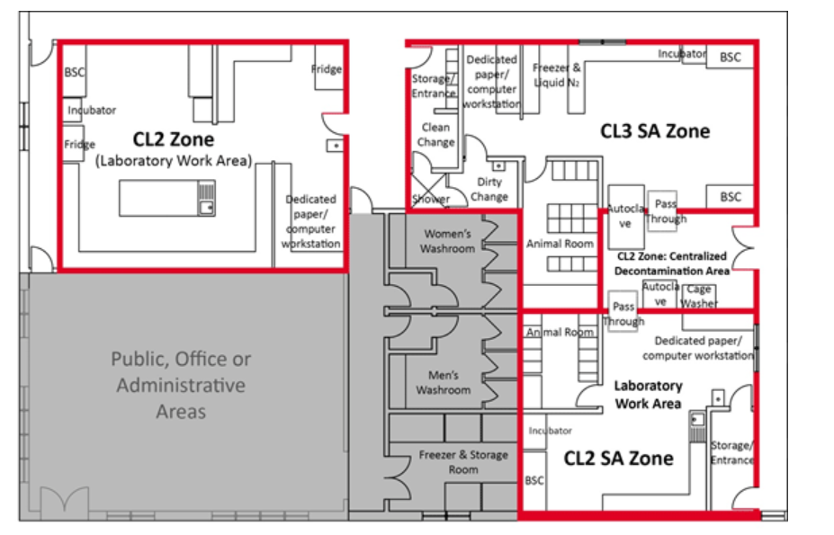

Text Equivalent - Figure 3-1 **Figure 3-1: Representative diagram of a Mixed-use Facility Containing Multiple Containment Level 2 (CL2) and Containment Level 3 (CL3) Zones**

A representative diagram of CL2 and CL3 zones includes a CL2 laboratory work area (top left area), a CL2 SA zone (bottom right area), and a CL3 SA zone (top right area). Common basic physical features between all zones are depicted in the diagram. These include a door to separate public, office, and administrative areas (bottom left area) from the containment zone; primary containment devices (e.g., BSCs) located away from high traffic areas and doors; and handwashing sinks provided near the point of exit. Additional features depicted for the CL2 SA zone and CL3 SA zone include anterooms or clothing change areas at entry and exit points. The anteroom in the CL3 SA zone includes a walk-through body shower. The SA zone animal rooms, where animals are housed in primary containment caging, are separated from the laboratory work area by a door. Pass through chambers (optional) in the CL2 SA zone and CL3 SA zone lead to a centralized decontamination area (centre right area), which is a separate CL2 zone. A common support area for freezers and storage (bottom central area) is also shared by the containment zones.  
The perimeter of each containment zone coincides with the outermost wall or door. Doors are provided between the public, office, or administrative areas, which are outside the containment zone and have no physical containment requirements, and the corridors leading to the containment zones.

**Figure 3-2: Representative Diagram of a Containment Level 4 (CL4) Zone Where Positive-Pressure Suits Are Worn**

The solid red line around the CL4 zone illustrates the containment zone perimeter. The thin black arrows across each doorway and through the anterooms indicate the direction of traffic flow for entry and exit.

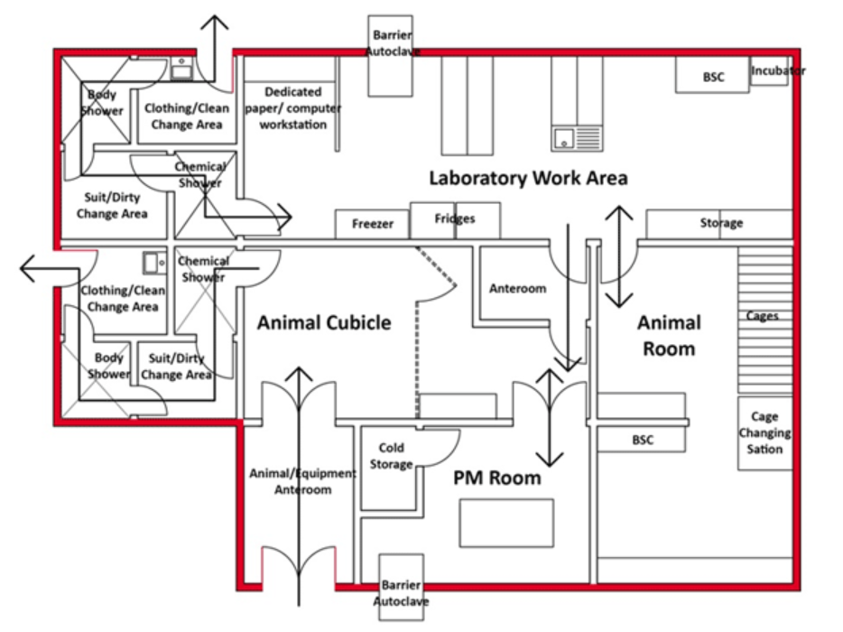

Text Equivalent - Figure 3-2 **Figure 3-2: Representative Diagram of a Containment Level (CL4) Zone where Positive Pressure Suits are Worn**

A representative diagram of a CL4 zone is depicted. It contains a laboratory work area across the top of the image, an animal room (SA zone) positioned at the lower right side and an animal cubicle and PM room (LA zone) positioned at the lower left side of the laboratory work area. Dedicated anterooms for personnel entry/exit to the zone are located to the left of the laboratory work area and the left of the LA zone. Both of the anterooms are comprised of a clothing/clean change area, a body shower, a suit/dirty change area, and a chemical shower. The LA zone also contains a separate anteroom at the bottom of the diagram for the entry of animals and equipment into the zone, as well as a separate anteroom for the entry of personnel from the laboratory work area. A gated area (stall) within the LA zone allows for separation of personnel and animals, and the PM room is directly accessed from the LA zone. The perimeter of the CL4 zone coincides with the outermost wall or door to the zone, and anterooms are part of the zone.

**Figure 3-3: Representative Diagrams of Different Containment Level 2 (CL2) Zones in the Same Physical Space**

Containment zones containing laboratory work areas (LWA) and support rooms are shown in orange; containment barriers are illustrated by a black hatched line. Freezers for storage of pathogens and toxins are indicated by grey rectangles. Configuration (a) illustrates a single CL2 suite or wing. Configuration (b) illustrates the same physical location where each work area is identified as a distinct CL2 zone. Note that a common cell culture room is considered a LWA.

**(a) CL2 suite or wing**

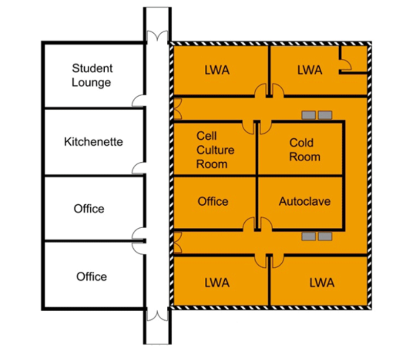

Text Equivalent - Figure 3-3a **Figure 3-3: Representative Diagrams of Different Containment Level 2 (CL2) Zones in the Same Physical Space**

This figure depicts a wing of separate rooms (i.e., laboratory work areas, cold room, cell culture room, autoclave room, and office) off the same corridor, with freezers located in the corridor. In Figure 3-3(a), doors to the corridor limit access to the entire wing, such that the entire wing becomes a CL2 zone. In Figure 3-3(b), the same physical space is depicted, but without doors to limit access to the wing corridor. In this configuration, each room (i.e., laboratory work areas, cold room, cell culture room, and autoclave room) is considered a separate CL2 zone, and the corridor and office are outside the CL2 zone.

**(b) Individual CL2 work areas**

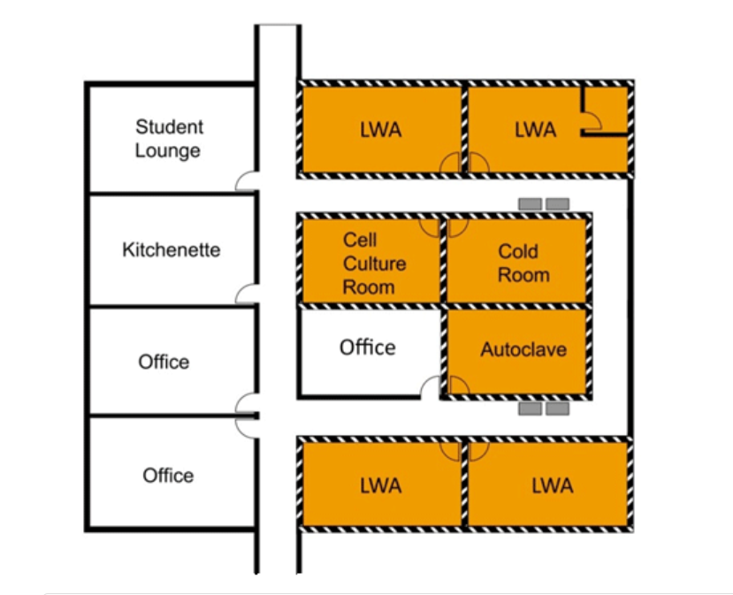

Text Equivalent - Figure 3-3b **Figure 3-3: Representative Diagrams of Different Containment Level 2 (CL2) Zones in the Same Physical Space**

This figure depicts a wing of separate rooms (i.e., laboratory work areas, cold room, cell culture room, autoclave room, and office) off the same corridor, with freezers located in the corridor. In Figure 3-3(a), doors to the corridor limit access to the entire wing, such that the entire wing becomes a CL2 zone. In Figure 3-3(b), the same physical space is depicted, but without doors to limit access to the wing corridor. In this configuration, each room (i.e., laboratory work areas, cold room, cell culture room, and autoclave room) is considered a separate CL2 zone, and the corridor and office are outside the CL2 zone.

**Figure 3-4: Representative Biohazard Warning Signage**

Example of biohazard warning signage found at the points of entry to a containment zone. Biohazard warning signage must include the international biohazard warning symbol, containment level, name and telephone numbers of a contact person, and entry requirements (CBS Matrix 3.3). The sign may be further supplemented with additional requirements for entry, a list of relevant processes and primary containment equipment used in large scale production areas, or information on other hazards (e.g., chemical, radioactive) present in the containment zone.

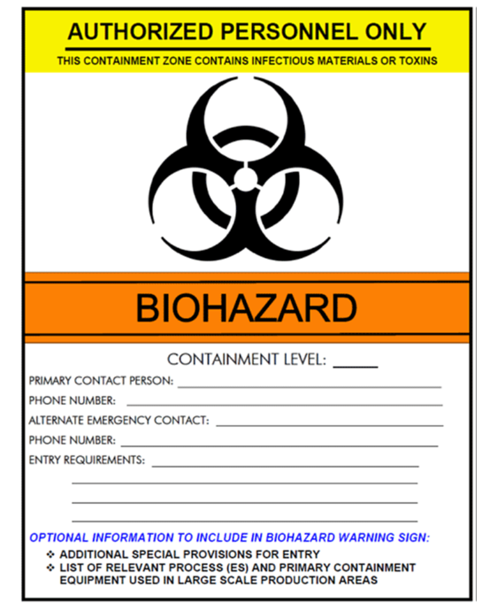

Text Equivalent - Figure 3-4 **Figure 3-4:** **Representative biohazard warning signage**

This figure is an example of a biohazard warning sign. This biohazard warning sign includes the international biohazard warning symbol, containment level, name and telephone numbers of both a primary and alternate contact person, and entry requirements (CBS matrix 3.3). The sign may be further supplemented with additional special provisions for entry, and a list of relevant processes and primary containment equipment used in large scale production areas, or information on other hazards (e.g., chemical, radioactive) present in the containment zone.

**Figure 3-5: Representative Diagrams of Placement of Offices with Respect to Adjoining Containment Level 2 (CL2) Zone**

Configuration (a) illustrates a CL2 zone that includes both the laboratory work area and office space. Configuration (b) illustrates the same physical location where the office is excluded from the containment zone. This configuration requires additional elements such keeping the office door closed and following appropriate PPE protocols for entry to and exit from the office, in order to be compliant with the CBS requirements.

**(a) Office inside the CL2 zone**

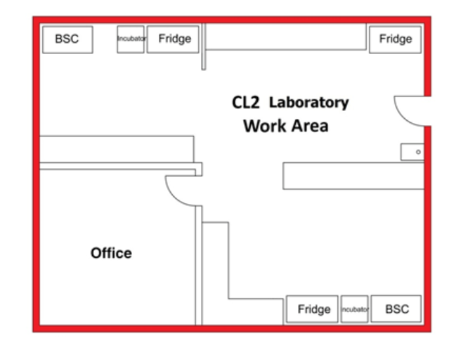

Text Equivalent - Figure 3-5a **Figure 3-5: Representative Diagrams of Placement of Offices with respect to Adjoining Containment Level 2 (CL2) Zone**

This figure depicts the same CL2 containment zone in which an office is only accessible from the laboratory work area. Configuration (a) illustrates a CL2 zone that includes both the laboratory work area and the office space. Configuration (b) illustrates the same physical space, but with the office excluded from the containment zone. This configuration requires additional elements such as posting biohazard signage on the office door, keeping the office door closed, and following appropriate PPE protocols for entry to and exit from the office, in order to be compliant with the CBS requirements.

**(b) Office outside the CL2 zone**

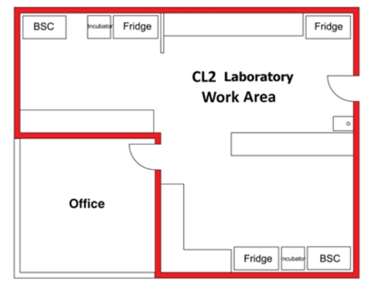

Text Equivalent - Figure 3-5b **Figure 3-5: Representative Diagrams of Placement of Offices with respect to Adjoining Containment Level 2 (CL2) Zone**

This figure depicts the same CL2 containment zone in which an office is only accessible from the laboratory work area. Configuration (a) illustrates a CL2 zone that includes both the laboratory work area and the office space. Configuration (b) illustrates the same physical space, but with the office excluded from the containment zone. This configuration requires additional elements such as posting biohazard signage on the office door, keeping the office door closed, and following appropriate PPE protocols for entry to and exit from the office, in order to be compliant with the CBS requirements.

**Figure 3-6: Representative Diagram of a Containment Level 3 (CL3) Small Animal Containment Zone (SA zone) Indicating the Containment Barrier and the Containment Zone Perimeter**

The containment barrier is indicated with a black hatched line and the containment zone perimeter is shown with a solid red line.

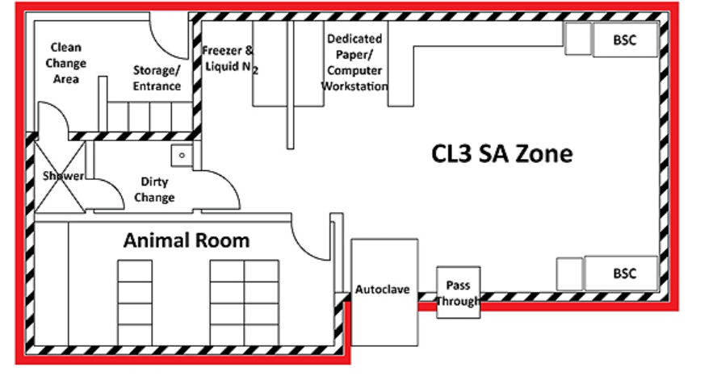

Text Equivalent - Figure 3-6 **Figure 3-6: Representative Diagram of a Containment Level 3 (CL3) Small Animal Containment Zone (SA zone) indicating the Containment Barrier and the Containment Zone Perimeter**

This figure depicts a CL3 SA zone. The zone is accessed through an anteroom at the upper left, which includes a storage area, a clean change area, a walk-through body shower, and a dirty change area. The laboratory work area, accessed from the anteroom, includes a cold storage area with freezers and liquid nitrogen, an area dedicated to paper and computer work, BSCs, and a double-door autoclave and pass-through chamber that cross the containment barrier. The animal room on the lower left side is accessed from the laboratory work area. The containment zone perimeter coincides with the outermost walls of the zone, including the anteroom. The containment barrier coincides with the containment zone perimeter, except in the anteroom, where it coincides with the inner (containment zone side) wall of the clean change room and storage area, and the shower door leading to the clean change area.

**Figure 3-7: Representative Diagram of a Containment Level 3 (CL3) Large Animal Containment Zone (LA zone) that Includes Multiple Containment Barriers**

The containment barrier of the containment zone is indicated with a black hatched line. The inner containment barrier (animal cubicles) is indicated with a blue dotted line and the containment zone perimeter by a solid red line.

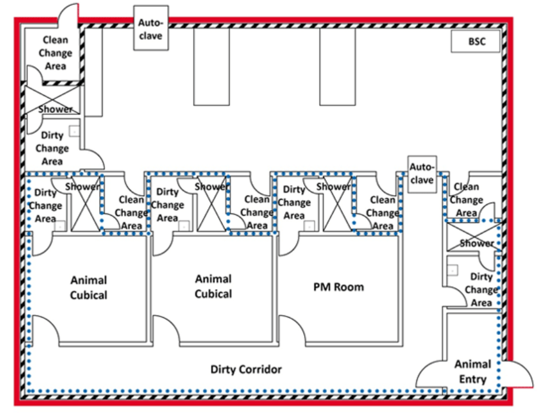

Text Equivalent - Figure 3-7 **Figure 3-7: Representative Diagram of a Containment Level 3 (CL3) Large Animal Containment Zone (LA zone) that includes Multiple Containment Barriers**

The figure shows a CL3 LA zone that includes a laboratory work area (top), two animal cubicles (lower left), and a PM room (lower centre). The containment zone is accessed through an anteroom at the top left with a clean change area, a walk-through body shower, and a dirty change area, that leads to the laboratory work area. Each cubicle and the PM room can be accessed from the laboratory work area through their own anterooms, which include a clean change area, a walk-through body shower, and a dirty change area. The animal cubicles and PM room can also be accessed through the dirty corridor (bottom of image), which is accessed through another anteroom from the laboratory work area. The bottom right corner also has an anteroom leading from outside the zone into the dirty corridor for animal entry. The containment zone perimeter coincides with the outermost walls of the entire zone, including anterooms leading into the zone. The containment barrier of the containment zone coincides with the perimeter, except in the anteroom where it coincides with the inner (containment zone side) wall of the clean change area and storage area, and the shower door leading into the clean change area. An additional (inner) containment barrier exists that surrounds the dirty corridor, the outside of the animal entry anteroom, the animal cubicles and the PM room, and the anterooms to the animal areas, except in the anterooms where it coincides with the inner (cubicle, PM room, or dirty corridor side) wall of the clean change area, and the shower door leading into the clean change area.

**Figure 3-8: Representative Diagram of Anteroom Spaces in a Containment Level 3 (CL3) Zone Identifying the Critical Door**

The containment barrier is indicated by the black hatched line and the containment zone perimeter is shown with a solid red line. Door "A" leads to the "clean" change area of the anteroom from outside the containment zone. Door "B", identified in yellow, is the critical door that separates the "clean" and "dirty" change areas. The "X" indicates the location of a walk-through body shower in the "dirty" change area. Door "C" leads to the CL3 work area (i.e., laboratory work area, animal room, animal cubicle, PM room, or large scale production area). In order to mitigate the migration of air from the "dirty" change area to the "clean" change area or outside the containment zone into the access corridor, critical door "B" would have to be interlocked or otherwise protected against simultaneous opening with door "A" (i.e., "A+B/B+A"). In order to mitigate the migration of air from the CL3 work area through the "dirty" change room and into the "clean" change area, critical door "B" would have to be interlocked with or otherwise protected against simultaneous opening with door "C" (i.e., "B+C/C+B").

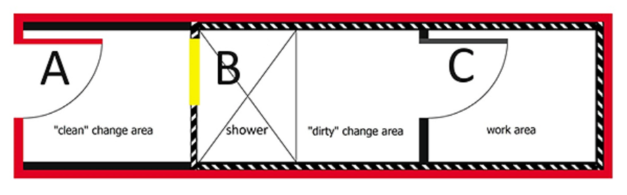

Text Equivalent - Figure 3-8 **Figure 3-8: Representative Diagram of Anteroom Spaces in a Containment Level 3 (CL3) Zone Identifying the Critical Door**

The image depicts an anteroom, which includes a clean change area, walk-through body shower, and dirty change area, and a CL3 work area, in order to identify the critical door on the containment barrier, and the combinations of doors needing to be interlocked.

Door “A” on the left of the image leads to the “clean” change area of the anteroom from outside the containment zone. Door “B”, which opens from the clean change area and leads into the walk-through body shower, is the critical door that separates the “clean” and “dirty” change areas. Door “C”, to the right, leads to the CL3 work area (i.e., a laboratory work area, an animal room, an animal cubicle, a PM room, or a large scale production area). In order to mitigate the migration of air from the “dirty” change area to the “clean” change area or outside the containment zone, critical door “B” would have to be interlocked or otherwise protected against simultaneous opening with door “A” (i.e., “A+B” and “B+A”). In order to mitigate the migration of air from the CL3 work area through the “dirty” change room and into the “clean” change area, critical door “B” would have to be interlocked with or otherwise protected against simultaneous opening with door “C” (i.e., “B+C” and “C+B”).

### References

1 Government of Canada. (2015). *Canadian Biosafety Standard* (2nd ed.). Ottawa, ON, Canada: Government of Canada.

 2 Canadian Council on Animal Care. (2003). *CCAC Guidelines on: Laboratory Animal Facilities - Characteristics* , *Design and Development* . Ottawa, ON, Canada: Canadian Council on Animal Care. 

3 Subhash, S. S., Baracco, G., Fennelly, K. P., Hodgson, M., & Radonovich, L. J. Jr. (2013). Isolation anterooms: Important components of airborne infection control. *American Journal of Infection Control* . 41:452-455.

## Chapter 4 - Risk Factors, Risk Groups, and Risk Assessments

" **Risk** " is a function of the probability of an undesirable event occurring and the consequences of that event. For the safety of the **community** , it is essential to mitigate risks through various mechanisms, such as administrative and engineering controls, practices, and procedures. Risk assessments are conducted for many components of a **biosafety** program, including the evaluation of individual, community and environmental safety, **biosecurity** requirements, training needs, and regulatory compliance. **Local risk assessments (LRAs), pathogen risk assessments,** and **toxin** risk assessments are discussed in this chapter; **overarching risk assessments** and **biosecurity risk assessments** are discussed in [Chapters 5](#ch5) and [6](/en/public-health/services/canadian-biosafety-standards-guidelines/handbook-second-edition/chapter-6-10.html) , respectively. The requirements for risk assessments in **facilities** regulated by the Public Health Agency of Canada (PHAC) and the Canadian Food Inspection Agency (CFIA) are specified in Matrix 4.1 of the Canadian Biosafety Standard (CBS), 2 nd Edition. [1](#ch4-1)

### 4.1 Pathogen and Toxin Risk Assessments and Risk Groups

The PHAC and the CFIA conduct **pathogen** and toxin risk assessments to determine the **risk group (RG** ) of a pathogen or toxin, which is in turn used to determine the appropriate **containment level** to safely conduct **laboratory** work and other activities with the pathogen or toxin. Risk assessments on well-characterized human pathogens are developed into technical documents by the PHAC known as **Pathogen Safety Data Sheets (PSDSs)** that are readily available to regulated and interested parties; fact sheets for federally reportable **diseases** affecting terrestrial animals in Canada have also been developed by the CFIA and are readily available on the CFIA website. Regulated parties are also encouraged to conduct pathogen and toxin risk assessments, especially on uncharacterized or modified pathogens and toxins. The PHAC and the CFIA can assist individuals in their pathogen and toxin risk assessments as necessary.

#### 4.1.1 Conducting Pathogen and Toxin Risk Assessments

Pathogen and toxin risk assessments are based on three key elements: science, policy, and expert judgement. There is a qualitative component to a pathogen and toxin risk assessment, so a consistent approach should be used when determining risk groups, and uncertainties and assumptions should be clearly documented. In order to appropriately address all of the elements, individuals with varying expertise and responsibilities (e.g., **facility** director, principal investigator, senior microbiologist, **biological safety officer [BSO]** , and institutional biosafety committee [IBC] members) should be included in the pathogen and toxin risk assessment process. Pathogen and toxin risk assessments should be reviewed routinely and revised when necessary to take into consideration relevant new information.

The pathogen risk assessment characterizes the risks associated with a pathogen based on the close examination of the following risk factors, which are the inherent characteristics of a pathogen that contribute to the risk it poses to humans and different animal species (risk factors for toxin risk assessments are discussed in Section 4.3.1):

* ***Pathogenicity*** *and **Virulence** :* Is the pathogen able to infect and cause disease in humans or animals (i.e., pathogenicity)? What is the severity of disease in individuals or in different animal species (i.e., virulence; the degree of disease)?
* *Route of Infection:* How does the pathogen gain entry into hosts (i.e., ingestion, inhalation, inoculation, contact with skin or mucous membranes, or genitourinary)?
* *Mode of Transmission:* How does the pathogen travel to hosts? Is the pathogen transmissible by direct contact (e.g., close intimate contact or casual contact) or indirect contact (e.g., fomites, aerosolized droplets or airborne transmission)? Can the pathogen be transmitted by vectors or **zoonosis** ?
* *Survival in the Environment:* How stable is the pathogen outside the host? Under which environmental conditions can it survive and for how long?
* ***Infectious Dose*** : What amount of pathogen is required to cause an infection in the host (measured in number of organisms)?
* *Availability of Effective Preventive and Therapeutic Treatments:* Are effective preventive measures available (e.g., vaccines)? Are effective treatments available (e.g., antibiotics, antivirals)?
* *Host Range:* What are the primary, intermediate, and dead-end hosts? Does the pathogen cause infection in a wide range of species, or is the host range more restricted?
* *Natural Distribution:* Is the pathogen present in Canada or is it exotic to Canada (i.e., non-indigenous)? Is it prevalent in a particular location, region, or human or animal population?
* *Impact of Introduction and/or **Release** into the Environment or the Canadian Public:* If the pathogen were introduced into the human or animal population or released into the environment (within Canada), what would be the economic, clinical, and biosecurity impact?

While most **infectious material** will clearly fall into one of the four risk groups outlined below, in some cases the level of risk associated with the different risk factors can vary dramatically within a risk assessment. As a result, certain risk factors may be considered more important when determining the final risk group category. For example, if a pathogen is unlikely to cause disease in humans or animals, it may be irrelevant that it can survive in the environment for a long period of time or that there is no available treatment.

#### 4.1.2 Risk Groups

It is very difficult to develop a comprehensive list of human and **animal pathogens** due to the emergence of new pathogens and the ongoing research into the characteristics of existing pathogens. Examples of human pathogens are included in Schedules 2-4 of the *Human Pathogens and Toxins Act* (HPTA), according to risk group; some of these pathogens are **zoonotic pathogens** . [2](#ch4-2) Schedule 5 includes an exhaustive list of human pathogens prohibited in Canada. Examples of **terrestrial animal pathogens** can be found on the CFIA website. The following definitions provide the risk group categorization for both human and animal pathogens based on the risk to an individual human or animal, and the risk to health of the community.

##### 4.1.2.1 Risk Group 1 (RG1; low individual and community risk)

A **microorganism** , nucleic acid, or protein that is either a) not capable of causing human or animal disease; or b) capable of causing human or animal disease, but unlikely to do so. Those capable of causing disease are considered pathogens that pose a low risk to the health of individuals or animals, and a low risk to public health or animal population. RG1 pathogens can be opportunistic and may pose a threat to immunocompromised individuals. Due to the low risk to public health and animal population associated with RG1 material, there are no physical or operational requirements for handling them. Nonetheless, due care should be exercised and safe work practices (e.g., **good microbiological laboratory practices** ) should be followed when handling these materials.

##### 4.1.2.2 Risk Group 2 (RG2; moderate individual risk, low community risk)

A pathogen or toxin that poses a moderate risk to the health of individuals or animals, and a low risk to public health and the animal population. These pathogens are able to cause serious disease in a human or animal but are unlikely to do so. Effective treatment and preventive measures are available and the risk of spread of diseases caused by these pathogens is low. Examples of RG2 human pathogens are included in Schedule 2 of the HPTA.

##### 4.1.2.3 Risk Group 3 (RG3; high individual risk, low community risk)

A pathogen that poses a high risk to the health of individuals or animals, and a low risk to public health. These pathogens are likely to cause serious disease in a human or animal. Effective treatment and preventive measures are usually available and the risk of spread of disease caused by these pathogens is low for the public. The risk of spread to the animal population, however, can range from low to high depending on the pathogen. Examples of RG3 human pathogens are included in Schedule 3 of the HPTA.

##### 4.1.2.4 Risk Group 4 (RG4; high individual risk, high community risk)

A pathogen that poses a high risk to the health of individuals or animals and a high risk to public health. These pathogens are likely to cause serious disease in a human or animal, which can often lead to death. Effective treatment and preventive measures are not usually available and the risk of spread of disease caused by these pathogens is high for the public. The risk of spread of disease to the animal population, however, ranges from low to high, depending on the pathogen. Examples of RG4 human pathogens are included in Schedule 4 of the HPTA.

### 4.2 Containment Assessments

Once the risk group has been determined by a pathogen and toxin risk assessment, there are several key factors to determine the appropriate level of **containment** at which the identified pathogen or toxin can be safely handled. Well-characterized pathogens that have had a pathogen risk assessment completed by the PHAC or the CFIA have already been assigned an appropriate risk group and containment level. The different containment levels are described in [Chapter 3](#ch3) and the requirements for containment level 2 (CL2) to containment level 4 (CL4) facilities that are regulated by the PHAC and the CFIA are specified in the CBS. In general, the containment level and risk group of the pathogen are the same (e.g., RG2 pathogens are handled at CL2); however, there are some exceptions. If the pathogen has been modified the containment requirements may need to be revised accordingly. These containment level changes reflect the risk mitigation strategies to address the specific modification of the pathogen. Any change or addition to the **controlled activities** specified on a **licence** under the *Human Pathogens and Toxins Regulations* (HPTR) requires an amendment to be submitted to the PHAC prior to making the change. [3](#ch4-3) Also, any change to the conditions of use specified on the **animal pathogen import permit** requires authorization from the appropriate issuing agency (i.e., the CFIA or the PHAC) prior to making the change. Further information on licences and animal pathogen import permits can be found in [Chapter 23](/en/public-health/services/canadian-biosafety-standards-guidelines/handbook-second-edition/chapter-21-25.html#ch23) .

The following factors are considered when conducting a containment assessment (i.e., determining the specific **physical containment requirements** , **operational practice requirements** , and **performance and verification testing requirements** ) for a pathogen:

* ***Aerosol*** *Generation:* Are equipment or procedures that may generate aerosols (e.g., pipetting, centrifugation, homogenization) being used? Personnel can be exposed to infectious aerosols or aerosolized toxin by direct inhalation of aerosolized droplets or by ingestion of droplets that settle on surfaces or hands.
* *Quantity:* What quantity of pathogen is being manipulated, and in what format (e.g., one large vessel, multiple small vessels)? **Large scale** processes (e.g., industrial fermentation, vaccine production) may have different containment requirements than laboratory scale work using the same pathogen.
* *Concentration of the Pathogen:* The concentration of the pathogen may vary depending on the work being performed (e.g., diagnostic specimens may contain a lower concentration of pathogen than pure **cultures** ).
* *Type of Proposed Work:* What is the nature of the work (e.g., diagnostic activities, scientific research, *in vitro* , ***in vivo*** , large scale)? For example, for *in vivo* work, the type of animal (e.g., host versus non-host species) and the inherent risks associated with that animal need to be considered when determining the appropriate containment level.
* *Shedding (specific to animals* ) *:* The shedding of pathogens should be considered when working with infected animals. Pathogens may be present in the saliva, urine or feces, and may also be exhaled by the animal. Due to the nature of zoonotic pathogens, additional precautions may need to be implemented whenever known or potentially infected animals are handled.

Some factors considered when determining the risk group may also be evaluated in the context of the containment assessment. For example, the concentration of the pathogen being handled may have less importance if the infectious dose is very high. On the other hand, aerosol generation becomes more important for pathogens transmitted via the inhalation route.

### 4.3 Special Considerations

Not all **biological material** will fall perfectly into a given risk group or containment level following a risk assessment. This could be the case for biological material (e.g., tissues, primary specimens) that may harbour pathogens, toxins, **prions** , or pathogens that have been modified or constructed. It is important to reiterate that an LRA be performed to determine the appropriate level of precautions to be taken for infectious material that is manipulated in a **containment zone** . Factors that should be considered when assessing the risks associated with activities involving these types of material are described below.

#### 4.3.1 Toxins

Microbial toxins are not considered to be infectious material, nor can they be classified as standard toxic chemicals; therefore, special considerations are needed when performing a risk assessment on this type of material. When compared to microbial pathogens, it is fairly easy to control the spread of toxins. Toxins do not replicate and are not transmitted from host to host. The most likely route of transmission to personnel handling toxins is through accidental inoculation or by the **exposure** of mucous membranes to aerosols. Additional risks associated with toxins include static electricity when handling dried and lyophilized toxins and the minute lethal doses of some toxins.

Only certain microbial toxins, whether naturally derived from a microorganism or synthetically produced, are regulated by the PHAC and the CFIA under the HPTA, HPTR, *Health of Animals Act* (HAA) and *Health of Animals Regulations* (HAR). [4](#ch4-4) [5](#ch4-5) An exhaustive list of the toxins regulated by the PHAC under the HPTA is included in Schedules 1 and 5 of the HPTA. The importation of microbial toxins derived from animal pathogens is regulated under the HAR; the importation of toxins derived from **non-indigenous animal pathogens** is regulated solely by the CFIA.

Certain regulated toxins are identified in the HPTR as "prescribed toxins" when present in a quantity greater than the identified **trigger quantity** , as described by Section 10(2) of the HPTR due to their **dual-use potential** (summarized in [Table 4-1](#t41) ). "Prescribed toxins" identified by the HPTR are also referred to as **security sensitive biological agents (SSBAs),** as they have additional biosecurity considerations. A toxin present in a part of a facility in a quantity greater than the trigger quantity is considered an SSBA and requires enhanced security measures (e.g., ***Human Pathogens and Toxins Act* Security Clearances [HPTA Security Clearances]** ). A toxin in a total quantity at or below the trigger quantity is not considered an SSBA; however, it remains a toxin, and is subject to the CBS (i.e., the minimum containment level for handling a regulated toxin is CL2). SSBAs are discussed in further detail in Section 4.3.3 and [Chapter 6](#ch6) .

| Toxin                                                | Trigger Quantity |
| ---------------------------------------------------- | ---------------- |
| Alpha toxin                                          | 5 mg             |
| Botulinum neurotoxin                                 | 0.5 mg           |
| Cholera toxin                                        | 20 mg            |
| Clostridium botulinum C2 and C3 toxins               | 5 mg             |
| Clostridium perfringens Epsilon toxin                | 5 mg             |
| Hemolysin                                            | 10 mg            |
| Shiga-like toxin (verotoxin)                         | 1 mg             |
| Shigatoxin                                           | 1 mg             |
| Staphylococcal enterotoxins, Type B                  | 1 mg             |
| Staphylococcal enterotoxins, types other than Type B | 10 mg            |
| Staphylococcus aureus Toxic shock syndrome toxin     | 5 mg             |

The principles of chemical safety and biosafety are both applicable when handling biological toxins capable of causing disease in humans or animals. In general, toxins capable of producing human and animal disease are safely handled in CL2; therefore, CL2 is the minimum containment level for a facility, such as a biochemistry laboratory, where activities with purified or chemically synthesized regulated toxins are performed in the absence of the parental microorganism or other pathogen.

##### 4.3.1.1 Risk Factors for Toxin Risk Assessments

When handling toxins derived from microorganisms, a detailed risk assessment should include the following:

* exposure assessment to identify risks inherent to the procedure being performed (e.g., inoculation risk, aerosol generation, buildup of static electricity when handling powdered toxins);

* routes of exposure (i.e., ingestion, inhalation, absorption - dermal and ocular, and inoculation);

* concentration and amount of toxin being handled, and units of activity;

* indicators of toxicity; 

    **LD 50 (median lethal dose** ; amount of toxin that is lethal to 50% of the test population);

    **ED 50 (median effective dose** ; amount of toxin that will cause a particular effect in 50% of the test population);

* rate of action (how long after exposure before effects are observed); 

    the effects of most neurotoxins are typically observed within minutes to hours after exposure; [6](#ch4-6)

    the effects of most cytotoxins are typically observed within hours to days after exposure; [6](#ch4-6)

* severity and duration of illness (acute versus chronic effects);

* availability of vaccines or antitoxins;

* use of chemical safety practices appropriate to the techniques used (i.e., solvents, acids); and

* identification as a "prescribed toxin" as described by Section 10(2) of the HPTR and the associated trigger quantity (summarized in [Table 4-1](#t41) ).

#### 4.3.2 Prions

The primary routes of infection for prions are through ingestion and inoculation (characteristics similar to RG2 pathogens). Conducting risk assessments for prions is challenging due to the long incubation times (up to 30 years) before disease symptoms appear in human or animal hosts. [7](#ch4-7) [8](#ch4-8) [9](#ch4-9) [10](#ch4-10) [11](#ch4-11) [12](#ch4-12) While the primary routes of prion transmission have been documented through ingestion or inoculation, there is limited evidence to suggest that alternate routes may also be possible. [7](#ch4-7) [13](#ch4-13) [14](#ch4-14) [15](#ch4-15) There have been no **laboratory acquired infections (LAIs) documented to date from activities involving prions.** [16](#ch4-16) There are currently no treatments or vaccines available for transmissible spongiform encephalitis (TSE) diseases. The protein structures of prions are very stable under extreme environmental conditions and they have been shown to remain infectious following standard treatment to inactivate other pathogens (e.g., autoclaving). [17](#ch4-17) [18](#ch4-18) Activities involving prions can generally be conducted safely at CL2 with additional physical containment requirements and operational practice requirements, which are specified in the CBS. Additional recommendations and considerations for the **decontamination** of prions are described in [Chapter 15](/en/public-health/services/canadian-biosafety-standards-guidelines/handbook-second-edition/chapter-11-15.html#ch15) .

#### 4.3.3 Security Sensitive Biological Agents

SSBAs are human pathogens and toxins that have been determined to pose an increased biosecurity risk due to their dual-use potential. That is, they can be used for legitimate scientific applications, but they pose an increased biosecurity risk due to an inherent potential for development and use as a biological weapon. SSBAs are the human pathogens and toxins that are identified as "prescribed human pathogens" and "prescribed toxins" in the HPTA and HPTR. Prescribed human pathogens are all RG3 and RG4 human pathogens that are on the *List of Human and Animal Pathogens and Toxins for Export Control* , published by the Australia Group (as amended from time to time), except for Duvenhage virus, Rabies virus and all other members of the Lyssavirus genus, Vesicular stomatitis virus, and Lymphocytic choriomeningitis virus. [19](#ch4-19) Prescribed toxins are all toxins listed in Schedule 1 of the HPTA that also appear on the *List of Human and Animal Pathogens and Toxins for Export Control* , published by the Australia Group (as amended from time to time), when in a quantity greater than the identified trigger quantity in a part of the facility where controlled activities with SSBAs are authorized, as described by Section 10(2) of the HPTR (prescribed toxins and trigger quantities are summarized in [Table 4-1](#t41) ). Consequently, there are increased biosecurity requirements specified in the CBS for SSBAs. For ease of reference, the PHAC maintains an exhaustive list (as amended from time to time) of all SSBAs, including toxin trigger quantities, on the PHAC website (http://phac-aspc.gc.ca/lab-bio/regul/ssba-abcse-eng.php). Additional biosecurity considerations for SSBAs are discussed in [Chapter 6](/en/public-health/services/canadian-biosafety-standards-guidelines/handbook-second-edition/chapter-6-10.html) .

#### 4.3.4 Non-indigenous Animal Pathogens

Non-indigenous animal pathogens are pathogens that are listed in the World Organisation for Animal Health's *OIE-Listed diseases, infections and infestations* (as amended from time to time) and that are also exotic to Canada (i.e., foreign animal disease agents that are not present in Canada). [20](#ch4-20) **Emerging animal disease** pathogens cause new infectious diseases resulting from the evolution or change of an existing pathogen, a known infectious disease spreading to a new geographic area or population, or a previously unrecognized pathogenic agent or disease diagnosed for the first time and which has a significant impact on animal health. Non-indigenous animal pathogens and emerging animal disease pathogens may only be imported into Canada under an animal pathogen import permit issued by the CFIA. The appropriate containment level and any additional requirements to work with certain animal pathogens (e.g., non-indigenous animal pathogens and emerging animal disease pathogens) are determined by the CFIA through a pathogen risk assessment and containment level assessment. Factors that are assessed by the CFIA when evaluating a request to work with a non-indigenous pathogen include the following:

* disease control and potential impacts to the health of the Canadian animal population (including livestock and poultry) in the event of a breach of containment; and
* consideration of international practices.

The release of a non-indigenous animal pathogen or emerging animal disease pathogen into the environment could have a serious negative impact on the Canadian animal population; therefore, additional physical containment and operational practices beyond CL3 (or CL3 LA zones [CL3-Ag]) are required when handling these pathogens. As an example, Matrix 3.8 of the CBS specifies an **effluent decontamination system** is required in containment zones where non-indigenous animal pathogens are handled, so that all liquid **waste** is appropriately decontaminated prior to release from the containment zone.

Applicants of an animal pathogen import permit for non-indigenous animal pathogens or emerging animal disease pathogens are subject to **facility certification** by the CFIA before an animal pathogen import permit is issued. Activities involving non-indigenous animal pathogens and emerging animal disease pathogens that are also zoonotic pathogens (i.e., capable of causing disease in humans and animals) also require a licence under the HPTA issued by the PHAC. Facility certification by the CFIA and regulatory oversight for the importation of animal pathogens are further described in [Chapter 23](/en/public-health/services/canadian-biosafety-standards-guidelines/handbook-second-edition/chapter-21-25.html#ch23) .

#### 4.3.5 Parasites

Transmission of a parasite can occur via a wide range of mechanisms that closely mirror those of other human and animal pathogens. When performing an LRA to determine the appropriate containment level for parasites, the mode of transmission as well as the parasite life cycle stages should be considered, since not all stages are infective or pathogenic.

#### 4.3.6 Large Scale Work

The PHAC and the CFIA generally consider activities involving volumes of toxins or the *in vitro* culture of infectious material on a scale of 10 litres or greater to be large scale; this could be a single vessel with a volume of 10 litres or greater, or in some cases, multiple vessels with a total volume of 10 litres or greater. Large scale production facilities such as industrial fermentation and vaccine production plants pose an increased risk to personnel and the environment due to the large quantities of infectious material or toxins being handled. As such, there are sometimes more stringent requirements specified in the CBS and additional considerations for large scale activities when compared to **laboratory work areas** handling laboratory scale volumes of the same pathogen at the same containment level. Consultation with the PHAC and the CFIA on a case-by-case basis will determine whether or not particular activities conducted in a containment zone are considered large scale and, therefore, required to meet all of the additional requirements specified in the CBS specific for **large scale production areas** . Additional considerations for large scale work are described in [Chapter 14](/en/public-health/services/canadian-biosafety-standards-guidelines/handbook-second-edition/chapter-11-15.html#ch14) .

#### 4.3.7 Animal Work

Because of the unpredictable behaviour of animals and the potential for shedding of pathogens, working with pathogens in live animals may significantly increase the risk associated with any given procedure. Specific considerations for work involving pathogens and toxins with animals are provided in [Chapter 13](/en/public-health/services/canadian-biosafety-standards-guidelines/handbook-second-edition/chapter-11-15.html#ch13) .

#### 4.3.8 Biotechnology

##### 4.3.8.1 Modifications that May Increase the Risk of a Pathogen

It is important for researchers to recognize the risks inherent to their activities and to take appropriate steps to mitigate those risks. Although the risk group and containment level may have been determined for a particular pathogen, modifications to a pathogen that increase risks posed by the pathogen may result in changes to specific physical containment or operational practice requirements from what is specified in the CBS. Modifications may be intentional (e.g., through the use of recombinant DNA [rDNA] technology) or incidental (e.g., resulting from pathogen evolution following passage through an *in vivo* model).

Experiments that decrease the risk posed by a pathogen (i.e., it has been attenuated) may be acceptable to be conducted with reduced physical containment and operational practice requirements. In these circumstances, a pathogen risk assessment is conducted to assign the attenuated pathogen to an appropriate risk group and containment level. For example, an attenuated strain of an RG3 pathogen may be determined to meet the risk profile for an RG2 pathogen and may be determined to be safe to handle at CL2, based on a pathogen risk assessment. In licensed facilities authorized to conduct controlled activities with human pathogens and toxins, the licence holder or the BSO is required to notify the PHAC in cases where the risk group of a human pathogen or toxin is modified, to initiate a discussion about the new risk classification of the modified strain and, if necessary, apply for a new licence or amend an existing licence (HPTA 12[2], HPTR [9][1][c][ii]).

Experiments that increase the risks posed by a pathogen can impact both the researcher and the community. For example, modifying a pathogen to become transmissible by the airborne route would increase the risks inherent in certain laboratory procedures that generate aerosols, as well as the impact on public or animal health if released from the laboratory. The HPTR Section 5 requires that the BSO and the licence holder be notified whenever an individual working under a licence authorizing controlled activities with human pathogens and toxins under the HPTA/HPTR intends to increase the virulence or pathogenicity of a human pathogen or the toxicity of a toxin. If such a modification changes the risk group of the pathogen or toxin, the PHAC is also to be notified (HPTR 26). Notifications can be submitted electronically to the PHAC through the Biosecurity Portal, accessible through the PHAC website (www.publichealth.gc.ca/pathogens), by telephone, email, or fax.

##### 4.3.8.2 Genetically Modified Organisms

The use of rDNA technologies, to create genetically modified organisms (GMOs) may increase or decrease the risk group and containment level relative to the risk group and containment level of the parental organism, depending on factors such as the gene(s) being transferred, the modification to genes already present in the organism (e.g., point mutations, deletions), the expression of the gene(s) in the recombinant organism, the biological containment required for handling the host organism, the interactions between the gene(s) being transferred and the host vector systems, and the viability of the host vector systems.

An LRA is performed to appropriately assess the physical containment and operational practice requirements when genetic manipulations that are performed:

* alter the pathogenicity or virulence of pathogens;
* affect the response of a pathogen to a pharmaceutical agent (e.g., changes in resistance to antibiotics);
* delete genetic material or introduce novel genetic material with potentially adverse effects (e.g., insertion of an oncogene);
* induce the production of toxins by recombinant microorganisms;
* broaden the host range or cell tropism of pathogens;
* create novel mechanisms or undesirable traits in transgenic animals;
* produce attenuated strains of recombinant pathogens that have lost virulence factors; or
* produce host bacterial or viral vector systems with limited ability to survive outside the containment zone.

Factors to consider when assessing GMOs include the following:

* containment level of the recipient organism;
* containment level of the donor organism;
* replication competency of the GMO;
* property of the donor segment incorporated into the recombinant particle;
* potential pathogenic factors associated with the donor segment; and
* novel hazards of the GMO that may not be well-characterized.

##### 4.3.8.3 Viral Vectors

The risks associated with viral vector systems can be assessed by examining the considerations for GMOs outlined in Section 4.3.8.2, along with the choice of vector system, the safety features engineered into the system, and the nature of the transgene insert(s) encoded by the vector. The use of retroviral vector systems, including lentiviral vectors derived from human immunodeficiency virus type 1 (HIV-1), raises other possible risks that should be assessed. More recent generations of lentiviral vector systems have been engineered with additional safety features to reduce the potential for production of replication competent retrovirus (i.e., a recombinant virus capable of self-replication), including the use of heterologous coat protein in place of native HIV-1 envelope protein, vector and packaging functions separated onto four or more plasmids, removal of genes essential for replication of wild type virus and the development of self-inactivating lentiviral vectors. [21](#ch4-21)

The major risks involving viral vector systems include:

* potential for generation and **propagation** of replication competent retrovirus (RCR);
* potential for oncogenesis;
* potential for increased pathogenicity; and
* potential for **seroconversion** , even with non-replicating viruses (e.g., indication of HIV-positive status resulting from exposure to a lentiviral vector).

#### 4.3.8.4 Synthetic Biological Devices and Systems

The risks associated with devices and systems resulting from **synthetic biology** and synthetic DNA (sDNA) technologies are similar to the risks associated with GMOs and rDNA technologies. The principal difference is that synthetic biology seeks to redesign existing, or to design and construct novel biological functions and systems that are not found in nature, and, as such, assessing the potential risks associated with products of synthetic biology is somewhat more complex. As a first step, the risks associated with the parental organisms should be assessed. The properties and potential impacts of the individual parts, systems, or organisms with which researchers will be working (engineered or naturally occurring) also need to be assessed given that pathogenic and non-pathogenic organisms will each potentially contain both non-pathogenic and pathogenic components.

The risks of synthetic biology stem from: the organism manipulated (i.e., the chassis), the type and origin of the genetic material added, and the added risks of different components working in concert. Synthetic biology has the additional inherent risk that this type of research may have dual-use potential or the potential for misuse, whether intentional or not. Prior to performing experiments, consideration should be given not only to the source of the components, but to the potential of synergistic effects leading to a more pathogenic organism. This is often difficult to quantify when combining elements from multiple sources, combining elements that have never existed together in a natural organism, or when developing a biological function that does not exist in nature. Finally, an assessment of all the components working together as a new single system needs to be completed. Possibly the greatest challenge is identifying the risks associated with sDNA added to such organisms, and the possible unexpected interactions resulting from the expression of the engineered genome.

#### 4.3.9 Infectious RNA

Purified positive-sense viral RNA is capable of causing infection and subsequent generation of complete, functional viruses in host cells. [22](#ch4-22) Consequently, it is necessary to exercise additional care when manipulating genomic material of positive-sense RNA viruses. Examples of RNA viruses that produce infectious positive-sense RNA capable of causing disease in humans include poliovirus and hepatitis C virus. [23](#ch4-23) Examples in animals include foot-and-mouth disease virus and classical swine fever virus. [24](#ch4-24) [25](#ch4-25) West Nile virus is an example of a zoonotic virus with a positive-sense single stranded RNA genome. [23](#ch4-23) An LRA should include the following considerations before handling infectious positive-sense viral RNA. [26](#ch4-26)

* the efficiency of infection with positive-sense viral RNA is lower when compared to infection with whole virus particles;
* RNA can withstand significantly higher temperatures than proteins, which means that infectious positive-sense RNA can be extracted from heat-inactivated viruses;
* the DNA copy of certain RNA viruses is also infectious (e.g., poliovirus, retroviruses);
* the infectivity of positive-sense viral RNA is unaffected by virus-specific antibodies; and
* infectious single-stranded positive-sense viral RNA may have increased tropism (i.e., cell type and host range) when compared to whole virus particles.

#### 4.3.10 Cell Lines

**Cell lines** are not considered infectious material, except when they harbour pathogens. Information on cell lines regulated by the PHAC and/or the CFIA can be obtained by contacting them directly or visiting their websites. The majority of cell lines are well-characterized and should be handled at the containment level of the pathogens they contain, if any. An LRA should be conducted prior to working with cell lines that are known to contain pathogens or potentially contaminated with pathogens, in order to determine the containment level appropriate for the contaminating organism of the highest risk group. One of the primary hazards of manipulating any cell line relates to the expression of latent viruses. Endogenous viral sequences have been found in a variety of cell lines derived from mammalian species, including humans. When handling non-recombinant cell lines, the risk assessment should include the following:

* *Source Organism:* cell lines derived from human or non-human primate tissue generally pose a greater potential risk for personnel than those derived from animals that are not closely related to humans;
* *Source Tissue:* provides an indication of possible contaminants and latent (e.g., oncogenic) viruses;
* *Type of Cell Line:* less will be known about primary cultures and lab-generated continuous cell lines than intensively characterized commercial cell lines; and
* *Source Population:* the particular breeding group or colony of the organism from which the cell line was derived may have a higher risk for some pathogens.

With respect to the handling of recombinant or genetically modified cell lines, the risk assessment should include the following considerations, in addition to the above criteria:

* properties of the host cell line; in the case of hybridomas, the properties of each of the contributing cells should be considered;
* vector used for transformation;
* transfer of viral sequences;
* transfer of virulence factors;
* activation of endogenous viruses;
* recombinant gene product; and
* presence of helper virus.

#### 4.3.11 Primary Specimens

Primary specimens are those derived directly from a human or animal. The HPTA and HPTR do not apply to human pathogens or toxins that are in an environment in which they naturally occur (i.e., in primary specimens). It should be noted, however, that specimens obtained from an animal that has been intentionally exposed to a human pathogen or toxin (e.g., experimental infection or inoculation) are subject to regulation under the HPTA and HPTR. Additionally, the HAA and HAR apply to any imported primary specimen that contains an animal pathogen or part of one that retains its pathogenicity, regardless of whether its presence is naturally occurring or not.

Pathogens may be transmitted from symptomatic and asymptomatic individuals. [27](#ch4-27) Accordingly, it is always prudent that primary specimens, such as blood, blood components (e.g., serum, plasma), other bodily fluids (e.g., urine, feces, saliva, milk), or tissues taken from human or animal subjects that have been exposed to a pathogen or toxin, be considered as potentially infectious.

Routine practices are infection control guidelines developed by the PHAC for health care settings to protect individuals from exposure to potential sources of pathogens. [27](#ch4-27) Routine practices and universal precautions to prevent the transmission of pathogens through occupational contact with human tissue or bodily fluids are discussed in [Chapter 21](/en/public-health/services/canadian-biosafety-standards-guidelines/handbook-second-edition/chapter-21-25.html) . [28](#ch4-28) [29](#ch4-29)

Diagnostic activities involving primary specimens that do not involve propagating, concentrating or purifying the pathogen (e.g., enzyme-linked immunosorbent assay [ELISA], extraction of genetic material, fixation of tissue samples for histology) are regularly carried out in hospitals, public health laboratories, and veterinary diagnostic laboratories. In most cases, the risks associated with this type of work are considered lower than propagation and *in vivo* work. Based on the risks associated with the pathogen suspected of being within the primary specimen and the laboratory procedures, the physical containment and operational requirements for activities with primary specimens may sometimes be lower than the requirements for handling pure cultures (i.e., derogated). Although the PHAC and the CFIA assign containment levels for pathogens, the CBS is performance-based, allowing facilities to use LRAs to determine the mitigation strategies for their activities dependent on the situation. In situations where a sample is suspected to contain a pathogen from a risk group higher than the containment level of the testing facility, additional operational practices or **transfer** to a facility with an appropriate containment level may be required, and can be determined in consultation with the PHAC and the CFIA.

#### 4.3.12 Autologous Cells, Tissues, and Specimens

The experimental infection of cells, tissues, or other specimens derived from the person conducting the experiment may endanger that individual. Such practices are described as "self-to-self" experimentation and are prohibited (CBS Matrix 4.6). Any procedure being conducted by an individual that involves the *in vitro* transformation or some other genetic modification of cells derived from his or her own body (i.e., **autologous cells** ) could result in the development of malignant disease (e.g., if the cells are modified to express an oncogene) or the expression of an unusual protein with pharmacological properties (e.g., if the cells are modified to express a toxin). Such experiments put the individual at risk since any innate immune protection that is normally available to destroy foreign cells would be bypassed. Personnel should not conduct these types of experiments in laboratory areas or containment zones in which they work and they should never donate or collect their own specimens or tissues, or those of any other personnel, within the containment zone.

#### 4.3.13 Handling Risk Group 1 Biological Material

The regulations administered by the PHAC and the CFIA do not apply to RG1 organisms; therefore, the CBS does not specify requirements for these activities. Nonetheless, RG1 biological material poses a low risk to the health of individuals or animals and this material should be handled safely in a basic laboratory or **animal work area** . Due care should be exercised and safe work practices (e.g., good microbiological laboratory practices) are strongly encouraged when handling these materials. Work with RG1 material is further discussed in [Chapter 21](/en/public-health/services/canadian-biosafety-standards-guidelines/handbook-second-edition/chapter-21-25.html) .

### 4.4. Risk Management

Risk management of human and animal pathogens and toxins involves understanding the legislative requirements related to conducting activities with such material (e.g., **importing** , handling, and possessing), as well as the abilities of the individuals concerned and the limitations of the facilities where the material is being handled and stored. Pursuant to the applicable legislation (i.e., HPTA, HPTR, HAA, and HAR), organizations that handle or store human or animal pathogens or toxins are required to comply with the CBS and may be subject to inspection by the PHAC or the CFIA. The risks associated with pathogens and toxins are managed through ensuring compliance with the applicable legislation and periodically conducting LRAs. It is the responsibility of facility personnel to complete an LRA specific to their containment zone and related processes (CBS Matrix 4.1), although the BSO or other designated individual may be consulted. The PHAC or the CFIA may also be consulted when determining the risk group and containment level for a particular pathogen. Administrative controls and roles and responsibilities are discussed further in [Chapter 5](#ch5) .

The process to undertake risk assessments for infectious material and toxins follows the same principles as those found to address hazards or risks in most occupational health and safety programs. [30](#ch4-30) The accepted mechanisms to control an identified occupational health and safety hazard apply to biosafety and biosecurity as well. These controls are:

* *Elimination (including substitution):* Is there a pathogen or process that poses less of a risk than the one selected that will provide the same result?
* *Engineering Controls:* This includes the selection and use of **primary containmentdevices** (e.g., **primary containment caging** , **biological safety cabinet [BSC]** , closed vessels, and heating, ventilation, and air conditioning [HVAC] systems).
* *Administrative Controls:* These are the controls that can alter the way in which the tasks are done and can include policies and **standard operating procedures (SOPs).**
* ***Personal Protective Equipment (PPE)*** *:* The PPE selected and worn by individuals to reduce or minimize the potential exposure to infectious material or toxins.

Safety legislation and other safety resources often refer to this list as the hierarchy of control, meaning that the controls should be considered in the order they are presented. PPE should be the last form of control considered when conducting the LRAs.

#### 4.4.1 Local Risk Assessments

LRAs are site-specific risk assessments that are conducted to identify hazards based on the pathogen, infectious material, or toxin in use and the activities to be performed. They examine specific elements of the biosafety program and may support the broader overarching risk assessment. Personnel who work in the containment zone with the infectious material and toxins are in the best position to provide input for an LRA to identify the hazards associated with their day-to-day activities and potential measures to mitigate risks. Depending on the nature of the procedure or tasks to be performed, there may be other hazards (e.g., chemical, radiological, physical) involved that may necessitate a broader task analysis as part of a larger or general health and safety program. In this case, the LRA to assess the biosafety risks involved with infectious material and toxins may already be incorporated into or included in the broader hazard analysis. The BSO should be involved in the development of the LRA. If the organization has an IBC, as described in [Chapter 5](#ch5) , it would be beneficial for the committee to also be involved. They could also liaise with the PHAC and the CFIA for more information or to confirm the outcome of their assessment.

##### 4.4.1.1 Identification of Tasks and Procedures

The first step of an LRA is to identify the tasks and procedures where infectious material and toxins will be used within the containment zone. The potential for the infectious material or toxins to cause harm to the personnel, the community, and the environment should also be assessed. It is important to include all of the known and potential risks associated with the work and the infectious material or toxins. This stage of an LRA is critical since it is not possible to effectively determine the risk associated with any hazard unless the activity with which it will be used has been properly identified.

##### 4.4.1.2 Break Down Tasks into Steps

All containment zone activities involving infectious material and toxins should be described. Examples of activities include large scale production, diagnostic work, and *in vivo* work with **small-sized animals** or **large-sized animals** . It is important to break down the tasks identified within the activities into steps, in order to minimize the amount of work needed for each LRA and assess the actual risk effectively. If only one step has been modified or altered in a certain task from the steps identified in a previous LRA, the impacts of the one step would need to be assessed. The quantity and concentration of infectious material or toxins used during the activity is also critical to understanding the potential risks in each step.

##### 4.4.1.3 Identify Potential Exposure Risks for Each Step

Risk (i.e., the probability of an undesirable event occurring and the consequences of that event) can be characterized based on the infectious material or toxins in use and the activities being performed. Each task (or step) will entail a different potential of leading to an exposure (e.g., sonication has a high probability of generating aerosols). The potential for exposure will also depend on the pathogen's characteristics (e.g., pathogenicity, virulence, route of transmission), the form of the pathogen (e.g., liquid culture, solid matrix, lyophilized spores), and the quantity of pathogen (e.g., amount, volume, concentration). Assigning probabilities and consequences to all possible combinations of these factors will allow the related risk for each step to be determined. [Figure 4-1](#f41) provides a matrix that can help visualize the concept by plotting probability and consequence to identify the risk.

##### 4.4.1.4 Determine Appropriate Mitigation Strategies for Each Risk

In the context of LRAs, risk mitigation strategies are biosafety practices that are put into place to minimize the identified risk. The mitigation strategies selected should always be appropriate to the level of risk. The controls listed in [Section 4.4](#s44) of this chapter provide the order in which the controls should be considered and assessed. Examples of these strategies include the use of primary containment devices, SOPs outlining the use of good microbiological laboratory practices and appropriate decontamination practices, and the use of appropriate PPE. These strategies should be developed, implemented, and regularly reviewed and updated. In some cases, the concept of acceptable risk may also come into play. Acceptable risk is based on the premise that zero risk is unachievable, and a tolerable or "acceptable" level of risk is determined by a risk assessment. If the risks associated with the infectious material, toxins, or activities concerned are deemed to be too high, the project may need to be modified or cancelled.

**Figure 4-1: Risk Assessment Matrix**

Risk can be evaluated by plotting the likelihood of an event occurring and the impact of that event, should it occur.

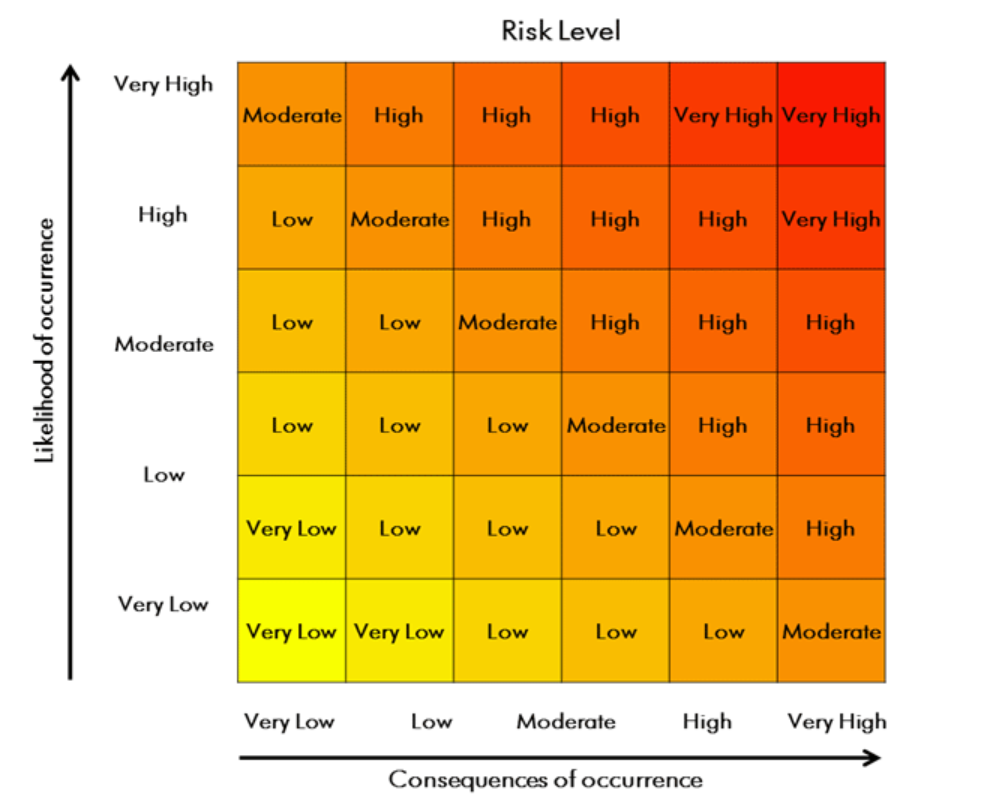

Text Equivalent - Figure 4-1 **Figure 4-1: Risk Assessment Matrix**

This figure presents a matrix for determining the level of risk based on the likelihood of an event occurring and the consequences of the event should it occur. Each axis goes from very low to very high.

### References

1 Government of Canada. (2015). *Canadian Biosafety Standard* (2nd ed.). Ottawa, ON, Canada: Government of Canada. 

2 *Human Pathogens and Toxins Act (S.C. 2009, c. 24).* (2015). 

3 *Human Pathogens and Toxins Regulations (SOR/2015-44).* (2015). 

4 *Health of Animals Act (S.C. 1990, c. 21).* (2015). 

5 *Health of Animals Regulations (C.R.C., c. 296)* . (2015). 

6 United States Army Chemical School. (2005). *FM 3-11.9/MCRP 3-37.1B/NTRP 3-11.32/AFTTP(I) 3-2.55: Potential Military Chemical/Biological Agents and Compounds.* Fort Leonard Wood, MO, USA: United States Army Chemical School.

 7 Prusiner, S. B. (2004). *P* *rion Biology and Diseases* (2nd ed.). Cold Spring Harbor, NY, USA: Cold Spring Harbor Laboratory Press 

8 Aguzzi, A., Nuvolone, M., & Zhu, C. (2013). The immunobiology of prion diseases. *Nature Reviews Immunology* . 13:888-902. 

9 World Organisation for Animal Health. (2015). General Disease Information Sheets: Bovine Spongiform Encephalopathy (BSE). Retrieved on 11/27, 2015 from http://www.oie.int/doc/ged/D13944.PDF Footnote 10 Bae, S.-E., Jung, S., Kim, H.-Y., & Son, H.S. (2012). Correlation analysis for the incubation period of prion disease. *Prion.* 6(3): 276-281. 

11 Collinge, J., Whitfield, J., McKintosh, E., Beck, J., Mead, S., Thomas, D.J., & Alpers, M.P. (2006). Kuru in the 21st century- an acquired human prion disease with very long incubation periods. *The Lancet.* 367(9528): 2068-2074. 

12 World Health Organization. (2003). *WHO Manual for Surveillance of Human Transmissible Spongiform Encephalopathies including variant Creutzfeldt-Jakob disease.* Geneva, Switzerland: World Health Organization. 

13 Weissmann, C., Enari, M., Klöhn, P.-C., Rossi, D., & Flechsig, E. (2002). Transmission of Prions. *Proceedings of the National Academy of Sciences* . 99(Suppl. 4):16378-16383. 

14 Denkers, N. D., Hayes-Klug, J., Anderson, K. R., Seelig, D. M., Haley, N. J., Dahmes, S. J., Osborn, D. A., *et al* . (2013). Aerosol Transmission of Chronic Wasting Disease in White-Tailed Deer. *Journal of Virology* . 87(3): 1890-1892. 

15 Haybaeck, J., Heikenwalder, M., Klevenz, B., Schwarz, P., Margalith, I., Bridel, C., Mertz, K., *et al* . (2011). Aerosols Transmit Prions to Immunocompetent and Immunodeficient Mice. *PLoS Pathog.* 7(1): e1001257. doi:10.1371/journal.ppat.1001257 

16 United States Department of Health and Human Services, United States Centers for Disease Control and Prevention, & United States National Institutes of Health. (2009). *Biosafety in Microbiological and Biomedical Laboratories* (5th ed.). Washington, DC, USA: United States Government Printing Office. 

17 United Kingdom Department of Health, Advisory Committee on Dangerous Pathogens, & the Spongiform Encephalopathy Advisory Committee. (2003). *Transmissible Spongiform Encephalopathy Agents: Safe Working and the Prevention of Infection -* Annex C: General Principles of Decontamination and Waste. Guidance from the Advisory Committee on Dangerous Pathogens and the Spongiform Encephalopathy Advisory Committee. London, UK: Department of Health. 

18 World Health Organization. (2000). *WHO Infection Control Guidelines for Transmissible Spongiform Encephalopathies* . Geneva, Switzerland: World Health Organization. 

19 Australia Group. (2015). *List of Human and Animal Pathogens and Toxins for Export Control* . Retrieved 11/03, 2015 from http://www.australiagroup.net/en/human_animal_pathogens.html 

20 World Organisation for Animal Health. (2015). *OIE-Listed diseases, infections and infestations.* Retrieved 11/03, 2015 from http://www.oie.int/animal-health-in-the-world/oie-listed-diseases-2015/ 

21 Zufferey, R., Dull, T., Mandel, R. J., Bukovsky, A., Quirox, D., Naldini, L., & Trono, D. (1998). Self-Inactivating Lentivirus Vector for Safe and Efficient *In Vivo* Gene Delivery. *Journal of Virology.* 72(12):9873-9880. 

22 Nguyen, M., & Haenni, A. L. (2003). Expression Strategies of Ambisense Viruses. *Virus Research* . 93(2):141-150. 

23 Knipe, D. M. (Ed.). (2007). *Fields Virology* (5th ed.). Philadelphia, PA, USA: Lippincott Williams & Wilkins. 

24 Belsham, G. J., & Bostock, C. J. (1988). Studies on the Infectivity of Foot-and-Mouth Disease Virus RNA Using Microinjection. *Journal of General Virology* . 69:265-274. 

25 Van Gennip, H. G. P., van Rijn, P. A., Widjojoatmodjo, M. N., & Moormann, R. J. M. (1999). Recovery of Infectious Classical Swine Fever Virus (CSFV) from Full-Length Genomic cDNA Clones by a Swine Kidney Cell Line Expressing Bacteriophage T7 RNA Polymerase *. Journal of Virological Methods* . 78(1-2):117-128. 

26 Wong, D. (2009). *Virus Replication* . Retrieved 11/03, 2015 from http://virology-online.com/general/Replication.htm 

27 Public Health Agency of Canada. (2012). *Routine Practices and Additional Precautions for Preventing the Transmission of Infection in Healthcare Settings* . Ottawa, ON, Canada: Public Health Agency of Canada. 

28 Health Canada. (2002). Infection control guidelines: Prevention and control of occupational infections in health care. *Canada Communicable Disease Report.* 28S1:1-264. Retrieved 11/03, 2015 from http://publications.gc.ca/collections/Collection/H12-21-3-28-1E.pdf 

29 United States Department of Labor. (2001). *O* *ccupational Safety and Health Standards: Bloodborne Pathogens.* Title 29 Code of Federal Regulations. 1910.1030 Washington, DC, USA: United States Department of Labor. 

30 Canadian Centre for Occupational Health and Safety. (2006). *Hazard Control* . Retrieved 11/03, 2015 from http://www.ccohs.ca/oshanswers/hsprograms/hazard_control.html

## Chapter 5 - Biosafety Program Management

A **biosafety** program is designed to prevent **infections** and illnesses among personnel and to protect the public, the environment, and animal population from harm by preventing the inadvertent **release** of **pathogens** or **toxins** . An effective biosafety program will promote and reinforce safe work practices, improve safety performance, and increase regulatory compliance through a combination of training, documentation, inspections, evaluation, review, and clear communication. A biosafety program may include a **biosecurity** component, or have a separate biosecurity program, to protect against the theft, loss, or intentional misuse of pathogens, toxins, or other **infectious material** . The management of a biosafety program involves ensuring all aspects of the biosafety program are in place. The requirements for biosafety program management in **facilities** regulated by the Public Health Agency of Canada (PHAC) and the Canadian Food Inspection Agency (CFIA) are specified in Matrix 4.1 of the *Canadian Biosafety Standard* (CBS), 2 nd Edition. [1](#ch5-1)

The level of detail and complexity of the biosafety program will depend on the nature (i.e., size, structure, complexity) of the organization and the activities performed by it. In organizations that carry out limited activities with pathogens, toxins, or infectious material, the task of developing a biosafety program may simply entail broadening the scope of an existing safety program to incorporate their **facility's** specific biosafety needs. In more complex organizations such as universities, it may be necessary to have biosafety personnel dedicated to ensure that the goals of the biosafety program are met. Although some more complex facilities may choose to maintain their biosafety and biosecurity components as two separate programs, biosecurity is included as a component of a biosafety program within the CBS and this document. This chapter outlines considerations on how a biosafety program can be effectively managed as well as the core elements of a biosafety program, which are further explored in the following chapters.

### 5.1 Administrative Controls

Integral to the success of any biosafety program is a strong commitment and involvement by everyone within the organization, including **senior management** , supervisors, the **biological safety officer (BSO)** , and individual personnel. Administrative controls implemented from the highest levels of the organizational structure (i.e., senior management) by means of policies and procedures help protect workers throughout the organization from **exposure** to human and **animal pathogens** and toxins. The roles and responsibilities for a successful biosafety program are outlined in this section. The specific administrative controls required at the operational level are specified in Matrix 4.1 of the CBS for facilities regulated by the PHAC or the CFIA. The *Plan for Administrative Oversight in a Research Setting* (see [Appendix A](/en/public-health/services/canadian-biosafety-standards-guidelines/handbook-second-edition/chapter-21-25.html#appa) ), required for any applicant for a licence for controlled activities with human pathogens and toxins who intends to carry out **scientific research** , is a tool that can be used to document the administrative controls already in place.

#### 5.1.1 Biosafety Policy

A high-level biosafety policy or code of practice, which is specific to the institution, is encouraged; it could be a standalone biosafety policy, code, or plan, or a biosafety policy integrated into a pre-existing health and safety policy or plan. The biosafety policy can outline senior management's commitment to biosafety, the guiding principles, the applicable biosafety and biosecurity standards (e.g., CBS, International Organisation for Standardization [ISO], Organisation for Economic Co-operation and Development [OECD] *Principles of Good Laboratory Practice* , Canadian Council on Animal Care [CCAC]) and legislation (i.e., *Human Pathogens and Toxins Act* [HPTA], *Human Pathogens and Toxins Regulations* [HPTR], *Health of Animals Act* [HAA], *Health of Animals Regulations* [HAR], and applicable federal/provincial/territorial legislation), the protection of personnel, the program objectives, accountabilities and responsibilities, and the consequences and disciplinary actions for deliberate or repeat non-compliance. [2](#ch5-2) [3](#ch5-3) [4](#ch5-4) [5](#ch5-5) [6](#ch5-6) [7](#ch5-7) [8](#ch5-8) A policy can establish the **internal accountability system** with respect to pathogens, toxins, and other regulated infectious material (e.g., infected or intoxicated animals, animal products or by-products that contain a pathogen or toxin). Communicating the policy to all personnel is essential in ensuring that all workers are aware and informed of their responsibilities as well as the consequences for non-compliance. Pathogen and toxin accountability and the internal accountability system are further discussed in [Chapter 19](/en/public-health/services/canadian-biosafety-standards-guidelines/handbook-second-edition/chapter-16-20.html#ch19) .

#### 5.1.2 Program Intent

The **program intent** describes the planned work to be performed in a **containment zone** and serves to document the scope of a facility's activities. It includes the pathogens, toxins, and other regulated infectious material the facility plans to use. Documenting the types of activities conducted in the facility at the broadest level (e.g., what type of business is conducted, such as academic/instructional, hospital/health care, public health surveillance, environmental surveillance, veterinary/animal health, research and development, manufacturing or production) is a good starting point for outlining the program intent. From there, the scope of work for the activities planned inside the facility, including ***in vitro*** activities with pathogens and toxins (e.g., routine **diagnostic activities** , scientific research, or **large scale** production), and ***in vivo*** activities with pathogens and toxins (e.g., work with small-sized animals or large-sized animals). Where *in vivo* work with pathogens and toxins is to be performed, the program intent includes a list of all animal species that will be used. The program intent can be documented at an organizational level; although in some cases where diverse activities are conducted within the same organization or facility (e.g., universities), it may be appropriate to develop a program intent at the level of the containment zone.

In containment zones where **non-indigenous animal pathogens or emerging animal disease pathogens** are handled, changes to program intent (e.g., introduction of a new pathogen or toxin or introduction of a new animal species) or to **standard operating procedure (SOPs)** that may impact **biocontainment** or biosafety are submitted to the CFIA prior to implementing the change to allow the CFIA to confirm the changes are acceptable in order to maintain **containment** (CBS Matrix 4.1).

#### 5.1.3 Roles and Responsibilities

In most organizations, senior management is the ultimate authority and is responsible for delegating appropriate authority for biosafety. Senior management is also responsible for ensuring that adequate resources are available to support the biosafety program and compliance with legal requirements, and for ensuring that biosafety concerns are appropriately prioritized and addressed. Senior management establishes policies and practices that describe the reasonable precautions to be undertaken for the prevention of the release of pathogens and toxins. They also play a role in the continuous improvement and relevance of the biosafety program.

Managers and supervisors are responsible for ensuring that personnel comply with biosafety related legislation. Where **controlled activities** involving human pathogens and toxins are authorized by a **licence** under the HPTA, the individual identified as the licence holder is ultimately accountable for activities carried out with the pathogens and toxins in a licensed facility. All personnel conducting controlled activities with human pathogens and toxins in a licensed facility have specific responsibilities laid out in the HPTA and HPTR (summarized in [Section 1.3](#s13) of the CBS).

Where animal pathogens or toxins have been imported to a facility in Canada under an **animal pathogen import permit** under the HAA and HAR, the individual identified as the importer on the permit is ultimately accountable for the imported pathogens, toxins, or other regulated infectious material. All personnel handling imported animal pathogens, toxins, and other regulated infectious material in a facility authorized to import or receive imported material via **transfer** , under an animal pathogen import permit under the HAA and HAR have specific responsibilities (summarized in [Section 1.4](#s14) of the CBS). It remains the responsibility of the regulated party to understand their obligations under the HPTA, HPTR, HAA, and HAR, as applicable, and regulated parties are encouraged to refer to the specific sections of the legislation for a complete understanding of the requirements.

Whenever possible, a senior officer from within the organization (i.e., senior management) should be identified as the licence holder representative and/or importer so that the appropriate institutional oversight of the pathogens, toxins, and other infectious material may be allocated. Pathogen and toxin accountability is further discussed in [Chapter 19](/en/public-health/services/canadian-biosafety-standards-guidelines/handbook-second-edition/chapter-16-20.html#ch19) .

#### 5.1.4 Biological Safety Officer

The biosafety representative, or BSO, is an individual with the appropriate knowledge who has been delegated the responsibility for the oversight of biosafety and biosecurity practices, including the organization's biosafety program. In many facilities, the biosafety representative or BSO is a role that can be assigned to a qualified person who performs these duties on a part-time basis (e.g., senior microbiologist, **laboratory** technician) or that can be assigned to a qualified person on a full-time basis, as determined by the organization. In some large organizations, there may be several individuals carrying out the functions of the biosafety representative or BSO to manage the key elements of the biosafety program. The HPTA and HPTR have been designed to reflect the key role played by BSOs in risk reduction in institutions **handling and storing** human pathogens and toxins and are designed to provide the designated BSO with the authority and controls necessary to facilitate their work, by specifying qualifications, functions, and power of a BSO.

The biosafety representative or BSO must have the knowledge appropriate to the **risks** associated with the activities being performed with pathogens and toxins in the facility, possess knowledge of the HPTA, HPTR, HAA, and HAR, and any other applicable federal or provincial/territorial legislation, possess knowledge of the **containment levels** in the facility, as well as knowledge of the applicable biosafety and biosecurity policies, standards, and practices appropriate to the risks associated with the activities being performed with pathogens and toxins in the facility. It is encouraged that the BSO updates or improves his or her knowledge of biosafety-related topics on a regular basis. This enables the BSO to remain well informed and current in areas related to managing the risks associated with the pathogens and toxins handled or stored within the organization. In accordance with Section 36 of the HPTA, a designated BSO must be identified in a facility that is applying for a licence to conduct controlled activities with human pathogens and toxins. Section 8 of HPTR further specifies the qualifications of the designated BSO in licensed facilities.

The BSO plays a key role in assisting scientific and technical staff in navigating the administrative and regulatory obligations associated with biosafety. The responsibilities of a BSO are distinct from those of the occupational health and safety committee. The biosafety representative, or designated BSO, is responsible for oversight of biosafety and biosecurity practices, including the overall management of the biosafety program, which may include policy development, implementing the program, monitoring compliance, conducting risk assessments and internal inspections/audits, overseeing and documenting biosafety-related training, assisting in investigations of **incidents** , compiling and providing any reports/ documentation, as required by the regulatory agencies, and maintaining liaison with containment zone personnel, support staff, housekeeping personnel, and contractors on biosafety-related matters, as well as the continual improvement of the program (CBS Matrix 4.1; HPTR 9[1]). The biosafety representative or designated BSO is also responsible to verify the accuracy and completeness of licence applications or renewals, animal pathogen import permit applications, and transfer requests, as well as to communicate with the PHAC and the CFIA on behalf of the licence holder or animal pathogen import permit holder, as appropriate. Although the responsibilities of a BSO may be separate from that of the occupational health and safety committee, it is recommended that the BSO be a part of the committee in order to provide the appropriate safety linkages. Section 9 of the HPTR further specifies the functions and power of the designated BSO in licensed facilities.

A change in the designated BSO may occur for a number of reasons, such as a change in employment or a prolonged absence (e.g., sabbatical, parental leave). Licence holders are required to notify the PHAC without delay when the designated BSO has changed (HPTA 36[6]). Consequently, considerations should be made within the organization to determine circumstances when a new BSO needs to be designated and the PHAC notified. It may be beneficial to identify alternate biosafety contacts to handle the day-to-day BSO responsibilities during short-term absences of the designated BSO (e.g., vacation).

#### 5.1.5 Institutional Biosafety Committee

An institutional biosafety committee (IBC) can also be involved in the management of a biosafety program. The BSO, or biosafety representative, should liaise with the IBC through regularly scheduled meetings and should present specific biosafety problems, concerns and policy/protocol improvements to be considered and addressed. The IBC can assist the BSO with risk assessments, biosafety protocol reviews and approvals, disputes about biosafety matters, or other biosafety or biosecurity concerns. Careful consideration should be given to the composition of the IBC, which should include several individuals with varying expertise. It is recommended that the IBC include at least one member from the research or technical staff, a representative from management, a medical advisor who can be consulted as required, and the BSO. Depending on the facility, other members may be included, such as facility technical staff or an animal care technician.

### 5.2 Risk Assessments and Planning

Risk assessments are conducted to identify hazards and appropriate mitigation strategies, and to evaluate whether or not existing mitigation measures are commensurate with the level of risk. There are many types of risk assessments related to handling pathogens and toxins, one of which is the **overarching risk assessment** , described below. A comparison should be made with requirements specified in the CBS [Chapters 3](#ch3) , [4](#ch4) , and [5](#ch5) , as well as existing best practices, to clearly identify gaps that need to be addressed.

The first step in conducting a biosafety or **biosecurity risk assessment** is always to determine the pathogens, toxins, and other infectious material that are present, or planned to be present, so that the associated risks can be determined and addressed. It may be necessary to review existing **inventories** (including material in **long-term storage** ), and research proposals in order to fully build an accurate perspective of the risks present in the facility. A survey of the facility in the context of planned program activities should also be conducted to identify the containment levels of existing laboratories and any gaps in facility design and engineering controls based on applicable regulations, standards, and guidelines. Determining the existence of shared laboratory workspace within the facility (e.g., multiple investigators, multiple agents, and various organizations) is a consideration for this survey as these spaces may have an impact on the way the biosafety program is managed. There are several additional international biosafety standards and guidelines available that may provide further assistance for best practices and performing biosafety and biosecurity risk assessments. [9](#ch5-9) [10](#ch5-10) [11](#ch5-11) [12](#ch5-12) Other types of risk assessments that are intended to be more focused in scope are discussed in [Chapter 4](#ch4) ( **pathogen risk assessments** and **local risk assessments [LRAs]** ) and [Chapter 6](/en/public-health/services/canadian-biosafety-standards-guidelines/handbook-second-edition/chapter-6-10.html) (biosecurity risk assessments).

#### 5.2.1 Overarching Risk Assessments

When developing a biosafety program, an overarching risk assessment is conducted to identify the hazards and appropriate mitigation management strategies (CBS Matrix 4.1). The overarching risk assessment process is a broad assessment that supports the biosafety program as a whole and may encompass multiple containment zones within an institution or organization.

The overarching risk assessment identifies hazards through a systematic review of the type of **biological material** that is present, including the identification of personnel who are handling it, the locations where the material is handled and stored, and the activities being conducted (e.g., routine diagnostic activities, scientific research, large scale, recombinant work, animal work). It helps identify the most important biosafety issues and provides an opportunity to assign resources where they can be the most effective. An overarching risk assessment informs the development of biosafety program risk mitigation strategies, which may include the use of engineering and administrative controls, practices and procedures, and training. This assessment includes a wide-ranging analysis of the hazards and possible exposure or release scenarios, which may involve examining factors such as the full spectrum of the different types of work to be performed, and the various equipment and procedures required. An overarching risk assessment provides a top-down view of the risks associated with the biosafety program, and may be supported by LRAs, which are more focused assessments to examine specific elements of the program.

The overarching risk assessment may also include a risk communication plan designed to effectively address public concerns about the risks associated with the facility and its operation. An effective risk communication plan is proactive and begins at the early planning stages of facility construction and continues after operation begins. This may include early engagement of, and open communication with, the public. Trust, transparency, and availability of information that will not compromise biosecurity are integral elements of a successful risk communication plan, and public engagement should be maintained throughout the lifetime of the facility.

### 5.3 Implementation of a Biosafety Program

While biosafety programs will differ from one organization to another, there are a number of common core program elements that must be present. These building blocks, when assembled upon a foundation of strong management commitment and planning, will provide a solid framework for an effective biosafety program. The complexity of any specific program element will depend on the outcome of the overarching risk assessment and the nature of the organization and its activities. An organization or institution may decide to incorporate their biosafety program into an existing management system to limit duplication and increase efficiencies.

#### 5.3.1 Biosafety Manual

A **Biosafety Manual** containing institutional policies, programs, and plans is to be developed, implemented, and kept up to date (CBS Matrix 4.1). The Biosafety Manual is the most common and effective tool for documenting the biosafety program and describing how the organization/facility will achieve the goals and objectives of the program. It is also one of the most effective tools to make personnel aware of the hazards, risks, mitigation strategies, emergency response, and safe work practices, and which personnel can consult as the need arises to review updates or refresh their memory on these issues. Depending on the detail and complexity of the program, the Biosafety Manual may be a standalone document or be incorporated into one or more general health and safety manuals within the organization. A description of the biosafety program itself, as well as each of the core elements described below, are included in the Biosafety Manual so that all personnel are aware of how the program is structured and the responsibilities relevant to all personnel.

#### 5.3.2 Biosecurity Plan

A biosecurity plan is to be developed and implemented by facilities where pathogens or toxins are handled or stored to describe and outline the security measures designed to prevent the loss, theft, misuse, diversion, or intentional release of pathogens and toxins from the facility (CBS Matrix 4.1). Further details on biosecurity are provided in [Chapter 6](/en/public-health/services/canadian-biosafety-standards-guidelines/handbook-second-edition/chapter-6-10.html) .

#### 5.3.3 Medical Surveillance and Evaluation Program

A **medical surveillance program** is to be developed, implemented, and kept up to date for facilities where pathogens or toxins are handled or stored (CBS Matrix 4.2). The basic purpose of this program is to help prevent illnesses related to exposure of laboratory personnel to infectious material or toxins, and to detect such illnesses when they occur, in order to protect the health of the **community** . Further details and considerations related to medical surveillance and evaluation programs are described in [Chapter 7](/en/public-health/services/canadian-biosafety-standards-guidelines/handbook-second-edition/chapter-6-10.html#ch7) .

#### 5.3.4 Training Program

A training program, based on a **training needs assessment** , is to be developed, implemented, evaluated, and improved and updated as necessary in order to identify current and future training needs of the facility, and gaps in the current training program (CBS Matrix 4.3). Training is a core element of the biosafety and biosecurity programs so that personnel are adequately informed on the risks associated with the pathogens and toxins with which they will work, as well as the approved safe work practices and mitigation strategies. Further details and considerations related to training programs are outlined in [Chapter 8](/en/public-health/services/canadian-biosafety-standards-guidelines/handbook-second-edition/chapter-6-10.html#ch8) .

#### 5.3.5 Safe Work Practices and Standard Operating Procedures

**Good microbiological laboratory practices** , described in [Chapter 21](/en/public-health/services/canadian-biosafety-standards-guidelines/handbook-second-edition/chapter-21-25.html) , lay the foundation for all safe work practices involving infectious material (CBS Matrix 4.6). All procedures that will involve potentially infectious material or toxins are assessed to ensure that safe work practices have been established (CBS Matrix 4.1). Safe work practices can be documented in SOPs so that they can be easily understood and implemented by all personnel.

SOPs are detailed, step-by-step procedures that are introduced during training, and that are read prior to performing the procedure for the first time, for refamiliarization with procedures that are performed infrequently, and whenever the SOP is amended. They provide documentation that can be reviewed by internal or external auditors, and can facilitate evaluation of compliance with program requirements. Safe work practices and SOPs specific to the containment zone (e.g., **personal protective equipment [PPE]** , entry and exit procedures, and **waste** management) are developed to address specific biosafety issues for the containment zone and added to the Biosafety Manual so that they are documented and accessible for all containment zone personnel (CBS Matrix 4.1).

#### 5.3.6 Emergency Response Planning

An **emergency response plan (ERP)** outlines the action(s) to be taken in the event of situations such as a spill, exposure, release of pathogens or toxins, infected animal escape, personnel injury or illness, power failure, fire, explosion, or other emergency situations (e.g., flood, earthquake, hurricane) (CBS Matrix 4.9). The ERP should take into account the physical structure of the building as well as the location (e.g., exposure to weather extremes, earthquakes, floods). This type of plan is for protecting human and animal health and safety as well as safeguarding property and the environment. Further details on ERPs are described in [Chapter 17](/en/public-health/services/canadian-biosafety-standards-guidelines/handbook-second-edition/chapter-16-20.html#ch17) .

#### 5.3.7 Regulatory Compliance

Regulatory compliance requires an understanding of the relevant legislation and regulations, including the HPTA and HPTR where human pathogens and toxins are handled and stored, as well as the HAA and HAR where imported animal pathogens and toxins are handled and stored. It is therefore important for any facility where pathogens or toxins are handled or stored to establish a liaison, through the BSO or other biosafety representative, with the applicable regulatory bodies, including the PHAC, the CFIA, and other Canadian governmental, non-governmental, provincial or territorial, and municipal authorities, as required. Further details on regulatory oversight are provided in [Chapter 23](#ch23) .

### 5.4 Measuring Program Effectiveness

A management system outlines the framework of processes and procedures that can be applied by an organization to meet specific goals. In general, management systems follow a cycle of planning, implementing, measuring, and improving (or the "Plan-Do-Check-Act cycle", as described by the ISO), whereby the management system itself is continually improved. [2](#ch5-2)

In order for any management system to be effective, its performance should be tracked and measured against the program's goals and objectives. For a biosafety program, that would include the following:

* how infections and illnesses among personnel are being prevented;
* how a release of pathogens or toxins is being prevented;
* how compliance with legislation is being achieved; and
* how safety is being promoted.

Internal mechanisms are put in place to determine how the biosafety program is functioning; performance measurements provide qualitative and quantitative information that can be collected and analyzed to evaluate the program's success. The tools described below are commonly used to evaluate a biosafety program.

#### 5.4.1 Incident Reporting and Investigations

**Incident** reports, subsequent investigations, and corrective actions can provide an indication of biosafety program effectiveness by identifying deficiencies and gaps in procedures or in the program itself. Incident reports and investigations are required in specific situations such as upon discovery of a **laboratory acquired infection/intoxication (LAI)** , an exposure, or a failure of a **containment system** or device. Incidents can serve as an indicator of a program's success, even though they are generally under-reported and thus challenging as a quantifiable measure. Additional information on incident reporting, documentation, and investigation can be found in [Chapter 18](/en/public-health/services/canadian-biosafety-standards-guidelines/handbook-second-edition/chapter-16-20.html#ch18) .

#### 5.4.2 Records

Records are documents pertaining to the biosafety program or to biocontainment systems that provide evidence or information accounting for something that has occurred (e.g., accomplished, achieved, performed, or maintained). They serve to document most activities, including training, containment zone access, importation, maintenance and repair, equipment monitoring/calibration, **decontamination** , and shipping, receiving, and transfer. They can be used to assess whether essential biosafety elements are met (e.g., review of who has access to which containment zone, and if they have received training; which pathogens are handled and stored in the facility; whether autoclave cycles are always effective).

Records are kept on file to provide evidence that a specific activity was performed and to document the results achieved (CBS Matrix 4.10). It is important that records are legible and clearly identify the activity, product, or service involved. Historical records are to be retained for a specified period of time, should be easy to retrieve, and protected from damage or loss.

##### 5.4.2.1 Authorized Persons

The CBS requires that facilities maintain a record of all individuals entering and exiting the containment zone where SSBAs are present, as well as containment level 3 (CL3, which include CL3 **large animal containment zones [LA zone]** ), and containment level 4 (CL4) zones (CBS Matrix 4.10). This can be accomplished by maintaining an entry and exit log, or electronically by having all personnel use an electronic key card to scan in and out of the containment zone.

In addition, the HPTA requires licence holders to establish and maintain a list of all persons authorized by the licence holder to access any part of the facility (e.g., building and room numbers) to which the licence applies (HPTA 31). This list is to be provided to the PHAC if requested. This list is to include, but is not limited to, personnel, students, researchers, visitors, cleaning staff, maintenance staff, and contractors, whether or not they handle pathogens or toxins. It is left to the facility to decide how the list of authorized persons is managed. Each researcher or laboratory manager should be aware of who is authorized to enter their licensed areas. It may also be possible to obtain the information from student or human resources records.

#### 5.4.3 Inventories

Pathogen and toxin accountability and **inventory** control processes allow pathogens, toxins, and other regulated infectious material to be readily located, when necessary, and permit missing items to be more easily identified. Any discrepancies noted can serve to identify potential areas for improvement, such as improving the existing inventory system, re-training of personnel, or implementation of a new system. Further details on pathogen and toxin accountability and inventory control are provided in [Chapter 19](/en/public-health/services/canadian-biosafety-standards-guidelines/handbook-second-edition/chapter-16-20.html#ch19) .

#### 5.4.4 Internal Inspections and Audits

Internal inspections and audits are an important component of any biosafety program and are designed to help prevent mishaps, incidents, and exposures, by proactively identifying hazards, deficiencies, or areas for improvement. These internal inspections and audits are conducted or coordinated by the BSO, with or without the participation of facility personnel, supervisors, directors, management, the IBC, or even occupational health and safety committees independently of PHAC and CFIA inspections. Many definitions exist for the terms "audit" and "inspection" and these terms are often used interchangeably. For the purposes of this document, internal inspections are conducted in person, scheduled regularly, thoroughly documented, and follow a documented procedure that outlines the items to be inspected in compliance with internal and external requirements. Internal audits are more periodic, focused, and can be carried out in person or be paper-based. Documentation from inspections and audits clearly specify the corrective actions to be implemented.

In general, internal inspections are conducted on an annual basis at a minimum (CBS Matrix 5.1), although it may be advisable to review critical elements of the program more frequently. The BSO, members of the IBC, senior management, or other similarly trained staff can conduct these internal inspections by walking through the **facility** . These walk-throughs provide an opportunity to observe the physical work environment, equipment, work practices, and correct use of PPE. It is also advantageous to interview personnel and supervisors, listen to any concerns, and review relevant documents and records.

Periodic audits between internal inspections can be useful to enforce and promote compliance. Audits can be random and unannounced and should be performed by individuals who are independent of the activity being audited.

Internal inspection and audit reports detail the findings of the inspection/audit and any corrective actions to be implemented to address deficiencies or non-compliance items. Internal inspection and audit procedures should include prompt follow-up on deficiencies, target dates for corrective action, and **verifications** to confirm implementation of corrective actions.

#### 5.4.5 Regulatory Reporting Requirements

The HPTA and HPTR specify the reporting requirements for the licence holder in facilities that have been authorized to conduct controlled activities with human pathogens and toxins. In addition, regular reporting to the PHAC or the CFIA may be required based on conditions of licence or conditions of animal pathogen import permit, or upon request of either agency. For example, an annual report of performance and verification tests, as specified in Matrix 5.1 of the CBS, is required based on a condition of licence, as well as a condition of an animal pathogen import permit. Further details on regulatory reporting requirements are provided in [Chapter 19](/en/public-health/services/canadian-biosafety-standards-guidelines/handbook-second-edition/chapter-16-20.html#ch19) .

### 5.5 Continuous Improvement of the Program

A successful biosafety program is regularly reviewed at the program management level and continually improved to remain relevant, applicable, and effective. Regular program reports (e.g., quarterly, semi-annually, annually) can be used as a tool to compare achievements against the program's objectives and goals. In addition, a third-party can be enlisted to conduct an objective review of the individual elements as well as the program management system as a whole to identify any gaps that may exist. The review will help address broad questions related to the program management system such as:

* Is the system in place and is it working?
* Are the appropriate procedures, processes, and plans in place to meet the program objectives and goals?
* Is the program adequately communicated to, and understood by, personnel?
* Does the program need to be updated?
* Is the system adapted in response to changes?
* Are adequate resources available to maintain the system?

Senior management should also review the biosafety program at regular intervals to ensure that the program remains effective. For example, the review may be used to determine the program's effectiveness at complying with legal requirements, based on existing legislation. Senior management can also ensure that the existing system continues to reflect the long-term goals and objectives of the institution or organization.

The biosafety program review can also identify non-compliance or other potential problems that may lead to non-compliance. Corrective action should be taken whenever non-compliance is identified, and preventive action should be taken to prevent the occurrence of non-compliance. These actions provide a framework that can help keep the program on track with its goals and objectives and an emphasis on personnel safety.

### References

1 Government of Canada. (2015). *Canadian Biosafety Standard* (2nd ed.). Ottawa, ON, Canada: Government of Canada. 

2 *ISO 9001:2008, Quality Management Systems - Requirements.* (2008). Geneva, Switzerland: International Organization for Standardization. 

3 ENV/MC/CHEM(98)17. (1998). *OECD Series on Principles of Good Laboratory Practice and Compliance Monitoring, Number 1: OECD Principles in Good Laboratory Practice (as revised in 1997).* Environment Directorate, Organisation for Economic Co-Operation and Development, Paris, France. 

4 Canadian Council on Animal Care. (2003). *CCAC Guidelines on: Laboratory Animal Facilities - Characteristics, Design and Development* . Ottawa, ON, Canada: Canadian Council on Animal Care. 

5 *Human Pathogens and Toxins Act (S.C. 2009, c. 24).* (2015). 

6 *Human Pathogens and Toxins Regulations (SOR/2015-44)* . (2015). 

7 *Health of Animals Act (S.C. 1990, c. 21).* (2015). 

8 *Health of Animals Regulations (C.R.C., c. 296).* (2015). 

9 CEN Workshop 31 - Laboratory biosafety and biosecurity. CEN Workshop Agreement (CWA) 15793:2011, *Laboratory biorisk management.* (2011). Brussels, Belgium: European Committee for Standardization. 

10 CEN Workshop 55 - CEN Workshop Agreement (CWA) 16393:2012, *Laboratory biorisk management-Guidelines for the implementation of CWA 15793:2008.* (2012). Brussels, Belgium: European Committee for Standardization. 

11 United States Department of Health and Human Services, United States Centers for Disease Control and Prevention, & United States National Institutes of Health. (2009). *Biosafety in Microbiological and Biomedical Laboratories* (5th ed.). Washington, DC, USA: United States Government Printing Office. 

12 World Health Organization. (2004). *Laboratory Biosafety Manual* (3rd ed.). Geneva, Switzerland: World Health Organization.

[ [Next page](/en/public-health/services/canadian-biosafety-standards-guidelines/handbook-second-edition/chapter-6-10.html) ]

## Page details

Date modified: 2023-06-09