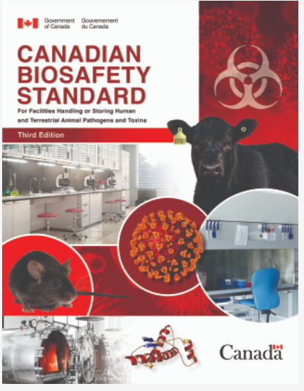
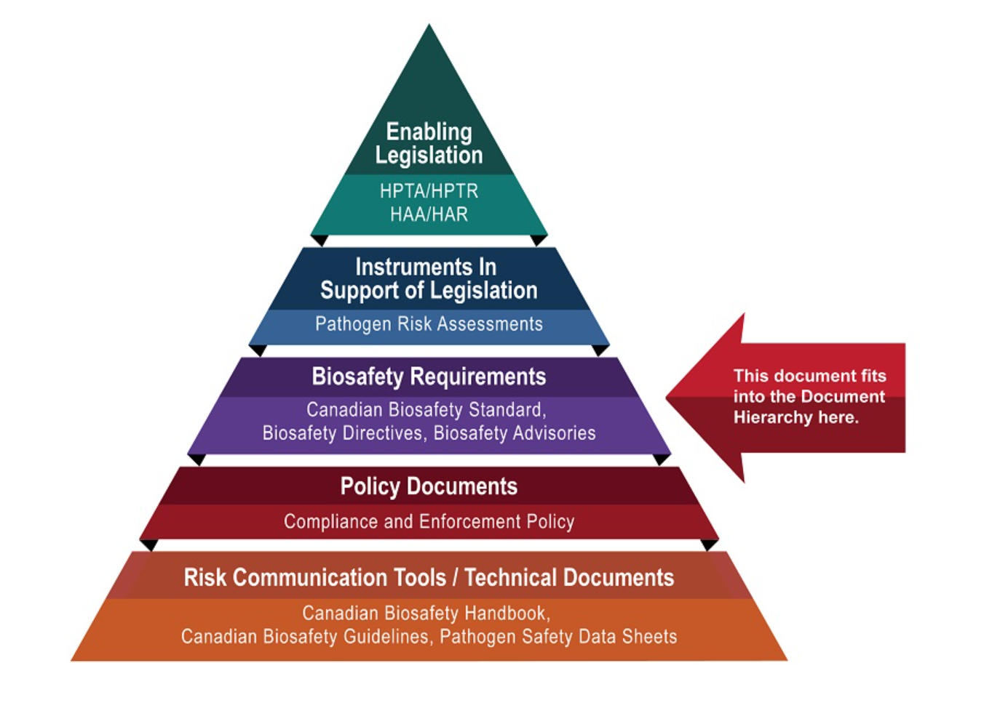
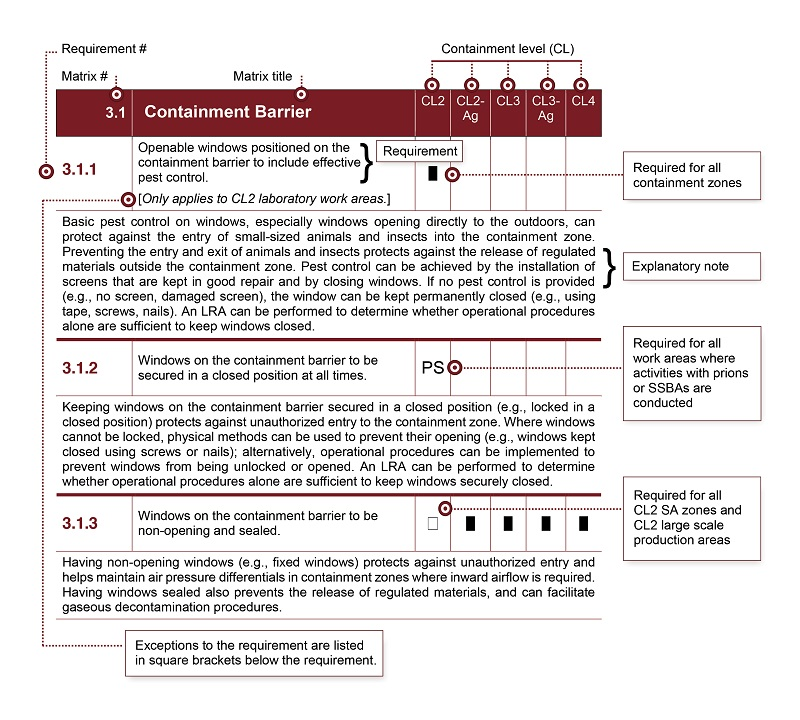

---
# 同时设置标题名称和顺序，order 越小越靠前，默认为 0
title: 《Canadian Biosafety Standard, Third Edition》
order: 3

# 同时设置导航名称和顺序，order 越小越靠前，默认为 0
nav:
  title: 海外文件
  order:  5
---
# Canadian Biosafety Standard, Third Edition

 [Download in PDF format](/content/dam/phac-aspc/migration/cbsg-nldcb/cbs-ncb/assets/pdf/canadian-biosafety-standard-third-edition.pdf)  
(7.3 MB, 168 pages)

**Organization:** [Public Health Agency of Canada](/en/public-health.html)

**Published:** 2022-11

**Cat.:** HP45-7/2022E-PDF

**ISBN:** 978-0-660-45739-0

**Publication Number:** 220463

## Related links

* [Access the Canadian Biosafety app](https://health.canada.ca/apps/canadian-biosafety-standard-facility/inspections.php)

## [Access the Biosecurity Addendum to the Canadian Biosafety Standard, Third Edition](https://training-formation.phac-aspc.gc.ca/mod/page/view.php?id=16281&lang=en)

## Table of contents

* [Preface](#aa1)
* [Abbreviations and acronyms](#aa2)
* [Glossary](#aa3)
* [1. Introduction](#a1) 
*  [1.1 Scope](#a1.1)
* [1.2 Regulatory authorities](#a1.2)
* [1.3 Working with human and animal pathogens and toxins](#a1.3)
* [1.4 Work activities](#a1.4)
* [2. How to use the *Canadian Biosafety Standard, Third Edition*](#a2) 
*  [2.1 Abbreviations, definitions and references](#a2.1)
* [2.2 Matrix layout: Sections 3, 4 and 5](#a2.2)
* [2.3 Explanatory notes](#a2.3)
* [2.4 *Canadian Biosafety Handbook*](#a2.4)
* [3. Physical containment requirements](#a3) 
*  [3.1 Containment barrier](#a3.1)
* [3.2 Access](#a3.2)
* [3.3 Surface finishes and casework](#a3.3)
* [3.4 Air handling](#a3.4)
* [3.5 Facility and services](#a3.5)
* [3.6 Essential biosafety equipment](#a3.6)
* [3.7 Effluent decontamination systems](#a3.7)
* [4. Operational practice requirements](#a4) 
*  [4.1 Biosafety program management](#a4.1)
* [4.2 Training program](#a4.2)
* [4.3 Personal protective equipment](#a4.3)
* [4.4 Entry and exit](#a4.4)
* [4.5 Work practices](#a4.5)
* [4.6 Animal work considerations](#a4.6)
* [4.7 Decontamination and waste management](#a4.7)
* [4.8 Emergency response](#a4.8)
* [4.9 Records and documentation](#a4.9)
* [5. Performance and verification testing requirements](#a5) 
*  [5.1 Performance and verification tests for all containment zones](#a5.1)
* [5.2 Additional performance and verification tests for select containment zones](#a5.2)
* [5.3 Performance and verification tests to be conducted during commissioning and at specified intervals for all containment zones](#a5.3)
* [References](#ref)
* [Appendix A: Key legislative and regulatory requirements](#app)

## Preface

In Canada, the handling or storing of Risk Group 2 (RG2), RG3, and RG4 human pathogens or toxins is regulated by the Public Health Agency of Canada (PHAC) under the *Human Pathogens and Toxins Act* (HPTA) and the *Human Pathogens and Toxins Regulations* (HPTR). Under the *Health of Animals Act* (HAA) and the *Health of Animals Regulations* (HAR), the PHAC and the Canadian Food Inspection Agency (CFIA) regulate the importation of animal pathogens or part of one (e.g., toxin), animals naturally or experimentally exposed to an animal pathogen or part of one (e.g., toxin), and animal products or by-products (e.g., tissue, serum), or other organisms carrying an animal pathogen or part of one (e.g., toxin).

The Government of Canada's *Canadian Biosafety Standard, Third Edition* (CBS), 2022 is the national standard for facilities where regulated human and terrestrial animal pathogens and toxins are handled or stored. The first edition of the *Canadian Biosafety Standards and Guidelines* , published in 2013, was developed to update and harmonize three existing Canadian biosafety standards and guidelines for the design, construction, and operation of facilities in which regulated materials are handled or stored:

* Laboratory Biosafety Guidelines, third edition, 2004
* Containment Standards for Veterinary Facilities, first edition, 1996
* Containment Standards for Laboratories, Animal Facilities and Post Mortem Rooms Handling Prion Disease Agents, first edition, 2005

The third edition of the CBS expands upon the risk-, evidence-, and performance-based approach of the second edition. Requirements have been revised to clarify the underlying biosafety and/or biosecurity intent, and to eliminate redundancies where possible.

The following figure depicts the document hierarchy used by the PHAC and the CFIA to oversee biosafety and biosecurity operations. Each tier of the pyramid corresponds to a document type, with documents increasing in order of precedence moving upwards. Acts and regulations are found at the top of the pyramid, as they are the documents that convey the PHAC's and the CFIA's legal authorities. Guidance material and technical pieces are found at the bottom of the pyramid, as they are only intended to summarize recommendations and scientific information.

**Figure 1: Government of Canada's biosafety and biosecurity document hierarchy**

 Figure 1 - Text description Figure in the form of a pyramid depicting the document hierarchy used by the PHAC to oversee biosafety and biosecurity operations. Each of the five tiers of the pyramid corresponds to a document type, with documents increasing in order of precedence moving upwards.

At the top sits the Enabling Legislation, that is, the HPTA, HPTR, HAA, and HAR, that convey the PHAC's legal authorities. Below the acts and regulations sit Instruments in Support of Legislation, which are the Pathogen Risk Assessments. The next tier down are the Biosafety Requirements, which include the Canadian Biosafety Standard, Biosafety Directives, and Biosafety Advisories. In the second lowest tier are the Policy Documents, which include the Compliance and Enforcement Policy. Guidance material and technical pieces found at the bottom of the pyramid, under the Risk Communication Tools and Technical Documents heading, are intended to summarize recommendations and scientific information only. These include the Canadian Biosafety Handbook, Canadian Biosafety Guidelines, and Pathogen Safety Data Sheets.

## Abbreviations and acronyms

Ag 

Agriculture (i.e., CL2-Ag, CL3-Ag)

BSC

 Biological safety cabinet

 BSO

 Biological safety officer 

CBH

 *Canadian Biosafety Handbook* 

CBS

 *Canadian Biosafety Standard, Third Edition*

 CFIA

 Canadian Food Inspection Agency 

CL

 Containment level (i.e., CL1, CL2, CL3, CL4)

 EAD

 Emerging animal disease

 ERP

 Emergency response plan 

FAD

 Foreign animal disease

 HAA

 *Health of Animals Act* 

HAR

 *Health of Animals Regulations* 

HEPA

 High efficiency particulate air 

HPTA

 *Human Pathogens and Toxins Act* 

HPTR

 *Human Pathogens and Toxins Regulations* 

HVAC

 Heating, ventilation, and air conditioning 

LA zone

 Large animal containment zone 

LRA

 Local risk assessment 

PHAC

 Public Health Agency of Canada

 PM room

 Post mortem room 

PPE

 Personal protective equipment 

PSDS

 Pathogen safety data sheet 

RG

 Risk group (i.e., RG1, RG2, RG3, RG4) 

SA zone

 Small animal containment zone 

SOP

 Standard operating procedure 

SSBA 

Security sensitive biological agent 

UPS

 Uninterruptible power supply 

Glossary

While some of the definitions provided in the glossary are universally accepted, many are specific to the *Canadian Biosafety Standard, Third Edition* (CBS); therefore, some definitions may not be applicable to facilities that fall outside the scope of the CBS.

Access control system

 A physical or electronic system designed to restrict access to authorized personnel only (e.g., key locks, electronic access cards). 

Accident

 An unplanned event that results in injury, harm, or damage.

 Administrative area 

A dedicated room or adjoining rooms that are used for activities that do not involve regulated materials. Administrative areas do not require any containment equipment, systems, or operational practices. Examples of administrative areas include offices, photocopy areas, and meeting/conference rooms.

 Aerosol 

A suspension of fine solid particles or liquid droplets in a gaseous medium (e.g., air) that can be created by any activity that imparts energy into a liquid or semi-liquid material. 

Airborne pathogen

 A pathogen that is capable of moving through or being carried by the air. 

Airtight doors

 Doors that are designed to allow no leakage of air (0%) under normal operating conditions and to withstand pressure decay testing and gaseous decontamination. Airtight doors can be achieved with inflatable or compression seals. 

Animal cubicle 

A room or space designed to house an animal (or animals) where the room itself serves as primary containment. These spaces are used to house large-sized animals (e.g., livestock, deer) or small-sized animals that are housed in open caging (i.e., not primary containment caging).

 Animal room

 A room designed to house animals in primary containment caging. These spaces are used to house only small-sized animals (e.g., mice, rats, rabbits).

 Anteroom 

A room, or series of rooms, inside the containment zone, used to separate "clean" areas from "dirty" areas (i.e., areas with a lower risk of contamination from those with a higher risk of contamination), for personnel, materials, and animal entry/exit across the containment barrier, and for entry to/exit from animal rooms, animal cubicles, and post mortem rooms. The negative differential air pressures in containment zones where inward airflow is required can be more effectively maintained through the presence of an anteroom. An anteroom may also provide appropriate space at the points of entry/exit to don, doff, and store dedicated and additional personal protective equipment, as required. 

Aquatic animal pathogen 

A pathogen, including those derived from biotechnology, that is capable of causing disease or infection in aquatic animals which, according to the *Health of Animals Regulations* , are finfishes, molluscs, and crustaceans or any part of a finfish, mollusc or crustacean at any life stage, as well as germplasm of those animals. In the context of the *Canadian Biosafety Standard, Third Edition* , aquatic animals also include aquatic mammals who spend their lives in water (e.g., seals, dolphins). 

Authorized personnel 

Individuals who have been granted unescorted access past biosecurity barriers, or to the containment zone, by an internal authority (e.g., the containment zone director, biological safety officer, another individual to whom this responsibility has been assigned). Access to these areas and related assets (e.g., sensitive information, equipment, critical support systems) is dependent on personnel completing training requirements and demonstrating proficiency in the standard operating procedures, as determined by the training needs assessment. Additional criteria for granting access include possessing the appropriate security clearance (e.g., *Human Pathogens and Toxins Act* Security Clearance) or baseline security check and having a need-to-know, as determined by the biosecurity risk assessment for the areas and related assets. 

Backdraft protection 

A system that prevents contaminated or potentially contaminated air from escaping the containment barrier through supply and exhaust air ducts in the event of a reversal of airflow. Automated isolation dampers (i.e., that close automatically in the event of a heating, ventilation, and air conditioning [HVAC] system failure) or high efficiency particulate air (HEPA) filters are commonly used for this purpose. 

Backflow prevention

 A system that protects the water supply to the containment zone from contamination in the event of a reversal of water flow. Many types of backflow devices also have test ports allowing them to be checked to confirm they are functioning properly. 

Biocontainment 

See "Containment". 

Biological material 

Pathogenic and non-pathogenic microorganisms, proteins, and nucleic acids, as well as any biological matter that may contain microorganisms, proteins, nucleic acids, other infectious agents, or parts thereof. Examples include, but are not limited to, bacteria, viruses, fungi, prions, toxins, genetically modified organisms, nucleic acids, tissue samples, diagnostic specimens, environmental samples, live vaccines, and isolates of a pathogen or toxin (e.g., pure culture, suspension, purified spores). 

Biological safety cabinet (BSC) 

A primary containment device that provides protection for personnel, the environment, and the product (depending on the BSC class) when working with biological material. 

Biological safety officer (BSO) 

An individual designated for overseeing the facility's biosafety and biosecurity practices. 

Biosafety 

Containment principles, technologies, and practices that are implemented to prevent unintentional exposure to regulated materials, and their accidental release. 

Biosafety manual

 A collection of facility-specific documents that describe the core elements of a biosafety program (e.g., biosecurity plan, training, personal protective equipment) that are applicable to the containment zone. The information can exist as a single paper or electronic document or as a collection of documents.

 Biosafety program

 A program that describes institutional plans and policies that facilitate the safe handling and storing of regulated materials, and prevent their release from the containment zone. Core elements of a biosafety program include, but are not limited to, a biosafety manual, a comprehensive training program, a medical surveillance program, an emergency response plan, standard operating procedures, and a biosecurity plan. 

Biosecurity 

Security measures designed to prevent the loss, theft, misuse, diversion, or intentional release of regulated materials, and other related assets (e.g., personnel, equipment, non-infectious material, animals, sensitive information). 

Biosecurity risk assessment

 A risk assessment in which the regulated materials, and other related assets (e.g., equipment, animals, sensitive information, personnel, non-infectious material) are defined and prioritized, the likelihood of threats, vulnerabilities, and associated consequences are assessed, and appropriate mitigation strategies are recommended to protect these assets against potential biosecurity events.

 Calibration 

The process of determining, standardizing, adjusting, or rectifying the settings or gradations on a measuring instrument or piece of equipment.

 "Clean" change area 

The designated space where dedicated personal protective equipment is donned when entering the containment zone, containment barrier, animal room, animal cubicle, or post mortem room. The "clean" change area is considered to be free from contamination when entry and exit procedures are followed. In high containment zones, the "clean" change area is located outside the containment barrier. 

"Clean" corridor 

In laboratory work areas and large animal containment zones, a corridor that is considered uncontaminated. Anterooms separating the "clean" corridor from each animal cubicle and post mortem room, as well as strict adherence to operational procedures (e.g., for entry and exit), are critical to prevent the spread of contamination in the containment zone.

 Closed system 

Equipment, apparatus, or process system designed to contain biological material and prevent its release into the surrounding environment (e.g., the containment zone). 

Commissioning

 A process whereby a newly constructed containment zone, or a newly modified or renovated containment zone, is subjected to a series of performance and verification tests to confirm that the finished containment zone, including equipment and containment systems, will operate in accordance with the physical design intent and specifications, and is ready to be put into operation or resume activities, respectively. Community 

Encompasses both human (i.e., the public) and animal populations. 

Containment 

The combination of physical design parameters and operational practices that protect personnel, the immediate work environment, and the community from exposure to biological material. The term "biocontainment" is also used in this context. 

Containment barrier 

The physical structures or barriers that create a boundary between "clean" and "dirty" areas or between areas of lower contamination and higher contamination (e.g., between the laboratory work areas, large scale production areas, animal rooms, animal cubicles, or post mortem rooms, and outside that containment area). The containment barrier itself is created by the walls, doors, floors, and ceilings of a room that physically enclose the areas within containment, as well as inward airflow at critical doors (where inward airflow is required). 

Containment level (CL) 

Minimum physical containment and operational practice requirements for handling regulated materials safely in laboratory, large scale production, and animal work environments. There are four containment levels ranging from a basic laboratory (i.e., CL1) to the highest level of containment (i.e., CL4). 

Containment system 

Dedicated equipment that functions to provide and maintain containment of regulated materials. This includes, but is not limited to, primary containment devices (e.g., biological safety cabinets), heating, ventilation, and air conditioning (HVAC) and control systems, and decontamination systems (e.g., autoclaves, effluent decontamination systems). 

Containment zone

 A physical area that meets the requirements for a specified containment level. A containment zone can be a single room (e.g., a Containment Level 2 [CL2] laboratory), a series of co-located rooms (e.g., several non-adjoining but lockable CL2 laboratory work areas), or it can be comprised of several adjoining rooms (e.g., a CL3 suite with dedicated laboratory areas, and separate animal rooms or animal cubicles). Dedicated support areas, including anterooms with showers and "clean" and "dirty" change areas where required, are considered to be part of the containment zone. 

Contamination

 The undesired presence of regulated materials on a surface (e.g., benchtop, hands, gloves) or within other materials (e.g., laboratory samples, cell cultures). 

Controlled activities 

Any of the following activities referred to in subsection 7(1) of the *Human Pathogens and Toxins Act* **:** possessing, handling or using a human pathogen or toxin; producing a human pathogen or toxin; storing a human pathogen or toxin; permitting any person access to a human pathogen or toxin; transferring a human pathogen or toxin; importing or exporting a human pathogen or toxin; releasing or otherwise abandoning a human pathogen or toxin; or disposing of a human pathogen or toxin.

 Critical door 

Any door of a containment zone, animal cubicle, or post mortem room where inward airflow is required. 

Culture

 The *in vitro* propagation of microorganisms, tissues, cells, or other living matter under controlled conditions (e.g., temperature, humidity, nutrients) to generate greater numbers or a higher concentration of the organisms or cells. In the context of the *Canadian Biosafety Standard* *, Third Edition* , "cell culture" refers to cells derived from a human or animal source. 

Decontamination 

The process by which materials and surfaces are rendered safe to handle and reasonably free of microorganisms, toxins, or prions; this may be accomplished through disinfection, inactivation, or sterilization. 

Decontamination technology 

Equipment proven by validation to render materials safe to handle and reasonably free of microorganisms, toxins, or prions. Examples include autoclaves, incinerators, tissue digesters, and effluent decontamination systems.

 Deep seal trap 

A plumbing drain trap that has an effective head or depth that is sufficient to maintain a water seal, in accordance with air pressure differentials (i.e., water is neither siphoned into the room nor pushed through the trap). These traps typically have a trap seal depth of 127 mm to 152 mm (5 to 6 inches). 

Deficiency 

An observation of non-conformity with the applicable requirements of the *Canadian Biosafety Standard* *, Third Edition* , a Biosafety Directive, the *Human Pathogens and Toxins Act* , *Human Pathogens and Toxins Regulations* , *Health of Animals Act* , or *Health of Animals Regulations* . 

"Dirty" change area 

The designated space inside the containment barrier where contaminated personal protective equipment, including dedicated footwear, is doffed when exiting the containment zone, containment barrier, animal room, animal cubicle, or post mortem room. The "dirty" change area is considered to be contaminated or potentially contaminated during normal operations.

 "Dirty" corridor 

In laboratory work areas and large animal containment zones, a corridor that is considered contaminated. The "dirty" corridor allows for the movement of personnel, specimens, regulated animals, and regulated materials between cubicles and post mortem rooms. 

Disease

 A disorder of structure or function in a living human or animal, or one of its parts, resulting from infection or intoxication. It is typically manifested by distinguishing signs and symptoms.

 Disinfectant 

A chemical agent capable of eliminating viable biological material on surfaces or in liquid waste. Effectiveness can vary depending on the properties of the chemical, concentration, shelf life, and contact time. 

Disinfection 

A process that eliminates most forms of living microorganisms from surfaces or inanimate objects. 

Dual-use potential 

Qualities of a pathogen or toxin, scientific method, intellectual property, or other related asset that allow it to be either used for legitimate scientific applications (e.g., commercial, medical, or research purposes), or intentionally misused to cause harm or disease. Examples of assets with dual-use potential include pathogens or toxins that could be used as a biological weapon (i.e., for bioterrorism), a method that facilitates propagation of such pathogens in a non-traditional laboratory setting, or the discovery that a certain mutation results in resistance to all available treatments.

 Dunk tank 

A disinfectant-filled vessel located on the containment barrier that allows for the safe removal of material and samples from containment zones via surface decontamination achieved through immersion. 

Effluent decontamination system 

Equipment connected to the drain plumbing used to decontaminate, through heat and/or chemical means, the liquid waste (i.e., effluent) produced in a containment zone prior to release into sanitary sewers. 

Emergency response plan (ERP)

 A document outlining the actions to be taken and the parties responsible in emergency situations such as a spill, exposure, release of regulated materials, animal escape, personnel injury or illness, power failure, or other emergency situations. 

Emerging animal disease (EAD) 

A new infectious disease resulting from the evolution or change of an existing pathogenic agent; a known infectious disease spreading to a new geographic area or population; or a previously unrecognized pathogenic agent or disease diagnosed for the first time which may have a significant impact on animal health, as determined by the Canadian Food Inspection Agency. 

Exporting 

The activity of shipping (e.g., transferring, transporting) regulated materials from Canada to another country or jurisdiction. In the context of the *Canadian Biosafety Standard* *, Third Edition* , this term does not apply to any activity to which the *Transportation of Dangerous Goods Act, 1992* applies, or to the export of pathogens or toxins authorized under the *Export and Import Permits Act* . 

Exposure 

Contact with, or close proximity to, pathogens or toxins that may result in infection or intoxication, respectively. Routes of exposure include inhalation, ingestion, inoculation, and absorption. 

Exposure follow-up report

 A tool used to report and document incident occurrence and investigation information for an exposure incident previously notified to the Public Health Agency of Canada.

 Facility 

Structures or buildings, or defined areas within structures or buildings, where regulated materials are handled or stored. This could include individual research and diagnostic laboratories, large scale production areas, or animal housing zones. A facility could also be a suite or building containing more than one of these areas. 

Facility certification 

The formal acknowledgement from the Canadian Food Inspection Agency (CFIA) that a containment zone or facility complies with the physical containment, operational practice, and performance and verification testing requirements described in the *Canadian Biosafety Standard* *, Third Edition* . Recertification refers to the renewal of the facility certification issued by the CFIA following a streamlined review process. 

Foreign animal disease (FAD) 

A disease that appears in the World Organisation for Animal Health Listed Diseases (as amended from time to time) that is not considered indigenous to Canada, as determined by the Canadian Food Inspection Agency (CFIA); or any CFIA-regulated Reportable Disease that does not exist in Canada for which the CFIA has an established response strategy; or any other disease which after due consideration is designated as such by the Minister of Agriculture and Agri-Food. Pathogens causing an FAD may also have serious negative health effects on Canadian animal populations. 

Good microbiological laboratory practices 

A basic laboratory code of practice applicable to all types of activities with biological material. These practices serve to protect workers and prevent contamination of the environment and the samples in use. 

Gross contamination 

The accumulation of organic material (e.g., bedding, feed, excrement, blood, tissues) on a surface that can be removed by physical methods, such as scraping, brushing, and wiping.

 Handling or storing 

"Handling or storing" regulated materials includes possessing, handling, using, producing, storing, permitting access to, transferring, importing, exporting, releasing, disposing of, or abandoning such material. This includes all controlled activities involving human pathogens and toxins specified in subsection 7(1) of the *Human Pathogens and Toxins Act* . All tenses and variations of "handling or storing" are also used in this context. 

Hazard 

A source of potential damage, harm, or adverse effects. In the context of biosafety, examples include objects (e.g., sharps, needles), materials (e.g., pathogens, toxins), animals (e.g., bites, scratches), and situations (e.g., containment system failure). 

High concentration 

Regulated materials that are concentrated to a degree that increases the risks associated with manipulating the material (i.e., increases the likelihood or consequences of exposure). 

High containment zone

 A containment zone (i.e., laboratory work area, large scale production area, animal room, animal cubicle, post mortem room), including all dedicated support areas, at Containment Level 3 (CL3), CL3-Agriculture, and CL4. 

High efficiency filter 

A device providing a filtration efficiency comparable to high efficiency particulate air (HEPA) filters. When filters are exposed to heat and/or moisture, high efficiency filters are considered acceptable alternatives to HEPA filters. Examples include membrane filters on plumbing vent lines and pressure differential monitoring lines. 

High efficiency particulate air (HEPA) filter

 A pleated mechanical air filter capable of filtering 99.97% of airborne particles 0.3 µm in diameter, the most penetrating particle size. Due to the effects of impaction, diffusion, and interception, HEPA filters are even more efficient at trapping and retaining particles that are either smaller or larger than 0.3 µm in diameter.

 *Human Pathogens and Toxins Act* (HPTA) security clearance 

An authorization following verification of an individual's background and reliability status issued by the Public Health Agency of Canada under section 34 of the HPTA. 

Importing 

The activity of bringing (e.g., transferring, transporting) regulated materials into Canada from another country or jurisdiction. In the context of the *Canadian Biosafety Standard* , *Third Edition* *,* this term does not apply to any activity to which the *Transportation of Dangerous Goods Act, 1992* applies. 

In situ 

Latin for "on site" or "in place"; describes a fixed location at which a procedure or experiment is conducted. 

In vitro

 Latin for "within glass"; describes experimentation involving components of a living organism within an artificial environment (e.g., manipulating cells in a petri dish), including activities involving cell lines or eggs. 

In vivo

 Latin for "within the living"; describes experimentation conducted within the whole living organism (e.g., studying the effect of antibiotic treatment in animal models). 

Inactivation 

A process that destroys the activity of pathogens and toxins. 

Incident 

An event or occurrence that has the potential of causing injury, harm, infection, intoxication, illness, disease, or damage. Incidents include accidents and near misses. 

Infectious material 

Any isolate of a pathogen or any biological material that contains human or animal pathogens and therefore, poses a risk to human or animal health.

 Inspection 

Actions undertaken for the purpose of verifying whether an organization is in compliance with the *Human Pathogens and Toxins Act* , *Human Pathogens and Toxins Regulations* , *Health of Animals Act* , and/or *Health of Animals Regulations* , or for the purpose of preventing non-compliance. 

Interlock

 A mechanism for coordinating the function of components (e.g., to prevent two doors being open simultaneously, to shut down a supply fan in the event of an exhaust fan failure). 

Intoxication 

A substance-induced disorder or disease resulting in a symptomatic or asymptomatic condition, or other physiological change resulting from an exposure (i.e., ingestion, inhalation, inoculation, absorption) to a toxin produced by or derived from a microorganism. This includes a response from exposure to a synthetically produced microbial toxin. 

Intrusion detection system (IDS) 

A technology that allows for monitoring and analysis of alarm devices for signs of unauthorized access and malicious activities. An IDS alerts security personnel when it detects suspicious patterns or behaviors at and within physical and logical biosecurity barriers.

 Inventory 

A list of (biological) assets associated with a containment zone identifying regulated materials in long-term storage (i.e., beyond 30 days) both inside and outside the containment zone.

 Inward airflow

 Air that always flows from areas of lower containment or lower contamination risk to areas of higher containment or higher contamination risk, as the result of a negative air pressure differential within the containment zone created by a ventilation system. Inward airflow protects against the release of airborne pathogens, infectious aerosols, and aerosolized toxins into "clean" areas. 

Isolation damper 

A shut-off valve used to seal off supply and exhaust air ductwork to/from a containment zone, as well as plumbing vent lines, to allow the decontamination of high efficiency particulate air (HEPA) filters. Automated isolation dampers also provide backdraft protection in the event of a heating, ventilation, and air conditioning (HVAC) system failure or a reversal of airflow. 

Key control 

A mechanism for preventing unauthorized duplication of, or unauthorized access to, keys or key cards (i.e., access cards) and for documenting authorized individuals who have been issued a key or key card. Key control may include the use of keys or key cards that cannot be copied or that are not readily available on the market, or procedures to prevent keys or key cards from leaving the building (e.g., exchanged for a personal item [e.g., identification card, device], electronic tracking system that records when a key or key card was issued and returned, and to whom). 

Laboratory

 An area within a facility or the facility itself where biological material is handled. 

Laboratory work area 

An area inside a containment zone designed and equipped for *in vitro* activities (e.g., for research, diagnostics, and teaching purposes). 

Large animal containment zone (LA zone) 

An animal containment zone comprised of one or more co-located or adjoining rooms of equal containment level where animals are housed in animal cubicles (i.e., the room itself serves as primary containment). An LA zone may include, for example, large-sized animals, such as livestock or deer, housed in cubicles, or cubicles where small-sized animals, such as mice or raccoons, are housed in open caging (i.e., not primary containment caging). Post mortem rooms, where present, are considered to be part of an LA zone.

 Large scale production 

Production or pre-production activities, including *in vitro* cultures, that involve large volumes of regulated materials. Large scale activities differ from laboratory- or bench-scale activities based on the equipment used as they are typically performed in fermenters, bioreactors, and other closed systems. 

Large volume 

A volume of regulated materials that is sufficiently large to increase the risk associated with the manipulation of the material when compared with laboratory- or bench-scale volumes (i.e., increases the likelihood or consequences of exposure or release). 

Legislative document 

Legislative documents issued by the Public Health Agency of Canada include the following: 

- Pathogen and Toxin Licence to conduct one or more controlled activities with human pathogens or toxins; and

* Terrestrial Animal Pathogen Permit for the importation or transfer of terrestrial animal pathogens in pure culture or in non-animal samples (e.g., human or environmental sample), with the exception of non-indigenous terrestrial animal pathogens.

Legislative documents issued by the Canadian Food Inspection Agency apply to non-indigenous terrestrial animal pathogens, terrestrial animal pathogens in animals, animal products or by-products, or other organisms, and animals naturally or experimentally infected or intoxicated with a terrestrial animal pathogen. These include the following:

* Terrestrial Animal Pathogen Import Permit;
* Terrestrial Animal Pathogen Transfer Permit; and
* Facility certification and compliance verification.

Licence 

See "Pathogen and Toxin Licence". 

Limited access 

Access that is only permitted to authorized personnel and other authorized visitors through either operational means (e.g., having authorized personnel actively monitor and check all individuals entering a designated area) or through the use of a physical barrier (e.g., an access control system, such as key locks or electronic access cards). 

Local risk assessment (LRA) 

A site-specific risk assessment used to identify hazards based on the regulated materials in use and the activities being performed. This analysis informs risk mitigation and risk management strategies, which are to be incorporated into the physical containment design and operational practices of the facility. 

Long-term storage

 In the context of the *Canadian Biosafety Standard* , *Third Edition* *,* the possession of regulated materials beyond 30 days of receipt or creation. 

Mechanism 

A physical or operational measure. 

Medical surveillance program 

A program designed to prevent and detect personnel illness related to exposure to regulated materials. The focus of the program is primarily preventive, but provides a response mechanism through which a potential infection or intoxication can be identified and treated before serious injury or disease occurs, and to reduce the potential of disease spread within the community. 

Microorganism 

A cellular or non-cellular microbiological entity that cannot be reasonably detected by the naked eye, and is capable of replication or transferring genetic material. Microorganisms include bacteria, fungi, viruses, and parasites, and may be pathogenic or non-pathogenic in nature.

 Movement 

The action of moving (e.g., bringing, carrying, leading, relocating) people, material (including regulated materials), or animals from one physical location to another physical location in the same building. This can include movement within the same containment zone, to a different containment zone, or to another location within the same building. 

Need-to-know 

A fundamental principle of security that restricts access to specific areas, regulated materials, and related assets (e.g., sensitive information, equipment, critical support systems) to individuals who need it as part of their job responsibilities. Only individuals who have a legitimate reason or authorization based on their job responsibilities may access specific areas and related assets. 

Non-compliance

 A state of non-conformity with legislative requirements (e.g., *Human Pathogens and Toxins Act* , *Human Pathogens and Toxins Regulations* , *Health of Animals Act* , *Health of Animals Regulations* , conditions of licence and terrestrial animal pathogen import permit). 

Non-indigenous terrestrial animal pathogen 

A pathogen that causes an animal disease listed in the World Organisation for Animal Health's Listed diseases (as amended from time to time) and that is exotic to Canada, or any other animal disease that is exotic to Canada which has a significant impact on animal health as determined by the Canadian Food Inspection Agency (i.e., foreign animal disease agents that are not present in Canada). These pathogens may have serious negative health effects on the Canadian animal population.

 Notification report 

A tool used to notify the Public Health Agency of Canada and document preliminary information for an incident (e.g., exposure; inadvertent possession, production or release; missing, stolen or lost pathogen). 

Open caging 

Caging intended to restrict animals to an area (e.g., animal pens). This type of caging does not prevent the release of regulated materials and, therefore, does not meet the requirements for primary containment caging. 

Operational practice requirements 

Administrative controls and procedures followed in a containment zone to protect personnel, the environment, and ultimately the community, from regulated materials, as specified in Section 4. 

Overarching risk assessment 

A broad risk assessment that supports the biosafety program as a whole and may encompass multiple containment zones within an organization. The overarching risk assessment identifies hazards, risks, and mitigation strategies for the proposed activities involving regulated materials. Mitigation and management strategies reflect the type of biosafety program needed to protect personnel from exposure and to prevent the release of regulated materials. 

Pass-through technology 

Equipment with double-door compartments situated on a containment barrier that allows the safe movement of materials into and out of the containment barrier. Examples include double-door barrier autoclaves, pass-through chambers, dunk tanks, barrier cage washers, and feed chutes. 

Pathogen 

A microorganism, nucleic acid, protein, or other infectious agent that is transmissible and capable of causing disease or infection in humans or animals. Classified human and animal pathogens can be found on the Public Health Agency of Canada's ePATHogen - Risk Group Database. 

Pathogen and Toxin Licence 

An authorization issued by the Public Health Agency of Canada:

​    a) under section 18 of the *Human Pathogens and Toxins Act* to conduct one or more controlled activities with human pathogens or toxins; and/or

​    b) under paragraph 51(a) of the *Health of Animals Regulations* for the importation into Canada of terrestrial animal pathogens (except for emerging animal disease pathogens and non-indigenous terrestrial animal pathogens).

"Licence" is also used in this context. 

Pathogen risk assessment 

An evaluation of the inherent characteristics of a biological agent (i.e., microorganism, protein, nucleic acid, or biological material containing parts thereof), which determines its risk group classification. A pathogen risk assessment involves the analysis of four key risk factors, including pathogenicity (i.e., infectivity and virulence), pre- and post-exposure measures, communicability, and impact on the animal population (i.e., host range, natural distribution, and economic impact). 

Pathogenicity 

The ability of a pathogen to cause disease in a human or animal host. 

Performance and verification testing requirements 

Performance and verification tests that are necessary to demonstrate compliance with the physical containment requirements specified in Section 3 and, in some cases, the operational practice requirements specified in Section 4. The performance and verification testing requirements are listed in Section 5. 

Personal protective equipment (PPE) 

Equipment and/or clothing worn by personnel to provide a barrier against regulated materials, thereby minimizing the risk of exposure. PPE may include, but is not limited to, lab coats, gowns, full-body suits, gloves, protective footwear, safety glasses, safety goggles, masks, and respirators. 

Physical containment requirements 

Physical barriers in the form of engineering controls and facility design used to protect personnel, the environment, and ultimately the community, from regulated materials, as specified in Section 3. 

Post mortem room (PM room) 

A room within the containment zone where necropsies and dissections are conducted on animals outside a primary containment device. 

Pressure decay testing 

A method of quantifying the leak rate of a sealed environment.

 Primary container 

A leak-proof receptacle designed to contain various types of samples, including regulated materials (e.g., test tube, vial). 

Primary containment 

The first level of physical barriers designed to contain regulated materials, and prevent their release. This is accomplished by the provision of a device, equipment, or other physical structure situated between the regulated materials and the individual, the work environment, or other areas within the containment zone. Examples include biological safety cabinets, glove boxes, and microisolator cages. In animal cubicles, the room itself serves as primary containment, and personal protective equipment serves as primary protection against exposure. 

Primary containment caging 

Animal caging serving as a primary containment device to prevent the release of regulated materials. Examples include ventilated filter-top cages and ventilated microisolator cage rack systems, with or without high efficiency particulate air (HEPA) filters.

 Primary containment device 

Apparatus or equipment that is designed to prevent the release of regulated materials, and to provide primary containment (i.e., provide a physical barrier between the regulated materials and the individual or the work environment). Examples include biological safety cabinets, isolators, centrifuges with sealable cups or rotors, process equipment, fermenters, bioreactors, microisolator cages and ventilated cage racks. 

Primary decontamination technology 

The initial validated equipment used to decontaminate waste from the containment zone before disposal, incineration, or release to sanitary sewers. This serves to remove or inactivate regulated materials through disinfection, sterilization, or inactivation. This may be followed by a secondary decontamination process. 

Prion 

A small proteinaceous infectious particle generally considered to be responsible for causing a group of neurodegenerative diseases in humans and animals known as transmissible spongiform encephalopathies. 

Process equipment 

Specific equipment used to carry out a manufacturing procedure involving biological material. This term is generally used to describe equipment used in large scale processes (e.g., industrial fermentation equipment, bioreactors).

 Program intent 

A description of the planned work to be performed in a containment zone. This includes, but is not limited to, the scope of work (e.g., diagnostic, teaching, research, large scale production, *in vitro* work, *in vivo* work), a list of regulated materials to be handled or stored, a list of animal species to be involved in *in vivo* work with regulated materials in the containment zone, and a list of procedures that may create aerosols. 

Puff-back 

The reversal of airflow from the face of a Class II B2 biological safety cabinet (BSC) due to failure of the heating, ventilation, and air conditioning (HVAC) system, power, or the exhaust fan serving the BSC. 

Regulated animal 

In the context of the *Canadian Biosafety Standard, Third Edition* , regulated animals include: 

* animals experimentally infected or intoxicated with a human pathogen or toxin (under the *Human Pathogens and Toxins Act* and *Human Pathogens and Toxins Regulations* ); and

* animals naturally or experimentally infected or intoxicated with a terrestrial animal pathogen or part of one (e.g., toxin), including those known or suspected to be infected or intoxicated (under the *Health of Animals Act* and *Health of Animals Regulations* ).

Regulated material

 In the context of the *Canadian Biosafety Standard, Third Edition* , regulated material includes: 

* human pathogens and toxins (under the *Human Pathogens and Toxins Act* and *Human Pathogens and Toxins Regulations* );

* terrestrial animal pathogens (under the *Health of Animals Act* [HAA] and *Health of Animals Regulations* [HAR]); and
* terrestrial animal pathogens in animals, animal products, animal by-products, or other organisms (under the HAA and HAR).

Release 

The discharge of regulated materials from a containment system or containment zone (e.g., resulting from leaking, spraying, depositing, dumping, vaporizing). 

Representative load 

A simulation batch of materials of a particular load type (e.g., plastics, waste, liquids, carcass), including mixed load types (e.g., containing pipette tips, agar plates and gloves), used to validate a decontamination method for routine loads. The quantity that would be decontaminated in a single load can be a defined amount (e.g., 6 lab coats), size (e.g., an autoclave bag 2/3 full) or weight (e.g., 5 kg). 

Restricted access Access 

that is strictly controlled and only permitted to authorized personnel by means of a physical barrier (i.e., an access control device or system, such as an electronic access card, access code, or key lock). 

Risk 

The probability of an undesirable event (e.g., accident, incident, breach of containment) occurring and the consequences of that event. 

Risk group (RG) 

The classification of a biological agent (i.e., microorganism, protein, nucleic acid, or biological material containing parts thereof) based on its inherent characteristics, including pathogenicity, virulence, communicability, and the availability of effective prophylactic or therapeutic treatments. The risk group describes the risk to the health of individuals and the public, as well as the health of animals and the animal population. 

Risk management plan 

A plan that provides the foundation and organizational arrangements for designing, implementing, monitoring, reviewing, and continually improving risk management throughout the organization. 

Scientific research

 As defined in section 1 of the *Human Pathogens and Toxins Regulations* , the following types of systematic investigation or research that are carried out in a field of science or technology by means of controlled activities: 

​     a) basic research, when the controlled activities are conducted for the advancement of scientific knowledge without a specific practical application (e.g., genomic studies to improve knowledge about disease resistance);

​    b) applied research, when the controlled activities are conducted for the advancement of scientific knowledge with a specific practical application (e.g., the development of vaccine strains to prevent disease);

​     c) experimental development, when the controlled activities are conducted to achieve scientific or technological advancement for the purpose of creating new - or improving existing - materials, products, processes, or devices (e.g., modifying pathways in various strains of microorganisms to improve ethanol production).

Secondary container 

A leak-proof container enclosing primary containers (e.g., an autoclave bag within a solid impact-resistant container). 

Security sensitive biological agents (SSBAs) 

The subset of human pathogens and toxins that have been determined to pose an increased biosecurity risk due to their potential for use as a biological weapon. SSBAs are identified as prescribed human pathogens and toxins by section 10 of the *Human Pathogens and Toxins Regulations* (HPTR). This means all risk Group 3 (RG3) and RG4 human pathogens that are in the *List of Human and Animal Pathogens and Toxins for Export Control* , published by the Australia Group, as amended from time to time, with the exception of Duvenhage virus, Rabies virus and all other members of the Lyssavirus genus, Vesicular stomatitis virus, and Lymphocytic choriomeningitis virus; as well as all toxins listed in Schedule 1 of the *Human Pathogens and Toxins Act* that are listed on the *List of Human and Animal Pathogens and Toxins for Export Control* when in a quantity greater than that specified in subsection 10(2) of the HPTR. 

Security sensitive biological agent (SSBA) zone 

Part of the facility where controlled activities with SSBAs are authorized as defined in the *Human Pathogens and Toxins Act* (HPTA). This zone can be an enclosed room, combination of rooms, or equipment where SSBAs are handled or stored and to which access is restricted to authorized personnel who hold a valid HPTA Security Clearance issued by the Public Health Agency of Canada. 

Security system 

The array of security technologies within a defined area designed to monitor for signs of unauthorized access and malicious activities against organizational assets, individuals, and information. 

Sensitive information

 In the context of the *Canadian Biosafety* *Standard* , *Third Edition,* documents and any other information pertaining to regulated materials or related assets, of which the unauthorized disclosure, access, use, modification, or destruction could reasonably be expected to: 

* compromise biosecurity; or

* cause undue risk to the health or safety of the community.

Small animal containment zone (SA zone) 

An animal containment zone comprised of one or several co-located or adjoining rooms of equal containment level where animals are housed in animal rooms inside primary containment caging (e.g., microisolators). An SA zone may contain, for example, mice, rats, or rabbits, provided that they are housed in primary containment caging. 

Standard operating procedure (SOP) 

A document that standardizes safe work practices and procedures for activities with regulated materials in a containment zone, as determined by a local risk assessment. Examples of SOPs include experimental protocols, entry and exit procedures, decontamination protocols, and emergency response procedures. 

Sterilization 

A process that completely eliminates all living microorganisms, including bacterial spores. 

Terrestrial animal pathogen 

A microorganism, nucleic acid, protein, or other infectious agent that is transmissible and capable of causing disease or infection in terrestrial animals; including those derived from biotechnology. These include pathogens that cause disease in avian and amphibian animals, but exclude those that only cause disease in invertebrates and aquatic animals. This also includes terrestrial animal pathogens or part of one (e.g., toxin) present on or in animal products, animal by-products, or other organisms. 

Terrestrial animal pathogen import permit 

A permit issued under paragraph 51(a) and (b) of the *Health of Animals* *Regulations* by the Public Health Agency of Canada or the Canadian Food Inspection Agency for the importation into Canada of terrestrial animal pathogens or part of one (e.g., toxin); or animals, animal products, animal by-products (e.g., tissue, serum), or other organisms carrying a terrestrial animal pathogen or part of one (e.g., toxin). 

Terrestrial animal pathogen transfer permit 

A permit issued under paragraph 51.1(a) of the *Health of Animals Regulations* by the Public Health Agency of Canada or the Canadian Food Inspection Agency for the transfer of terrestrial animal pathogens or part of one (e.g., toxins); or animals, animal products, animal by-products (e.g., tissue, serum), or other organisms carrying a terrestrial animal pathogen or part of one (e.g., toxin).

 (Microbial) Toxin 

A poisonous substance that is produced by or derived from a microorganism and can lead to adverse health effects in humans or animals. Human toxins are listed in Schedule 1 and Part 1 of Schedule 5 in the *Human Pathogens and Toxins Act* . 

Training needs assessment 

An evaluation performed to identify the current and future training needs of the facility (i.e., organization, containment zone), including training, refresher training, and retraining, and to identify gaps in the current training program. 

Transfer 

A change in possession of regulated materials between individuals from the same or different facilities (i.e., the movement from the place or places specified in the licence or terrestrial animal pathogen import permit to any other place). 

Transportation 

The act of transporting (e.g., shipping, conveyance) regulated materials to another building or location (i.e., different address), within Canada or abroad, in accordance with the *Transportation of Dangerous Goods Act* and *Regulations* .

 Trigger quantity 

The minimum quantity above which a toxin regulated under the *Human Pathogens and Toxins Act* is considered a "prescribed toxin" and, therefore, a security sensitive biological agent, as described by subsection 10(2) of the *Human Pathogens and Toxins Regulations* . 

Validation 

The act of confirming that a method achieves its objective and is suitable for its intended purpose through the provision of objective evidence. This can be achieved by observing that specific conditions have been met (e.g., using biological indicators, chemical integrators, or parametric monitoring devices placed in challenging locations within the load to confirm that a given autoclave cycle can decontaminate a representative load of waste). 

Ventilated cage changing station 

Equipment specifically designed to change bedding and other contents from animal cages that: 

​    a) directs the air away from the user into the interior of the unit at a sufficient velocity to protect the user from potential exposure to regulated materials; and

​    b) filters the exhaust air prior to release from the unit, thereby preventing the potential release of regulated materials into the environment.

Verification 

The routine monitoring of equipment and processes to confirm continued efficacy between validations (e.g., testing the performance of an autoclave using biological indicators, viewing airflow gauges to confirm fan function in a biological safety cabinet). Verification includes comparing the accuracy of a piece of equipment to an applicable standard or standard operating procedure. 

Virulence 

The degree or severity of a disease caused by a pathogen. 

Waste 

Any solid or liquid material generated by a facility for disposal.

 Work surface 

A surface in the containment zone on which work is conducted. Examples include benchtops, tables, and surfaces within biological safety cabinets. 

Zoonoses 

Diseases transmissible between living animals and humans. Zoonoses include anthropozoonoses (i.e., diseases transmitted from animals to humans) and zooanthroponoses, also known as reverse zoonoses (i.e., diseases transmitted from humans to animals). 

Zoonotic pathogen A pathogen that causes disease in humans and animals, and that can be transmitted from animals to humans and vice versa (i.e., zoonoses). They are considered both human and animal pathogens.

## 1. Introduction

Within Canada and abroad, the COVID-19 pandemic has transformed the landscape of biosafety and biosecurity. The design, structure, and operation of containment zones are critical in mitigating the biosafety and biosecurity risks posed by regulated materials, preventing personnel exposure, and safeguarding public health from a laboratory release. The CBS outlines biosafety and biosecurity requirements which ultimately protect laboratory personnel and the community. The CBS sets out the minimum physical containment, operational practice, and performance and verification testing requirements for facilities where RG2, RG3, and RG4 human or terrestrial animal pathogens or toxins are handled and stored. The third edition of the CBS supersedes the *Canadian Biosafety Standard* , second edition, 2015.

### 1.1 Scope

Facilities that have been issued a Pathogen and Toxin Licence (hereafter, licence) under the HPTA and the HPTR, as well as facilities that have been issued a terrestrial animal pathogen import permit or a terrestrial animal pathogen transfer permit under the HAA and the HAR must comply with the CBS.

Facilities in Canada where imported aquatic animal pathogens are handled or stored must comply with the CFIA's *Containment Standards for Facilities Handling Aquatic Animal Pathogens* , first edition, 2010. Likewise, facilities in Canada where imported plant pests are handled or stored must comply with the CFIA's *Containment Standards for Facilities Handling Plant Pests* , first edition, 2007. The CBS also applies to aquatic animal pathogens and plant pests if they are capable of causing disease in either humans or terrestrial animals.

#### 1.1.1 Human pathogens and toxins excluded from the HPTA

The HPTA does not apply to a human pathogen or toxin that is in an environment in which it naturally occurs, provided it has not been cultivated (e.g., cultured) or intentionally collected or extracted (e.g., centrifugation, chromatography), or to a drug in dosage form whose sale is permitted or otherwise authorized under the Food and Drugs Act or a human pathogen or toxin contained in such a drug [HPTA 4]. Human pathogens and toxins are considered to be in their natural environment in primary specimens (e.g., blood, plasma, swabs, urine, fecal samples, cerebrospinal fluid, tissue, milk) collected from patients who are infected with a human pathogen or have been exposed to a toxin, in environmental samples (e.g., soil, tree bark, air filter), and in primary specimens collected from naturally exposed animals. Activities with a pathogen or toxin in its natural environment that do not increase the quantity or concentration of the pathogen, such as those designed to detect proteins, antibodies, or nucleic acids are also excluded from the HPTA. As such, there are no legal obligations under the HPTA for facilities where only these activities are conducted; nonetheless, the CBS can be used as a reference for best biosafety practices to protect the health and safety of personnel and the community.

#### 1.1.2 Exemption from the HPTA licensing requirement

Facilities exempted from the licensing requirement are still regulated under the HPTA, and as such, must take all reasonable precautions to protect the health and safety of the public against the risks posed by activities with human pathogens and toxins [HPTA 6]. These facilities may be subject to inspection by the PHAC to verify whether all reasonable precautions have been taken. As best practice, following the applicable physical containment and operational practice requirements specified in the CBS can help demonstrate this. Additional biosafety guidelines from the PHAC are also available to further support exempted facilities.

##### 1.1.2.1 Diagnostic activities with a human pathogen

Under subsection 27(1) of the HPTR, a person who performs diagnostic activities or laboratory analyses with a human pathogen that is not a prion or a prescribed human pathogen (i.e., security sensitive biological agent [SSBA]) is exempted from requiring a licence. However, this exemption only applies if they do not cultivate (e.g., culture) or otherwise produce a human pathogen, or, if there is any production, it is done using a sealed container that prevents the pathogen's release and is decontaminated before its disposal or reuse (i.e., the container remains sealed until decontamination has been performed). Exemption from the licensing requirement also applies to persons handling quality control samples or proficiency panels containing RG2 or RG3 human pathogens that mimic primary specimens and that are used to confirm the continued accuracy of diagnostic assays (e.g., to calibrate an instrument, determine the performance of laboratory tests or measurements, monitor a laboratory's continued proficiency), provided that these samples do not contain a prion or an SSBA.

##### 1.1.2.2 Veterinary practices with a human pathogen

Under subsection 27(2) of the HPTR, laboratory analyses or diagnostic testing of an RG2 human pathogen performed by a veterinarian who is registered under the laws of a province, or any persons under the supervision of a registered veterinarian, are exempted from requiring a licence on the condition that any controlled activities with the RG2 pathogen are conducted in the course of providing care to animals in a clinical practice in that province. This includes diagnostic activities such as the isolation, culture, cultivation, or concentration of the pathogen in order to identify an infection with an RG2 pathogen that may also infect humans (i.e., human or zoonotic pathogens). The exemption does not apply to veterinary diagnostic facilities that provide diagnostic services to veterinary practices (i.e., they receive specimens from outside clinics and facilities), nor does it apply to diagnostic testing of specimens from animals intentionally or experimentally exposed to an RG2 human pathogen (i.e., veterinary research or *in vivo* studies involving human pathogens or toxins).

### 1.2 Regulatory authorities

In Canada, facilities where human pathogens or toxins are handled or stored are regulated under the HPTA and HPTR. Examples of these facilities include public health laboratories, teaching and research laboratories, diagnostic laboratories, and vaccine production plants. Unless specifically excluded from the HPTA, or exempted from the licensing requirement under the HPTA or the HPTR, these facilities require a licence to knowingly conduct controlled activities with a human pathogen or toxin. Canadian facilities that import animal pathogens or part of one (e.g., toxin), or animals, animal products or by-products (e.g., tissue, serum), or other organisms carrying an animal pathogen or part of one (e.g., toxin) are regulated under the HAA and HAR. Zoonotic pathogens (i.e., capable of causing disease in both human and animal hosts) that are imported into Canada are regulated under the HPTA, HPTR, HAA, and HAR.

#### 1.2.1 Public Health Agency of Canada

The PHAC is the national authority on biosafety and biosecurity for human pathogens and toxins. The PHAC is responsible for the regulation of human pathogens and toxins under the authority of the HPTA and HPTR. Under the HAA and HAR, the PHAC is also responsible for the importation or transfer of pure cultures of terrestrial animal pathogens or part of one (e.g., toxin), with the exception of non-indigenous terrestrial animal pathogens and pathogens causing emerging animal diseases (EADs). Persons conducting controlled activities (i.e., handling or storing) with human pathogens or toxins are to refer to the HPTA and HPTR for a complete understanding of the applicable requirements (refer to Tables A-1 and A-2 in Appendix A for key requirements under the HPTA and HPTR). It remains the responsibility of the licence holder to understand their obligations under both the HPTA and HPTR, in addition to the conditions of their licence, which include abiding by the applicable requirements set out in the CBS.

#### 1.2.2 Canadian Food Inspection Agency

The CFIA is responsible for the regulation of the importation or transfer of non-indigenous terrestrial animal pathogens and pathogens causing EADs, as well as animals, animal products, and animal by-products (e.g., tissue, serum) that carry a terrestrial animal pathogen or part of one (e.g., toxin), under the authority of the HAA and HAR. The CFIA is also responsible for the regulation of the importation or transfer of aquatic animal pathogens and plant pests. Persons applying for a terrestrial animal pathogen import permit are to refer to the HAA or HAR for a complete understanding of the requirements (refer to Table A-3 in Appendix A for key requirements under the HAA and HAR). It remains the responsibility of the holder of the terrestrial animal pathogen import permit to understand their obligations under both the HAA and HAR, in addition to the conditions of their terrestrial animal pathogen import permit, which include abiding by the applicable requirements set out in the CBS.

#### 1.2.3 Compliance monitoring and verification

The PHAC and the CFIA refer to the HPTA, HPTR, HAA, HAR, and the CBS to monitor and verify the ongoing compliance of regulated facilities with applicable requirements. Regulated facilities must comply with regulatory requirements in order to maintain or renew their licences, terrestrial animal pathogen import permits and transfer authorizations, and where applicable, the facility certification (and recertification) of containment zones. Compliance with the physical containment, operational practice, and performance and verification testing requirements, respectively described in sections 3, 4, and 5 of the CBS, helps in preventing personnel exposure and the release of regulated materials, which could potentially pose significant risks to human or animal health, the environment, or the economy.

In some instances, facilities where regulated materials are handled or stored may need to be modified or renovated to meet the physical containment requirements specified in Section 3 of the CBS. In accordance with the PHAC and the CFIA's current compliance and enforcement programs and the [PHAC Regulatory Compliance and Enforcement Framework](/en/public-health/corporate/transparency/regulatory-openness-and-transparency/regulatory-compliance-enforcement-framework.html) , corrective action plans for non-compliances are reviewed by the PHAC and the CFIA on a case-by-case basis. It is recommended that non-compliance items be discussed with the relevant agency (or agencies) to determine a reasonable timeframe for compliance, based on the level of risk and the interim risk mitigation strategies in place, or to determine whether alternative mitigation strategies can be implemented for these items.

#### 1.2.4 International alignment

As internationally recognized leaders in human and animal biosafety, the World Health Organization (WHO) and the World Organisation for Animal Health (WOAH) promote a risk-based approach for the safe handling and storing of human and animal pathogens and toxins. The WHO's *Laboratory Biosafety Manual,* fourth edition, 2020, emphasizes a risk-based approach to biosafety, with a strong focus on risk assessments. Furthermore, the WHO has moved away from the concepts of risk groups and biosafety levels (i.e., containment levels) in its implementation of this approach. The WOAH's *Terrestrial Animal Health Code* also highlights the importance of risk assessment and risk management for the global improvement of animal health and welfare through safe international trade.

The graduated approach taken in the CBS, whereby requirements at Containment Level 2 (CL2) provide the foundation for higher containment levels, aligns with the fourth edition of the *Laboratory Biosafety Manual* , which presents three levels of requirements: "core requirements", "heightened control measures", and "maximum containment measures". This is consistent with Canada's goal of presenting risk-, evidence-, and performance-based requirements in the CBS. The approach to biosecurity taken in the CBS (i.e., requirements related to security) also ensures Canada's policies align and support international agreements regarding pathogens and toxins on export control lists or in biological weapons conventions.

### 1.3 Working with human and terrestrial animal pathogens and toxins

#### 1.3.1 Pathogens

A pathogen is a microorganism, nucleic acid, protein, or other infectious agent that is transmissible and capable of causing infection or disease in humans or animals. This can include bacteria, viruses, fungi, parasites, prions, recombinant DNA, genetically modified microorganisms, viral vectors, and synthetic biology products. Human pathogens are capable of causing disease in humans; animal pathogens cause disease in animals. In the context of the CBS, the term "terrestrial animal pathogens" refers only to pathogens that cause disease in terrestrial animals, including avian and amphibian animals. Zoonotic pathogens cause diseases in humans and animals and can be transmitted from animals to humans or vice versa (i.e., zoonoses). These are, therefore, considered both human and animal pathogens. Examples of human pathogens are provided in Schedules 2 to 4 of the HPTA, which are non-exhaustive lists, and in Part 2 of Schedule 5 of the HPTA. Classified human and animal pathogens can also be found on the PHAC's ePATHogen Risk Group Database.

#### 1.3.2 Toxins

Biological toxins are poisonous substances that are a natural product of the metabolic activities of certain microorganisms, plants, and animal species. Unlike pathogens, toxins are non-infectious and unable to propagate when isolated from the parental organism. In the context of the CBS, the term "toxin" refers only to microbial toxins regulated by the PHAC and the CFIA under the HPTA and the HAA. An exhaustive list (as amended from time to time) of toxins regulated under the HPTA is listed in Schedules 1 and 5 of the HPTA, whereas any imported microbial toxin derived from an animal pathogen is also regulated under the HAA. In general, toxins capable of causing disease, known as intoxication, in humans or animals are safely handled in CL2 zones, at a minimum. Additional physical containment or operational practice requirements may apply, based on risk assessments.

#### 1.3.3 Prions

Prions are small, proteinaceous, infectious particles that are generally considered to be the cause of a number of fatal progressive neurodegenerative diseases in humans and animals known as transmissible spongiform encephalopathies. The most likely route of transmission of infectious prions is through inoculation or ingestion. Prions are resistant to decontamination procedures and processes commonly effective against other pathogens. Activities involving infectious prions can generally be safely conducted at CL2 with specific additional physical containment and operational practice requirements. Consequently, there are increased or unique requirements for activities with prions, indicated by the letter 'P' in the matrices presented in sections 3, 4, and 5.

#### 1.3.4 Security sensitive biological agents

SSBAs are human pathogens and toxins that pose an increased biosecurity risk due to their inherent dual-use potential (i.e., properties that allow them to be either used for legitimate scientific applications, or intentionally misused as biological weapons). In the context of the CBS, SSBAs are the human pathogens and toxins that are identified as "prescribed human pathogens and toxins" in the HPTA and HPTR. Prescribed human pathogens are all RG3 and RG4 human pathogens that also appear on the *List of Human and Animal Pathogens and Toxins for Export Control* , published by the Australia Group (as amended from time to time), except for Duvenhage virus, Rabies virus and all other members of the Lyssavirus genus, Vesicular stomatitis virus, and Lymphocytic choriomeningitis virus.

Prescribed toxins (i.e., SSBA toxins) are all toxins listed in Schedule 1 of the HPTA that also appear on the *List of Human and Animal Pathogens and Toxins for Export Control* , published by the Australia Group (as amended from time to time), when present in a quantity greater than the identified trigger quantity in an SSBA zone, as described by subsection 10(2) of the HPTR. Consequently, for certain requirements presented in sections 3, 4, and 5, there are unique requirements for SSBAs at any containment level, and there are increased requirements for activities with SSBA toxins in CL2 or CL2-Agriculture (CL2-Ag) zones (as indicated by the letter 'S' in the CL2 or CL2-Ag column of the matrix). A toxin present in a facility in a quantity below the trigger quantity is not an SSBA; however, it remains a regulated toxin that is subject to the requirements in the CBS (i.e., the minimum containment level for handling a regulated toxin is CL2). For ease of reference, the PHAC maintains an [exhaustive list (as amended from time to time) of all SSBA toxins](https://health.canada.ca/en/epathogen) , including toxin trigger quantities, on the Government of Canada website.

#### 1.3.5 Non-indigenous terrestrial animal pathogens and emerging animal disease pathogens

Non-indigenous terrestrial animal pathogens are exotic to Canada (i.e., foreign animal disease [FAD] agents that are not present in Canada). In the context of the CBS, non-indigenous terrestrial animal pathogens are pathogens that are listed in the World Organisation for Animal Health's Listed diseases (as amended from time to time) and that are also exotic to Canada. Due to the risk of serious negative health effects to the Canadian animal population and the resultant economic impact, more stringent physical containment and operational practice requirements apply to containment zones where non-indigenous terrestrial animal pathogens are imported and handled. Consequently, to prevent their release into the environment, there are several unique requirements in sections 3, 4, and 5 for activities with non-indigenous terrestrial animal pathogens, as indicated in the text of the requirement itself. In order to prevent the spread of a communicable disease, a facility in which a non-indigenous terrestrial animal pathogen is imported or handled may be subject to facility certification by the CFIA before the terrestrial animal pathogen import permit is issued. This certification is in accordance with the CFIA's [*Policy on the importation of terrestrial foreign or emerging animal disease agents into Canada by external facilities*](http://www.inspection.gc.ca/animals/biohazard-containment-and-safety/pathogen-imports/policy-on-the-importation/eng/1532528906854/1532528907603) .

An EAD is a new infectious disease resulting from the evolution or change of an existing pathogen, a known infectious disease spreading to a new geographic area or population, or a previously unrecognized pathogen or disease diagnosed for the first time and which may have a significant impact on animal health. EAD pathogens are administered by the CFIA as non-indigenous terrestrial animal pathogens due to the high risk of serious negative effects associated with these pathogens.

#### 1.3.6 Risk groups

Risk groups allow for the classification of a biological agent (i.e., microorganism, protein, nucleic acid, or biological material containing parts thereof) based on its inherent characteristics, including pathogenicity, virulence, communicability, and the availability of effective prophylactic or therapeutic treatments. The following definitions provide the risk group categorization for both human and animal pathogens based on the risk to the individual or animal and the risk to the community or animal population. The individual and community risk for each risk group is described in Table 1-1. Examples of human and animal pathogens, and their corresponding risk group classification, can be found online on the [ePATHogen Risk Group Database](https://health.canada.ca/en/epathogen) .

**Table 1-1: Overview of risk groups in terms of individual and community risk**

| Type of risk    | Risk Group 1 | Risk Group 2 | Risk Group 3 | Risk Group 4 |
| --------------- | ------------ | ------------ | ------------ | ------------ |
| Individual risk | Low          | Moderate     | High         | High         |
| Community risk  | Low          | Low          | Low          | High         |

##### 1.3.6.1 Risk Group 1 (RG1; low individual and community risk)

A microorganism, nucleic acid, or protein that is either:

* not capable of causing human or animal disease; or
* capable of causing human or animal disease, but unlikely to do so.

RG1 organisms capable of causing disease are considered pathogens that pose a low risk to the health of individuals or animals, and a low risk to public health and the animal population. RG1 pathogens can be opportunistic and may pose a threat to immunocompromised individuals. Due to the low risk to public health and the animal population, the CBS does not specify requirements for handling RG1 biological material. Nevertheless, it remains important to exercise due care and follow safe work practices (e.g., good microbiological laboratory practices) when handling RG1 biological material.

##### 1.3.6.2 Risk Group 2 (RG2; moderate individual risk, low community risk)

A pathogen or toxin that poses a moderate risk to the health of individuals or animals, and a low risk to public health and the animal population. These pathogens are able to cause serious disease in a human or animal but are unlikely to do so. Effective treatment and preventive measures are available and the risk of spread of diseases caused by these pathogens is low. Examples of RG2 human pathogens are included in Schedule 2 of the HPTA.

##### 1.3.6.3 Risk Group 3 (RG3; high individual risk, low community risk)

A pathogen that poses a high risk to the health of individuals or animals, and a low risk to public health. These pathogens are likely to cause serious disease in a human or animal. Effective treatment and preventive measures are usually available and the risk of spread of disease caused by these pathogens is low for the public. The risk of spread to the animal population, however, can range from low to high depending on the pathogen. Examples of RG3 human pathogens are included in Schedule 3 of the HPTA.

##### 1.3.6.4 Risk Group 4 (RG4; high individual risk, high community risk)

A pathogen that poses a high risk to the health of individuals or animals and a high risk to public health. These pathogens are likely to cause serious disease in a human or animal which can often lead to death. Effective treatment and preventive measures are not usually available and the risk of spread of disease caused by these pathogens is high for the public. The risk of spread of disease to the animal population, however, can range from low to high depending on the pathogen. Examples of RG4 human pathogens are included in Schedule 4 of the HPTA.

#### 1.3.7 Containment levels and containment zones

Containment levels describe the minimum physical containment and operational practices that a containment zone (i.e., an identified physical area that meets the requirements for a specified containment level) requires for the safe handling or storing of regulated materials. The CBS describes the three containment levels recognized by the PHAC and the CFIA, ranging from the lowest level permitted to work with regulated materials (i.e., CL2) to the highest level of containment (i.e., CL4). A containment zone can be a single room (e.g., a laboratory), a series of co-located rooms (e.g., several non-adjoining but lockable CL2 laboratory work areas), or can also be comprised of several adjoining rooms of the same containment level (e.g., a CL3 suite comprised of dedicated laboratory work areas and support areas, such as anterooms, change rooms, storage rooms, preparation areas, and centralized autoclave room). A containment zone may include one or more work areas of different types (i.e., laboratory work area, large scale production area, and animal work areas), as long as they are of the same containment level.

#### 1.3.8 Pathogen risk assessments and containment level assessments

Well-characterized pathogens that have had a pathogen risk assessment completed by the PHAC or the CFIA have been assigned a risk group and containment level. The risk group classification of thousands of pathogens and toxins can be found through the online [ePATHogen Risk Group Database](https://health.canada.ca/en/epathogen) , and in technical documents known as [Pathogen Safety Data Sheets (PSDSs)](/en/public-health/services/laboratory-biosafety-biosecurity/pathogen-safety-data-sheets-risk-assessment.html) that are readily available on the Government of Canada website. In addition to the risk group classification, PSDSs outline precautionary measures for the safe handling and disposal of the pathogens.

Fact Sheets for federally reportable diseases affecting terrestrial animals in Canada have been developed by the CFIA and are readily available on the [CFIA website](https://inspection.canada.ca/animal-health/terrestrial-animals/diseases/reportable/eng/1303768471142/1303768544412) . The appropriate containment level and any additional requirements to work with certain terrestrial animal pathogens (e.g., non-indigenous terrestrial animal pathogens and EAD pathogens) are determined by the CFIA through a pathogen risk assessment and containment level assessment.

In general, the containment level and risk group of a pathogen are the same (e.g., RG2 pathogens are handled at CL2); however, there are exceptions. In some cases, there is a higher or unique level of risk associated with handling certain pathogens (e.g., non-indigenous terrestrial animal pathogens, prions) or with certain types of work (e.g., *in vivo* work, large scale production). A site-specific local risk assessment (LRA) is critical to evaluate and determine which work-specific operational practices and mitigation strategies are needed to achieve the appropriate level of protection.

#### 1.3.9 Local risk assessments

LRAs are site-specific risk assessments of activities involving regulated materials that are used to:

* identify and characterize hazards associated with the regulated materials in use and the activities being performed;
* assess the risks for each hazard, determine the likelihood of incidents occurring that have the potential for exposure, release, or loss of regulated materials, and the consequences of those incidents; and
* develop and implement mitigation measures.

LRAs determine the risk mitigation strategies that need to be incorporated into the facility design and program procedures, based on planned activities, to safely handle and store regulated materials. The CBS specifies the minimum requirements for a containment zone according to the containment level. Since the majority of requirements are risk- and performance-based, LRAs are used to determine the way in which such requirements can be implemented. For example, the CBS requires that dedicated personal protective equipment (PPE) specific to each containment zone be donned in accordance with entry procedures; however, the PPE selected, and how and where it is donned and doffed is determined by an LRA.

#### 1.3.10 Risk-based exemptions to physical containment or operational practice requirements

As part of the ongoing pathogen risk assessments and containment level assessments conducted by the PHAC and the CFIA, the containment level required for handling a pathogen may change over time and specific physical containment or operational practice requirements may be reduced in conjunction with the implementation of additional risk mitigation strategies to address the specific pathogen. For example, many of the physical containment and operational practice requirements at CL3 are aimed at reducing the risks associated with airborne or aerosol-transmitted pathogens. In specific cases, work with an RG3 pathogen not known to be transmissible by inhalation and involving activities less likely to produce an infectious aerosol may be safely performed at CL2 with additional biosafety requirements. The PHAC develops Biosafety Directives that provide a comprehensive overview of the customized containment level requirements for activities with specific pathogens or groups of pathogens when the containment level differs from the risk group (e.g., an RG3 pathogen handled at CL2). The customized containment level requirements approved by the PHAC or the CFIA would be stipulated in the licence or terrestrial animal pathogen import permit.

Exemptions to specific physical containment or operational practice requirements will be considered by the PHAC and the CFIA on a case-by-case basis, provided that it can be demonstrated that the intent of the requirement in question has been met through an alternative mechanism, as determined by an LRA.

### 1.4 Work activities

#### 1.4.1 Large scale work

Large scale work includes activities involving production volumes of toxins or *in vitro* cultures of regulated materials, as opposed to laboratory- or bench-scale activities that generally involve much smaller volumes and are performed in glassware or plasticware. Production-scale cultures and purifications are typically performed in fermenters, bioreactors, and other closed systems. Large scale production facilities, which include industrial fermentation and vaccine production plants, pose an increased risk to personnel and the environment due to the large quantities of regulated materials being handled, and the inherent risks associated with the equipment used (e.g., aerosolization of regulated materials when released from a pressurized system). As such, there are sometimes more stringent requirements and additional considerations for large scale production areas when compared to laboratory work areas at the same containment level. Sections 3, 4, and 5 specify additional requirements for containment zones where activities involve large scale production of regulated materials, as indicated in the text of the requirement itself.

Where there is uncertainty, whether or not particular activities conducted in a containment zone are required to follow the increased or unique requirements for large scale production areas will be determined in consultation with the PHAC and/or the CFIA on a case-by-case basis.

#### 1.4.2 Working with animals

Work with regulated materials involving living animals (i.e., *in vivo* ) is carried out in an animal containment zone. An animal containment zone refers to a series of co-located animal rooms or animal cubicles, as well as associated corridors and support rooms (e.g., storage and preparation areas) of equal containment level. A zone where the animals are contained in primary containment caging (i.e., filtered containment caging to prevent the release of regulated materials) is termed a "small animal containment zone" (or SA zone). The room where animals are housed in primary containment caging within an SA zone is referred to as an "animal room". Alternatively, a zone where the room itself serves as primary containment is termed a "large animal containment zone" (or LA zone). The room or space within the LA zone in which animals are housed is referred to as an "animal cubicle". LA zones may also include animal post mortem rooms (PM rooms). In the context of the CBS, the term "post mortem room" is specific to rooms in LA zones where animal necropsies and dissections are conducted.

It is important to note that the designation as an SA zone or LA zone is dependent on the way in which the animal is housed (i.e., primary containment caging versus the room providing primary containment) rather than the actual physical size of the animal. In general, large-sized animals and small-sized animals are housed in LA zones and SA zones, respectively. However, in some cases, small-sized animals can be housed in an LA zone. For example, a room where small-sized animals are housed in open caging only intended for the confinement of animals to an area (i.e., it does not include filtration to prevent the release of regulated materials) is considered to be an animal cubicle inside an LA zone, despite the actual size of the animal. Animal cubicles and PM rooms in LA zones require additional and sometimes unique physical containment and operational practice requirements in order to contain the regulated materials and protect personnel entering these spaces from exposure. These requirements are identified under the agriculture (i.e., Ag) column.

## 2. How to use the *Canadian Biosafety Standard*

The CBS specifies, according to containment level, the minimum physical containment, operational practice, and performance and verification testing requirements for facilities where regulated materials are handled or stored. In the context of the CBS, "handling or storing" regulated materials includes possessing, handling, using, producing, storing, permitting access to, transferring, importing, exporting, releasing, disposing of, or abandoning such material.

### 2.1 Abbreviations, definitions, and references

A detailed list of all abbreviations and acronyms used throughout the CBS is located at the beginning of this document.

A comprehensive glossary for technical terms is located at the beginning of this document. The terminology used in the CBS is to be interpreted according to the corresponding definitions provided in the glossary.

A full list of all external standards and other documents that are referenced in the CBS (including hyperlinks) is provided at the end of the document. Except where information from an external standard is directly incorporated into the CBS, external standards are referenced by number only, and users are to refer to the most recent version available.

### 2.2 Matrix layout: Sections 3, 4, and 5

The requirements for facilities where regulated materials are handled or stored are provided in sections 3, 4, and 5. The requirements are risk- and evidence-based, and, where possible, more performance-based than explicitly prescriptive. Section 3 describes the physical containment requirements (i.e., engineering controls and facility design) that are to be met prior to the handling or storing of regulated materials. Section 4 describes the operational practice requirements (i.e., administrative controls and procedures) to be implemented in order to mitigate risks and protect personnel, the community, and the environment in relation to the handling or storing of regulated materials. Section 5 provides the requirements for the performance and verification tests necessary to demonstrate compliance with the physical containment requirements specified in Section 3 and, in some cases, the operational practice requirements specified in Section 4.

The requirements in sections 3, 4, and 5 are presented in a series of matrices (or tables) in which the applicability of each requirement to specific containment levels and, in some cases, to specific work areas is indicated. The requirements are grouped by topic into multiple matrices that contain separate CL2, CL3, and CL4 columns. Rather than grouping requirements by containment level within a given matrix, they are instead organized to show how a given requirement applies across different containment levels. This helps to illustrate how the requirements at higher containment levels build on those of lower levels of containment. Different types of work areas within a containment zone are included in each column of the matrices as summarized in Table 2-1. Due to the unique risks present, additional physical containment and operational practice requirements apply to LA zones, where the room itself serves as primary containment. Within each matrix, LA zones at CL2 and CL3 are represented by separate columns, and are designated as CL2-Ag and CL3-Ag, respectively. The remaining work areas (i.e., laboratory work areas, large scale production areas, and SA zones) are all represented under the CL2 and CL3 columns. The requirements in the CL4 column encompass all work areas.

**Table 2-1: Summary of the types of work areas included in each column of the matrices**

<table border=0 cellpadding=0 cellspacing=0 width=984 style='border-collapse:
 collapse;table-layout:fixed;width:741pt'>
 <col width=686 style='mso-width-source:userset;mso-width-alt:21952;width:515pt'>
 <col width=57 style='mso-width-source:userset;mso-width-alt:1813;width:43pt'>
 <col width=82 style='mso-width-source:userset;mso-width-alt:2624;width:62pt'>
 <col width=46 style='mso-width-source:userset;mso-width-alt:1472;width:35pt'>
 <col width=67 style='mso-width-source:userset;mso-width-alt:2154;width:51pt'>
 <col width=46 style='mso-width-source:userset;mso-width-alt:1472;width:35pt'>
 <tr height=19 style='mso-height-source:userset;height:14.5pt'>
  <td rowspan=2 height=38 class=xl656906 width=686 style='border-bottom:1.0pt solid #DDDDDD;
  height:29.0pt;width:515pt'>Type of work area</td>
  <td colspan=5 class=xl676906 width=298 style='border-right:1.0pt solid #DDDDDD;
  border-left:none;width:226pt'>Matrix column</td>
 </tr>
 <tr height=19 style='height:14.5pt'>
  <td height=19 class=xl636906 width=57 style='height:14.5pt;border-top:none;
  border-left:none;width:43pt'>CL2 a</td>
  <td class=xl636906 width=82 style='border-top:none;border-left:none;
  width:62pt'>CL2-Ag a</td>
  <td class=xl636906 width=46 style='border-top:none;border-left:none;
  width:35pt'>CL3</td>
  <td class=xl636906 width=67 style='border-top:none;border-left:none;
  width:51pt'>CL3-Ag</td>
  <td class=xl636906 width=46 style='border-top:none;border-left:none;
  width:35pt'>CL4</td>
 </tr>
 <tr height=19 style='height:14.5pt'>
  <td height=19 class=xl646906 width=686 style='height:14.5pt;border-top:none;
  width:515pt'>Laboratory work areas</td>
  <td class=xl646906 width=57 style='border-top:none;border-left:none;
  width:43pt'>Yes</td>
  <td class=xl646906 width=82 style='border-top:none;border-left:none;
  width:62pt'>No</td>
  <td class=xl646906 width=46 style='border-top:none;border-left:none;
  width:35pt'>Yes</td>
  <td class=xl646906 width=67 style='border-top:none;border-left:none;
  width:51pt'>No</td>
  <td class=xl646906 width=46 style='border-top:none;border-left:none;
  width:35pt'>Yes</td>
 </tr>
 <tr height=19 style='height:14.5pt'>
  <td height=19 class=xl646906 width=686 style='height:14.5pt;border-top:none;
  width:515pt'>Large scale production areas</td>
  <td class=xl646906 width=57 style='border-top:none;border-left:none;
  width:43pt'>Yes</td>
  <td class=xl646906 width=82 style='border-top:none;border-left:none;
  width:62pt'>No</td>
  <td class=xl646906 width=46 style='border-top:none;border-left:none;
  width:35pt'>Yes</td>
  <td class=xl646906 width=67 style='border-top:none;border-left:none;
  width:51pt'>No</td>
  <td class=xl646906 width=46 style='border-top:none;border-left:none;
  width:35pt'>Yes</td>
 </tr>
 <tr height=19 style='height:14.5pt'>
  <td height=19 class=xl646906 width=686 style='height:14.5pt;border-top:none;
  width:515pt'>SA zones b(including animal rooms)</td>
  <td class=xl646906 width=57 style='border-top:none;border-left:none;
  width:43pt'>Yes</td>
  <td class=xl646906 width=82 style='border-top:none;border-left:none;
  width:62pt'>No</td>
  <td class=xl646906 width=46 style='border-top:none;border-left:none;
  width:35pt'>Yes</td>
  <td class=xl646906 width=67 style='border-top:none;border-left:none;
  width:51pt'>No</td>
  <td class=xl646906 width=46 style='border-top:none;border-left:none;
  width:35pt'>Yes</td>
 </tr>
 <tr height=19 style='height:14.5pt'>
  <td height=19 class=xl646906 width=686 style='height:14.5pt;border-top:none;
  width:515pt'>LA zones c(including animal cubicles and
  PM rooms, where applicable)</td>
  <td class=xl646906 width=57 style='border-top:none;border-left:none;
  width:43pt'>No</td>
  <td class=xl646906 width=82 style='border-top:none;border-left:none;
  width:62pt'>Yes</td>
  <td class=xl646906 width=46 style='border-top:none;border-left:none;
  width:35pt'>No</td>
  <td class=xl646906 width=67 style='border-top:none;border-left:none;
  width:51pt'>Yes</td>
  <td class=xl646906 width=46 style='border-top:none;border-left:none;
  width:35pt'>Yes</td>
 </tr>
 <tr height=19 style='height:14.0pt'>
  <td colspan=6 height=19 class=xl766906 style='border-right:1.0pt solid #DDDDDD;
  height:14.0pt'>　</td>
 </tr>
 <tr height=19 style='height:14.0pt'>
  <td colspan=6 height=19 class=xl706906 width=984 style='border-right:1.0pt solid #DDDDDD;
  height:14.0pt;width:741pt'>a&nbsp;
  Includes activities involving prions or animals infected with prions.</td>
 </tr>
 <tr height=19 style='height:14.0pt'>
  <td colspan=6 height=19 class=xl706906 width=984 style='border-right:1.0pt solid #DDDDDD;
  height:14.0pt;width:741pt'>b&nbsp;
  Animal containment zones where the animals are housed in primary
  containment caging.</td>
 </tr>
 <tr height=19 style='height:14.5pt'>
  <td colspan=6 height=19 class=xl736906 width=984 style='border-right:1.0pt solid #DDDDDD;
  height:14.5pt;width:741pt'>c&nbsp;
  Animal containment zones where the room itself serves as primary
  containment.</td>
 </tr>
 <![if supportMisalignedColumns]>
 <tr height=0 style='display:none'>
  <td width=686 style='width:515pt'></td>
  <td width=57 style='width:43pt'></td>
  <td width=82 style='width:62pt'></td>
  <td width=46 style='width:35pt'></td>
  <td width=67 style='width:51pt'></td>
  <td width=46 style='width:35pt'></td>
 </tr>
 <![endif]>
</table>

In most cases, the requirements for all work areas represented within a column of the matrices are the same (e.g., CL2 laboratory work area, large scale production area, SA zone) and a closed box appears in the columns ( **■** ). In some instances, the requirement itself will reference a particular type of work area (e.g., "large scale", "animal work", "SA zone", "animal rooms", "animal cubicles", "PM rooms") to which it applies. In the case that a requirement applies to CL2 SA zones and CL2 large scale production areas, but is not required for CL2 laboratory work areas, an open box ( **□** ) appears in the CL2 column.

In instances where the requirement applies differently based on the work area, the exceptions are listed in square brackets below the requirement (e.g., [Not required for CL2 SA zones.], [In CL3 zones, only required where non-indigenous terrestrial animal pathogens are handled.]). A description of the symbols and an example of the matrix layout is provided in Figure 2-1.

Throughout sections 3, 4, and 5, the following symbols and combinations are used:

■    Required for all containment zones, including work areas where activities with prions and SSBAs are conducted 

For CL2 and CL2-Ag zones, the following symbols are used to facilitate the identification of the applicable requirements:

□       Required for all CL2 SA zones and CL2 large scale production areas including CL2 SA zones and CL2 large scale production areas where activities with prions or SSBAs are conducted; not required for CL2 laboratory work areas

 P      Required for all work areas where activities with prions are conducted 

 S      Required for all work areas where activities with SSBAs are conducted 

PS     Required for all work areas where activities with prions or SSBAs are conducted 

□P     Required for all CL2 SA zones and CL2 large scale production areas, as well as for CL2 laboratory work areas where activities with prions are conducted 

□PS   Required for all CL2 SA zones and CL2 large scale production areas, as well as for CL2 laboratory work areas where activities with prions or SSBAs are conducted 

The absence of a symbol in a column indicates that the element is not required for that containment level.

**Figure 2-1: Example of the matrix layout and the symbols found in sections 3, 4, and 5** 

Figure 2-1 - Text description The image provides a visual representation of part of Matrix 3.1, which includes requirements 3.1.1, 3.1.2, and 3.1.3, annotated to indicate where the following elements are found:

1. The matrix number appears in the first column of the header row.
2. The matrix title appears in the second column of the header row.
3. Containment levels CL2, CL2-Ag, CL3, CL3-Ag, and CL4 appear in the 3rd to 7th columns of the header row.
4. The requirement number appears in the first column.
5. The requirement appears in the second column.
6. Exceptions to the requirements, listed in italics in square brackets below the requirement, appear in the second column.
7. The closed square symbol appears in the CL2 column of requirement 3.1.1, which indicates it is required for all containment zones.
8. The symbol PS appears in the CL2 column of requirement 3.1.2, which indicates it is required only for CL2 areas where activities with prions or SSBAs are conducted.
9. The open square symbol appears in the CL2 column of requirement 3.1.3, which indicates it is required for all CL2 SA zones and CL2 large scale production areas.
10. An explanatory note appears under each requirement and spans all 7 columns of the table.

### 2.3 Explanatory notes

The explanatory notes, located under the requirements, provide additional information on the intent of the requirement, specifically how the risks are being mitigated by each requirement listed in sections 3, 4, and 5. The explanatory notes also include examples of how the requirement can be achieved. These are not considered specific requirements or recommendations; rather, they are provided for clarification and represent typical means of meeting a requirement. The explanatory notes for the requirements listed in Section 5 include more details on the tests to be performed.

### 2.4 *Canadian Biosafety Handbook*

The [*Canadian Biosafety Handbook*](/en/public-health/services/canadian-biosafety-standards-guidelines/handbook-second-edition.html) (CBH) is a companion document to the CBS that provides core information and guidance on ways to achieve the biosafety and biosecurity requirements specified in the CBS. The CBH systematically addresses the concepts required for the development and maintenance of a comprehensive risk-based biosafety management program. In some instances, best practices or risk mitigation strategies other than those described in the CBH may also be acceptable to meet the requirements of the CBS.

## 3. Physical containment requirements

This section specifies the physical containment requirements (i.e., engineering controls and facility design) intended to mitigate the risks associated with handling or storing regulated materials, and/or handling or housing regulated animals.

### 3.1 Containment barrier

The containment barrier refers to the physical structures (e.g., walls, doors, floors, ceilings) or barrier (e.g., inward airflow in areas where it is provided) present that create a boundary between the "clean" and "dirty" areas of a containment zone, or between areas of lower containment and higher containment. Points of access through the containment barrier are provided through doors and anterooms. Equipment such as dunk tanks, pass-through chambers, and double-door barrier autoclaves are examples of penetrations of the containment barrier through which material can be moved into and out of the containment barrier.

**Containment barrier**

| Matrix 3.1 | Containment barrier                                          | CL2  | CL2-Ag | CL3  | CL3-Ag | CL4  |
| ---------- | ------------------------------------------------------------ | ---- | ------ | :--: | ------ | ---- |
| 3.1.1      | Openable windows positioned on the containment barrier to include effective pest control.[Only applies to CL2 laboratory work areas.] | ■    |        |      |        |      |
|            | Basic pest control on windows, especially windows opening directly to the outdoors, can protect against the entry of small-sized animals and insects into the containment zone. Preventing the entry and exit of animals and insects protects against the release of regulated materials outside the containment zone. Pest control can be achieved by the installation of screens that are kept in good repair and by closing windows. If no pest control is provided (e.g., no screen, damaged screen), the window can be kept permanently closed (e.g., using tape, screws, nails). An LRA can be performed to determine whether operational procedures alone are sufficient to keep windows closed. |      |        |      |        |      |
| 3.1.2      | Windows on the containment barrier to be secured in a closed position at all times. | PS   |        |      |        |      |
|            | Keeping windows on the containment barrier secured in a closed position (e.g., locked in a closed position) protects against unauthorized entry to the containment zone. Where windows cannot be locked, physical methods can be used to prevent their opening (e.g., windows kept closed using screws or nails); alternatively, operational procedures can be implemented to prevent windows from being unlocked or opened. An LRA can be performed to determine whether operational procedures alone are sufficient to keep windows securely closed. |      |        |      |        |      |
| 3.1.3      | Windows on the containment barrier to be non-opening and sealed. | □    | ■      |  ■   | ■      | ■    |
|            | Having non-opening windows (e.g., fixed windows) protects against unauthorized entry and helps maintain air pressure differentials in containment zones where inward airflow is required. Having windows sealed also prevents the release of regulated materials, and can facilitate gaseous decontamination procedures. |      |        |      |        |      |
| 3.1.4      | Windows to provide security as determined by a biosecurity risk assessment. | ■    | ■      |  ■   | ■      | ■    |
|            | Windows that include security features can provide various degrees of protection against breakage and security threats (e.g., outsider threats, unauthorized personnel). Where windows can be opened (e.g., CL2 laboratory work areas), a biosecurity risk assessment can determine whether operational procedures for closing and locking windows sufficiently address security risks, or whether additional security features are needed. Simple designs and materials (e.g., blinds, privacy film) can be used to prevent viewing into the containment zone. Based on the biosecurity risk assessment, security features used for enhancing the security of windows may include double-glazed windows, tempered glass, heat or chemically strengthened glass, laminated safety glass, acrylic or polycarbonate glazing, adhesive anti-intrusion films, metal bars, grilles, or expanded metal mesh. Glass break sensors or vibration sensors may also be integrated into intrusion detection systems to further enhance the security of windows. It is important that these features do not interfere with the life safety of individuals within the containment zone. |      |        |      |        |      |
| 3.1.5      | Pass-through technologies on the containment barrier to be provided with a mechanism that prevents the simultaneous opening of both doors. |      |        |  ■   |        |      |
|            | Preventing the simultaneous opening of doors on both sides of pass-through technologies on the containment barrier prevents a breach of containment and the release of regulated materials from the containment zone. This can be achieved operationally, with the use of visual or audible indicators that signal when doors are opened or closed, or by other acceptable mechanisms. Mechanical or electronic door interlocks preventing the simultaneous opening of doors are more dependable as they do not rely on personnel adherence to operational procedures. |      |        |      |        |      |
| 3.1.6      | Doors of pass-through technologies on the containment barrier to be equipped with mechanical or electronic interlocks that prevent the simultaneous opening of both doors. |      |        |      | ■      |      |
|            | Pass-through technologies on the containment barrier that have mechanical or electronic door interlocks prevent personnel from simultaneously opening both doors (e.g., double-door barrier autoclave). The simultaneous opening of such doors interferes with the maintenance of inward airflow and could result in a breach of containment. Keeping at least one door of pass-through technologies on the containment barrier closed safeguards containment integrity and prevents the release of regulated materials. |      |        |      |        |      |
| 3.1.7      | Doors of pass-through technologies on the containment barrier to be equipped with mechanical or electronic interlocks and a visual or audible indicator. |      |        |      |        | ■    |
|            | Pass-through technologies on the containment barrier that have mechanical or electronic door interlocks and a visual or audible indicator prevent personnel from simultaneously opening both doors (e.g., double-door barrier autoclave). The simultaneous opening of such doors interferes with the maintenance of inward airflow and could result in a breach of containment. Keeping at least one door of pass-through technologies on the containment barrier closed safeguards containment integrity and prevents the release of regulated materials. A backup mechanism (e.g., operational procedures) provides added protection. |      |        |      |        |      |
| 3.1.8      | All penetrations on the containment barrier to be sealed to maintain containment barrier integrity. |      |        |  ■   | ■      | ■    |
|            | The integrity of the containment barrier of the containment zone, animal cubicle, and PM room can be maintained with a continuous seal (e.g., non-shrinking sealant such as silicone, polyurethane, or polyether caulk) around penetrations to close all potential gaps with the adjacent wall, ceiling, and floor of the containment barrier. Penetrations on the containment barrier include equipment (e.g., double-door barrier autoclave, dunk tanks, pass-through chambers), conduits, plumbing, wiring, and any other items passing through the barrier. An appropriate seal allows individuals to perform applicable testing (e.g., pressure decay testing), helps maintain inward airflow, and is compatible with the chemicals used for surface decontamination and gaseous decontamination of the room should it be required (e.g., routine decontamination procedures, following an incident, decommissioning). Depending on the application, different materials may be acceptable to create a hermetic seal to maintain a continuous barrier (e.g., biological sealing flange, gasket made of flexible material). Equipment that is designed and installed in a manner that minimizes gaps with the containment barrier surface reduces reliance on sealing materials. |      |        |      |        |      |

<table border="1" cellpadding="5" cellspacing="0">
  <tr>
    <td colspan="100%">
      <strong>■</strong>: Required for all containment zones, including work areas where activities with prions and SSBAs are conducted; 
      <strong>□</strong>: Required for all CL2 SA zones and CL2 large scale production areas including CL2 SA zones and CL2 large scale production areas where activities with prions or SSBAs are conducted; not required for CL2 laboratory work areas; 
      <strong>P</strong>: Required for all work areas where activities with prions are conducted; 
      <strong>S</strong>: Required for all work areas where activities with SSBAs are conducted; 
      <strong>PS</strong>: Required for all work areas where activities with prions or SSBAs are conducted; 
      <strong>□P</strong>: Required for all CL2 SA zones and CL2 large scale production areas, as well as for CL2 laboratory work areas where activities with prions are conducted; 
      <strong>□PS</strong>: Required for all CL2 SA zones and CL2 large scale production areas, as well as for CL2 laboratory work areas where activities with prions or SSBAs are conducted
    </td>
  </tr>
</table>

### 3.2 Access

Physical barriers (e.g., doors, locks, anterooms, interlocks) at points of entry to and exit from the containment zone are critical for maintaining containment integrity and allowing access only to authorized individuals (i.e., authorized personnel and authorized visitors). In high containment zones, the physical barriers help maintain inward airflow and provide spaces to doff and store contaminated or potentially contaminated PPE inside the containment barrier.

**Access**

| Matrix 3.2 | Access                                                       | CL2  | CL2-Ag | CL3  | CL3-Ag | CL4  |
| ---------- | ------------------------------------------------------------ | ---- | ------ | ---- | ------ | ---- |
| 3.2.1      | Biohazard warning signage to be posted at points of entry to the containment zone, animal room, animal cubicle, PM room, and areas where unique hazards exist. | ■    | ■      | ■    | ■      | ■    |
|            | Biohazard warning signage posted at the points of entry to the containment zone, animal room, animal cubicle, PM room, and at the entrance to areas where unique hazards exist is a critical communication tool. Such signage is designed to inform individuals outside the designated area of the hazards present within. |      |        |      |        |      |
| 3.2.2      | Biohazard warning signage to include: a) international biohazard warning symbol;  b) containment level;  c) required PPE;  d) entry requirements, if applicable; and  e) emergency contact information. | ■    | ■      | ■    | ■      | ■    |
|            | Information provided on biohazard warning signage may apply to an entire containment zone or a specific room or area within the containment zone. The international biohazard warning symbol is a universally accepted logo that indicates the presence of biological materials that pose a health risk. Including the containment level, required PPE, and entry requirements on biohazard warning signage further communicates the level of risk associated with the biological materials present. Emergency contact information (e.g., telephone numbers) on the biohazard warning signage is essential to facilitate emergency response and incident notification procedures. |      |        |      |        |      |
| 3.2.3      | In areas where regulated materials are stored outside the containment zone, biohazard warning signage to:  a) be posted at points of entry to these areas or on equipment in which regulated materials are stored;  b) include the international biohazard warning symbol;  c) include the risk group of the regulated materials; and  d) include emergency contact information. | ■    | ■      | ■    | ■      |      |
|            | Biohazard warning signage informs personnel of the risks associated with the regulated materials that are stored and the requirements for handling them (e.g., PPE, containment level at which they can be handled). Biohazard warning signage can also help with identifying the specific location of material in the inventory. The international biohazard warning symbol is a universally accepted logo that indicates the presence of biological materials that pose a health risk. It is essential to provide emergency contact information (e.g., telephone numbers) on signage to facilitate emergency response and incident notification procedures. Examples of equipment used to store regulated materials outside the containment zone include refrigerators, cold rooms, freezers, cabinets, and lock boxes. |      |        |      |        |      |
| 3.2.4      | Containment zones to be separated from public and administrative areas by a lockable door. | ■    | ■      | ■    | ■      | ■    |
|            | A door is a physical barrier that protects against the release of regulated materials by separating the containment zone (i.e., "dirty" or contaminated area) from public and administrative areas (i.e., "clean" or uncontaminated areas). Lockable doors provide a basic physical barrier to prevent unauthorized access to the containment zone and to safeguard the regulated materials stored within. Installation and design considerations (e.g., locating the door hinges in a manner that prevents potential opening from the outside) are considered in the biosecurity risk assessment. If a door serves as a physical barrier encompassing both a "dirty" area and a "clean" area, operational practices can be implemented to limit the spread of contamination. Where large openings provide access to the containment zone (e.g., sample receipt counter), closable alternatives (e.g., roll-down door, blinds over counter) can help limit access and contain the release of regulated materials within the work area in the case of a spill. |      |        |      |        |      |
| 3.2.5      | Restricted access into the containment zone to be provided through an access control system. | □P   | ■      | ■    | ■      | ■    |
|            | Access control systems are used to restrict access to the containment zone to authorized individuals only. These systems also maintain the security of the containment zone (i.e., remains locked) at all times (e.g., when occupied, when vacant, during emergency evacuation situations). Examples of access control systems include biometric readers, electronic access card systems, keypads, key code systems, key control mechanisms (i.e., preventing duplication of keys or key cards), or equivalent systems. |      |        |      |        |      |
| 3.2.6      | Restricted access into the SSBA zone to be provided through an access control system. | S    | S      | ■    | ■      | ■    |
|            | Access control systems are used to restrict access to the part of the facility where SSBAs are present to authorized individuals only. These systems also maintain the security of that part of the facility (i.e., remains locked) at all times (e.g., when occupied, when vacant, during emergency evacuation situations) when SSBAs are present and accessible. Examples of access control systems include biometric readers, electronic access card systems, keypads, key code systems, key control mechanisms (i.e., preventing duplication of keys or key cards), or equivalent systems. |      |        |      |        |      |
| 3.2.7      | Limited access into each animal room, animal cubicle, and PM room where non-indigenous terrestrial animal pathogens are handled or stored to be provided through an access control system or other acceptable mechanism. |      |        | ■    | ■      | ■    |
|            | Access control systems are used to limit access to each animal room, animal cubicle, and PM room where non-indigenous terrestrial animal pathogens are present to authorized individuals only. These systems also maintain the security of that part of the facility (i.e., remains locked) at all times (e.g., when occupied, when vacant, during emergency evacuation situations). Examples of access control systems include biometric readers, electronic access card systems, keypads, key code systems, key control mechanisms (i.e., preventing duplication of keys or key cards), or equivalent systems. |      |        |      |        |      |
| 3.2.8      | Electronic access control system to the containment zone, where provided, to be backed up with an alternate access control system or other acceptable mechanism. |      |        | ■    | ■      | ■    |
|            | Providing a backup to an access control system maintains the security of the containment zone in the event of a power failure or emergency release of electronic locking systems. Examples of alternate access control systems include a physical key code system, a redundant key lock and key control mechanism (i.e., preventing the duplication of keys or key cards), and stationing a security guard at the entrance of the containment zone (e.g., outside door) or in a location within the facility that allows them to prevent unauthorized entry. |      |        |      |        |      |
| 3.2.9      | Space to be provided inside the containment zone for dedicated PPE that has been worn and may be reused. | ■    | ■      | ■    | ■      | ■    |
|            | Dedicated storage space inside the containment zone (or within the containment barrier, where applicable) is necessary to store dedicated PPE (e.g., lab coats, coveralls, face shields, respirators) that has been worn and may be reused. Having a dedicated space for PPE that has been worn and may be reused keeps this PPE physically separated from personal clothing (e.g., coats, hats, boots) and unused PPE, which prevents the spread of contamination and the release of regulated materials to areas outside the containment zone. It is best practice for the dedicated space for PPE that has been worn and may be reused to be near the point of donning (e.g., near a BSC). Hooks, lockers, shelves, cubbies, bins, or spaces within dedicated change areas are examples of dedicated storage space for PPE that has been worn and may be reused. An LRA will determine the amount of dedicated space required to store PPE that has been worn and may be reused, prevent cross-contamination, and allow personnel to safely perform exit procedures (e.g., sufficient number of hooks to prevent stacking multiple lab coats one on top of the other). |      |        |      |        |      |
| 3.2.10     | Dedicated change area to be provided to facilitate entry and exit procedures and the separation of personal clothing from dedicated PPE that has been worn (i.e., "clean" change area separated from "dirty" change area). | □P   | ■      | ■    | ■      | ■    |
|            | Dedicated change areas at the points of entry to, and exit from, the containment zone, at the containment barrier (where applicable), or in another specified location (e.g., in some CL2 areas based on an LRA) facilitate the donning and doffing of dedicated PPE. These areas also facilitate the physical separation of personal clothing from PPE that has been worn, which prevents personal clothing from being contaminated. Dedicated change areas are often anterooms or part of an anteroom. In higher containment levels, the "clean" area is outside the containment barrier while the "dirty" area is within the barrier. In some cases (e.g., in a CL2 SA zone), a designated area at the points of entry to, and exit from, the containment zone may serve as a dedicated change area. In these cases, demarcation that distinguishes the "clean" area from the "dirty" area (e.g., border of the area marked with tape on the floor, plastic curtain separating the space, different coloured flooring) can be used. |      |        |      |        |      |
| 3.2.11     | Where inward airflow is required, anterooms to be provided to prevent contamination of the "clean" corridor and areas outside the containment zone. [Not required for CL2 SA zones.] | □    | ■      |      |        |      |
|            | The presence of anterooms at the points of entry to, and exit from, a containment zone, or an animal cubicle or a PM room where the exit is to a "clean" corridor, creates a buffer space that helps maintain the air pressure differentials required to create inward airflow. This buffer space also prevents the spread of potentially contaminated air to areas of lower contamination or lower containment (e.g., outside the containment zone, the "clean" corridor outside the animal cubicle). This buffer space may be achieved by a single anteroom or with multiple anterooms that can be dedicated for the entry and exit of personnel, animals, or equipment moving across the containment barrier. The location and the number of anterooms needed are determined by the function of the containment zone and the activities taking place. |      |        |      |        |      |
| 3.2.12     | Anteroom(s) with a walk-through body shower to be provided on the containment barrier. |      |        | ■    | ■      | ■    |
|            | The presence of anterooms with a walk-through body shower at the points of entry to, and exit from, a containment barrier helps prevent the spread of contamination to areas of lower contamination or lower containment. Having anterooms equipped with a walk-through body shower located between the "clean" and "dirty" change areas of the anterooms allows personnel to wash their hair and body to remove any potential contamination as they exit. In an LA zone, a walk-through body shower at the critical doors of the animal cubicles or PM rooms that exit to a "clean" corridor allows personnel to remove all contamination before exiting to the "clean" corridor, "clean" change room, or areas outside the containment zone. At CL4, the walk-through body shower provides an essential redundancy to prevent the release of regulated materials. The body shower is an extension of the "dirty" change area and is, therefore, within the boundaries of the containment barrier. The location and the number of anterooms with a walk-through body shower are determined by the function of the containment zone and the activities taking place. |      |        |      |        |      |
| 3.2.13     | Anterooms at the points of exit from the containment zone to include a chemical decontamination shower and a suit change area in containment zones where positive-pressure suits are worn. [Not required for CL4 laboratory work areas where regulated materials are exclusively handled in a Class III BSC line.] |      |        |      |        | ■    |
|            | In CL4 zones where positive-pressure suits are worn, a chemical decontamination shower (or suit decontamination shower) is a critical safety feature to be included in the "dirty" change area of the anteroom to decontaminate the positive-pressure suit (using a validated method) before it is removed. The location of the chemical decontamination shower in the exit sequence is critical to prevent personnel exposure. The chemical decontamination shower is located at the immediate exit from the contaminated area and is followed by the designated suit change area (i.e., where the decontaminated suit is removed) before the walk-through body shower. The designated suit change area can be a dedicated separate space or room, or a designated area within the "dirty" change area of the anteroom. In either case, the chemical decontamination shower and suit change room or area are both inside the containment barrier as they are considered extensions of the "dirty" area within the anteroom. |      |        |      |        |      |
| 3.2.14     | Where inward airflow is required, anteroom critical doors to be provided with a mechanism that prevents their simultaneous opening. [Not required for CL2 SA zones.] | □    | ■      | ■    |        |      |
|            | Preventing the simultaneous opening of anteroom critical doors with adjacent and sequential critical doors maintains the air pressure differentials required to create inward airflow. This mechanism also helps limit the spread of potentially contaminated air into "clean" areas and areas of lower contamination or lower containment (e.g., "clean" change area, "clean" corridor, areas outside the containment zone). Examples of suitable mechanisms include physical means, such as mechanical or electronic door interlocks (e.g., interlocks equipped with manual overrides for emergency exit), and visual or audible alarms. Suitable mechanisms also include operational means, such as SOPs and signs that prevent personnel from opening doors simultaneously. |      |        |      |        |      |
| 3.2.15     | Anteroom critical doors to be provided with mechanical or electronic interlocks that prevent their simultaneous opening. |      |        |      | ■      | ■    |
|            | Preventing the simultaneous opening of anteroom critical doors with adjacent and sequential critical doors with mechanical or electronic door interlocks maintains the air pressure differentials required to create inward airflow. Such mechanical or electronic door interlocks also limit the spread of potentially contaminated air into areas of lower contamination or lower containment (e.g., "clean" change area, "clean" corridor, areas outside the containment zone). Manual overrides allow doors with mechanical or electronic interlocks to be opened in an emergency. |      |        |      |        |      |
| 3.2.16     | Chemical decontamination shower doors to be provided with mechanical or electronic interlocks that prevent the simultaneous opening of doors. |      |        |      |        | ■    |
|            | Preventing the simultaneous opening of chemical decontamination shower doors maintains the air pressure differentials and limits the spread of potentially contaminated air into the "dirty" change areas (e.g., suit change area, walk-through body shower) of the anterooms. Manual overrides allow doors with mechanical or electronic interlocks to be opened in an emergency. |      |        |      |        |      |
| 3.2.17     | Airtight doors to be provided for entry, including:  a) the chemical decontamination shower doors;  b) the inner and outer doors of the anterooms   dedicated to the entry of animals and equipment into the containment zone; and  c) any critical door on the containment barrier. [In CL3-Ag zones, only required where non-indigenous terrestrial animal pathogens are handled.] |      |        |      | ■      | ■    |
|            | Airtight doors (e.g., inflatable air pressure resistant seals, compression seals) are designed to completely prevent leakage of air under normal operating conditions to maintain the integrity of the containment barrier and to withstand pressure decay testing and gaseous decontamination. |      |        |      |        |      |

<table border="1" cellpadding="5" cellspacing="0">
  <tr>
    <td colspan="100%">
      <strong>■</strong>: Required for all containment zones, including work areas where activities with prions and SSBAs are conducted; 
      <strong>□</strong>: Required for all CL2 SA zones and CL2 large scale production areas including CL2 SA zones and CL2 large scale production areas where activities with prions or SSBAs are conducted; not required for CL2 laboratory work areas; 
      <strong>P</strong>: Required for all work areas where activities with prions are conducted; 
      <strong>S</strong>: Required for all work areas where activities with SSBAs are conducted; 
      <strong>PS</strong>: Required for all work areas where activities with prions or SSBAs are conducted; 
      <strong>□P</strong>: Required for all CL2 SA zones and CL2 large scale production areas, as well as for CL2 laboratory work areas where activities with prions are conducted; 
      <strong>□PS</strong>: Required for all CL2 SA zones and CL2 large scale production areas, as well as for CL2 laboratory work areas where activities with prions or SSBAs are conducted
    </td>
  </tr>
</table>

### 3.3 Surface finishes and casework

The use of appropriate surface finishes and casework for containment zones is necessary to facilitate the maintenance, cleaning, and decontamination of surfaces within the zone. Surfaces of the containment barrier (i.e., walls, ceilings, floors) are essential in maintaining containment. Surface finishes also help protect against the stresses associated with activities routinely performed within the containment zone, such as repeated decontamination and frequent high pressure washing in animal containment zones.

**Surface finishes and casework**

| Matrix 3.3 | Surface finishes and casework                                | CL2  | CL2-Ag | CL3  | CL3-Ag | CL4  |
| ---------- | ------------------------------------------------------------ | ---- | ------ | ---- | ------ | ---- |
| 3.3.1      | In accordance with function, surfaces and coatings, including floors, ceilings, walls, doors, frames, casework, benchtops, and furniture, to be: a) cleanable; b) non-absorbent; c) resistant to physical damage; and d) resistant to damage caused by decontamination procedures and products. | ■    | ■      | ■    | ■      | ■    |
|            | Cleanable and resistant surface materials and protective finishes (e.g., paint, epoxy) with a compatible non-shrinking sealant provide protection against the stresses associated with the activities performed inside the containment zone, which may include repeated decontamination (e.g., chemical, gaseous), frequent high pressure washing in animal containment zones, physical stresses (e.g., impacts, heat, equipment resting on surfaces, animal cages) and scratches (e.g., movement of large-sized animals across floors). Examples of surfaces that may require decontamination include floors, ceilings, walls, doors, frames, casework, benchtops, furniture, animal cages and pens, and shelves. The level of surface protection needed is determined by the function of the containment zone and the activities taking place. For example, the floors in a laboratory work area may only require decontamination procedures following incidents, while floors in an LA zone may require additional protection as they are routinely subject to decontamination. Non-absorbent materials may include stainless steel, epoxy resin, or chemical-resistant plastic laminate for benchtops, and urethane or vinyl for stools and chairs. |      |        |      |        |      |
| 3.3.2      | Surfaces that may come in contact with regulated materials to be continuous with adjacent and overlapping materials. | ■    |        |      |        |      |
|            | The continuity of surfaces (e.g., work surfaces with surface mounted outlets, gas supply, and other services) provides a continuous barrier designed to prevent contaminated liquids and aerosols from depositing onto surfaces that are difficult to access and decontaminate. It also facilitates chemical decontamination procedures after a spill, splash, or other type of event that results in contamination of surfaces. |      |        |      |        |      |
| 3.3.3      | In accordance with function, surfaces to be continuous and sealed with adjacent and overlapping materials. | □P   | ■      | ■    | ■      | ■    |
|            | The continuity of the seal between adjacent surfaces (e.g., walls, floors, ceilings, benchtops) and overlapping materials (e.g., flooring, baseboards, coving, backsplashes) provides a continuous barrier designed to prevent contaminated liquids and aerosols from depositing onto surfaces that are hard to access and decontaminate. It also facilitates decontamination after a spill (e.g., in a laboratory work area) and the routine cleaning and decontamination of the containment zone, animal room, animal cubicle, and PM room. In accordance with function, surfaces that need to be continuous and sealed with adjacent and overlapping materials include work surfaces, backsplashes that are tight to the wall, seals between floors and walls, and seals between walls and ceilings. At CL2, the need to maintain the continuity of seal between the wall and ceiling can be determined by an LRA, based on the activities taking place, the likelihood of contamination, and in accordance with the function of the containment zone. Heat welding or a continuous bead of silicone sealant, such as caulking, can be used to create a continuous surface. |      |        |      |        |      |

<table border="1" cellpadding="5" cellspacing="0">
  <tr>
    <td colspan="100%">
      <strong>■</strong>: Required for all containment zones, including work areas where activities with prions and SSBAs are conducted; 
      <strong>□</strong>: Required for all CL2 SA zones and CL2 large scale production areas including CL2 SA zones and CL2 large scale production areas where activities with prions or SSBAs are conducted; not required for CL2 laboratory work areas; 
      <strong>P</strong>: Required for all work areas where activities with prions are conducted; 
      <strong>S</strong>: Required for all work areas where activities with SSBAs are conducted; 
      <strong>PS</strong>: Required for all work areas where activities with prions or SSBAs are conducted; 
      <strong>□P</strong>: Required for all CL2 SA zones and CL2 large scale production areas, as well as for CL2 laboratory work areas where activities with prions are conducted; 
      <strong>□PS</strong>: Required for all CL2 SA zones and CL2 large scale production areas, as well as for CL2 laboratory work areas where activities with prions or SSBAs are conducted
    </td>
  </tr>
</table>

### 3.4 Air handling

Heating, ventilation, and air conditioning (HVAC) systems can be designed to create a defined containment barrier (e.g., through inward airflow) to minimize the spread of infectious aerosols and aerosolized toxins. In high containment zones, these systems may include additional features, such as high efficiency particulate air (HEPA) filters for exhaust air and automated interlocks.

**Air handling**

| Matrix 3.4 | Air handling                                                 | CL2  | CL2-Ag | CL3  | CL3-Ag | CL4  |
| ---------- | ------------------------------------------------------------ | ---- | ------ | ---- | ------ | ---- |
| 3.4.1      | Inward airflow to be provided and maintained at the containment barrier where:  a) regulated materials that are primarily infectious or transmitted  transmitted by inhalation are handled; or  b) infectious aerosols or aerosolized toxins may be generated by the procedures outside a primary containment device. [Not required for CL2 SA zones.] | □    | ■      |      |        |      |
|            | Air pressure differentials established by the HVAC system design create and maintain inward airflow under normal operation. This airflow results in air moving from areas of lower containment or with a lower risk of air being contaminated (e.g., "clean" corridor) towards areas of higher containment or with a higher risk of air being contaminated (e.g., laboratory work areas, animal rooms, animal cubicles, PM rooms). This airflow prevents the release of airborne and aerosolized contamination from areas where the air may be contaminated. This airflow also establishes a barrier of air to prevent potentially contaminated air from crossing the containment barrier. For example, inward airflow forces air to flow from outside the containment zone into the anteroom, and into "dirty" corridors or work areas (e.g., laboratory work areas, animal rooms, animal cubicles). Inward airflow not only keeps aerosols generated during procedures from spreading to other areas, it also helps prevent the spread of contaminated air if an incident occurs and produces infectious aerosols outside of a primary containment device (e.g., spill, cage opening accidentally). |      |        |      |        |      |
| 3.4.2      | Inward airflow to be provided and maintained at the containment barrier and at critical doors of animal cubicles and PM rooms. |      |        | ■    | ■      | ■    |
|            | Air pressure differentials established by the HVAC system create and maintain inward airflow under normal operation. This airflow results in air moving from areas of lower containment or with a lower risk of air being contaminated (e.g., "clean" corridor, "clean" change area of anterooms) towards areas of higher containment or with a higher risk of air being contaminated (e.g., "dirty" change area of anterooms, laboratory work areas, animal rooms, animal cubicles, PM rooms). This airflow prevents the release of airborne and aerosolized contamination from areas where the air may be contaminated. This airflow also establishes a barrier of air to prevent potentially contaminated air from crossing the containment barrier. For example, inward airflow forces air to flow from outside the containment zone or "clean" corridor into the "clean" change area of the anteroom, from the "clean" change area into the walk-through body shower (where applicable) or the "dirty" change area, and from the "dirty" change area into "dirty" corridors or work areas (e.g., laboratory work areas, animal rooms, animal cubicles). |      |        |      |        |      |
| 3.4.3      | Where inward airflow is required, monitoring devices that visually indicate inward airflow to be provided at a location where they can be verified by personnel immediately prior to entry. [Not required for CL2 SA zones.] | □    | ■      | ■    | ■      | ■    |
|            | Monitoring devices (e.g., pressure differential monitoring gauge, calibrated differential pressure probe, floating ball, visual indicators) that visually indicate HVAC systems operating parameters allow personnel to verify whether the system is working properly and inward airflow is indeed maintained. Placing such devices at the points of entry to the containment zone, the containment barrier, or the entrance of animal cubicles or PM rooms, allows personnel to verify that inward airflow is being maintained prior to entry. |      |        |      |        |      |
| 3.4.4      | Pressure differential monitoring lines penetrating the containment barrier to be provided with HEPA or high efficiency filtration. [Not required for CL3 and CL3-Ag zones with airtight pressure differential monitoring devices.] |      |        | ■    | ■      | ■    |
|            | Pressure differential monitoring lines that penetrate the containment barrier are designed to prevent the release of potentially contaminated air (e.g., airborne pathogens, infectious aerosols, aerosolized toxins) in the event of positive pressurization due to HVAC system failure. Examples of such design considerations include providing lines with HEPA or high efficiency filtration or small in-line filters within the containment barrier, or having lines fully sealed. |      |        |      |        |      |
| 3.4.5      | Visual or audible alarms that signal the failure of HVAC systems to be provided at locations that allow personnel inside and outside the containment zone to be alerted. |      |        | ■    | ■      | ■    |
|            | Alarms (e.g., stroboscopic visual alarms, audible alarms) that indicate failure of the HVAC system in maintaining normal operating parameters (i.e., in maintaining inward airflow) enable personnel, both inside and outside the containment zone, to quickly become aware of the failure and initiate emergency procedures and repairs (if needed) to prevent a breach of containment. |      |        |      |        |      |
| 3.4.6      | Shared supply and exhaust air systems to be provided with an effective means of preventing contamination of areas of lower containment and the outside environment.[In CL4 zones, only applies to CL4 spaces located between the chemical decontamination shower and the "clean" change room.] |      |        | ■    | ■      | ■    |
|            | Backdraft protection in air systems connected directly to the outside environment or to shared ductwork (e.g., connected to ductwork supplying areas outside containment, lower containment zones, or areas with a lower risk of contamination within the containment zone) prevents the contamination of areas outside the containment zone and areas with a lower risk of contamination within the containment zone in the event of airflow reversal or HVAC system failure. Effective backdraft protection on supply and exhaust air systems includes automated isolation dampers (e.g., gas-tight dampers, bubble-tight dampers) that block airflow in the event of an HVAC system failure and HEPA filters that purify any air released. Backdraft protection on supply ductwork is provided downstream (i.e., according to normal airflow) of any connection with ductwork supplying other areas (e.g., general ventilation, areas of lower containment) and upstream of any connection on exhaust ductwork, unless the connecting ductwork services other containment zones of equivalent containment level. |      |        |      |        |      |
| 3.4.7      | Backdraft protection on supply air to be provided through HEPA filtration. [Not required for CL4 spaces located between the chemical decontamination shower and the "clean" change room.] |      |        |      |        | ■    |
|            | Given the risks associated with RG4 regulated materials, the only appropriate backdraft protection on supply air at CL4 are HEPA filters as this passive mechanism prevents regulated materials from being released from the containment zone, even in the event of HVAC system failure or airflow reversal. |      |        |      |        |      |
| 3.4.8      | Supply and exhaust air systems to be equipped with automated mechanical or electronic interlocks that prevent positive pressurization of the containment zone and sustained reversal of airflow at the containment barrier. |      |        | ■    | ■      | ■    |
|            | HVAC system interlocks shutdown or divert the supply air system automatically (i.e., does not rely on personnel intervention) upon an interruption of the exhaust air system, to prevent sustained pressurization of the containment zone that could result in potential airflow reversal, leakage of air from the containment barrier (e.g., through penetrations, under doors) and the release of regulated materials. Examples of HVAC system interlocks include control logic built into the containment zone's building automation system and hard-wired connections between the supply and exhaust air fans. |      |        |      |        |      |
| 3.4.9      | Where inward airflow is required, exhaust air to be:  a) HEPA-filtered or high efficiency-filtered;  b) treated with a validated method that prevents the release of regulated materials; or c) 100% exhausted directly to the outdoors.[Not required for CL2 SA zones.] | □    | ■      |      |        |      |
|            | Directly venting exhaust air to the outdoors protects against the recirculation (and potential concentration) of infectious aerosols and aerosolized toxins within the containment zone or other areas within the building. Where air is not exhausted directly outdoors (i.e., it is recirculated in the building), it is filtered or exposed to heat, radiation, or chemical treatments to remove or inactivate the regulated materials potentially present. An LRA can determine the appropriate approach, which may include a HEPA or high efficiency filter. Similarly, consideration can be given to the location of exhaust vents outside the building to allow exhaust air to be appropriately diluted prior to human or animal exposure, and prior to re-entering the building (e.g., via adjacent intake vent). For example, exhaust vents can be located far from air intakes, windows that can be opened, doors, and walkways. Examples of treatments that may be used to prevent the release of regulated materials include protocols with charcoal and ultraviolet radiation. |      |        |      |        |      |
| 3.4.10     | Exhaust air to pass through one stage of HEPA filtration.    |      |        | ■    | ■      |      |
|            | HEPA filtration of exhaust air provides protection against the release of airborne pathogens, infectious aerosols, and aerosolized toxins from the containment zone or the recirculation of such material within the building. |      |        |      |        |      |
| 3.4.11     | Exhaust air to pass through two stages of HEPA filtration. [Only one stage of HEPA filtration is required for CL4 spaces located between the chemical decontamination shower and the "clean" change room.] |      |        |      |        | ■    |
|            | HEPA filtration of exhaust air provides protection against the release of airborne pathogens, infectious aerosols, and aerosolized toxins from the containment zone or the recirculation of such material within the building. Given the risks associated with RG4 regulated materials, two stages of HEPA filtration are necessary to provide the appropriate level of protection against their release. |      |        |      |        |      |
| 3.4.12     | HEPA and high efficiency filters to conform to IEST-RP-CC001. |      |        | ■    | ■      | ■    |
|            | Certified HEPA and high efficiency filters are factory manufactured and tested in accordance with the applicable IEST standard to demonstrate that they meet their design function. |      |        |      |        |      |
| 3.4.13     | HEPA filter housings to be capable of withstanding structural changes at a pressure 25% higher than the maximum operating pressure, in accordance with ASME N511. |      |        | ■    | ■      | ■    |
|            | HEPA filter housings are designed to withstand the pressures associated with regular operation, gaseous decontamination, and the applied pressures associated with routine testing of containment zone ductwork integrity (i.e., pressure decay testing). Such design reduces the potential of rupture or developing a leak (i.e., in the housing or around the HEPA filter) during these procedures through which regulated materials could be released. |      |        |      |        |      |
| 3.4.14     | HEPA or high efficiency filter housings to allow for in situ filter isolation, decontamination, and testing. | □    | ■      | ■    | ■      | ■    |
|            | Given the risks associated with the regulated materials handled, a mechanism to isolate HEPA or high efficiency filters (i.e., isolation dampers such as gas-tight dampers or bubble-tight dampers) is critical to prevent the release of contaminated air when decontaminating or testing (e.g., *in situ* scan testing) filters. |      |        |      |        |      |
| 3.4.15     | Supply air ductwork located between the containment barrier and backdraft protection, and exhaust air ductwork located between the containment barrier and HEPA filters or isolation dampers to be sealed airtight in accordance with SMACNA Seal Class A. |      |        | ■    | ■      | ■    |
|            | An airtight seal on supply and exhaust air ductwork between the containment zone and backdraft protection prevents leakage of contaminated air, thereby preventing the release of regulated materials. An airtight seal on supply and exhaust air ductwork also allows gaseous decontamination and routine pressure decay testing to be performed. A construction using welded stainless steel maximizes safety and durability of the ductwork through time. It is important to take into consideration that a CL2 facility aiming to become a CL3 facility may require extensive ductwork sealing if the initial construction was held to a lesser standard. |      |        |      |        |      |
| 3.4.16     | Sections of supply and exhaust air systems located outside the containment barrier to be accessible for maintenance and repair. |      |        |      |        | ■    |
|            | Sections of supply and exhaust air systems, including ductwork and fans, outside the containment barrier require regular repairs, maintenance, cleaning, and inspections to confirm that the HVAC system continues to operate as designed. This is best achieved by locating these sections of the supply and exhaust air systems so that they are easily accessible by maintenance and other personnel. |      |        |      |        |      |

<table border="1" cellpadding="5" cellspacing="0">
  <tr>
    <td colspan="100%">
      <strong>■</strong>: Required for all containment zones, including work areas where activities with prions and SSBAs are conducted; 
      <strong>□</strong>: Required for all CL2 SA zones and CL2 large scale production areas including CL2 SA zones and CL2 large scale production areas where activities with prions or SSBAs are conducted; not required for CL2 laboratory work areas; 
      <strong>P</strong>: Required for all work areas where activities with prions are conducted; 
      <strong>S</strong>: Required for all work areas where activities with SSBAs are conducted; 
      <strong>PS</strong>: Required for all work areas where activities with prions or SSBAs are conducted; 
      <strong>□P</strong>: Required for all CL2 SA zones and CL2 large scale production areas, as well as for CL2 laboratory work areas where activities with prions are conducted; 
      <strong>□PS</strong>: Required for all CL2 SA zones and CL2 large scale production areas, as well as for CL2 laboratory work areas where activities with prions or SSBAs are conducted
    </td>
  </tr>
</table>

### 3.5 Facility and services

Facility services include all plumbing, electrical, and other services related to the operation of the containment zone. Consideration of the risks, including the impact of a possible regulated material release, is important at the beginning of the planning and design phase, and before construction begins. Containment zone design is dependent on the containment level and the type of activities that will be performed in the facility. Considerations may include the design of containment systems (e.g., HVAC and control systems, decontamination systems), the location of larger equipment and their anticipated maximum electrical demand, and centralizing services (e.g., conduits, electrical wiring, plumbing lines) to reduce the number of penetrations in the containment barrier.

**Facility and services**

| Matrix 3.5 | Facility and services                                        | CL2  | CL2-Ag | CL3  | CL3-Ag | CL4  |
| ---------- | ------------------------------------------------------------ | ---- | ------ | ---- | ------ | ---- |
| 3.5.1      | Exposed conduits, piping, and other services to be mounted in a manner that allows for decontamination of all surfaces. | □    | ■      | ■    | ■      | ■    |
|            | Exposed conduits, piping, and other services within the containment zone are mounted in a manner that facilitates cleaning and decontamination procedures. Considerations can include the use of stand-off fasteners and surface mounted brackets that prevent the accumulation of contamination (e.g., bedding, contaminated liquids) in hard to reach places and allow accessibility for maintenance, cleaning, and decontamination. Where conduits are fixed tight to the wall, they may be caulked to create a continuous surface with the wall. |      |        |      |        |      |
| 3.5.2      | Exposed conduits, piping, and other services at or below the work surface, and any other surface that may become contaminated, to be mounted in a manner that allows for decontamination of all surfaces. | P    |        |      |        |      |
|            | Exposed conduits, piping, and other services at or below the work surface, and any other surface that may become contaminated, are mounted in a manner that facilitates cleaning and decontamination procedures. Considerations can include the use of stand-off fasteners and surface mounted brackets that prevent the accumulation of contamination (e.g., contaminated liquids) in hard to reach places and allow accessibility for maintenance, cleaning, and decontamination. Where conduits are fixed tight to the wall, they may be caulked to create a continuous surface with the wall. |      |        |      |        |      |
| 3.5.3      | Isolation valve and reduced pressure backflow prevention to be provided for water supply services in accordance with CAN/CSA-B64.10/B64.10.1. |      | P      | ■    | ■      | ■    |
|            | Backflow prevention (e.g., reduced pressure principle systems) and isolation valves (e.g., gate valves) on containment zone water supply piping prevent contamination of the potable water supply outside the containment zone. Isolation valves allow personnel to control the water supply which facilitates emergency shut-off if needed. Test ports allow individuals to confirm the backflow prevention device is functioning as designed. |      |        |      |        |      |
| 3.5.4      | Sinks to be provided to facilitate handwashing.              | ■    | ■      | ■    | ■      | ■    |
|            | Handwashing prevents the spread of contamination inside and outside the containment zone. Sinks that are located near the points of exit from the containment zone or the containment barrier facilitate handwashing by personnel upon exit and reduce the risk of contaminating hands between handwashing and exiting. Handwashing sinks with "hands-free" capability (e.g., electronic eye or infrared sensor, foot pedal or pump, elbow- or knee-controlled tap) reduce the risk of contamination of the sink area, which further reduces the potential for washed hands to become contaminated before exiting. Where the location of sinks does not facilitate handwashing, SOPs based on an LRA can describe the appropriate procedures to remove contamination from the hands and prevent the release of regulated materials from the containment zone. |      |        |      |        |      |
| 3.5.5      | Handwashing sinks to be equipped with "hands-free" capability. | □    | ■      | ■    | ■      | ■    |
|            | Handwashing sinks with "hands-free" capability (e.g., electronic eye or infrared sensor, foot pedal or pump, elbow- or knee-controlled tap) reduce the risk of contamination of the sink area, which further reduces the potential for washed hands to become contaminated before exiting. |      |        |      |        |      |
| 3.5.6      | Rooms housing process equipment and other services to be capable of containing the total volume of a release of large scale process fluids that have not been decontaminated. [Not required for CL2 SA zones.] | □    |        | ■    |        | ■    |
|            | Containment zone design features, such as capped or raised floor drains, can be incorporated into large scale production areas to prevent the release of regulated materials into sanitary sewers or to areas outside the containment zone in the event of a leak or a spill. Design features can also include dikes, dams, berms, and pits to contain the largest volume of a leak or a spill of process fluids that can realistically occur based on an LRA. |      |        |      |        |      |
| 3.5.7      | Drains to be equipped with deep seal traps of sufficient depth to maintain a seal of water. |      |        | ■    | ■      | ■    |
|            | Deep seal traps create a water seal to prevent contaminated air from being released from the containment zone into the piping, sewer, and effluent decontamination systems and into areas of lower containment (e.g., outside the containment zone). A deep seal "P"-trap is commonly used in containment zones where air pressure differentials are maintained, or where airflow reversal may occur. The trap depth can be determined according to the maximum pressures generated by the HVAC system. In most facilities, a seal depth of 125 mm or greater offers adequate protection. |      |        |      |        |      |
| 3.5.8      | Drain piping from areas inside the containment barrier to be connected to an effluent decontamination system and installed in a manner that prevents contamination of lower containment levels.[In CL3 zones, only required where non-indigenous terrestrial animal pathogens are handled.] |      | P      | ■    | ■      | ■    |
|            | Where drain piping from different containment levels converge, it can be designed in a manner that prevents effluent from higher containment from flowing into lower containment (e.g., due to an overflowing drain resulting from a blockage). Ideally, drain piping from multiple containment zones will converge in close proximity to the effluent decontamination system to prevent this from occurring. |      |        |      |        |      |
| 3.5.9      | Autoclave condensate drains located outside the containment barrier to be installed in a manner that prevents the release of regulated materials. |      |        | ■    | ■      | ■    |
|            | Drains for autoclave condensate are installed in a manner that prevents the release of potentially contaminated liquids and steam from the autoclave and the containment zone. For example, autoclave condensate can be collected and decontaminated prior to release into the sanitary sewer system by being redirected, via a closed connection, to an effluent decontamination system. While closed connections are preferable to prevent the release of contaminated condensate and steam, open connections may be acceptable where a drain is located inside the containment barrier or where the autoclave is equipped with an auto-decontamination function (i.e., condensate and steam are decontaminated before release from the autoclave). |      |        |      |        |      |
| 3.5.10     | Plumbing vent lines to be independent from those servicing areas of lower containment, unless provided with HEPA or high efficiency filtration installed at locations that prevent contamination of areas of lower containment. |      |        | ■    |        |      |
|            | Plumbing vent lines for containment zone plumbing are kept separate from plumbing vent lines for areas outside the containment zone to prevent the release of regulated materials into the piping that services those areas. Where plumbing vent lines for the containment zone converge with vent lines from outside the containment zone, HEPA or high efficiency filters can be installed to prevent contaminated air from entering plumbing vent lines of piping servicing areas outside the containment zone. |      |        |      |        |      |
| 3.5.11     | Plumbing vent lines to be provided with HEPA or high efficiency filtration installed at locations that prevent contamination of areas of lower containment and the outside environment. [In CL3 zones, only required where non-indigenous terrestrial animal pathogens are handled.] |      |        | ■    | ■      |      |
|            | Plumbing vent lines with HEPA or high efficiency filters located between piping that services areas within the containment barrier and the connection to plumbing vent lines that are vented outside or connected to piping that services areas of lower containment prevent the release of regulated materials into the piping that services areas outside the containment barrier or the environment. Isolation dampers (i.e., bubble-tight or gas-tight) or other means allow complete isolation of filters for gaseous decontamination and the replacement or testing of filters to be performed safely. |      |        |      |        |      |
| 3.5.12     | Plumbing vent lines to be provided with two stages of HEPA or high efficiency filtration installed at locations that prevent contamination of other containment zones and the outside environment. |      |        |      |        | ■    |
|            | Plumbing vent lines with HEPA or high efficiency filters located between piping that services areas within the containment barrier and the connection to plumbing vent lines that are vented outside or connected to piping that services other areas prevent the release of regulated materials into the piping that services areas outside the containment barrier or the environment. Given the risks associated with RG4 regulated materials, two stages of HEPA or high efficiency filtration in plumbing vent lines are necessary to provide the appropriate level of protection against their release. Isolation dampers (i.e., bubble-tight or gas-tight) or other means allow complete isolation of filters for gaseous decontamination and the replacement or testing of filters to be performed safely. |      |        |      |        |      |
| 3.5.13     | Backup breathing air supply system to be provided for areas where positive-pressure suits are worn, in accordance with CAN/CSA Z180.1. |      |        |      |        | ■    |
|            | In the event that the supplied breathing air system fails, backup breathing air supply systems (e.g., backup air cylinders, reserve air tank) provide sufficient air (in accordance with CAN/CSA Z180.1) to all personnel in CL4 zones where positive-pressure suits are worn. The quantity of backup air that may be needed in an emergency can be based on the maximum number of positive-pressure suits worn at any given time and the farthest distance personnel may need to cross to exit the containment zone during an emergency. |      |        |      |        |      |
| 3.5.14     | Services and equipment critical to containment, including biosecurity, to be supported by emergency power, or to fail in a manner that prevents a breach of containment or biosecurity. | □ PS | ■      | ■    | ■      | ■    |
|            | The continued operation of equipment critical for the containment and security of regulated materials (e.g., BSCs, ventilated cage racks, electronic access control systems) during a power failure is crucial to maintain containment integrity and to safeguard the security of the containment zone. In high containment zones, such equipment include HVAC systems and controls (e.g., access controls, Supervisory Control and Data Acquisition [SCADA] systems, alarms, interlocks), as well as equipment essential for personnel safety (e.g., air supply). Emergency power can be provided through a UPS system or a building generator. Where emergency power is not available, it is essential that security systems fail secure (i.e., locked) to maintain the security of the zone, and HVAC systems fail neutral (i.e., no airflow) to maintain containment. |      |        |      |        |      |
| 3.5.15     | Life safety systems, building automation systems, and security systems to be supported by UPS. |      |        |      |        | ■    |
|            | A UPS system allows the continued operation of life safety equipment (e.g., supplied breathing air to positive-pressure suits), building automation systems, and security systems (e.g., electronic access control systems), which is essential to keep personnel safe and to safeguard the containment of material and the security of the zone. |      |        |      |        |      |

<table border="1" cellpadding="5" cellspacing="0">
  <tr>
    <td colspan="100%">
      <strong>■</strong>: Required for all containment zones, including work areas where activities with prions and SSBAs are conducted; 
      <strong>□</strong>: Required for all CL2 SA zones and CL2 large scale production areas including CL2 SA zones and CL2 large scale production areas where activities with prions or SSBAs are conducted; not required for CL2 laboratory work areas; 
      <strong>P</strong>: Required for all work areas where activities with prions are conducted; 
      <strong>S</strong>: Required for all work areas where activities with SSBAs are conducted; 
      <strong>PS</strong>: Required for all work areas where activities with prions or SSBAs are conducted; 
      <strong>□P</strong>: Required for all CL2 SA zones and CL2 large scale production areas, as well as for CL2 laboratory work areas where activities with prions are conducted; 
      <strong>□PS</strong>: Required for all CL2 SA zones and CL2 large scale production areas, as well as for CL2 laboratory work areas where activities with prions or SSBAs are conducted
    </td>
  </tr>
</table>

### 3.6 Essential biosafety equipment

Biosafety equipment provides effective containment of regulated materials. This includes all primary containment devices (e.g., BSCs, isolators, centrifuges with sealable cups, process equipment, fermenters, bioreactors, primary containment cages, ventilated cage racks) and decontamination technologies (e.g., autoclaves).

**Essential biosafety equipment**

| Matrix 3.6 | Essential biosafety equipment                                | CL2  | CL2-Ag | CL3  | CL3-Ag | CL4  |
| ---------- | ------------------------------------------------------------ | ---- | ------ | ---- | ------ | ---- |
| 3.6.1      | BSCs or other primary containment devices to be provided, based on an LRA. [Not required for areas where the room serves as primary containment.] | ■    | ■      | ■    | ■      | ■    |
|            | When properly maintained and used in combination with good microbiological laboratory practices and SOPs, primary containment devices provide effective protection for personnel and the environment during activities that involve handling open vessels of regulated materials, or regulated animals. Examples of primary containment devices include BSCs, process equipment, fermenters, bioreactors, closed systems, primary containment caging (e.g., microisolator cages), ventilated cage racks, and centrifuges with sealed safety cups or rotors. In rooms that serve as primary containment (e.g., animal cubicles, PM rooms), PPE serves as the primary protection against exposure. |      |        |      |        |      |
| 3.6.2      | Where the room does not serve as primary containment, process equipment, closed systems, and other primary containment devices to prevent the release of regulated materials under normal operations or have mechanisms in place to contain a potential release. [Not required for CL2 SA zones.] | □    |        | ■    |        | ■    |
|            | Having a mechanism in place to prevent the release of regulated materials from large scale process equipment, closed systems, and other primary containment devices used for large scale production of regulated materials protects personnel from exposure and prevents the spread of contamination. Examples of mechanisms that can prevent the release of regulated materials include installing HEPA filters on ports and vents and fully enclosing a primary containment device within a ventilated housing that is exhausted through HEPA filters (e.g., walk-in containment enclosure). Having additional mechanisms (e.g., backup valves, SOPs) for primary containment devices, process equipment, and closed systems used for large scale production activities provides redundant protection against release of untreated regulated materials into the containment zone or the sanitary sewer system. Where release may occur (e.g., when process equipment reduces the pressure built up in the system), a mechanism can be put in place to ensure this release is completely contained and prevent personnel exposure. |      |        |      |        |      |
| 3.6.3      | Primary containment caging to be provided to house regulated animals. [Not required for large scale production areas.] | □    |        |      |        |      |
|            | Primary containment caging systems are designed to prevent the release of regulated materials shed by regulated animals. The choice of primary containment caging, including the type of filter (e.g., HEPA filter, dust filter), can be based on an LRA that takes into consideration the regulated material that may be present, the animals handled, and the type of work performed. Ventilated microisolator cages are an example of primary containment caging systems that could be used in an SA zone. |      |        |      |        |      |
| 3.6.4      | HEPA-filtered primary containment caging systems to be provided to house regulated animals. |      |        | ■    |        | ■    |
|            | Primary containment caging systems with HEPA filtration on individual cages (e.g., filter-top cages) are designed to prevent personnel exposure and the release of regulated material shed by regulated animals. The choice of primary containment caging can be based on an LRA that takes into consideration the regulated material that may be present, the animals handled, and the type of work performed. |      |        |      |        |      |
| 3.6.5      | Decontamination technologies to be provided within the containment zone, or procedures to be in place to safely and securely move or transport waste for decontamination outside the containment zone. | ■    | ■      |      |        |      |
|            | The decontamination of waste and other contaminated material inside the containment zone, or procedures for the safe and secure movement or transport of such material to a decontamination area outside the containment zone (e.g., centralized facility decontamination location, off-site waste disposal service), prevents the release of regulated materials. Examples of decontamination technologies include autoclaves and incinerators. Where decontamination technologies are not available within the containment zone, procedures may be implemented, based on LRAs, for the safe and secure movement or transportation of waste and other contaminated material outside the containment zone. Considerations for the LRA include the volume of waste generated (e.g., animal containment zones produce large volumes of contaminated waste) and the type of waste (e.g., solid waste, mixed waste, large volumes of contaminated liquids). |      |        |      |        |      |
| 3.6.6      | Decontamination technologies to be provided on the containment barrier. |      |        | ■    | ■      | ■    |
|            | Pass-through decontamination technologies (e.g., double-door barrier autoclave, dunk tank, fumigation chamber) on the containment barrier allow material to be decontaminated within the containment barrier and the decontaminated material to be removed from the decontamination technology from outside the containment barrier. This eliminates the possibility of the material becoming contaminated again before they cross the containment barrier. |      |        |      |        |      |
| 3.6.7      | Decontamination technologies to be equipped with monitoring devices and recording mechanisms that capture operating parameters. | ■    | ■      | ■    | ■      | ■    |
|            | Monitoring devices on decontamination technologies visually indicate operating parameters, allowing personnel to verify whether the decontamination technologies are working properly (i.e., operating parameters are achieving the validated parameters for decontamination). Examples of operating parameters that may be indicated on monitoring devices include the date, cycle number, time, temperature, chemical concentration, and pressure. It is also necessary to have a recording mechanism in place to capture operating parameters (e.g., decontamination technology with a recording feature incorporated, SOP specifying which operating parameters personnel manually capture during the decontamination procedure) as this serves as evidence that parameters necessary for decontamination are met. |      |        |      |        |      |
| 3.6.8      | Mechanisms to be provided to prevent contamination of vacuum systems and the release of regulated materials. | ■    | ■      | ■    | ■      | ■    |
|            | Vacuum systems are used to aspirate liquid from a container or vessel or to create a void in filtration units. As vacuum pumps may cause aerosolization of regulated materials, they require mechanisms to prevent such aerosols from contaminating the vacuum lines and pumps, or from being released inside or outside the containment zone. Such mechanisms include the use of HEPA or high efficiency filters, small in-line filters (e.g., 0.2 µm filter), and disinfectant traps. SOPs may also be developed and implemented to prevent the contamination of vacuum systems and the release of regulated materials. |      |        |      |        |      |

<table border="1" cellpadding="5" cellspacing="0">
  <tr>
    <td colspan="100%">
      <strong>■</strong>: Required for all containment zones, including work areas where activities with prions and SSBAs are conducted; 
      <strong>□</strong>: Required for all CL2 SA zones and CL2 large scale production areas including CL2 SA zones and CL2 large scale production areas where activities with prions or SSBAs are conducted; not required for CL2 laboratory work areas; 
      <strong>P</strong>: Required for all work areas where activities with prions are conducted; 
      <strong>S</strong>: Required for all work areas where activities with SSBAs are conducted; 
      <strong>PS</strong>: Required for all work areas where activities with prions or SSBAs are conducted; 
      <strong>□P</strong>: Required for all CL2 SA zones and CL2 large scale production areas, as well as for CL2 laboratory work areas where activities with prions are conducted; 
      <strong>□PS</strong>: Required for all CL2 SA zones and CL2 large scale production areas, as well as for CL2 laboratory work areas where activities with prions or SSBAs are conducted
    </td>
  </tr>
</table>

### 3.7 Effluent decontamination systems

Effluent decontamination systems prevent the release of contaminated liquids into sanitary sewers, and ultimately, the environment. An effluent decontamination system is critical for decontaminating all liquid waste generated in CL2-Ag zones where prions are handled, CL3 zones where non-indigenous terrestrial animal pathogens are handled, and all CL3-Ag and CL4 zones.

**Effluent decontamination systems**

| Matrix 3.7 | Effluent decontamination systems                             | CL2  | CL2-Ag | CL3  | CL3-Ag | CL4  |
| ---------- | ------------------------------------------------------------ | ---- | ------ | ---- | ------ | ---- |
| 3.7.1      | An effluent decontamination system to be provided. [In CL3 zones, only required where non-indigenous terrestrial animal pathogens are handled.] |      | P      | ■    | ■      | ■    |
|            | An effluent decontamination system allows all liquid waste leaving the containment zone to be decontaminated by heat and/or chemical means prior to being released into sanitary sewers. An appropriate system will be able to decontaminate the volume of effluent produced. Effluent decontamination system designs can include holding tanks in conjunction with one or more decontamination tanks designed to decontaminate effluent in a continuous flow or in static volumes (i.e., batches). Equipment design considerations include mechanisms that prevent blockages (e.g., macerator, properly sized piping), and heat and chemical resistance in accordance with use. |      |        |      |        |      |
| 3.7.2      | Rooms housing an effluent decontamination system serving as a primary decontamination technology to have:   a) lockable doors with biohazard warning signage;  b) sealed surfaces, such as floors and walls, that contain the full volume of the effluent decontamination system;  c) floor drains that are sealed or re-routed to the effluent decontamination system; and  d) suitable PPE and materials needed to respond to biological spills. |      | P      | ■    | ■      | ■    |
|            | In the event of an effluent decontamination system failure (e.g., leak from a holding or decontamination tank), the room housing an effluent decontamination system is designed to contain the maximum volume of effluent that may be released (i.e., based on an LRA) to prevent a release from containment. This may be achieved with sealed floor surfaces and the use of coves, berms, or dikes, or with sealed floor surfaces, seals between the floor and walls, and walls that are sealed to the maximum height that spilled effluent may reach (i.e., surfaces to be continuous with adjacent and overlapping materials). Rooms housing an effluent decontamination system serving as a primary decontamination technology are also designed to provide the appropriate level of security (e.g., lockable doors) and to support the procedures for safe entry (i.e., as described on biohazard warning signage) to prevent unauthorized access. |      |        |      |        |      |
| 3.7.3      | Rooms housing an effluent decontamination system to:  a) maintain inward airflow;  b) have an anteroom for entry and exit; and  c) have HEPA filtration on exhaust air. |      |        |      |        | ■    |
|            | Given the increased risk associated with RG4 regulated materials, rooms housing an effluent decontamination system servicing a CL4 zone are designed to provide additional protection against an effluent decontamination system failure. These additional physical containment requirements include the provision of an anteroom to support inward airflow and allow procedures for safe entry and exit of personnel, and HEPA-filtered exhaust air to prevent the release of contaminated air. |      |        |      |        |      |
| 3.7.4      | Visual or audible alarms to indicate warnings and failure of the effluent decontamination system to be provided at locations that allow personnel to be alerted of such warnings or failure. |      | P      | ■    | ■      | ■    |
|            | Alarm systems (e.g., audible alarm, automated electronic messaging) that indicate warnings and failure of the effluent decontamination system allow personnel inside and/or outside of the containment zone to be immediately alerted of the warnings or failure, which allows for a prompt response to rectify the issue or undertake emergency procedures. |      |        |      |        |      |
| 3.7.5      | Monitoring devices and recording mechanisms to be in place to capture critical decontamination parameters of effluent decontamination systems. |      | P      | ■    | ■      | ■    |
|            | Monitoring devices (e.g., temperature sensors, pressure sensors, electronic gauges) that capture and visually indicate operating parameters (e.g., temperature, pressure, pH, flow rate) are essential to allow personnel to verify that the effluent decontamination system reaches and maintains the required parameters for decontamination of regulated materials. It is also necessary to have a recording mechanism in place to capture operating parameters (e.g., monitoring devices with a recording feature incorporated, SOP specifying which operating parameters personnel manually capture during the decontamination procedure) as this serves as evidence that parameters necessary for decontamination are met. |      |        |      |        |      |
| 3.7.6      | Drain piping connected to an effluent decontamination system to be identified with labels. |      | P      | ■    | ■      | ■    |
|            | Accurate labelling of all drain piping connected to an effluent decontamination system allows for the correct identification of these components and supports a prompt response by trained personnel in the event of a failure or leak. Examples of appropriate labelling include colour-coding, directional arrows, identification tags, and hazard symbols. |      |        |      |        |      |
| 3.7.7      | Effluent decontamination system vent lines to be provided with HEPA or high efficiency filtration installed at locations that prevent contamination of areas of lower containment and the outside environment. |      |        | ■    | ■      |      |
|            | HEPA or high efficiency filters provided on plumbing vent lines for the effluent decontamination system prevent the release of regulated materials from containment if the filters are located before contaminated air is exhausted outside or into plumbing vent lines for piping that services areas outside the containment barrier. |      |        |      |        |      |
| 3.7.8      | Effluent decontamination system vent lines to be provided with two stages of HEPA or high efficiency filtration installed at locations that prevent contamination of other containment zones and the outside environment. |      |        |      |        | ■    |
|            | HEPA or high efficiency filters provided on plumbing vent lines for the effluent decontamination system prevent the release of regulated materials from containment. To provide appropriate protection against release, filters are located before contaminated air is exhausted outside or into plumbing vent lines for piping that services areas outside the containment barrier. Given the risks associated with RG4 regulated materials, two stages of HEPA or high efficiency filtration are necessary to provide redundant protection against release. |      |        |      |        |      |

<table border="1" cellpadding="5" cellspacing="0">
  <tr>
    <td colspan="100%">
      <strong>■</strong>: Required for all containment zones, including work areas where activities with prions and SSBAs are conducted; 
      <strong>□</strong>: Required for all CL2 SA zones and CL2 large scale production areas including CL2 SA zones and CL2 large scale production areas where activities with prions or SSBAs are conducted; not required for CL2 laboratory work areas; 
      <strong>P</strong>: Required for all work areas where activities with prions are conducted; 
      <strong>S</strong>: Required for all work areas where activities with SSBAs are conducted; 
      <strong>PS</strong>: Required for all work areas where activities with prions or SSBAs are conducted; 
      <strong>□P</strong>: Required for all CL2 SA zones and CL2 large scale production areas, as well as for CL2 laboratory work areas where activities with prions are conducted; 
      <strong>□PS</strong>: Required for all CL2 SA zones and CL2 large scale production areas, as well as for CL2 laboratory work areas where activities with prions or SSBAs are conducted
    </td>
  </tr>
</table>

## 4. Operational practice requirements

This section describes the operational practice requirements (i.e., administrative controls and procedures) intended to mitigate risks associated with handling or storing regulated materials, and/or handling or housing regulated animals. Although the requirements in this section are specified for each containment zone, organizations may decide to combine certain biosafety program elements (e.g., biosafety manual, biological safety officer [BSO], biosecurity plan) for multiple containment zones, as determined by an overarching risk assessment.

### 4.1 Biosafety program management

A biosafety program is designed to prevent infections, intoxications, and illnesses among personnel and the community and to protect the environment from harm by preventing the release of regulated materials from containment. The level of detail and complexity of the biosafety program will depend on the nature of the organization (i.e., size, structure, and complexity) and the activities performed within it. An effective biosafety program requires a strong commitment and involvement by everyone within the organization, including senior management, supervisors, the BSO, and personnel. The day-to-day management of the biosafety program can be determined internally and responsibilities delegated accordingly.

**Biosafety program management**

| Matrix 4.1 | Biosafety program management                                 | CL2  | CL2-Ag | CL3  | CL3-Ag | CL4  |
| ---------- | ------------------------------------------------------------ | ---- | ------ | ---- | ------ | ---- |
| 4.1.1      | A biosafety program to be developed, documented, implemented, kept up to date, and evaluated and improved as necessary. | ■    | ■      | ■    | ■      | ■    |
|            | A biosafety program allows for the effective implementation and continued application of biosafety practices in accordance with regulatory requirements and an organization's biosafety policies. The biosafety program is meant to promote a culture of biosafety, to mitigate all risks identified through risk assessments, and to develop plans and programs to meet all applicable regulatory requirements (e.g., training, incident investigation, validation and verification, creation of SOPs, documentation and records). |      |        |      |        |      |
| 4.1.2      | A biosafety representative (i.e., BSO) with the knowledge appropriate for the containment levels and regulated materials handled, to be designated for the oversight of biosafety and biosecurity practices including:   a) verifying the accuracy and completeness of applications for legislative documents, as applicable;  b) communicating with the PHAC and the CFIA, as applicable;  c) promoting and monitoring compliance with applicable legislation (including the HPTA, HPTR, HAA, and HAR), conditions of licence and terrestrial animal pathogen import permits, the biosafety manual, and SOPs, which includes, but is not limited to:  i. arranging and documenting appropriate biosafety and biosecurity training for personnel, as applicable; ii. conducting periodic inspections and biosafety audits and reporting the findings, as applicable; and iii. informing the licence holder and/or terrestrial animal pathogen import permit holder, as applicable, in writing of any non-compliance by a person working with regulated materials that is not being corrected by that person after they have been made aware of it;  d) assisting in the development and maintenance of SOPs and the biosafety manual; and  e) assisting with internal investigations of incidents. | ■    | ■      | ■    | ■      | ■    |
|            | Biosafety representatives (e.g., designated BSOs) are responsible for participating in the development and implementation of the key elements of the biosafety program. In order to accomplish these responsibilities effectively, BSOs require sufficient knowledge of the regulated materials handled and appropriate experience for the type of facility and containment levels where regulated materials are handled or stored. |      |        |      |        |      |
| 4.1.3      | Where non-indigenous terrestrial animal pathogens are handled or stored, changes in program intent and changes to the physical structure of the facility, to equipment, or to SOPs that could affect biocontainment to be submitted to the CFIA for approval prior to implementation. |      |        | ■    | ■      | ■    |
|            | Given the risks to the animal population, food supply, and economy associated with non-indigenous terrestrial animal pathogens, any changes to program intent (which describes the scope of a facility's activities, including the regulated materials and animal species handled), or changes that could affect biocontainment in containment zones where non-indigenous terrestrial animal pathogens are handled or stored are submitted to the CFIA prior to their implementation. This allows the CFIA to confirm the changes are acceptable and that the regulated materials will be effectively contained. Changes that may affect biocontainment include changes to the physical structure of the facility (e.g., changing the location of walls, doors, or ductworks, unsealing floor drains), to equipment (e.g., changing the type of filter used in a BSC), or to SOPs (e.g., a new procedure performed outside a BSC). |      |        |      |        |      |
| 4.1.4      | An overarching risk assessment to be conducted, documented, and kept up to date. | ■    | ■      | ■    | ■      | ■    |
|            | An overarching risk assessment is a broad assessment that reflects all the activities being conducted within the facility and is often performed during the initial development or review of a facility's biosafety program. It is intended to identify biosafety and biosecurity hazards and risks, and takes into consideration all the risk assessments performed to provide appropriate mitigation strategies for the proposed activities involving regulated materials. |      |        |      |        |      |
| 4.1.5      | A biosecurity risk assessment to be conducted, documented, and kept up to date. | ■    | ■      | ■    | ■      | ■    |
|            | A biosecurity risk assessment identifies and prioritizes assets, defines threats, vulnerabilities, and consequences, evaluates risks, and informs a facility's biosecurity plan. |      |        |      |        |      |
| 4.1.6      | An LRA to be conducted, documented, and kept up to date for activities involving regulated materials. | ■    | ■      | ■    | ■      | ■    |
|            | LRAs are site-specific risk assessments that are conducted to identify hazards based on the regulated materials in use and the activities being performed. They are used to develop SOPs that describe safe work practices for the activities being performed. Risks considered may be associated with activities (e.g., *in vivo* procedures, equipment that generates aerosols), instruments (e.g., sharps), regulated materials (e.g., potential for aerosol transmission), the form of the materials (e.g., toxin in powder form), and the quantity of the materials handled (e.g., large volumes, high concentrations). |      |        |      |        |      |
| 4.1.7      | A biosafety manual to be developed, documented, implemented, followed, kept up to date, and communicated and made available to authorized personnel. A biosafety manual includes a description of the: institutional biosafety policies, programs, and plans;  physical design and operation of the containment zone and systems;  overarching, biosecurity, and local risk assessments;  biosecurity plan;  medical surveillance program;  training program;  ERP and incident reporting procedures; housekeeping program;  facility and equipment maintenance program for components of the containment zone, including integrity testing of primary containment devices; and  SOPs for safe work practices specific to the containment zone. | ■    | ■      | ■    | ■      | ■    |
|            | The biosafety manual is essential to promote biosafety and biosecurity among personnel inside and outside the containment zone. It can include information on biosafety and biosecurity policies and program intent, and can provide personnel with an overarching view of biosafety and biosecurity objectives within the organization. It can also include information specific to a containment zone, including a description of the physical design and operation of the containment zone and systems to provide context to SOPs (e.g., entry and exit procedures, verification of inward airflow). A communication plan can be implemented to inform personnel of new or updated information, and where it can be found. Information can exist as a single paper-based or electronic document, or as a collection of separate documents. When information related to various biosafety program elements exists across separate documents, a central document (e.g., a table of contents) may allow quick and easy access to all essential information. Individual documents may or may not be stored in a single physical location. For example, sensitive information related to SSBAs may be kept separate to remain accessible to authorized personnel only (e.g., personnel with an HPTA Security Clearance). |      |        |      |        |      |
| 4.1.8      | A biosecurity plan to be developed, documented, implemented, followed, evaluated, kept up to date, and communicated and made available to authorized personnel. A biosecurity plan describes: risks associated with activities and assets with dual-use potential; physical security;  personnel security;  accountability and defined accountability measures for regulated materials;  inventory control;  incident and emergency response;  information management; and biosecurity training and awareness. | ■    | ■      | ■    | ■      | ■    |
|            | The biosecurity plan details the mitigation strategies for countering potential biosecurity events identified in the biosecurity risk assessment. Mitigation strategies are implemented to address personnel security and prevent the loss, theft, misuse, diversion, or intentional unauthorized release of biological assets (i.e., regulated materials) and related facility assets (e.g., equipment, non-infectious material, animals, sensitive information). Mitigation strategies for personnel security always include suitability assessment and ongoing reliability assessment. Mitigation strategies for physical security include barriers, access controls, intrusion detection, protocols for granting and revoking authorized access, and protocols for maintaining entry and exit logs for the containment zone. Mitigation strategies also serve to prevent unauthorized access to sensitive information or to containment zones and areas where regulated materials are handled or stored. Mitigation strategies related to information management often include information protection, information classification, and SOPs for appropriate storage of electronic information and hard copies. Training and awareness of the biosecurity plan (e.g., with workshops or functional and tabletop exercises) ensures mitigation strategies are followed. Biosecurity training can also include training on incident reporting (e.g., loss or theft of regulated materials), facility policies on appropriate use of electronic devices and social media, and recognizing social engineering or suspicious behaviour from insider threats. Evaluation and review of the biosecurity plan supports the continued improvement of the overall biosafety program, and may be done following an incident, changes in program intent (e.g., working with a new pathogen, gain-of-function research), or any other situation that may affect the biosecurity plan (e.g., facility renovations). The biosecurity plan can be developed by a multidisciplinary team of experts (e.g., scientists, cybersecurity specialists, security practitioners, external consultants) and approved by senior management. |      |        |      |        |      |
| 4.1.9      | A medical surveillance program based on an overarching risk assessment and LRAs to be developed, documented, implemented, followed, and kept up to date. | ■    | ■      | ■    | ■      | ■    |
|            | A medical surveillance program helps prevent, detect, and treat illnesses associated with the exposure of laboratory personnel to regulated materials. The focus of the program is primarily preventive, although it also provides a response mechanism to help identify and treat infection or intoxication in a timely manner. The need for a medical surveillance program is based on the regulated materials handled (e.g., likelihood of infection, severity of disease) and the activities taking place in the containment zone (e.g., aerosol production, use of sharps, mucosal exposure). |      |        |      |        |      |
| 4.1.10     | SOPs for operational practices and performance and verification testing to be developed, documented, implemented, followed, kept up to date, and communicated and made available to authorized personnel. | ■    | ■      | ■    | ■      | ■    |
|            | SOPs are the foundation for safe work practices and describe the specific chain of events or actions for a particular activity. SOPs that are kept up to date, communicated to personnel, and made available for quick review allow personnel to complete tasks safely and in accordance with internal (i.e., organization) and external (e.g., laws, regulations, standards) requirements. SOPs also ensure that operational practice and performance and verification testing requirements are met. SOPs for safe work practices include those for the use of PPE; entry and exit procedures for personnel, animals, and materials; use of primary containment devices; safe handling of animals; decontamination and waste management; safe and secure movement and transportation of regulated materials; and any procedure or task involving regulated materials, or animals, as determined by an LRA. It is important for SOPs to be implemented and followed as they are written, and updated whenever there are changes made to procedures. |      |        |      |        |      |

<table border="1" cellpadding="5" cellspacing="0">
  <tr>
    <td colspan="100%">
      <strong>■</strong>: Required for all containment zones, including work areas where activities with prions and SSBAs are conducted; 
      <strong>□</strong>: Required for all CL2 SA zones and CL2 large scale production areas including CL2 SA zones and CL2 large scale production areas where activities with prions or SSBAs are conducted; not required for CL2 laboratory work areas; 
      <strong>P</strong>: Required for all work areas where activities with prions are conducted; 
      <strong>S</strong>: Required for all work areas where activities with SSBAs are conducted; 
      <strong>PS</strong>: Required for all work areas where activities with prions or SSBAs are conducted; 
      <strong>□P</strong>: Required for all CL2 SA zones and CL2 large scale production areas, as well as for CL2 laboratory work areas where activities with prions are conducted; 
      <strong>□PS</strong>: Required for all CL2 SA zones and CL2 large scale production areas, as well as for CL2 laboratory work areas where activities with prions or SSBAs are conducted
    </td>
  </tr>
</table>

### 4.2 Training program

Training is a core element of biosafety and biosecurity, a

nd is essential to the success of the biosafety program. It is critical that personnel be knowledgeable about the hazards present in the work environment and the practices, tools, and equipment that can protect them from exposure to regulated materials, and prevent their release from containment. The training program may encompass education (i.e., theoretical knowledge), training (i.e., practical skill development), and supervision of personnel until they have demonstrated knowledge of the information and proficiency in the procedures on which they were trained.

**Training program**

| Matrix 4.2 | Training program                                             | CL2  | CL2-Ag | CL3  | CL3-Ag | CL4  |
| ---------- | ------------------------------------------------------------ | ---- | ------ | ---- | ------ | ---- |
| 4.2.1      | A training needs assessment to be conducted, documented, kept up to date, and reviewed annually. | ■    | ■      | ■    | ■      | ■    |
|            | A training needs assessment can be used when initially developing a training program to determine key components of the training program, including objectives, content, target groups, implementation strategy, and retraining cycles. It can also be used to assess an existing training program against its established objectives to determine whether any gaps or deficiencies exist in the program. As training needs can vary according to personnel responsibilities and experience, separate assessments can be performed for different target groups (e.g., scientists, technicians, students, maintenance and cleaning staff, personnel with an HPTA Security Clearance). Assessments also determine any need for additional training and the frequency of refresher training (e.g., training on emergency response procedures, drills). The need for refresher training can change over time, based on the annual review process, personnel competence and experience, incidents, or changes in the biosafety program or biosecurity plan (i.e., new risk mitigation measures). |      |        |      |        |      |
| 4.2.2      | A training program, based on a training needs assessment, to be developed, documented, implemented, kept up to date, and evaluated and improved as necessary. A training program includes training on:   SOPs and relevant elements of the biosafety manual;  potential hazards associated with the regulated materials handled;  signs and symptoms of diseases associated with the regulated materials handled;  necessary precautions to prevent exposure to, or the release of, regulated materials handled;  necessary precautions to prevent biosecurity incidents involving regulated materials or related assets (e.g., sensitive information);  relevant physical design and operation of the containment zone and containment systems;  correct use and operation of laboratory equipment, including primary containment devices;  restraint and handling techniques for work involving animals;  and emergency response procedures (including annual refresher training). | ■    | ■      | ■    | ■      | ■    |
|            | The training program includes key elements of the biosafety program. It is regularly reviewed and improved to remain accurate and relevant, and to provide personnel with training appropriate to the work performed. Additional or refresher training may be developed over time, based on the review process, personnel competence and experience, incidents, or changes in the biosafety program. |      |        |      |        |      |
| 4.2.3      | Visitors, maintenance and janitorial staff, contractors, and others who require temporary access to the containment zone to be trained and/or accompanied by authorized personnel, in accordance with their anticipated activities in the containment zone. | ■    | ■      | ■    | ■      | ■    |
|            | Individuals requiring temporary access to the containment zone are trained on specific elements of the biosafety manual (i.e., based on the training needs assessment for their specific activities) and/or accompanied by authorized personnel during their activities in the containment zone to prevent incidents (e.g., exposure, release). Basic training on biosafety allows individuals to be informed of the hazards within the containment zone (i.e., what knowledge they need to work safely) and to understand biosafety procedures (e.g., PPE required for entry). Direct supervision of those who require temporary access to the containment zone encourages the correct application of learned techniques (e.g., handwashing, safe removal of PPE upon exit) and reduces the risks of a biosecurity incident. |      |        |      |        |      |
| 4.2.4      | Personnel to demonstrate knowledge of the relevant elements of the biosafety manual and proficiency in the procedures on which they were trained before engaging in unsupervised activities with regulated materials and regulated animals. | ■    | ■      | ■    | ■      | ■    |
|            | Having personnel who are knowledgeable of the SOPs used in the containment zone and proficient in their application reduces the potential for exposure or release when regulated materials or regulated animals are being handled. Until proficiency is demonstrated, direct supervision of trainees by authorized personnel reinforces the use of correct procedures during work activities or when responding to an accident or biosafety or biosecurity incident. Based on the training needs assessment, demonstration of proficiency can be limited to the specific tasks that will be performed by personnel; it may not be necessary to evaluate proficiency on all procedures for which training is available. |      |        |      |        |      |

<table border="1" cellpadding="5" cellspacing="0">
  <tr>
    <td colspan="100%">
      <strong>■</strong>: Required for all containment zones, including work areas where activities with prions and SSBAs are conducted; 
      <strong>□</strong>: Required for all CL2 SA zones and CL2 large scale production areas including CL2 SA zones and CL2 large scale production areas where activities with prions or SSBAs are conducted; not required for CL2 laboratory work areas; 
      <strong>P</strong>: Required for all work areas where activities with prions are conducted; 
      <strong>S</strong>: Required for all work areas where activities with SSBAs are conducted; 
      <strong>PS</strong>: Required for all work areas where activities with prions or SSBAs are conducted; 
      <strong>□P</strong>: Required for all CL2 SA zones and CL2 large scale production areas, as well as for CL2 laboratory work areas where activities with prions are conducted; 
      <strong>□PS</strong>: Required for all CL2 SA zones and CL2 large scale production areas, as well as for CL2 laboratory work areas where activities with prions or SSBAs are conducted
    </td>
  </tr>
</table>

### 4.3 Personal protective equipment

PPE includes protective equipment and clothing designed to minimize the risk of exposure to regulated materials. Selection of PPE is determined by an LRA and is specific to the containment zone and work activities to be performed. Considerations also include the degree of protection required and the suitability of the equipment for the situation (e.g., dexterity, fit).

**Personal protective equipment**

| Matrix 4.3 | Personal protective equipment                                | CL2  | CL2-Ag | CL3  | CL3-Ag | CL4  |
| ---------- | ------------------------------------------------------------ | ---- | ------ | ---- | ------ | ---- |
| 4.3.1      | PPE selection to be determined by an LRA.                    | ■    | ■      | ■    | ■      | ■    |
|            | Using or wearing dedicated PPE, activity-specific PPE, or an additional layer of PPE protects individuals from exposure and prevents the release of regulated materials from the containment zone. The selection of PPE appropriate for a given task, work area, or containment zone is determined by an LRA. Examples of PPE for work with regulated materials include lab coats, aprons, disposable sleeves, solid-front gowns, coveralls, full body protective clothing where full body coverage is needed (e.g., inside the containment barrier of LA zones), eye or face protection (e.g., goggles, face shield) where there is a risk of exposure to splashes or flying objects, and dedicated footwear (e.g., boots, shoes) or additional protective footwear (e.g., boot or shoe covers) where floors may be contaminated (e.g., animal cubicles, PM rooms). In some cases, an additional layer of PPE may be warranted based on an LRA (e.g., an apron worn over a lab coat, a second pair of gloves donned for specific tasks). |      |        |      |        |      |
| 4.3.2      | Gloves to be worn when handling regulated materials or regulated animals, as determined by an LRA. | ■    |        |      |        |      |
|            | Wearing appropriate gloves (e.g., latex, nitrile, vinyl) protects personnel from exposure and prevents the spread of contamination by protecting hands from contamination. LRAs can determine whether gloves need to be worn at CL2, based on the risks associated with the regulated materials or regulated animals, and the activities (e.g., the risk of injury when gloves are worn close to an open flame may outweigh the risk posed by the regulated materials). LRAs can also take into account personnel competence with the procedures and adherence to handwashing procedures in preventing exposure and the spread of contamination. Where tasks involve sharps, LRAs may determine puncture-resistant gloves are to be worn. |      |        |      |        |      |
| 4.3.3      | Gloves to be worn when handling regulated materials or regulated animals. | □P   | ■      | ■    | ■      | ■    |
|            | Appropriate gloves (e.g., latex, nitrile, vinyl) that protect hands from contamination are always worn when handling regulated materials and regulated animals to protect personnel from exposure and prevent the spread of contamination. Where tasks involve sharps or prions, LRAs may determine puncture-resistant gloves are to be worn. |      |        |      |        |      |
| 4.3.4      | Respirators to be worn where there is a risk of exposure to infectious aerosols that can be transmitted by inhalation or to aerosolized toxins, as determined by an LRA. |      | ■      | ■    | ■      |      |
|            | Wearing a fitted and appropriate respirator protects personnel from exposure via the inhalation route when an LRA determines there is a risk of airborne pathogens, infectious aerosols, and aerosolized toxins that are not contained in a primary containment device (e.g., BSC, HEPA-filtered cage). The type of respirator (e.g., N95, N100, powered air purifying respirator) must be suited to its use, according to an LRA. Where respirators are worn, occupational health and safety regulations require that a fit-testing program be in place. |      |        |      |        |      |
| 4.3.5      | Positive-pressure suits to be worn. [Not required for CL4 laboratory work areas where regulated materials are exclusively handled in a Class III BSC line.] |      |        |      |        | ■    |
|            | In CL4 zones where regulated materials are not exclusively handled in a Class III BSC, a properly functioning positive-pressure suit protects personnel from exposure by providing a complete barrier of protection (i.e., full coverage suit and air pressure in the event of a suit breach) between personnel and the regulated materials, as well as continuously delivering clean, breathable air. |      |        |      |        |      |
| 4.3.6      | Where breathing air supply connections are located within the containment zone, positive-pressure suits to include a HEPA or high efficiency filter on the air inlet. |      |        |      |        | ■    |
|            | HEPA or high efficiency filters are provided on the air inlet of positive-pressure suits to prevent contamination that may be present on the connectors located within the containment zone from entering the suit with the flowing air. |      |        |      |        |      |

<table border="1" cellpadding="5" cellspacing="0">
  <tr>
    <td colspan="100%">
      <strong>■</strong>: Required for all containment zones, including work areas where activities with prions and SSBAs are conducted; 
      <strong>□</strong>: Required for all CL2 SA zones and CL2 large scale production areas including CL2 SA zones and CL2 large scale production areas where activities with prions or SSBAs are conducted; not required for CL2 laboratory work areas; 
      <strong>P</strong>: Required for all work areas where activities with prions are conducted; 
      <strong>S</strong>: Required for all work areas where activities with SSBAs are conducted; 
      <strong>PS</strong>: Required for all work areas where activities with prions or SSBAs are conducted; 
      <strong>□P</strong>: Required for all CL2 SA zones and CL2 large scale production areas, as well as for CL2 laboratory work areas where activities with prions are conducted; 
      <strong>□PS</strong>: Required for all CL2 SA zones and CL2 large scale production areas, as well as for CL2 laboratory work areas where activities with prions or SSBAs are conducted
    </td>
  </tr>
</table>

### 4.4 Entry and exit

Operational practices for entry and exit are critical for maintaining containment integrity and allowing only authorized individuals (i.e., authorized personnel and authorized visitors) access to the containment zone. Adherence to operational procedures maintains inward airflow (where required) and keeps contaminated or potentially contaminated PPE inside the containment zone or containment barrier, preventing the release of regulated materials on contaminated clothing and PPE.

**Entry and exit**

| Matrix 4.4 | Entry and exit                                               | CL2  | CL2-Ag | CL3  | CL3-Ag | CL4  |
| ---------- | ------------------------------------------------------------ | ---- | ------ | ---- | ------ | ---- |
| 4.4.1      | Doors and other openings to the containment zone, animal room, animal cubicle, and PM room to be kept closed. | ■    | ■      | ■    | ■      | ■    |
|            | Doors and other openings (e.g., sample receipt windows) are kept closed to maintain the integrity of the containment barrier, prevent the release of infectious aerosols and aerosolized toxins from highly contaminated rooms (e.g., animal cubicle) or in the event of an incident (e.g., spill), and prevent animal escape. Keeping doors and other openings closed is also essential for maintaining inward airflow where it is required. |      |        |      |        |      |
| 4.4.2      | Only authorized individuals to be granted access to the containment zone, animal room, animal cubicle, PM room, room housing an effluent decontamination system, and to areas where other services supporting the containment zone are located. | ■    | ■      | ■    | ■      | ■    |
|            | Limiting or restricting access to the containment zone, animal room, animal cubicle, PM room, room housing an effluent decontamination system, and to areas where mechanical and electrical services supporting the containment zone (e.g., electrical panels, mechanical penthouse, HVAC system control areas) are located to authorized individuals protects the safety of individuals entering these areas and the security of the regulated materials and assets present. Access authorization provides a mechanism to verify that everyone entering a containment zone (e.g., personnel, visitors, maintenance and cleaning staff) meet entry requirements, including having completed the required training (i.e., appropriate level of training based on the training needs assessment for the tasks they are performing) and, where applicable, obtaining an HPTA Security Clearance, before they are granted unsupervised access to the containment zone, or that they are supervised until they meet the requirements. To help prevent system failures, access to operation controls can be restricted to authorized individuals on site and, where applicable, include appropriate security measures to prevent remote access by unauthorized individuals. |      |        |      |        |      |
| 4.4.3      | A key control mechanism to be in place when access control systems include key locks or key card readers. | □ PS | ■      | ■    | ■      | ■    |
|            | A key control mechanism is essential when access control systems include keys and key locks, or key cards and key card readers, as it prevents unauthorized use and duplication of keys and key cards. A key control mechanism can involve the use of keys or key cards that cannot be copied or that are not readily available on the open market, or procedures restricting access to the keys or key cards to prevent their duplication. Such procedures can include sign in/sign out, or exchanging a key or key card for a personal item (e.g., identification card, personal device) to prevent keys or key cards from leaving the building, or the use of an electronic tracking system that records when a key or key card was issued and returned, who issued it, and to whom. |      |        |      |        |      |
| 4.4.4      | Doors to areas housing mechanical and electrical services supporting the containment zone to be kept locked at all times. |      |        | ■    | ■      | ■    |
|            | Unauthorized access to mechanical and electrical services supporting the containment zone (e.g., HVAC system control areas, water supply shut-off valves and controls, mechanical penthouse, electrical panels) is prevented by keeping the doors and panels locked. This protects the safety of individuals in the containment zone, prevents the release of regulated materials (e.g., inward airflow is maintained), and maintains the security of regulated materials and related assets (e.g., electronic access control system). It also prevents inadvertent exposure to hazards (e.g., opening a duct or HEPA filter housing). If mechanical or electrical services are located in publicly accessible areas (e.g., electrical panel or water shut-off in a public corridor), a mechanism is needed to keep them secured at all times (e.g., locked). If operation controls for mechanical or electrical services can be accessed remotely, additional security measures may be necessary to restrict access to authorized individuals. |      |        |      |        |      |
| 4.4.5      | Doors to areas housing an effluent decontamination system to be kept locked at all times. |      | P      | ■    | ■      | ■    |
|            | Unauthorized individuals are prevented from entering rooms housing an effluent decontamination system when the doors are kept locked at all times. This protects against exposure and the intentional or inadvertent release of contaminated effluent (e.g., by causing failure of the effluent decontamination system). If operation controls for the effluent decontamination system can be accessed remotely, additional security measures may be necessary to restrict access to authorized individuals. |      |        |      |        |      |
| 4.4.6      | Procedures to be in place to prevent contamination of the "clean" corridor where critical doors provide direct access between the "clean" corridor and an animal cubicle or PM room. |      | ■      |      | ■      | ■    |
|            | When the door from an animal cubicle or PM room opens directly onto a "clean" corridor (i.e., no anteroom), there is a risk that the corridor will become contaminated and that the contamination may spread to areas outside the containment zone when the door is opened. The implementation of procedures prevents the contamination of the "clean" corridor and the spread of contamination outside the containment zone. |      |        |      |        |      |
| 4.4.7      | Personnel to verify correct reading of devices that visually indicate inward airflow immediately prior to entry into an area where inward airflow is required. [Not required for CL2 SA zones.] | □    | ■      | ■    | ■      | ■    |
|            | Visually confirming correct readings on devices that monitor the operating parameters of the HVAC system (e.g., pressure differential monitoring gauge, floating ball, visual indicators) before entering an area where inward airflow is required allows personnel to confirm that inward airflow is maintained and that it is safe to enter the containment zone. In the event of a system failure, this procedure also prevents the release of regulated materials from the containment zone resulting from personnel opening critical doors. |      |        |      |        |      |
| 4.4.8      | Personal clothing and belongings to be stored separately from dedicated PPE that has been worn in the containment zone. | ■    | ■      | ■    | ■      | ■    |
|            | Storing personal clothing (e.g., outerwear, street clothes, undergarments), belongings, and clean PPE separate from dedicated PPE that has been worn in the containment zone (i.e., potentially contaminated) prevents these items from being contaminated. This protects individuals from exposure and prevents the spread of contamination outside the containment zone. Personal clothing, belongings, and clean PPE can be stored outside the containment zone or within the containment zone in dedicated change areas. Where personal clothing, belongings, clean PPE, and used PPE are stored within the containment zone (e.g., in a CL2 laboratory work area, based on an LRA) or within the same anteroom, these can be physically or spatially separated to prevent contamination. For example, placing hooks or lockers on opposite walls, or on each side of the entrance door may be appropriate if SOPs maintain separation (e.g., one side is reserved for personal clothing and belongings and the other for used PPE) and prevent cross-contamination during exit. |      |        |      |        |      |
| 4.4.9      | Personal belongings and items for personal use not required for work to be kept separate from areas where regulated materials are handled or stored. | ■    |        |      |        |      |
|            | Personal belongings and other items for personal use (e.g., backpack, notebook, purse, cell phone) are kept separate from areas where regulated materials are handled or stored to prevent these items from being contaminated, which protects individuals from exposure and prevents the spread of contamination outside the containment zone. It also prevents these items becoming contaminated and being subjected to decontamination procedures before they are removed from containment. At CL2, items can be kept separated by space (e.g., stored in a "clean" area) or a physical barrier (e.g., on a clean surface behind a shield, in a sealed bag that can be surface decontaminated). The appropriate method will be based on an LRA that takes into account the potential for contamination of the surface (e.g., spills, splashes, aerosols) and the regulated materials handled. |      |        |      |        |      |
| 4.4.10     | Personal belongings and items for personal use not required for work to be left outside the containment zone or in change areas outside the containment barrier. | □P   | ■      | ■    | ■      | ■    |
|            | Personal belongings and other items for personal use (e.g., backpack, notebook, purse, cell phone) are left outside the containment zone or in change areas outside the containment barrier to prevent the contamination of these items, which protects individuals from exposure and prevents the spread of contamination outside the containment barrier. It also avoids the need to subject personal items to decontamination procedures before being removed from the containment barrier. |      |        |      |        |      |
| 4.4.11     | Open wounds, cuts, and scratches to be covered in a manner that prevents exposure prior to entering the containment zone. | ■    | ■      | ■    | ■      | ■    |
|            | Intact skin provides protection from infection and intoxication. Any breach of the skin (e.g., wound, cut, scratch, graze, rash) may provide a portal of entry for pathogens and toxins, and needs to be protected with a bandage or other suitable dressing or cover prior to entry into the containment zone. Wounds, cuts, and scratches that occur within the containment zone are incidents that need to be reported to the appropriate internal authority. |      |        |      |        |      |
| 4.4.12     | Jewellery that may become contaminated or compromise PPE to be removed or covered prior to entering the containment zone. | ■    | ■      | ■    | ■      | ■    |
|            | Jewellery may become contaminated or impede the decontamination of regulated materials trapped between jewellery and the skin (e.g., during handwashing, showering). Jewellery may also interfere with PPE (e.g., rings and watches may tear gloves or positive-pressure suits). Removing jewellery and leaving it outside the containment zone also avoids the need to subject jewellery to decontamination procedures (e.g., bleach, autoclave) prior to removal from the containment zone. Based on an LRA, certain jewellery (e.g., flat band ring, small earrings) may be worn in the containment zone if there is minimal risk it could damage PPE, become contaminated (e.g., if it is covered by PPE), or it is unlikely to be exposed to contaminated material or aerosols (e.g., the jewellery is in the nose or mouth). |      |        |      |        |      |
| 4.4.13     | Personnel to don dedicated PPE prior to entering the containment zone in accordance with entry procedures. | ■    | ■      |      |        |      |
|            | Donning dedicated PPE prior to entry into the containment zone protects individuals from exposure to regulated materials by preventing the contamination of the person and personal clothing, which in turn prevents the spread of contamination outside the containment zone. |      |        |      |        |      |
| 4.4.14     | Personnel to doff personal clothing and footwear and don dedicated PPE prior to entering the containment barrier. Where personal clothing and footwear are worn in CL2-Ag or CL3 zones, personal clothing and footwear to be fully covered by PPE. |      | P      | ■    | ■      | ■    |
|            | Removing personal clothing and footwear and donning dedicated PPE, including dedicated footwear, protects individuals from exposure, and prevents the contamination of personal clothing and footwear and the spread of contamination outside the containment barrier. In CL2-Ag zones where prions are handled and at CL3, an LRA may determine it is acceptable to wear personal clothing (i.e., street clothes) under full coverage PPE; however, personal clothing and footwear may need to be doffed within the containment zone and decontaminated if there is any risk that they may have been contaminated. Removing or covering personal clothing that hangs (e.g., ties, scarves, hoodie strings) reduces the risk of these items becoming contaminated. |      |        |      |        |      |
| 4.4.15     | Where non-indigenous terrestrial animal pathogens are handled, personnel to doff personal clothing and footwear and don dedicated PPE prior to entering the containment barrier. |      |        | ■    | ■      | ■    |
|            | Removing personal clothing and footwear and donning dedicated PPE, including dedicated footwear, protects individuals from exposure, and prevents the contamination of personal clothing and footwear and the spread of contamination outside the containment barrier. |      |        |      |        |      |
| 4.4.16     | Activity-specific PPE or an additional layer of PPE to be donned prior to beginning the activity in the containment zone. | ■    | ■      | ■    | ■      | ■    |
|            | Specific activities with regulated materials may result in specific risks. LRAs determine the PPE required to protect personnel from exposure to regulated materials when performing specific activities. This PPE may be different or in addition to the PPE required to enter the containment zone. For example, higher risk activities (e.g., creating infectious aerosols, possibility of splashes, work with animals) may require the use of additional PPE (e.g., respirator, solid-front gown, apron), while lower risk activities may allow for a lower level of protection. The PPE worn when performing maintenance for potentially contaminated devices, equipment, or systems will depend on the equipment and the risk of exposure (e.g., servicing the control panel of a BSC, replacing a HEPA filter, servicing decontaminated equipment). |      |        |      |        |      |
| 4.4.17     | Positive-pressure suits to be donned prior to entering the chemical decontamination shower. [Not required for CL4 laboratory work areas where regulated materials are exclusively handled in a Class III BSC line.] |      |        |      |        | ■    |
|            | In CL4 zones where regulated materials are not exclusively handled in a Class III BSC, a properly functioning positive-pressure suit protects personnel from exposure to regulated materials, and prevents the spread of contamination outside the containment barrier. |      |        |      |        |      |
| 4.4.18     | Dedicated and activity-specific PPE to be doffed in a manner that minimizes contamination of the skin, hair, and personal clothing (where worn), and stored or disposed of within the containment zone or containment barrier. | ■    | ■      | ■    | ■      | ■    |
|            | Removing dedicated and activity-specific PPE in a particular order and in a manner that prevents the contamination of skin, hair, and personal clothing (as described in SOPs) reduces the potential of creating aerosols and of contaminated PPE coming into contact with unprotected skin, hair, or personal clothing. Reducing such risks protects personnel from exposure. Doffed PPE is stored or disposed of within the containment zone (or within the containment barrier, where applicable). |      |        |      |        |      |
| 4.4.19     | Personnel to wash hands when exiting the containment zone, containment barrier, animal room, animal cubicle, or PM room. | ■    | ■      | ■    | ■      |      |
|            | Handwashing is performed according to SOPs immediately before exiting the containment zone, containment barrier, animal room, animal cubicle, or PM room to prevent hands from being contaminated upon exit. It includes washing any skin surfaces that may have been exposed to regulated materials (e.g., forearms not covered by PPE). Depending on the facility design, an LRA may determine it is safe to remove gloves within an inner room or inner area of the containment zone and wash hands at a handwashing sink located near the exit from the containment zone. Similarly, it may be acceptable to wash hands at a workstation far from the exit. If sinks are not readily available, an LRA may determine that hands can be decontaminated using a hand sanitizer (confirmed to be effective against the regulated materials in use) and hands washed at an available sink outside the containment zone. |      |        |      |        |      |
| 4.4.20     | Personnel to wash hands at the containment barrier when exiting. |      | ■      | ■    | ■      |      |
|            | Handwashing is performed according to SOPs (after removing gloves) at the containment barrier immediately before exiting to prevent hands from being contaminated upon exit. It includes washing any skin surfaces that may have been exposed (e.g., forearms not covered by PPE). Where a full body shower is required upon exit, it may be an acceptable substitute to handwashing. |      |        |      |        |      |
| 4.4.21     | Dedicated and activity-specific PPE to be doffed when exiting the containment zone, containment barrier, animal room, animal cubicle, or PM room. [Not required for CL4 zones where positive-pressure suits are worn.] | P    | ■      | ■    | ■      | ■    |
|            | Removing dedicated PPE or activity-specific PPE (e.g., scrubs, boots, coveralls, lab coats, aprons, gowns, full body suits, shoe covers, head and face protection) when exiting the containment zone, containment barrier, animal room, animal cubicle, or PM room protects individuals from exposure by preventing the spread of contamination outside these areas. Where it is supported by SOPs, PPE worn within animal cubicles or PM rooms may be worn in "dirty" corridors and removed when exiting the containment zone or containment barrier, based on an LRA. |      |        |      |        |      |
| 4.4.22     | Eyeglasses and personal belongings required for work to be decontaminated at the containment barrier prior to exit, unless protected from contamination by PPE. |      | ■      | ■    | ■      | ■    |
|            | Eyeglasses worn and personal belongings required for work brought inside the containment barrier that are not protected by an additional layer of PPE can become contaminated. Where there is a risk of contamination during regular activities (e.g., in an animal cubicle) or as a result of an incident, SOPs can include decontaminating eyeglasses at the containment barrier to prevent the spread of contamination outside the containment barrier. |      |        |      |        |      |
| 4.4.23     | Personnel to remove all clothing and shower out when exiting the containment barrier. [In CL3 zones, only required where non-indigenous terrestrial animal pathogens are handled.] |      |        | ■    | ■      |      |
|            | Removing all clothing worn inside the containment barrier, including undergarments, and showering out upon exit prevents the spread of contamination outside the containment barrier and protects the community by preventing the release of regulated materials. |      |        |      |        |      |
| 4.4.24     | Personnel wearing positive-pressure suits to undergo chemical decontamination when exiting the animal cubicle, PM room, or laboratory work area. |      |        |      |        | ■    |
|            | Given the risks associated with RG4 regulated materials, exit procedures from CL4 zones include a chemical decontamination shower while wearing the positive-pressure suit. A chemical decontamination shower removes all potential contamination from positive-pressure suits, which protects personnel from exposure during their removal. |      |        |      |        |      |
| 4.4.25     | Personnel to remove dedicated PPE, remove all clothing, and shower out when exiting the containment barrier. |      |        |      |        | ■    |
|            | Given the risks associated with RG4 regulated materials, showering is an essential redundancy to prevent the potential spread of contamination outside the containment barrier. Anyone exiting through the containment barrier, which is at the entrance to the walk-through body shower, is required to shower even if they have not entered a work area (e.g., laboratory) within the containment zone. Where positive-pressure suits are worn, this body shower takes place after the chemical decontamination shower. |      |        |      |        |      |

<table border="1" cellpadding="5" cellspacing="0">
  <tr>
    <td colspan="100%">
           <strong>■</strong>: Required for all containment zones, including work areas where activities with prions and SSBAs are conducted; 
      <strong>□</strong>: Required for all CL2 SA zones and CL2 large scale production areas including CL2 SA zones and CL2 large scale production areas where activities with prions or SSBAs are conducted; not required for CL2 laboratory work areas; 
      <strong>P</strong>: Required for all work areas where activities with prions are conducted; 
      <strong>S</strong>: Required for all work areas where activities with SSBAs are conducted; 
      <strong>PS</strong>: Required for all work areas where activities with prions or SSBAs are conducted; 
      <strong>□P</strong>: Required for all CL2 SA zones and CL2 large scale production areas, as well as for CL2 laboratory work areas where activities with prions are conducted; 
      <strong>□PS</strong>: Required for all CL2 SA zones and CL2 large scale production areas, as well as for CL2 laboratory work areas where activities with prions or SSBAs are conducted
    </td>
  </tr>
</table>

### 4.5 Work practices

The use of safe work practices when handling regulated materials helps protect personnel from exposure to regulated materials, and helps prevent their release from containment. Good microbiological laboratory practices are the foundation for all safe work practices involving biological material. In containment zones where regulated materials are handled or stored, safe work practices include the proper use and maintenance of containment systems, biosafety equipment (e.g., BSCs, centrifuges), as well as aspects of general containment zone maintenance (e.g., tidiness, minimizing clutter).

**Work practices**

| Matrix 4.5 | Work practices                                               | CL2  | CL2-Ag | CL3  | CL3-Ag | CL4  |
| ---------- | ------------------------------------------------------------ | ---- | ------ | ---- | ------ | ---- |
| 4.5.1      | Procedures to be followed to prevent personnel exposure to regulated materials and the spread of contamination during tasks. | ■    | ■      | ■    | ■      | ■    |
|            | Adhering to SOPs to prevent the spread of contamination within the containment zone protects personnel from exposure and prevents the release of regulated materials from containment. SOPs include those for good microbiological laboratory practices, decontamination of surfaces and items that may be contaminated, and removal of PPE when it may have become contaminated. |      |        |      |        |      |
| 4.5.2      | Traffic and work flow patterns to be established and followed to prevent the spread of contamination. | ■    | ■      | ■    | ■      | ■    |
|            | Clearly identifying areas or surfaces of lower contamination (i.e., "clean") and areas of higher contamination (i.e., "dirty"), and implementing procedures for traffic and work flow patterns to facilitate movement of personnel, equipment, samples, and animals from "clean" to "dirty" areas limits the spread of contamination. This may include separating "clean" spaces dedicated to report writing and other paperwork from areas or surfaces where regulated materials are handled with a physical partition (e.g., splash shield, separate room) or by placing them at a safe distance to minimize the risk of contaminating office supplies (e.g., paper, notebooks) and equipment (e.g., computers) that cannot be easily decontaminated and may result in personnel exposure. Work flow patterns may include having all clean materials (e.g., pipettes, media, flasks) on one side of the workstation and cultures and waste on the other. |      |        |      |        |      |
| 4.5.3      | Containment zone to be kept clean and the presence of the following to be minimized:  a) obstructions;  b) materials that are in excess or not  required; and  c) items that cannot be easily decontaminated. | ■    | ■      | ■    | ■      | ■    |
|            | A clean, uncluttered work environment, with few obstructions, allows for the appropriate decontamination of the containment zone. It also minimizes slipping, tripping, falling, and collision hazards that could potentially lead to exposure incidents or the spread of contamination. Storing excess materials outside the containment zone also protects this material from becoming contaminated and being subjected to decontamination procedures. |      |        |      |        |      |
| 4.5.4      | Contact of the face or mucous membranes with items contaminated or potentially contaminated with regulated materials to be prevented. | ■    | ■      | ■    | ■      | ■    |
|            | Activities such as mouth pipetting, chewing the end of a pencil, eating, drinking, applying cosmetics, inserting ear buds, inserting or removing contact lenses, and any other activity involving the potential contact of any item within the containment zone (including the hands) with mucous membranes of the eyes, nose, ears, and mouth are prevented to reduce the risk of exposing mucous membranes to items contaminated or potentially contaminated with a regulated material. |      |        |      |        |      |
| 4.5.5      | Hair that may become contaminated when working in the containment zone to be restrained or covered. | ■    | ■      | ■    | ■      | ■    |
|            | Restraining or covering hair (including beards) reduces the risk that hair becomes contaminated through accidental contact with gloved hands, specimens, containers, equipment, or surfaces, and during activities in rooms that serve as primary containment, as determined by an LRA. |      |        |      |        |      |
| 4.5.6      | Use of sharp and glass objects to be strictly limited and avoided when suitable alternatives can be used. | ■    | ■      | ■    | ■      | ■    |
|            | Certain sharp objects (e.g., scissors) or glass objects (i.e., that may be broken) can cause punctures or injuries, and can potentially result in the inoculation of personnel with a regulated material. Limiting their use in the containment zone and encouraging the use of suitable alternatives (e.g., plastic scissors, plasticware) will reduce the risk of injury and exposure. |      |        |      |        |      |
| 4.5.7      | Use of needles and syringes to be strictly limited. Bending, shearing, re-capping, or removing needles from syringes to be avoided, and if necessary, performed only as specified in SOPs. | ■    | ■      | ■    | ■      | ■    |
|            | Needles and syringes can cause punctures or injuries, and can potentially result in the injection or inoculation of personnel with a regulated material. Limiting their use in the containment zone and encouraging the use of suitable alternatives (e.g., safety-engineered needles, plasticware) will reduce the risk of injury and exposure. Activities such as bending, shearing, re-capping, or removing needles from syringes create an even greater risk of injury and are to be avoided altogether. Where that is not possible, strict adherence to SOPs (e.g., using forceps to bend or recap a needle) will protect personnel from injury and exposure. |      |        |      |        |      |
| 4.5.8      | Verification of small in-line filter assemblies associated with vacuum pump systems to be performed at a frequency based on use. | ■    | ■      | ■    | ■      | ■    |
|            | A procedure for the routine verification of small in-line filter assemblies associated with vacuum pump systems is developed and followed to confirm that filters continue to function as intended to prevent a breach of containment. Verification of small in-line filter assemblies may include visual confirmation of their integrity and the absence of visible contamination. |      |        |      |        |      |
| 4.5.9      | Verification of primary containment devices to be performed at a frequency based on use. | ■    | ■      | ■    | ■      | ■    |
|            | When functioning as intended and used properly, primary containment devices effectively contain any aerosols produced within them. As such, the routine verification of primary containment devices, as described in SOPs, prevents personnel exposure and the release from containment of regulated materials resulting from equipment failure. Verification of BSCs may include viewing airflow gauges to confirm fan function, or holding a tissue at the sash to confirm air is drawn into the BSC. Verification is performed under normal operating conditions, with any equipment or devices (including open flames, mixers, vacuum pumps, and microcentrifuges) that will be used in the BSC in place and operating. This is to confirm they do not disrupt the air curtain essential for containment. Verification also includes confirming the integrity of sealing rings on centrifuge sealed safety cups and rotors. O-rings and gaskets that appear dried may be greased and those that are cracked or damaged replaced. |      |        |      |        |      |
| 4.5.10     | Operation of containment and life safety systems to be verified daily. |      |        |      |        | ■    |
|            | Daily verification of containment and life safety systems, such as inward airflow, breathing air supply, effluent decontamination systems, and disinfectant level in the chemical decontamination shower, is critical to maintain containment, prevent a release, and protect personnel working in the containment zone. |      |        |      |        |      |
| 4.5.11     | Integrity of positive-pressure suits to be verified at a frequency determined by an LRA. |      |        |      |        | ■    |
|            | Routinely verifying the integrity of positive-pressure suits confirms that they are functioning as intended (i.e., prevent personnel exposure and can deliver clean, breathable air). Frequency of verification is determined by the manufacturer's specifications and an LRA. Based on the condition of the suit (e.g., new or used suit), an LRA may determine that visual verification is sufficient prior to donning procedures or that a pressure test is to be performed prior to every use or weekly (e.g., based on frequency of use). Integrity testing may also focus on certain parts of the suit that are at a higher risk of leakage (e.g., zippers, cuffs at wrists and ankles). |      |        |      |        |      |
| 4.5.12     | Personnel to doff activity-specific PPE in a manner that minimizes contamination of the skin, hair, and personal clothing (where worn) after completing work activities and when PPE may have become contaminated. | ■    | ■      | ■    | ■      | ■    |
|            | After completing tasks requiring specific PPE, or following an incident that may have resulted in PPE becoming contaminated, removing PPE in accordance with SOPs protects the individual against exposure to regulated materials, and prevents the spread of contamination inside and outside the containment zone. |      |        |      |        |      |
| 4.5.13     | Primary containers of regulated materials to be opened only at the containment level to which the material and activities have been assigned by the PHAC and the CFIA. | ■    | ■      | ■    | ■      | ■    |
|            | Opening primary containers of regulated materials only in containment zones that meet the minimum requirements for the containment level to which the material and activities have been assigned prevents personnel exposure and release from containment. Only pathogens rendered non-infectious and inactivated toxins (i.e., using a validated process) may be handled in other areas. |      |        |      |        |      |
| 4.5.14     | Primary containers of regulated materials removed from the containment zone to be stored in a labelled, leak-proof, impact-resistant secondary container, and kept either in locked storage equipment or within an area with limited access. | ■    | ■      |      |        |      |
|            | Safe and secure storage of regulated materials is critical to prevent unauthorized access and their release from containment. Additional precautions (e.g., storing in locked equipment) are necessary for the security of regulated materials stored outside the containment zone. This can include, for example, storing samples in a locked freezer or in a room that is kept locked. |      |        |      |        |      |
| 4.5.15     | Primary containers of regulated materials removed from the containment zone to be stored in a labelled, leak-proof, impact-resistant secondary container, and kept in locked storage equipment and within an area with limited access. | P    | P      | ■    | ■      |      |
|            | Safe and secure storage of regulated materials is critical to prevent unauthorized access and their release from containment. Additional precautions (e.g., storing in locked equipment within an area with limited access) are necessary for the security of regulated materials stored outside the containment zone. This can include, for example, storing samples in a locked freezer that is located in a room that is kept locked. |      |        |      |        |      |
| 4.5.16     | Primary containers of SSBAs removed from the SSBA zone to be stored in a labelled, leak-proof, impact-resistant secondary container, and kept in locked storage equipment that is non-movable. | S    | S      | ■    | ■      |      |
|            | Safe and secure storage of regulated materials is critical to prevent unauthorized access and their intentional release from containment. Given their dual-use potential, SSBAs require more stringent security measures, especially when they are stored outside the containment zone. Appropriate methods to restrict access and properly secure SSBAs outside the SSBA zone may include storing them in equipment that is locked with high security padlocks, combination locks, or other means, combined with hinges that are not readily removable. In such cases, SSBA storage equipment must be non-movable, either due to its size (e.g., too heavy or large to be easily moved) or by being fixed in place (e.g., bolted to the wall or floor). In general, locks that are built into refrigerators and freezers do not provide effective security unless they are designed to do so. |      |        |      |        |      |
| 4.5.17     | RG4 regulated materials to be stored within the containment zone. |      |        |      |        | ■    |
|            | Safe and secure storage of regulated materials is critical to prevent unauthorized access and their release from containment. Given the risks associated with RG4 regulated materials, their storage requires stringent containment and security measures (e.g., restricted access) that can only be met within the CL4 zone. Therefore, they can never be stored outside the CL4 zone. |      |        |      |        |      |
| 4.5.18     | Regulated materials to be inactivated with a validated and routinely verified method prior to removal from the containment zone for use at a lower containment level. |      |        | ■    | ■      | ■    |
|            | Inactivation using a validated method renders the material non-infectious and non-toxic, which is critical prior to transfer to a lower containment level. Examples of inactivation methods may include tissue fixation, nucleic acid or protein extraction, and sample lysis prior to immunoassay or antigen assay, if the method has been validated to be effective against the regulated materials in use. The inactivation method is verified at a frequency determined by an LRA. |      |        |      |        |      |
| 4.5.19     | Procedures to be in place to prevent a leak, drop, spill, or similar event during storage or the movement of regulated materials. | ■    | ■      | ■    | ■      | ■    |
|            | Procedures to prevent leaks, drops, or spills, or to contain the regulated materials when these events occur, protect personnel from exposure incidents and prevent the release of regulated materials. This includes having procedures for the storage of material (including waste) and movement of material within a containment zone or between containment zones within a building. Procedures are based on LRAs that take into consideration the type of material being moved or stored, the risks associated with the material (e.g., large volumes of material, whether contained in a single vessel or multiple vessels, involve higher risks), and the areas in the building where incidents (e.g., collisions, bumps) are more likely. |      |        |      |        |      |
| 4.5.20     | A BSC or other primary containment device to be used for activities with open vessels, based on the risks associated with:  a) the inherent   characteristics of the regulated material;  b) the potential to produce infectious aerosols or aerosolized toxins;  c) the handling of high concentrations of regulated materials; and  d) the handling of large volumes of regulated materials. [Not required when inoculating or collecting samples from regulated animals housed in an animal cubicle.] | ■    | ■      |      |        |      |
|            | BSCs and other primary containment devices (e.g., custom enclosures) provide effective primary containment to protect personnel from exposure to, and prevent release of, infectious aerosols and aerosolized toxins. The need to use a primary containment device in CL2 and CL2-Ag zones is based on LRAs that take into consideration the activities taking place (e.g., likelihood of producing an infectious aerosol), the quantities of material being handled (i.e., large volumes or high concentrations), the history of laboratory-acquired infections or intoxications with the pathogen or toxin, and the inherent characteristics of the regulated material being handled. Considerations include the severity of disease caused by the regulated material being handled, and the potential for airborne transmission of a pathogen in a laboratory setting that may differ from its normal mode of transmission. Highly volatile material (e.g., toxins in powder form, fungal spores) may need to be handled in still air to prevent the spread of contamination. |      |        |      |        |      |
| 4.5.21     | All activities involving open vessels of regulated materials to be performed in a BSC or other primary containment device. [Not required when inoculating or collecting samples from regulated animals housed in an animal cubicle.] |      |        | ■    | ■      | ■    |
|            | BSCs and other primary containment devices provide effective primary containment to protect personnel from exposure to, and prevent release of, infectious aerosols. Given the risks associated with RG3 and RG4 regulated materials, a BSC or other primary containment device is used for all activities involving open vessels containing these regulated materials. |      |        |      |        |      |
| 4.5.22     | BSCs and other primary containment devices to be located and operated in a manner that minimizes airflow disruption of the devices. | ■    | ■      | ■    | ■      | ■    |
|            | The air curtain protects personnel from exposure and prevents the release of regulated materials. It can be easily disrupted by air currents or drafts created by traffic, opening and closing doors (e.g., a nearby incubator or refrigerator), other BSCs in close proximity, and HVAC system vents. To maintain the protective air curtain, BSCs and primary containment devices are located in a space where they are protected from air currents. Where the location of the BSC or other primary containment device is not ideal, an alternative measure (e.g., deflectors on air diffusers, line on floor to keep traffic at a reasonable distance) may be effective. Testing using a smoke pencil may be performed to verify that activities taking place near BSCs and other primary containment devices (e.g., door opening, foot traffic) do not disrupt airflow. |      |        |      |        |      |
| 4.5.23     | Centrifugation of regulated materials that are primarily infectious or transmitted by inhalation to be carried out in sealed safety cups or rotors that are unloaded using a mechanism that prevents their release. | ■    | ■      |      |        |      |
|            | As centrifugation can create aerosols, certain mechanisms (e.g., SOPs, equipment, devices) are required to protect individuals from exposure and prevent the spread of contamination. When centrifuging regulated materials that are primarily infectious or transmitted by inhalation, devices such as sealed safety cups and rotors that are unloaded in a BSC can contain any potential aerosols produced. Implementing SOPs for using sealed safety cups and rotors with regulated materials is based on the inherent characteristics of the regulated material being handled. Considerations include the severity of disease caused by the regulated material being handled, and the potential for airborne transmission of a pathogen in a laboratory setting that may differ from its normal mode of transmission. Based on an LRA, SOPs that allow sufficient time for aerosols to settle prior to opening sealed safety cups and rotors outside a BSC may also be acceptable. |      |        |      |        |      |
| 4.5.24     | Centrifugation of regulated materials to be carried out in sealed safety cups or rotors that are unloaded in a BSC or other primary containment device using a mechanism that prevents their release. | P    | P      | ■    | ■      | ■    |
|            | Sealed safety cups or rotors for centrifugation prevent the release of infectious aerosols and aerosolized toxins that may be created during centrifugation. To protect individuals from exposure to any aerosolized material and prevent the spread of contamination, sealed safety cups or rotors are also unloaded in a BSC or other primary containment device using specific mechanisms (e.g., SOPs, equipment, devices). |      |        |      |        |      |
| 4.5.25     | Large scale production and processing of regulated materials to be performed within process equipment, a closed system, or other primary containment device. [Not required for CL2 SA zones.] | □    |        | ■    |        | ■    |
|            | Large scale cultures of regulated materials (e.g., for large scale production) are kept in closed systems or other primary containment devices (e.g., fermenters, bioreactors, processing vessels) that provide effective primary containment and protect personnel and the environment from regulated materials. This equipment is designed to withstand large volumes, variable internal temperatures and pressures, and other types of strains on valves or other controlled openings. |      |        |      |        |      |
| 4.5.26     | Collecting samples, adding materials, or transferring fluids during large scale activities to be performed in a manner that prevents the release of regulated materials. [Not required for CL2 SA zones.] | □    |        | ■    |        | ■    |
|            | Based on an LRA, SOPs are developed for collecting samples, adding materials, and transferring culture fluids during large scale activities to prevent personnel exposure to, or the release of, regulated materials (e.g., in liquids, aerosols), and the contamination of exposed surfaces. Such procedures can describe in detail how to safely work through appropriate sampling ports and the devices required for safe transfer. |      |        |      |        |      |
| 4.5.27     | A mechanism to be in place to prevent, detect, and respond to pest control issues. | ■    | ■      | ■    | ■      | ■    |
|            | The entry and exit of pests (e.g., rodents, insects) may lead to the inadvertent transfer and spread of regulated materials outside the containment zone. A mechanism (e.g., SOP, device) to detect the presence of pests allows for a prompt response to prevent their entry and exit from the containment zone. Where pests may be an issue, mechanisms for basic pest control include fitting windows with properly installed screens that are in good repair, placing traps at strategic locations, and installing door sweeps. |      |        |      |        |      |
| 4.5.28     | A mechanism to be in place to maintain water seals in drainage traps. |      |        | ■    | ■      | ■    |
|            | Water seals in drainage traps located in sinks, showers, and floor drains are maintained through regular use or routine filling to prevent the passage of potentially contaminated air. Water seals are part of the containment barrier where inward airflow is maintained. Where the water level is insufficient, HVAC system failure could result in contaminated air flowing through the drain (e.g., contaminated air from a CL3 PM room flowing into a CL2 laboratory). Mechanisms to ensure water level is sufficient can be automatic (e.g., trap seal primer) or performed according to SOPs (e.g., water added manually). Where drains are not needed, other mechanisms such as capping may be a suitable alternative. |      |        |      |        |      |

<table border="1" cellpadding="5" cellspacing="0">
  <tr>
    <td colspan="100%">
            <strong>■</strong>: Required for all containment zones, including work areas where activities with prions and SSBAs are conducted; 
      <strong>□</strong>: Required for all CL2 SA zones and CL2 large scale production areas including CL2 SA zones and CL2 large scale production areas where activities with prions or SSBAs are conducted; not required for CL2 laboratory work areas; 
      <strong>P</strong>: Required for all work areas where activities with prions are conducted; 
      <strong>S</strong>: Required for all work areas where activities with SSBAs are conducted; 
      <strong>PS</strong>: Required for all work areas where activities with prions or SSBAs are conducted; 
      <strong>□P</strong>: Required for all CL2 SA zones and CL2 large scale production areas, as well as for CL2 laboratory work areas where activities with prions are conducted; 
      <strong>□PS</strong>: Required for all CL2 SA zones and CL2 large scale production areas, as well as for CL2 laboratory work areas where activities with prions or SSBAs are conducted
    </td>
  </tr>
</table>

### 4.6 Animal work considerations

Due to the unpredictable behaviour of animals, especially when ill, *in vivo* work (i.e., involving live animals) with regulated materials increases the risk associated with any given procedure. Special considerations and handling techniques for work with animals help prevent disease transmission in the community resulting from personnel exposure to, or the release of, regulated materials. Animals can be naturally or experimentally exposed to zoonotic pathogens, and can also be asymptomatic carriers of human pathogens.

**Animal work considerations**

| Matrix 4.6 | Animal work considerations                                   | CL2  | CL2-Ag | CL3  | CL3-Ag | CL4  |
| ---------- | ------------------------------------------------------------ | ---- | ------ | ---- | ------ | ---- |
| 4.6.1      | Viewing of animals by unauthorized individuals through windows on the containment barrier to be prevented. [Not required for CL2 large scale production areas.] | □    | ■      | ■    | ■      | ■    |
|            | The viewing into an animal work area (i.e., animal room, animal cubicle, PM room) by unauthorized individuals is a biosecurity risk. Unauthorized individuals can be prevented from viewing into containment areas through the proper positioning of windows or the use of mechanisms that obstruct the view through windows (e.g., privacy films, one-way mirrors, curtains). |      |        |      |        |      |
| 4.6.2      | Procedures to be used to minimize injury to personnel, including scratches, bites, kicks, crushing injuries, and accidental self-inoculation. [Not required for CL2 large scale production areas.] | □    | ■      | ■    | ■      | ■    |
|            | Since animals can behave unpredictably, and different species give rise to different risks, using restraint and handling techniques appropriate to the species or animal (i.e., based on an LRA) provides both personnel and animal safety, especially when the animal is diseased or has been exposed to a regulated material. |      |        |      |        |      |
| 4.6.3      | Regulated animals to be handled at the containment level to which the regulated materials, or *in vivo* activities have been assigned by the PHAC and the CFIA. [Not required for CL2 large scale production areas.] | □    | ■      | ■    | ■      | ■    |
|            | Handling regulated animals at the containment level to which the regulated materials, or *in vivo* activities have been assigned protects personnel from exposure incidents and prevents a release. |      |        |      |        |      |
| 4.6.4      | Regulated animals in SA zones to be maintained within a primary containment device at all times. [Not required for CL2 large scale production areas.] | □    |        | ■    |        | ■    |
|            | All regulated animals in an SA zone are kept within a primary containment device at all times, including during housing, transfer from cages to BSCs, husbandry, inoculation, sample collection, surgeries, necropsies, and any other procedures, to protect personnel from exposure and prevent the release of regulated materials. Primary containment in an SA zone may be provided by a BSC, primary containment caging or cage system, or ventilated cage changing station. |      |        |      |        |      |
| 4.6.5      | Inoculation, surgical, and necropsy procedures with animals in SA zones to be carried out in a BSC or other appropriate primary containment device. [Not required for CL2 large scale production areas.] | □    |        | ■    |        | ■    |
|            | Conducting inoculation, surgical, and necropsy procedures on small-sized animals in a BSC or other appropriate primary containment device, such as a ventilated animal surgery, downdraft, or backdraft station, provides effective primary containment and protects personnel and the environment from infectious aerosols and aerosolized toxins. |      |        |      |        |      |
| 4.6.6      | Regulated animals to be kept in a primary containment cage or other appropriate primary containment device during movement to, or during activities at, lower containment. [Not required for CL2 large scale production areas.] | □    | ■      | ■    | ■      |      |
|            | Handling regulated animals at the containment level to which the regulated materials, or *in vivo* activities have been assigned protects personnel from exposure incidents and prevents a release. When activities need to be performed at lower containment, keeping regulated animals in a primary containment cage or other appropriate primary containment device at all times prevents exposure to, or release of, regulated materials. Examples of such activities include moving an animal to an imaging facility at lower containment and performing imaging on an animal. |      |        |      |        |      |
| 4.6.7      | Primary containment caging or animal cubicles housing regulated animals to be labeled to identify the regulated material in use. [Not required for CL2 large scale production areas.] | □    | ■      | ■    | ■      | ■    |
|            | Identifying the regulated materials to which an animal has been exposed on the label of the primary containment cage or animal cubicle housing the animal is critical for personnel to be aware of the risks associated with the animal and to properly contain the regulated material present during procedures with the animal. This is particularly important in SA zones where more than one regulated material may be in use. |      |        |      |        |      |
| 4.6.8      | Procedures with animals involving regulated materials to be designed and carried out in a manner that minimizes the creation of aerosols and prevents the dissemination of dust and other particulates from cages, refuse, and regulated animals. [Not required for CL2 large scale production areas.] | □    | ■      | ■    | ■      | ■    |
|            | Certain procedures that are used to expose animals to regulated materials (e.g., inoculation), or that involve animals that have been exposed to regulated materials (e.g., sample collection, surgery and necropsy techniques) have the potential for creating aerosols. Procedures that prevent the creation of aerosols and the dissemination of dust and other particulates containing regulated materials protect personnel from exposure and prevent the spread of contamination. For example, it may be preferable to use a low-pressure water spray or other similar method during initial cleaning procedures for animal cubicles or PM rooms instead of a pressure washer that is more likely to aerosolize regulated materials. Procedures can also include avoiding inoculation, surgical, and necropsy techniques that have the potential for creating aerosols, or implementing procedures to mitigate the risks associated with these techniques (e.g., using a downdraft or backdraft station). |      |        |      |        |      |
| 4.6.9      | Entry and exit procedures to be implemented to prevent the release of aerosolized or airborne regulated materials from animal cubicles and PM rooms. |      | ■      |      | ■      | ■    |
|            | When procedures involve airborne pathogens or lead to the creation of aerosolized regulated materials (e.g., inoculation, surgery, necropsy), appropriate procedures for entry to and exit from the animal cubicle or PM room protect individuals from exposure and prevent the spread of contamination outside the animal cubicle or PM room. Examples include procedures that prevent the simultaneous opening of adjacent or sequential doors (e.g., anteroom doors) leading into an animal cubicle or PM room, and allowing sufficient time for any aerosols to settle before opening the door to enter or exit. |      |        |      |        |      |
| 4.6.10     | Animals to be moved into, within, and out of the containment zone in a manner that prevents their escape. [Not required for CL2 large scale production areas.] | □    | ■      | ■    | ■      | ■    |
|            | Live animals are safely and securely moved into, within, and out of the containment zone (e.g., using restraint techniques) to prevent animal escape and the spread of contamination within (e.g., in a "clean" corridor) or outside the containment zone. Procedures may include using a primary containment cage with filters in an SA zone, or the use of gates and restraints in an LA zone. |      |        |      |        |      |
| 4.6.11     | Animal carcasses to be removed in a manner that prevents the spread of contamination.  [Not required for CL2 large scale production areas.] | □    | ■      | ■    | ■      | ■    |
|            | Removing animal carcasses in a manner that prevents the spread of contamination helps prevent exposure to, or release of, regulated materials. Examples include packaging animal carcasses in labelled, leak-proof, and impact-resistant containers that have been surface decontaminated. Large animal carcasses can also be divided into smaller portions prior to packaging in order to facilitate movement. |      |        |      |        |      |

<table border="1" cellpadding="5" cellspacing="0">
  <tr>
    <td colspan="100%">
           <strong>■</strong>: Required for all containment zones, including work areas where activities with prions and SSBAs are conducted; 
      <strong>□</strong>: Required for all CL2 SA zones and CL2 large scale production areas including CL2 SA zones and CL2 large scale production areas where activities with prions or SSBAs are conducted; not required for CL2 laboratory work areas; 
      <strong>P</strong>: Required for all work areas where activities with prions are conducted; 
      <strong>S</strong>: Required for all work areas where activities with SSBAs are conducted; 
      <strong>PS</strong>: Required for all work areas where activities with prions or SSBAs are conducted; 
      <strong>□P</strong>: Required for all CL2 SA zones and CL2 large scale production areas, as well as for CL2 laboratory work areas where activities with prions are conducted; 
      <strong>□PS</strong>: Required for all CL2 SA zones and CL2 large scale production areas, as well as for CL2 laboratory work areas where activities with prions or SSBAs are conducted
    </td>
  </tr>
</table>

### 4.7 Decontamination and waste management

Effective decontamination of waste is critical in all containment zones. Failure of decontamination may result in personnel exposure to, or the release of, contaminated material. The principles of disinfection, inactivation, and sterilization for the treatment of contaminated material, surfaces, and spaces are essential for reducing the risk of exposure to regulated materials within containment zones, or their release from containment.

**Decontamination and waste management**

| Matrix 4.7 | Decontamination and waste management                         | CL2  | CL2-Ag | CL3  | CL3-Ag | CL4  |
| ---------- | ------------------------------------------------------------ | ---- | ------ | ---- | ------ | ---- |
| 4.7.1      | Gross contamination to be removed from surfaces and equipment prior to their decontamination. | ■    | ■      | ■    | ■      | ■    |
|            | Organic material (e.g., feces, blood, bedding, feed) may inactivate or impede certain surface decontamination methods (e.g., chemical disinfectants, ultraviolet radiation). Removing gross contamination from surfaces, equipment, and other items will allow for their effective decontamination. This is especially important in LA zones where there is a high risk of contamination (e.g., animal cubicles, PM rooms, "dirty" corridor). After removal, gross contamination is decontaminated using an appropriate method (e.g., autoclaved, incinerated) prior to disposal. |      |        |      |        |      |
| 4.7.2      | Surfaces that may become contaminated to be cleaned and decontaminated at a frequency determined by an LRA. | ■    | ■      | ■    | ■      | ■    |
|            | Removing gross contamination, cleaning with soap and water, and decontaminating surfaces (e.g., work surfaces, floors, walls) using disinfectants or neutralizing chemicals effective against the regulated materials in use minimizes the risks of exposure when it is performed at an appropriate frequency based on an LRA. An LRA may determine some surfaces need to be decontaminated more routinely based on certain activities taking place (i.e., risk of contamination). For example, in LA zones, decontaminating animal cubicles, PM rooms, and the "dirty" corridor whenever they are grossly contaminated and at the end of each experiment prevents the spread of contamination, which protects personnel from exposure. SOPs can be developed to establish the frequency of decontamination of specific surfaces. |      |        |      |        |      |
| 4.7.3      | Disinfectants and neutralizing chemicals effective against the regulated materials handled or stored to be available and used in the containment zone. | ■    | ■      | ■    | ■      | ■    |
|            | Disinfectants and neutralizing chemicals available inside the containment zone allow for decontamination of surfaces (e.g., benchtops, containers) and prompt response to biological spills. Neutralizing chemicals used for a given toxin may not be effective against others. Similarly, a disinfectant that is effective against one pathogen may not be effective against others. In addition, other factors that may influence their effectiveness include the type of pathogen being decontaminated (e.g., virus, bacteria, prion), its state (e.g., vegetative, spore form), the organic load (i.e., amount of organic material such as soil, bedding, litter, feed, or manure present on a surface or in a suspension), the material being decontaminated, and the shelf life of the disinfectant. As such, it is best practice to label disinfectants with the expiry date or date of preparation. |      |        |      |        |      |
| 4.7.4      | Sharps to be discarded in containers that are leak-proof, puncture-resistant, and fitted with lids, or constructed for the purpose of sharps disposal. | ■    | ■      | ■    | ■      | ■    |
|            | Waste containers for sharps are leak-proof, puncture-resistant, and fitted with lids to prevent sharp objects from puncturing the container, which may lead to a leak or injury to containment zone personnel or individuals handling waste, resulting in an exposure. If sharps waste is to be autoclaved, containers must be able to withstand the temperatures to which they will be exposed. |      |        |      |        |      |
| 4.7.5      | HEPA and high efficiency filters to be:  a) decontaminated in situ prior to removal; or  b) contained using an alternative mechanism during removal and subsequent decontamination. | ■    | ■      | ■    | ■      | ■    |
|            | Decontamination of HEPA and high efficiency filters through *in situ* fumigation with an effective chemical (e.g., formaldehyde, vaporized hydrogen peroxide) allows for the decontamination of filters prior to their removal (e.g., from filter housing, BSC). Where a HEPA or high efficiency filter is installed at or near the containment barrier (i.e., at the air supply, exhaust diffuser), a full room decontamination may also effectively decontaminate the filter. Suitable alternatives to *in situ* decontamination include using HEPA and high efficiency filters with a bag-in/bag-out capability or using procedures to contain the filter during removal and subsequent decontamination. In containment zones where prions are handled, such an alternative mechanism is required for the safe removal of HEPA and high efficiency filters since most common decontamination methods (e.g., fumigation) do not completely inactivate prions. |      |        |      |        |      |
| 4.7.6      | Contaminated liquids to be decontaminated prior to release into sanitary sewers. | ■    | ■      | ■    | ■      | ■    |
|            | Decontamination of contaminated liquids (e.g., culture liquids generated in a CL2 laboratory work area, water from a CL3 body shower, fluids from large scale production) using a validated and routinely verified method prior to discharge into sanitary sewers prevents the release of regulated materials. It is best practice to decontaminate potentially contaminated liquids leaving a containment zone prior to release into sanitary sewers as liquids handled within the containment zone are at risk of becoming contaminated during experimental procedures. |      |        |      |        |      |
| 4.7.7      | Regulated materials, contaminated items, and waste to be:  a)   decontaminated prior to disposal or removal from the containment zone, animal room, animal cubicle, or PM room, or prior to testing or repair of equipment; or  b) placed in closed, labelled, and leak-proof secondary containers that have been surface decontaminated prior to removal from the containment zone, animal room, animal cubicle, or PM room. | ■    | ■      |      |        |      |
|            | Decontamination of regulated materials and contaminated items such as contaminated PPE, waste (e.g., contaminated bedding), contaminated clothing (e.g., protective clothing, personal clothing following an incident), equipment, and other materials prior to disposal or removal from the containment zone, or prior to testing or repair of equipment is important to prevent the release of regulated materials from the containment zone. If contaminated material is removed from the containment zone in a closed and labelled secondary container for subsequent decontamination at a location outside the containment zone, the surface of the container is decontaminated to protect the safety of individuals who handle, clean, and dispose of it. An LRA to determine the need for surface decontamination in a CL2 laboratory work area may take into account the likelihood for the surface to be contaminated. An example of a leak-proof secondary container for waste is an autoclave bag within a solid impact-resistant container that is labelled and kept closed. |      |        |      |        |      |
| 4.7.8      | Regulated materials, as well as all items and waste to be decontaminated at the containment barrier prior to removal from the containment zone, animal room, animal cubicle, or PM room. |      |        | ■    | ■      | ■    |
|            | Decontamination of regulated materials, and items such as PPE, protective clothing, equipment, materials, and waste (e.g., contaminated bedding) at the containment barrier prevents the release of regulated materials from high containment zones (e.g., animal rooms, animal cubicles, PM rooms). Decontamination of PPE prior to disposal or laundering (i.e., before it is removed from the containment zone) protects individuals handling the PPE (e.g., laundry service personnel) outside the containment zone. Where laundering procedures are used as a decontamination technology, these must be validated to be effective against the regulated materials in use, and routinely verified. |      |        |      |        |      |
| 4.7.9      | Primary containers of regulated materials removed from the containment zone for relocation to another containment zone, or for storage outside the containment zone to be placed in closed, labelled, and leak-proof secondary containers that have been surface decontaminated prior to removal from the containment zone. [Storage of RG4 regulated materials outside the CL4 zone is not permitted.] |      |        | ■    | ■      | ■    |
|            | Properly packaging, labelling, and surface decontaminating secondary containers of regulated materials keeps them contained, prevents exposure, and prevents the release of regulated materials (i.e., on the surface of the package) outside the containment zone. The choice of secondary container is determined by LRAs that take into consideration the type of material being moved or stored and the risks associated with the material (e.g., large volumes of material). |      |        |      |        |      |
| 4.7.10     | Performance of decontamination technologies to be routinely verified at a frequency determined by an LRA. | ■    | ■      | ■    | ■      | ■    |
|            | Verification of decontamination technologies (e.g., verifying equipment performance using biological indicators, chemical integrators, and/or parametric monitoring devices) is performed routinely to confirm that materials subjected to the decontamination procedure are effectively decontaminated. An LRA helps determine the procedures for routine monitoring (e.g., frequency, elements to verify) that will be developed into SOPs based on the decontamination technology, the equipment used, and the frequency of use of the equipment (e.g., used monthly versus daily). Examples include confirming the duration of time at which an autoclave cycle remains at the required temperature and pressure, and the routine monitoring of the level of chemicals in supply tanks for chemical decontamination technologies (e.g., chemical decontamination showers) to confirm quantities are sufficient to allow effective decontamination to take place. |      |        |      |        |      |
| 4.7.11     | Doors of pass-through technologies not to be opened simultaneously. |      |        | ■    | ■      | ■    |
|            | The simultaneous opening of both doors of a double-door barrier autoclave or other pass-through technology interferes with inward airflow and can result in a breach of containment. Having mechanisms to always keep at least one door closed (e.g., autoclave door interlock supported by operational procedures) maintains containment and prevents the release of regulated materials. |      |        |      |        |      |
| 4.7.12     | Contaminated bedding to be: a) removed within a primary containment device or ventilated cage changing station prior to decontamination; or b) decontaminated within containment cages. | ■    |        | ■    |        | ■    |
|            | Bedding from animals exposed to a regulated material is considered contaminated unless the absence of shedding has been verified. To prevent the spread and release of regulated materials, bedding can be decontaminated while still inside the closed containment cage or after being removed from the cage in a primary containment device (e.g., BSC) or ventilated cage changing station to protect individuals from exposure. |      |        |      |        |      |
| 4.7.13     | Procedures for full room decontamination to be developed, implemented, and followed, based on an LRA.  [Not required for CL2 SA zones.] | □    | ■      | ■    | ■      | ■    |
|            | Where full room decontamination may be required (e.g., routine procedures, following an incident, for decommissioning, bringing in or removing large equipment), procedures are developed for the effective decontamination of all the regulated materials handled and for all scenarios when it may be required. Potential scenarios include after a spill or aerosol production that may have contaminated the room, at the end of a project, or to facilitate regular preventive maintenance and performance and verification testing. Full room decontamination procedures include gaseous decontamination, dry fog, and surface decontamination using a disinfectant. Based on an LRA, full room decontamination following incidents in CL2 zones may be achieved through surface decontamination of all potentially contaminated surfaces. |      |        |      |        |      |
| 4.7.14     | Full room decontamination to be verified upon each use.      |      |        | ■    | ■      | ■    |
|            | Various factors can impact the effectiveness of a decontamination process for large spaces, including changes in temperature, relative humidity, and lot-to-lot variation of disinfectants. Verification of full room decontamination upon each use confirms that the process was effective. |      |        |      |        |      |

<table border="1" cellpadding="5" cellspacing="0">
  <tr>
    <td colspan="100%">
            <strong>■</strong>: Required for all containment zones, including work areas where activities with prions and SSBAs are conducted; 
      <strong>□</strong>: Required for all CL2 SA zones and CL2 large scale production areas including CL2 SA zones and CL2 large scale production areas where activities with prions or SSBAs are conducted; not required for CL2 laboratory work areas; 
      <strong>P</strong>: Required for all work areas where activities with prions are conducted; 
      <strong>S</strong>: Required for all work areas where activities with SSBAs are conducted; 
      <strong>PS</strong>: Required for all work areas where activities with prions or SSBAs are conducted; 
      <strong>□P</strong>: Required for all CL2 SA zones and CL2 large scale production areas, as well as for CL2 laboratory work areas where activities with prions are conducted; 
      <strong>□PS</strong>: Required for all CL2 SA zones and CL2 large scale production areas, as well as for CL2 laboratory work areas where activities with prions or SSBAs are conducted
    </td>
  </tr>
</table>

### 4.8 Emergency response

Plans that have been developed and implemented for situations where biosafety or biosecurity issues may arise as a result of an emergency will expedite an efficient and appropriate response. Emergency situations include any situation that may result in personnel exposure to regulated materials, their release from containment, or a breach of biosecurity. Protocols for incident reporting and investigation are an integral component of the ERP as incidents may be indicative of deficiencies in biosafety or biosecurity systems that need to be identified and corrected.

**Emergency response**

| Matrix 4.8 | Emergency response                                           | CL2  | CL2-Ag | CL3  | CL3-Ag | CL4  |
| ---------- | ------------------------------------------------------------ | ---- | ------ | ---- | ------ | ---- |
| 4.8.1      | An ERP, based on overarching and local risk assessments, to be developed, documented, implemented, reviewed, and kept up to date. | ■    | ■      | ■    | ■      | ■    |
|            | A comprehensive ERP enables personnel to respond quickly to emergency situations. It sets out the procedures that personnel need to follow in response to various emergency situations in order to protect their health and safety, to prevent the release of regulated materials from the containment zone, and to maintain the security of regulated materials, and related assets (e.g., sensitive information) stored inside and outside the containment zone. The ERP is reviewed and updated at a frequency determined by the organization (e.g., during a routine biosafety program review, following any changes to the biosafety program). |      |        |      |        |      |
| 4.8.2      | Liaison to be established with local first responders or health care facilities, as determined by an LRA. |      |        | ■    | ■      | ■    |
|            | Establishing a liaison with first responders, the local hospital, or local health care facilities ensures that individuals who may respond to an incident or interact with exposed personnel are aware of the regulated materials being handled and stored. Having prior knowledge of the regulated materials to which individuals may be exposed helps first responders and medical professionals develop appropriate procedures to prevent secondary exposures (e.g., wear appropriate PPE during intervention, quarantine exposed personnel) and have the necessary material (e.g., special medical supplies) available to treat individuals promptly following an incident. |      |        |      |        |      |
| 4.8.3      | Emergency medical contact card to be issued to containment zone personnel handling non-human primates or regulated materials that cause uncommon diseases or illnesses in Canada, as determined by an LRA. | ■    | ■      | ■    | ■      | ■    |
|            | Emergency medical contact cards can include contact information for facility supervisors and a summary of important information regarding regulated materials, such as routes of transmission, symptoms, and preventive and therapeutic treatments. Emergency medical contact cards may be provided to personnel who handle regulated materials that cause diseases or illnesses that are not common in Canada, that are unlikely to be recognized by healthcare staff or difficult to diagnose, or that require atypical treatments (e.g., a rare anti-toxin, a multi-drug resistant strain of bacteria that is only responsive to one treatment). They are also provided to personnel who handle non-human primates, which are often asymptomatic carriers of Macacine alphaherpesvirus 1 (also known as Macacine herpesvirus 1 or Herpes B virus). |      |        |      |        |      |
| 4.8.4      | ERP to describe emergency procedures for incidents within and outside the containment zone that may lead to personnel exposure to regulated materials, or their release from containment. | ■    | ■      | ■    | ■      | ■    |
|            | A comprehensive ERP sets out the procedures for personnel to follow in response to all foreseeable emergencies and incidents (e.g., incidents during routine procedures, movement, or storage). Incidents that may be addressed in the ERP include any situation that may result in personnel exposure or the release of regulated materials from containment, as well as any accident or incident, medical emergency, emergency egress, biological spill, power failure, animal escape, failure of primary containment device, puff-back from Class II B2 BSCs (where present), and loss of containment. The plan includes any additional procedures (e.g., contact tracing) needed to minimize the spread of contamination and mitigate the risks of exposure. Having a mechanism to identify individuals present during an incident or during response can help support the incident investigation process. When an incident results in a need to exit the containment zone or for first responders to enter an incident area, it is important that this mechanism does not affect the entry or exit procedures. Based on an LRA and the type of incident, the mechanism could be a sign-up sheet (e.g., name, phone number) in a location that is at a safe distance from the incident area. |      |        |      |        |      |
| 4.8.5      | ERP to include procedures for:  a) the notification of key internal personnel and relevant regulatory authorities (e.g., PHAC, CFIA);  b)   biosafety or biosecurity incident investigation and follow-up; and  c) the implementation of measures to mitigate future risks. | ■    | ■      | ■    | ■      | ■    |
|            | Including procedures for promptly informing the appropriate internal personnel and relevant regulatory authorities (when appropriate) of emergency situations or incidents, for initiating the incident investigation, and for implementing corrective and preventive measures provides personnel with the correct steps to take and the individuals to notify in the event of an incident. |      |        |      |        |      |
| 4.8.6      | ERP to include procedures for positive-pressure suit damage, loss of breathing air, and failure of chemical decontamination shower. |      |        |      |        | ■    |
|            | Response procedures for emergencies in a CL4 zone that could potentially lead to a breach of containment or loss of breathing air are developed and described in the ERP to protect individuals from exposure to regulated materials. Including response procedures that address failure of the chemical decontamination shower protects against the spread of contamination and the release of regulated materials from the containment zone. |      |        |      |        |      |
| 4.8.7      | ERP to include emergency egress procedures for when showering out of the containment zone is necessary or by-passed. |      |        | ■    | ■      | ■    |
|            | Response procedures for emergencies requiring personnel to shower upon exit from the containment barrier (e.g., personnel splashed with a pathogen as a result of a spill) are developed and described in the ERP to prevent the spread of contamination and the release of regulated materials from the containment zone. Procedures must also be developed for emergency situations when showering out may be by-passed, as determined by an LRA. |      |        |      |        |      |
| 4.8.8      | Suitable PPE and materials needed to respond to biological spills to be available. | ■    | ■      | ■    | ■      | ■    |
|            | A biological spill kit (i.e., PPE and materials needed to respond to biological spills) allows for a prompt response to contain, decontaminate, and clean up a spill involving regulated materials. It prevents exposure of personnel, the spread of contamination, and the release of regulated materials. Materials may be assembled into a single container (e.g., as a kit). Alternatively, having all needed materials readily available (e.g., bleach, paper towels or other absorbent, tongs, waste bags, dust pan, pail) is acceptable. The type of material included in a biological spill kit depends on the regulated materials handled (e.g., effective decontamination chemical) and the risks identified by an LRA (e.g., larger volumes may require greater quantities or specialized material, such as absorbent dams). |      |        |      |        |      |
| 4.8.9      | Biosafety and biosecurity incidents to be reported immediately to the appropriate internal authority. | ■    | ■      | ■    | ■      | ■    |
|            | Immediately reporting biosafety and biosecurity incidents (e.g., incidents involving regulated materials, animals, failure of containment systems or control systems, missing pathogens, unauthorized access to sensitive information) to the appropriate internal authority according to SOPs allows for a rapid and appropriate response to minimize the risk to personnel (e.g., administration of medical assistance or first-aid) and the consequences of a biosecurity incident. Immediate reporting allows for procedures to be promptly initiated to contain any possible release of regulated materials, repair or perform corrective actions to containment systems, secure assets with dual-use potential, and when applicable, notify the appropriate regulatory agencies. |      |        |      |        |      |
| 4.8.10     | Investigation of biosafety and biosecurity incidents to be conducted and documented to determine root causes and measures to mitigate future risks. | ■    | ■      | ■    | ■      | ■    |
|            | An incident investigation determines the root causes (i.e., why the incident occurred) of the biosafety or biosecurity incident involving regulated materials, or animals in the containment zone, or the failure of containment systems or control systems. The investigation can also identify whether the incident was an isolated event and if additional measures can be implemented to mitigate risks or prevent the recurrence of similar events. Incidents include both accidents and near misses (i.e., where an event had the potential for damage or harm, but none occurred). Having a mechanism to identify individuals present during an incident or incident response can also help support the incident investigation process; indeed, these individuals may be able to provide valuable information that could help identify the root causes of the incident. Individuals who may be present during an incident or incident response include facility personnel (e.g., containment zone personnel, security personnel, first-aid personnel), visitors, maintenance staff, first responders, and any other individual who may have entered the containment zone during the incident or incident response. Identifying first responders may be achieved by establishing a liaison with the local unit (e.g., police, fire, paramedic). |      |        |      |        |      |
| 4.8.11     | The PHAC to be informed without delay via the submission of a notification report following:  a) an exposure to a human pathogen or toxin;  b)  recognition of a disease that has or may have been caused by an exposure to a human pathogen or toxin; or  c) non-exposure biosafety and biosecurity incidents. | ■    | ■      | ■    | ■      | ■    |
|            | Submitting a notification report without delay (i.e., as soon as reasonably possible), even when little detail is available, allows the PHAC to assist the licence holder in their response, if such assistance is requested or necessary, and also allows the PHAC to initiate a public health response, should one be required. Key information that is submitted includes a description (if known) of the incident (e.g., exposure, inadvertent possession, missing material, unauthorized access to sensitive information), the place and time of the incident, the name of the pathogen or toxin, the quantity and concentration, and any other supporting information known at the time of submission. For incidents that may not need to be formally reported (i.e., near misses), the incident should still be investigated and documented. While pathogens in their natural environment (e.g., diagnostic specimens) and RG1 organisms are excluded from the HPTA (unless a human pathogen or toxin has been cultivated or intentionally collected or extracted), it is recommended that any incident in a licensed or unlicensed facility that involves such specimens (where the identity of the pathogen is known) be reported to the PHAC on a voluntary basis. |      |        |      |        |      |
| 4.8.12     | An exposure follow-up report documenting the completed investigation to be submitted to the PHAC within:  a)   15 days of the submission of an exposure notification report involving an SSBA; or  b) 30 days of the submission of an exposure notification report involving a human pathogen or toxin other than an SSBA. | ■    | ■      | ■    | ■      | ■    |
|            | An exposure follow-up report updates the PHAC on the notified exposure incident (or recognized disease) and allows for the identification, monitoring, and analysis of trends related to exposures (or disease) over time. New information is included in the exposure follow-up report and may include the status of the ongoing incident investigation, root cause analysis, risk mitigation strategies put in place to prevent recurrence, and outcomes (if known). |      |        |      |        |      |
| 4.8.13     | Where non-indigenous terrestrial animal pathogens are handled or stored, or in accordance with conditions of the terrestrial animal pathogen import permit, the CFIA to be informed without delay of incidents involving:   a) regulated materials or regulated animals, including a possible release or animal escape; and  b) failure of containment systems or control systems. | ■    | ■      | ■    | ■      | ■    |
|            | Reporting incidents that may have resulted in personnel exposure to a non-indigenous terrestrial animal pathogen, release of such regulated material from containment, failure of containment systems or control systems, or animal escape allows the CFIA to assess the severity of the incident and assist the facility in mitigating the risk of harm to the animal population. |      |        |      |        |      |

<table border="1" cellpadding="5" cellspacing="0">
  <tr>
    <td colspan="100%">
            <strong>■</strong>: Required for all containment zones, including work areas where activities with prions and SSBAs are conducted; 
      <strong>□</strong>: Required for all CL2 SA zones and CL2 large scale production areas including CL2 SA zones and CL2 large scale production areas where activities with prions or SSBAs are conducted; not required for CL2 laboratory work areas; 
      <strong>P</strong>: Required for all work areas where activities with prions are conducted; 
      <strong>S</strong>: Required for all work areas where activities with SSBAs are conducted; 
      <strong>PS</strong>: Required for all work areas where activities with prions or SSBAs are conducted; 
      <strong>□P</strong>: Required for all CL2 SA zones and CL2 large scale production areas, as well as for CL2 laboratory work areas where activities with prions are conducted; 
      <strong>□PS</strong>: Required for all CL2 SA zones and CL2 large scale production areas, as well as for CL2 laboratory work areas where activities with prions or SSBAs are conducted
    </td>
  </tr>
</table>

### 4.9 Records and documentation

Records are documents that reflect the activities of a biosafety program (e.g., training, access, decontamination, performance and verification testing) and provide evidence that requirements have been met (e.g., an activity was performed, a result was achieved, an improvement was implemented).

**Records and documentation**

| Matrix 4.9 | Records and documentation                                    | CL2  | CL2-Ag | CL3  | CL3-Ag | CL4  |
| ---------- | ------------------------------------------------------------ | ---- | ------ | ---- | ------ | ---- |
| 4.9.1      | Records and documentation to be kept on file for a minimum of:  a) 5 years for licence activities with human pathogens and toxins;  b)  2 years following the date of disposal, complete transfer, or inactivation of the imported material in accordance with terrestrial animal pathogen import permit requirements for terrestrial animal pathogens or part of one (e.g., toxin); and  c) 5 years for performance and verification test records or until repeat testing is conducted, whichever is longer. | ■    | ■      | ■    | ■      | ■    |
|            | Maintaining records pertaining to licence activities and terrestrial animal pathogen import permit requirements (e.g., transfers, imports, exports) for a minimum amount of time allows for the documentation of regulated materials being, or that have been, handled or stored within the containment zone. It also allows for their review by the PHAC or the CFIA, if requested. Records are kept on file for a minimum of 5 years to meet the document retention requirement under HPTR 29(1) and for a minimum of 2 years as a condition of terrestrial animal pathogen import permit under HAR 91.3(a). Performance and verification test records are kept on file for a minimum 5 years or until repeat testing is conducted (i.e., if repeat testing takes place at intervals longer than 5 years) to ensure that relevant documentation remains available. |      |        |      |        |      |
| 4.9.2      | Records of biosafety and biosecurity incidents to be kept on file for a minimum of 10 years. | ■    | ■      | ■    | ■      | ■    |
|            | Records of biosafety and biosecurity incidents involving regulated materials, regulated animals, security breaches, or failure of or compromise to biocontainment (i.e., operational failure that could have resulted in exposure or release) provide details regarding the incident and can serve as evidence that an investigation took place, root causes were identified, and that corrective measures were implemented when needed. Records of incidents allow for the monitoring of trends that can serve to improve systems or procedures. They are a useful reference in future investigations and can also serve as learning tools. |      |        |      |        |      |
| 4.9.3      | Access to records and documentation pertaining to activities with regulated materials to be granted only to authorized individuals. | S    | S      | ■    | ■      | ■    |
|            | Allowing only authorized individuals to have access to sensitive information safeguards the security of the sensitive information, the regulated materials, and the related assets. Sensitive information includes inventories, regulated material storage locations (e.g., room or floor number, floorplans), lists of authorized personnel, security access control methods, access codes, and passwords. Based on the biosecurity risk assessment, additional information that may be treated as sensitive information include experimental protocols and results (e.g., methods or gene sequences with dual-use potential), information related to gain-of-function research, personnel records, and access logs. Authorized individuals may include authorized personnel, management, or other individuals who require access to records and documentation to perform their duties (i.e., need-to-know), as determined by an internal authority (e.g., the containment zone director, BSO, another individual to whom this responsibility has been assigned). These authorized individuals have appropriate training on information management practices (e.g., knowledge of internal policies) and, when information pertains to SSBAs, have an HPTA Security Clearance. |      |        |      |        |      |
| 4.9.4      | All biosafety and biosecurity training to be documented; records to be kept on file. | ■    | ■      | ■    | ■      | ■    |
|            | Training records document personnel's successful completion of the training and refresher training required for specific positions and work activities, based on the training needs assessment. Training is one of the elements required to be granted unsupervised access to the containment zone (i.e., authorized personnel) and these records allow for the demonstration that personnel meet the requirements. |      |        |      |        |      |
| 4.9.5      | An inventory of regulated materials in long-term storage to be maintained and to include locations and risk groups. | ■    | ■      | ■    | ■      | ■    |
|            | An inventory is a list of biological assets stored inside and outside a containment zone. The inventory allows individuals who are accountable for the regulated materials to manage and control the material and rapidly detect if material is missing or if material in storage is not accounted for. At minimum, an inventory describes the material in sufficient detail (i.e., genus, species, and strain when necessary) to identify the level of risk for humans and for animals (i.e., risk group) and the material's location(s) (e.g., room or freezer, inside or outside the containment zone). An inventory may also capture the material's form (e.g., powder form, cryopreserved, highly concentrated, pure form) and unique information relating to the pathogen (e.g., non-indigenous terrestrial animal pathogen) such that informed decisions (e.g., use of appropriate procedures) may be made. The format (e.g., electronic, paper, logbook of samples) is determined by the facility and takes into account the need for the information to be kept current and readily accessible to authorized personnel. |      |        |      |        |      |
| 4.9.6      | An inventory of RG3 and RG4 pathogens, and SSBA toxins in long-term storage, to be maintained and to include:  a)   specific identification of the regulated materials; and  b) a mechanism that allows for the detection of a missing or stolen sample in a timely manner. | S    | S      | ■    | ■      | ■    |
|            | The increased risk (e.g., dual-use potential) associated with RG3 pathogens, RG4 pathogens, and SSBA toxins warrants an inventory with an increased level of detail to allow personnel to quickly detect any missing material. The inventory provides the material's identity with sufficient detail (e.g., name, genus, species, strain) to identify the material's human and animal risk group. Inventories of regulated materials stored inside and outside the containment zone include the material's specific location(s) (e.g., room, freezer, rack, box), and information to allow the detection of a missing or stolen sample, which may include the number of vials or vessels and quantity of material (e.g., volume, concentration, units of toxin) in each primary container. |      |        |      |        |      |
| 4.9.7      | Drawings and physical specifications of all structures and services pertaining to the containment zone, including "as built" drawings updated with any modifications, to be kept on file. [Not required for CL2 SA zones.] | □P   | P      | ■    | ■      | ■    |
|            | Drawings and physical specifications that reflect the current structure and services pertaining to the containment zone are essential records to properly identify the containment barrier, perform verification tests of containment systems, and safely perform repairs and renovations when necessary. These documents provide evidence that the containment zone has been built to comply with the applicable physical containment requirements. Accurate and complete documentation will include all changes made to the physical structure of the containment zone (e.g., removing a wall, rerouting piping), including those incurred during construction, renovation, or modification processes. |      |        |      |        |      |
| 4.9.8      | Records of containment zone (including support areas) and equipment maintenance, repair, inspections, deficiencies, corrective measures, testing, and certification (including performance and verification testing records) to be kept on file. | ■    | ■      | ■    | ■      | ■    |
|            | Records of containment zone (including support areas) and equipment maintenance, repair, inspections, deficiencies, corrective measures, testing, and certification (including performance and verification testing records) are evidence that requirements are met, and that identified deficiencies are corrected in a timely manner. These records can include documentation of formal internal inspection reports, follow-up notes from an institutional committee (e.g., biosafety, health and safety), informal notes or documentation on required repairs, and BSC testing and certification, HEPA filter testing, equipment integrity testing, and building maintenance reports. |      |        |      |        |      |
| 4.9.9      | Records of visual and audible alarms for effluent decontamination systems and HVAC systems to be kept on file. |      | P      | ■    | ■      | ■    |
|            | Effluent decontamination systems and HVAC systems are equipped with visual or audible alarms to alert users of deficiencies or malfunction. Examples include alarms for warnings (e.g., leaking valve, reduced airflow, high level alarm, low level alarm) and failures (e.g., decontamination failed to achieve validated parameters, HVAC fan failure). Records of visual and audible alarms for effluent decontamination systems and HVAC systems are evidence that the alarms function as intended and that users were alerted of the warnings or failures. |      |        |      |        |      |
| 4.9.10     | Documents (e.g., certificates) demonstrating calibration was valid at the time of testing to be kept on file for equipment used for performance and verification testing of containment systems and essential biosafety equipment. | ■    | ■      | ■    | ■      | ■    |
|            | Calibration certificates are evidence that instruments used for performance and verification testing of containment systems and essential biosafety equipment had met minimum accuracy parameters at the time of their calibration, and that the certificate remained valid at the time of its use. Examples of instruments for which a calibration certificate may be required include aerosol photometers, particle counters, and anemometers used to test BSCs and HEPA filters, pressure gauges used for testing pressure decay and the integrity of positive-pressure suits, and thermocouples for measuring the temperature in an autoclave. Calibration certificates from third-party certifiers can be obtained by request, where applicable. |      |        |      |        |      |
| 4.9.11     | A record of the entry and exit of all individuals entering the containment zone, including visitors, to be maintained and kept on file. | S    | S      | ■    | ■      | ■    |
|            | Records of all individuals, including visitors, entering the containment zone with times of entry and exit (e.g., a paper or electronic log book) document who was present in the containment zone at any given time, which is essential for incident investigation in the event of a known or suspected exposure or release, and for biosecurity incidents (e.g., missing pathogen, unauthorized entry). When verified regularly, the entry and exit log can also be used as a means to detect unauthorized access to the containment zone. An effective entry and exit log book will include names of individuals in sufficient detail to differentiate those with similar names, the date, and the exact time of entry and exit. Alternatively, it may be acceptable to capture (and preserve) electronic access information if all personnel and visitors are required to scan in and out using an electronic **access control system**. An appropriate method for recording entries and exits allows a copy (e.g., scan of log book, extracted log from the access system) to be prepared and shared upon request with the PHAC, the CFIA, or other regulatory authorities. The level of detail in entry and exit records for SSBA zones where prescribed toxins are present is based on the biosecurity risk assessment. |      |        |      |        |      |
| 4.9.12     | Records of validation and routine verification of decontamination technologies and processes to be kept on file. | ■    | ■      | ■    | ■      | ■    |
|            | Records of validation and routine testing of decontamination technologies and processes are evidence that the decontamination methods continue to be effective against the regulated materials handled or stored in the containment zone. This includes inactivation methods used to render the material non-infectious and non-toxic prior to transfer to a lower containment level. |      |        |      |        |      |

<table border="1" cellpadding="5" cellspacing="0">
  <tr>
    <td colspan="100%">
          <strong>■</strong>: Required for all containment zones, including work areas where activities with prions and SSBAs are conducted; 
      <strong>□</strong>: Required for all CL2 SA zones and CL2 large scale production areas including CL2 SA zones and CL2 large scale production areas where activities with prions or SSBAs are conducted; not required for CL2 laboratory work areas; 
      <strong>P</strong>: Required for all work areas where activities with prions are conducted; 
      <strong>S</strong>: Required for all work areas where activities with SSBAs are conducted; 
      <strong>PS</strong>: Required for all work areas where activities with prions or SSBAs are conducted; 
      <strong>□P</strong>: Required for all CL2 SA zones and CL2 large scale production areas, as well as for CL2 laboratory work areas where activities with prions are conducted; 
      <strong>□PS</strong>: Required for all CL2 SA zones and CL2 large scale production areas, as well as for CL2 laboratory work areas where activities with prions or SSBAs are conducted
    </td>
  </tr>
</table>

## 5. Performance and verification testing requirements

This section specifies the performance and verification testing requirements intended to demonstrate compliance with the physical containment requirements specified in Section 3 and, in some cases, with the operational practice requirements specified in Section 4. Reports demonstrating the successful completion of these tests are requested by the PHAC and the CFIA in support of applications for a Pathogen and Toxin Licence for controlled activities with human pathogens and toxins, applications for a terrestrial animal pathogen import permit, or facility certification/recertification of containment zones. In addition, test reports may be verified by the PHAC and the CFIA for ongoing compliance, including during inspections and audits. The corresponding physical containment and operational practice requirements from sections 3 and 4 are referenced in the individual explanatory note for each requirement in Matrices 5.1 to 5.3, when applicable. In certain scenarios, the PHAC or the CFIA may request additional tests, on a case-by-case basis, to demonstrate performance or verification of containment systems other than those tests described in the matrices below.

### 5.1 Performance and verification tests for all containment zones

The following matrix describes the minimum performance and verification tests to be performed by all types of work areas at all containment levels (CL2 to CL4).

**Performance and verification tests for all containment zones**

| Matrix 5.1 | Performance and verification tests for all containment levels | CL2  | CL2-Ag | CL3  | CL3-Ag | CL4  |
| ---------- | ------------------------------------------------------------ | ---- | ------ | ---- | ------ | ---- |
| 5.1.1      | Performance and verification tests described in 5.1.2-5.1.8 to be conducted and documented prior to initial use, and at minimum annually thereafter, or more frequently as necessitated by:   a) a change, repair, or modification that may affect biocontainment;  b) a condition of licence;  c) a condition of terrestrial animal pathogen import permit; or  d) a request from the PHAC or the CFIA. | ■    | ■      | ■    | ■      | ■    |
|            | Performance and verification tests are conducted to confirm that the containment zone and equipment (e.g., small in-line filter assemblies, decontamination technologies, BSCs, custom ventilated enclosures) function as designed and intended, and meet the minimum acceptable criteria. The tests in Matrix 5.1 are repeated annually, and more frequently for the situations described, to confirm the minimum criteria continue to be met. Testing frequency may be increased based on the risks associated with equipment, systems, and procedures malfunctioning or failing, and may also be increased for higher containment levels. Repeated failures to meet specifications and requiring service to return to compliance may indicate a need for more frequent testing unless the root cause of the recurrent failures is identified and corrected. |      |        |      |        |      |
| 5.1.2      | Inspections of the containment zone (e.g., surfaces, equipment, procedures) to be conducted; when deficiencies are identified, implementation of corrective measures to be verified. | ■    | ■      | ■    | ■      | ■    |
|            | Faults, deficiencies, or deterioration within a containment zone include physical elements (e.g., faulty equipment or lighting, cracked or chipped paint or floors) and operational elements (e.g., non-adherence to entry procedures). Faults, deficiencies, and deterioration may not be noticed by personnel during normal operations (i.e., on a day-to-day basis); therefore, inspections of the containment zone, including surfaces, floors, walls, ceilings, and equipment are performed. When deficiencies are found, corrective measures are implemented in a timely manner. Documenting performance and verification tests, processes, and results serves as evidence that the containment zone and equipment function as designed and intended, tests were performed when required, and corrective measures were implemented in a timely manner (i.e., what, when and how corrective measures were implemented). |      |        |      |        |      |
| 5.1.3      | Visual inspection of small in-line filter assemblies to be conducted and filters to be replaced or tested in accordance with manufacturer's specifications. | ■    | ■      | ■    | ■      | ■    |
|            | A procedure for the inspection and replacement or testing of small in-line filter assemblies is developed and followed to verify (i.e., according to manufacturer's specifications) that filters continue to function as intended to prevent a breach of containment. Examples of small in-line filters include filters on pressure differential lines and autoclave vents. Labels can be placed on, or in proximity to, filters to allow visual confirmation of the last inspection, replacement or testing. This requirement is intended to verify the performance of filters in accordance with requirements 3.4.4, 3.6.3, 3.6.4, 3.6.8, and 4.3.6. |      |        |      |        |      |
| 5.1.4      | Performance of decontamination technologies to be validated under in-use conditions using representative loads in conjunction with application-specific biological indicators, chemical integrators, and/or parametric monitoring devices consistent with the technology. | ■    | ■      | ■    | ■      | ■    |
|            | Validation of decontamination technologies (e.g., autoclave, effluent decontamination system) confirms the appropriate parameters required for the effective decontamination of materials prior to their disposal or removal from the containment zone. Validation is performed under in-use conditions (e.g., cycle time, temperature, pressure) using representative loads (e.g., type and quantity of material). It is recommended that mock loads consisting of non-infectious material be used to perform validation. In cases where biological indicators or chemical integrators are not appropriate, parametric monitoring devices can be used to accurately monitor the performance of decontamination equipment. Examples of such devices include thermocouples and gauges that capture cycle time, temperature, and pressure. Based on an LRA, the routine verification of decontamination technologies (e.g., autoclave) may be documented as an annual validation if the waste load reflects a typical load (i.e., type and amount of material) and it is performed with biological indicators, chemical integrators, or parametric monitoring devices placed in a challenging location within the load. This requirement is intended to validate the performance of decontamination technologies in accordance with requirements 3.6.5, 3.6.6, and 3.7.1. |      |        |      |        |      |
| 5.1.5      | Monitoring devices that visually indicate inward airflow to be verified to function as intended. | ■    | ■      | ■    | ■      | ■    |
|            | Monitoring devices that visually indicate inward airflow (e.g., pressure differential monitoring gauge, air velocity gauge, calibrated differential pressure probe, floating ball, visual indicators) capture and display parameters that demonstrate containment is being maintained. Verification of these devices confirms that they function as intended. This requirement is intended to allow verification in accordance with requirement 3.4.3. |      |        |      |        |      |
| 5.1.6      | Class II BSCs to be certified under typical conditions of use in accordance with NSF/ANSI 49, if such certification is possible. | ■    | ■      | ■    | ■      | ■    |
|            | Class II BSCs are tested to confirm they operate as intended to prevent the release of regulated materials, and exposure that could result from equipment failure. NSF/ANSI 49 describes the acceptable parameters and tests required for certification. The BSC is set up in the manner in which it is typically used, which includes having in place any permanent equipment that is normally operating in or near the BSC during activities. It is recommended that the tests be performed by a certified technician. This requirement is intended to verify the performance of Class II BSCs in accordance with requirement 3.6.1. Where certification of a Class II BSC to NSF/ANSI 49 is not possible, requirement 5.1.7 applies. |      |        |      |        |      |
| 5.1.7      | If the design of a BSC or other ventilated device does not allow certification in accordance with NSF/ANSI 49, verification of the following manufacturer's specifications under typical conditions of use to be performed:   a) integrity of the HEPA filters to be tested in accordance with the HEPA filter test method IEST-RP-CC034.3 or equivalent;  b) maintenance of containment during normal operation and failure conditions to be verified;  c) integrity of devices designed with positive-pressure plenums to be demonstrated by determining that exterior surfaces of all plenums, welds, gaskets, and plenum penetrations or seals are free of leaks; and  d) alarms to be demonstrated to function as intended. | ■    | ■      | ■    | ■      | ■    |
|            | Ventilated devices (e.g., BSCs, custom ventilated devices, downdraft tables, cage rack systems, ventilated cage changing stations) are tested to confirm they meet manufacturer's specifications and operate as intended to prevent the release of regulated materials, and exposure incidents resulting from equipment failure. The device is tested while it is set up in the manner in which it is typically used, which includes having in place any equipment (e.g., micro-incinerator or flame, microcentrifuge, vortex mixer, fan, neighbouring BSC) that is normally operating in or near the device during activities. It is recommended that tests be performed by a qualified technician (e.g., demonstrated proficiency, recognized training). Records to capture include the tests performed, the methodology, and manufacturer's specifications to demonstrate the integrity of the HEPA filters, maintenance of containment, and the function of visual or audible alarms. Where the BSC is designed with a positive-pressure plenum, the integrity of the plenum is verified, including if a panel is removed. This requirement is intended to verify the performance of ventilated devices in accordance with requirement 3.6.1. |      |        |      |        |      |
| 5.1.8      | Integrity of primary containment devices other than BSCs and ventilated devices to be tested in accordance with testing procedures and acceptance criteria appropriate for the equipment and design. | ■    | ■      | ■    | ■      | ■    |
|            | Primary containment devices (e.g., process equipment, closed systems, primary containment caging, sealed centrifuge cups and rotors) are tested to confirm they operate as intended to prevent the release of regulated materials, and exposure incidents resulting from equipment failure. This assessment includes tests for HEPA filters when they are present. HEPA filters that cannot be tested (e.g., small in-line filters, inaccessible HEPA filters) can be replaced regularly according to a replacement schedule for which the frequency of replacement is based on manufacturer's specifications and LRAs. For example, integrity testing of small equipment may be performed more routinely than integrity testing on larger equipment (e.g., visually inspecting O-rings in centrifuge buckets). This requirement is intended to verify the performance of primary containment devices, other than BSCs and ventilated devices, in accordance with requirements 3.6.1, 3.6.2, 3.6.3, and 3.6.4. |      |        |      |        |      |

<table border="1" cellpadding="5" cellspacing="0">
  <tr>
    <td colspan="100%">
            <strong>■</strong>: Required for all containment zones, including work areas where activities with prions and SSBAs are conducted; 
      <strong>□</strong>: Required for all CL2 SA zones and CL2 large scale production areas including CL2 SA zones and CL2 large scale production areas where activities with prions or SSBAs are conducted; not required for CL2 laboratory work areas; 
      <strong>P</strong>: Required for all work areas where activities with prions are conducted; 
      <strong>S</strong>: Required for all work areas where activities with SSBAs are conducted; 
      <strong>PS</strong>: Required for all work areas where activities with prions or SSBAs are conducted; 
      <strong>□P</strong>: Required for all CL2 SA zones and CL2 large scale production areas, as well as for CL2 laboratory work areas where activities with prions are conducted; 
      <strong>□PS</strong>: Required for all CL2 SA zones and CL2 large scale production areas, as well as for CL2 laboratory work areas where activities with prions or SSBAs are conducted
    </td>
  </tr>
</table>

### 5.2 Additional performance and verification tests for select containment zones

In addition to the performance and verification tests specified in Matrix 5.1, the following matrix describes additional performance and verification tests for select CL2 and CL2-Ag containment zones, and all CL3 and CL4 containment zones.

**Additional performance and verification tests for select containment zones**

| Matrix 5.2 | Additional performance and verification tests for select containment zones | CL2  | CL2-Ag | CL3  | CL3-Ag | CL4  |
| ---------- | ------------------------------------------------------------ | ---- | ------ | ---- | ------ | ---- |
| 5.2.1      | Performance and verification tests described in 5.2.3-5.2.15 to be conducted and documented prior to initial use, and at minimum every two years thereafter, or more frequently as necessitated by: a) a change, repair, or modification that may affect biocontainment;  b) a condition of licence;  c) a condition of terrestrial animal pathogen import permit; or  d) a request from the PHAC or the CFIA. [In CL2 SA zones, only required where prions are handled.] | □P   | ■      |      |        |      |
|            | Performance and verification tests are conducted to confirm that the containment and security systems are functioning as designed and intended, and meet the minimum acceptable criteria for the safe and secure handling of regulated materials. Testing frequency may be increased based on the risks associated with equipment, systems, and procedures malfunctioning or failing. Repeated failures to meet specifications and requiring service to return to compliance may indicate a need for more frequent testing unless the root cause of the recurrent failures is identified and corrected. Documenting performance and verification tests, processes, and results is evidence that tests were performed when required, containment systems function as designed and intended, and corrective measures were implemented in a timely manner (i.e., what, when and how corrective measures were implemented). |      |        |      |        |      |
| 5.2.2      | Performance and verification tests described in 5.2.3-5.2.19 to be conducted and documented prior to initial use, and at minimum annually thereafter, or more frequently as necessitated by: a) a change, repair, or modification that may affect biocontainment;  b) a condition of licence;  c) a condition of terrestrial animal pathogen import permit; or  d) a request from the PHAC or the CFIA. | S    | S      | ■    | ■      | ■    |
|            | Performance and verification tests are conducted to confirm that the containment and security systems are functioning as designed and intended, and meet the minimum acceptable criteria for the safe and secure handling of regulated materials. Testing frequency may be increased based on the risks associated with equipment, systems, and procedures malfunctioning or failing. Repeated failures to meet specifications and requiring service to return to compliance may indicate a need for more frequent testing unless the root cause of the recurrent failures is identified and corrected. Documenting performance and verification tests, processes, and results is evidence that tests were performed when required, containment systems function as designed and intended, and corrective measures were implemented in a timely manner (i.e., what, when and how corrective measures were implemented). |      |        |      |        |      |
| 5.2.3      | Operation of access control systems and security systems to be verified to function as intended. [In CL2 SA zones, only required where prions or SSBAs are handled.] | □ PS | ■      | ■    | ■      | ■    |
|            | Access control and security systems prevent unauthorized access to the containment zones. Verification confirms that access control systems operate as designed, such that a correct code, card, or biometric trait allows access and an incorrect one does not (i.e., door remains locked). Other security systems (e.g., closed circuit television, alarm) are routinely verified to confirm that they operate as specified. If key locks or key card readers are used, verification can include confirming that doors are indeed kept locked, keys and key cards are only distributed to authorized personnel, and the key control mechanism prevents duplication of keys and key cards (e.g., electronic tracking or log to record when a key or key card was issued and returned). This requirement is intended to verify the performance of access control and security systems, where installed, in accordance with requirements 3.2.5, 3.2.6, 3.2.7, and 3.2.8. |      |        |      |        |      |
| 5.2.4      | Emergency power and UPS systems to be verified to function under representative electrical load conditions. [In CL2 SA zones, only required where prions or SSBAs are handled.] | □ PS | ■      | ■    | ■      | ■    |
|            | Containment systems, life safety systems, building automation systems, and security systems used in high containment zones (e.g., controls, fans, primary containment devices, communication devices, effluent decontamination systems) are critical in preventing personnel exposure and the release of regulated materials. Testing of the emergency power and UPS systems under the conditions of a representative electrical load confirms that the generator or UPS can produce sufficient power to allow critical containment systems to operate without interruption during a power outage. If live load testing is not possible, simulated load testing is acceptable. This requirement is intended to verify the performance of emergency power and UPS systems, where present, in accordance with requirements 3.5.14 and 3.5.15. |      |        |      |        |      |
| 5.2.5      | Seals, surfaces, and penetrations of the containment barrier to be visually inspected to confirm their integrity. [In CL2 SA zones, only required where prions are handled.] | □P   | ■      | ■    | ■      | ■    |
|            | Seals and surfaces make up the containment barrier and allow areas or surfaces to be effectively decontaminated. Monitoring (i.e., visually inspecting) the state of surfaces and seals and correcting any deterioration maintains the integrity of the barrier and prevents the release of regulated materials. A visual inspection includes verifying floors, walls, and ceilings, as well as floor-to-wall and wall-to-ceiling (where required) junctions for cracks, chips, and wear. This requirement is intended to verify the performance of seals and surfaces in accordance with requirements 3.1.8, 3.3.1, 3.3.2, and 3.3.3. |      |        |      |        |      |
| 5.2.6      | In rooms housing an effluent decontamination system serving as a primary decontamination technology, sealed surfaces to be visually inspected to confirm their integrity. |      | P      | ■    | ■      | ■    |
|            | In rooms housing an effluent decontamination system serving as a primary decontamination technology, sealed surfaces allow the room to contain the full volume of a release from the effluent decontamination system in the event of a failure. Monitoring (i.e., visually inspecting) the state of sealed surfaces and correcting any deterioration maintains the integrity of the barrier and prevents the release of regulated materials. A visual inspection includes verifying the floors and walls, as well as floor-to-wall junctions for cracks, chips, and wear. This requirement is intended to verify the performance of seals and surfaces in accordance with requirement 3.7.2. |      |        |      |        |      |
| 5.2.7      | Visual inspection of the effluent decontamination system and drain piping leading to the effluent decontamination system to be conducted annually to identify deterioration or leakage. |      | P      | ■    | ■      | ■    |
|            | Deterioration or leakage of the effluent decontamination system or piping leading to the effluent decontamination system, including deterioration of elbows, joints, welds, and pipes, may compromise containment. Visual inspections can include non-destructive examination techniques such as ultrasonic probe testing and/or the inspection of visual indicators that identify if leakage has occurred. This requirement is intended to verify the integrity of the effluent decontamination system and drain piping leading to the effluent decontamination system installed in accordance with requirement 3.7.1. |      |        |      |        |      |
| 5.2.8      | Where inward airflow is required, integrity of the seals of penetrations through the containment barrier of the containment zone, animal cubicle, and PM room to be tested with a smoke pencil or other aid that does not influence the direction of airflow. [Not required in CL2 SA zones.] | □    | ■      | ■    | ■      | ■    |
|            | Testing the integrity of seals with a smoke pencil identifies seals that have lost their integrity and that are in need of repair. This test is required for seals around penetrations of the containment barrier of the containment zone, animal cubicle, and PM room, including seals of all conduits and wiring, as well as seals around doors, windows, and pass-through technologies such as autoclaves and dunk tanks. Video recordings of testing can be kept on file to support documentation. This requirement is intended to verify the integrity of the seals in accordance with requirement 3.1.8. |      |        |      |        |      |
| 5.2.9      | Where inward airflow is required, testing using a smoke pencil or other visual aid that does not influence the direction of airflow to be performed at critical doors to confirm that inward airflow is maintained. [Not required in CL2 SA zones.] | □    | ■      | ■    | ■      | ■    |
|            | Visually demonstrating at all critical doors that air flows toward areas of higher containment and never the reverse, according to design, confirms that inward airflow is being maintained. The absence of airflow can also be verified at airtight doors (i.e., at CL4) to confirm that no air flows past the seal. Doors that are considered part of the wall according to facility design (e.g., sealed escape doors, breakaway sealed) do not need to be tested. Video recordings of testing and plan view drawings can also be kept on file to support documentation. This requirement is intended to verify that inward airflow is maintained in accordance with requirements 3.4.1, 3.4.2, and 3.7.3. |      |        |      |        |      |
| 5.2.10     | Supply ductwork isolation dampers serving as the primary backdraft protection to be verified to close in an airtight manner using a smoke pencil or other visual aid that does not influence the direction of airflow. |      |        | ■    | ■      | ■    |
|            | Visually demonstrating the absence of airflow when the damper is closed confirms that the isolation dampers close properly and that the gasket creates an airtight seal. Testing can be performed by going to a downstream diffuser to assess whether there is any downstream airflow present, using a smoke pencil or other visual aid that allows for the observation of air leakage before, during, and after a damper is closed. A building management system report showing there is no airflow when the damper is closed provides complementary information, if available. Conducting this testing in a manner that minimizes surrounding airflow interactions helps achieve accurate results. Room pressure decay testing is also acceptable. |      |        |      |        |      |
| 5.2.11     | HEPA and high efficiency filters to be tested *in situ*, to confirm their integrity, by particle challenge testing using the scan test method in accordance with IEST-RP-CC034.3. When scan testing is not possible, probe testing is acceptable. When testing in accordance with IEST-RP-CC034.3 is not possible, testing in accordance with manufacturer's specifications is acceptable. | □    | ■      | ■    | ■      | ■    |
|            | HEPA and high efficiency filters are tested (i.e., by scan or probe) to confirm their integrity and prevent a breach of containment and the release of infectious aerosols and aerosolized toxins from the containment zone. This requirement is intended to verify the performance of HEPA and high efficiency filters installed in accordance with requirements 3.4.6, 3.4.7, 3.4.9, 3.4.10, 3.4.11, 3.5.10, 3.5.11, 3.5.12, 3.6.4, 3.7.3, 3.7.7, and 3.7.8. |      |        |      |        |      |
| 5.2.12     | Accessible HEPA and high efficiency filter housings and ductwork between housings and the containment barrier to be visually inspected for deficiencies. | □    | ■      | ■    | ■      | ■    |
|            | Visual inspection for defects, cracks, deformation, and deficiencies of HEPA and high efficiency filter housings and ductwork between the housing and the containment barrier confirms they continue to maintain their integrity. Where the filter housing or ductwork has deformed, it may be necessary to test it for leaks (e.g., smoke test, pressure decay testing), or to test HEPA or high efficiency filters to confirm their integrity. |      |        |      |        |      |
| 5.2.13     | Integrity of the containment barrier, including ductwork and filter housings, to be verified by room pressure decay testing. Acceptance criteria include two consecutive tests with a maximum loss of 50% of maximum operational pressure over a 20-minute period. [In CL3-Ag zones, only required where non-indigenous terrestrial animal pathogens are handled.] |      |        |      | ■      | ■    |
|            | Identifying surfaces that have lost their integrity on the containment barrier is essential to protect personnel from exposure and to prevent a breach of containment, as well as to allow gaseous decontamination to be performed. This requirement is intended to verify the integrity of the containment barrier designed in accordance with requirements 3.1.8 and 3.2.17. |      |        |      |        |      |
| 5.2.14     | Mechanical or electronic door interlocks to be verified to function as intended. |      | ■      | ■    | ■      | ■    |
|            | Properly functioning door interlocks prevent the simultaneous opening of critical doors with adjacent and sequential doors, which could lead to a breach of containment. Verification of door interlocks confirms that the interlocks operate as designed. Door interlocks can be tested by opening the critical door and attempting to simultaneously open the associated interlocked doors. Door interlocks are tested one at a time, in both directions. This requirement is intended to verify the performance of door interlocks and associated manual overrides installed in accordance with requirements 3.1.5, 3.1.6, 3.1.7, 3.2.14, 3.2.15, and 3.2.16. |      |        |      |        |      |
| 5.2.15     | Reduced pressure backflow preventers to be tested at minimum annually in accordance with CAN/CSA B64.10. |      | P      | ■    | ■      | ■    |
|            | Reduced pressure backflow preventers on the potable water supply are tested to confirm that they are working as intended and protect the main water supply from contamination in the event of a reversal of water flow from the containment facility. This requirement is intended to verify the performance of reduced pressure backflow prevention in accordance with requirement 3.5.3. |      |        |      |        |      |
| 5.2.16     | Compressed breathing air and systems, including backup breathing air supply systems, to be verified in accordance with CAN/CSA Z180.1. [Not required for CL4 laboratory work areas where regulated materials are exclusively handled in a Class III BSC line.] |      |        |      |        | ■    |
|            | Compressed breathing air and associated systems, including the switchover to the backup breathing air supply system and alarm response, are tested to confirm they operate as intended and provide the required pressure, volume, airflow, and air quality during normal and emergency (i.e., failure of the primary system) operation, with the maximum number of suits in use. Tests (e.g., positive pressure flow) are performed according to manufacturer's specifications and may be performed more often based on frequency of use. This requirement is intended to verify the performance of compressed breathing air and associated systems in accordance with requirements 3.5.13 and 4.3.5. |      |        |      |        |      |
| 5.2.17     | Positive-pressure suits to be verified to meet manufacturer's specifications. [Not required for CL4 laboratory work areas where regulated materials are exclusively handled in a Class III BSC line.] |      |        |      |        | ■    |
|            | Positive-pressure suits, including a visual inspection of seams, closures, gaskets, HEPA filters, and joints, and pressure testing by suit inflation, are tested to confirm that they operate as intended to prevent personnel exposure. Documentation may include test dates, suits in use, deficiencies, and any repairs completed (i.e., how and when these repairs were performed). If the tests are performed routinely prior to entry, the documented results of the tests may be acceptable. This requirement is intended to verify the integrity of positive-pressure suits worn in the containment zone in accordance with requirements 4.3.5, 4.3.6, and 4.4.17. |      |        |      |        |      |
| 5.2.18     | Chemical decontamination shower systems, including parametric monitoring devices, to be verified to function as intended. [Not required for CL4 laboratory work areas where regulated materials are exclusively handled in a Class III BSC line.] |      |        |      |        | ■    |
|            | Chemical decontamination shower systems in the containment zone are tested (e.g., with a carrier test) to confirm that they operate as designed and the correct contact time, concentration and volume for effective decontamination are attained. The test includes verifying that the appropriate concentration or volume of disinfectant is discharged, chemical level and conductivity meters function as intended, and that the timer (if applicable) reaches the minimum set time. This requirement is intended to verify the performance of chemical decontamination shower systems and associated parametric monitoring devices installed in accordance with requirements 3.2.13 and 3.6.7. |      |        |      |        |      |
| 5.2.19     | Chemical decontamination showers to be validated to be effective. |      |        |      |        | ■    |
|            | Validation of chemical decontamination showers confirms the appropriate parameters for the effective decontamination of positive-pressure suits prior to their removal. Validation can be performed using a known quantity of surrogate pathogen to confirm that chemical decontamination is effective on different types of materials. A surrogate pathogen has equal or greater chemical resistance than the pathogen in use. This requirement is intended to validate the performance of chemical decontamination showers installed in accordance with requirement 3.2.13. |      |        |      |        |      |

<table border="1" cellpadding="5" cellspacing="0">
  <tr>
    <td colspan="100%">
            <strong>■</strong>: Required for all containment zones, including work areas where activities with prions and SSBAs are conducted; 
      <strong>□</strong>: Required for all CL2 SA zones and CL2 large scale production areas including CL2 SA zones and CL2 large scale production areas where activities with prions or SSBAs are conducted; not required for CL2 laboratory work areas; 
      <strong>P</strong>: Required for all work areas where activities with prions are conducted; 
      <strong>S</strong>: Required for all work areas where activities with SSBAs are conducted; 
      <strong>PS</strong>: Required for all work areas where activities with prions or SSBAs are conducted; 
      <strong>□P</strong>: Required for all CL2 SA zones and CL2 large scale production areas, as well as for CL2 laboratory work areas where activities with prions are conducted; 
      <strong>□PS</strong>: Required for all CL2 SA zones and CL2 large scale production areas, as well as for CL2 laboratory work areas where activities with prions or SSBAs are conducted
    </td>
  </tr>
</table>

### 5.3 Performance and verification tests to be conducted during commissioning and at specified intervals for all containment zones

In addition to the performance and verification tests specified in Matrices 5.1 and 5.2, the following matrix describes the performance and verification tests to be performed during the commissioning process for the containment zone. Since buildings and systems may deteriorate over time, certain tests in this matrix are to be repeated at specified intervals.

Test reports documenting the successful completion of these tests will be requested by the PHAC and the CFIA for a newly commissioned containment zone to support an application for a new licence for controlled activities with human pathogens and toxins, for an application for a terrestrial animal pathogen import permit for a containment zone where a terrestrial animal pathogen has not been imported previously, or for the initial facility certification for a containment zone intending to conduct activities with non-indigenous terrestrial animal pathogens. Retesting of the containment systems will also be required as necessitated by a change, repair, or modification to the containment zone, containment device, or system; a condition of licence; a condition of terrestrial animal pathogen import permit; or a request from the PHAC or the CFIA.

**Performance and verification tests to be conducted during commissioning and at specified intervals for all containment zones**

| Matrix 5.3 | Performance and verification tests to be conducted during commissioning and at specified intervals for all containment zones | CL2  | CL2-Ag | CL3  | CL3-Ag | CL4  |
| ---------- | ------------------------------------------------------------ | ---- | ------ | ---- | ------ | ---- |
| 5.3.1      | Performance and verification tests described in 5.3.2-5.3.9 to be conducted and documented during commissioning, and as specified, or more frequently as necessitated by: a) a change, repair, or modification that may impact the implicated system;  b) a condition of licence;  c) a condition of terrestrial animal pathogen import permit; or  d) a request from the PHAC or the CFIA. | ■    | ■      | ■    | ■      | ■    |
|            | Performance and verification tests are conducted during commissioning of the containment zone to confirm that the containment systems are functioning as designed and intended. Tests are repeated at specified intervals or following changes that may impact a containment system to confirm that the minimum acceptable criteria continue to be met (i.e., despite the facility aging or changes). Where tests cannot be repeated within the specified interval, or where tests have failed, facilities can contact the PHAC and/or the CFIA to establish an action plan to repeat tests and meet minimum requirements. |      |        |      |        |      |
| 5.3.2      | During commissioning, emergency power and UPS systems to be verified to function under true switch-over and electrical load conditions. [In CL2 SA zones, only required where prions or SSBAs are handled.] | □ PS | ■      | ■    | ■      | ■    |
|            | The emergency power and UPS systems are tested under true electrical load conditions (i.e., true switch-over) to confirm that the generator can produce sufficient power to allow critical containment systems to operate during a power outage without interruption. Such containment systems that are critical to prevent personnel exposure and release of regulated materials include equipment controls, fans, critical containment devices, communication devices, and effluent decontamination systems. Where true switch-over cannot be performed due to other activities taking place in the building (e.g., laboratories located in hospitals), facilities can contact the PHAC and/or the CFIA to establish an action plan to meet this requirement. This requirement is intended to verify the performance of emergency power and UPS systems, where present, in accordance with requirements 3.5.14 and 3.5.15. |      |        |      |        |      |
| 5.3.3      | During commissioning, drain piping leading to an effluent decontamination system to be tested in accordance with the National Plumbing Code of Canada. |      | P      | ■    | ■      | ■    |
|            | Drain piping is tested in accordance with the *National Plumbing Code of Canada* to confirm that the system is working correctly. Testing includes all drains and associated piping, as well as associated vent lines connected to the effluent decontamination system (i.e., any piping to or from the containment zone). This requirement is intended to verify the performance of drain piping installed in accordance with requirement 3.5.8. |      |        |      |        |      |
| 5.3.4      | During commissioning, supply ductwork located between backdraft protection and the containment barrier, and exhaust ductwork located between the containment barrier and HEPA filter or isolation damper, including HEPA filter housings, to undergo *in situ* pressure decay testing in accordance with ASME N511. Acceptance criteria include the provision that the rate of leakage is not to exceed 1.0% of volume/minute. |      |        | ■    |        |      |
|            | Testing of containment zone ductwork and HEPA filter housings confirms their integrity under normal operating conditions, thereby preventing a breach of containment and the release of infectious aerosols and aerosolized toxins from the containment zone. This requirement is intended to verify the integrity of the supply air and exhaust air ductwork, including HEPA filter housings, installed in accordance with requirements 3.4.6, 3.4.7, 3.4.13, and 3.4.15. |      |        |      |        |      |
| 5.3.5      | During commissioning, supply ductwork located between backdraft protection and the containment barrier, and exhaust ductwork located between the containment barrier and HEPA filter or isolation damper, including HEPA filter housings, to undergo *in situ* pressure decay testing in accordance with ASME N511. Acceptance criteria include the provision that the rate of leakage is not to exceed 0.1% of volume/minute. |      |        |      | ■      | ■    |
|            | Testing of containment zone ductwork and HEPA filter housings confirms their integrity under normal operating conditions, thereby preventing a breach of containment and the release of infectious aerosols and aerosolized toxins from the containment zone. This requirement is intended to verify the integrity of the supply air and exhaust air ductwork, including HEPA filter housings, installed in accordance with requirements 3.4.6, 3.4.7, 3.4.13, and 3.4.15. |      |        |      |        |      |
| 5.3.6      | During commissioning and every 10 years, HVAC systems and controls to be verified during scenarios simulating failure of system components, including exhaust fans, supply fans, and power. Acceptance criteria include demonstration that reversal of inward airflow is not sustained at critical doors, and HVAC system alarms and interlocks operate as intended. |      |        | ■    | ■      | ■    |
|            | HVAC systems and controls are critical for environmental and personnel safety. The HVAC system and HVAC system components are tested through a variety of failure scenarios to demonstrate that they can continue to maintain minimum operating parameters (established during commissioning) to prevent a breach of containment and the release of infectious aerosols and aerosolized toxins from the containment zone. Considerations include factors influencing the systems at different times of the day. This requirement is intended to verify the performance of the HVAC system and HVAC system components and features in accordance with requirements 3.4.1, 3.4.2, 3.4.3, 3.4.4, 3.4.5, and 3.4.8, as applicable. |      |        |      |        |      |
| 5.3.7      | During commissioning and every 10 years, HVAC systems and controls to be verified during scenarios simulating failure of system components related to Class II B2 BSC exhaust fans (where present). Acceptance criteria include the demonstration that Class II B2 BSC puff-back is minimized and associated system alarms and interlocks operate as intended. | ■    | ■      | ■    | ■      | ■    |
|            | HVAC systems and controls are critical for environmental and personnel safety. The HVAC system and HVAC system components are tested through a variety of failure scenarios to demonstrate that they can continue to maintain minimum operating parameters (established during commissioning) to prevent a breach of containment and the release of infectious aerosols and aerosolized toxins from the containment zone or from a Class II B2 BSC. In the event of an exhaust fan failure, Class II B2 BSCs can produce a reversal of airflow from the face of the BSC (i.e., puff-back) as a result of a delayed reaction to a shutdown. Every effort is made to minimize puff-backs mechanically (e.g., interlocked supply blower brake, automated isolation damper on BSC air supply). Where puff-back cannot be eliminated, it can be minimized by changing physical parameters for the equipment (i.e., duration and airflow velocity as low as achievable) and implementing additional operational mechanisms that address the risks associated with the puff-back, based on the regulated materials, and procedures in use. Examples of operational mechanisms include the use of additional PPE (e.g., respirator, face protection) by all personnel in the immediate work area, and posting emergency protocols to be followed in the event that puff-back occurs. This testing verifies the scenario where the external exhaust fan fails completely and assesses BSC response during the delay prior to the internal supply blower shutting down. Considerations include factors influencing the systems at different times of the day. This requirement is intended to verify the performance of the HVAC system, HVAC system components and features, and Class II B2 BSCs in accordance with requirements 3.4.1, 3.4.2, 3.4.3, 3.4.4, 3.4.5, and 3.4.8, as applicable. |      |        |      |        |      |
| 5.3.8      | During commissioning and every 3 years, integrity of the containment barrier of animal cubicles and PM rooms, including all ductwork and HEPA filter housings, to be verified by room pressure decay testing. Acceptance criteria include two consecutive tests with a maximum loss of 50% of maximum operational pressure over a 20-minute period. |      |        |      | ■      |      |
|            | Integrity of the containment barrier is verified by room pressure decay testing for specific spaces that serve as primary containment. Identifying surfaces that have lost their integrity on the containment barrier, including all associated ductwork and HEPA filter housings, is essential to protect personnel from exposure and to prevent a breach of containment. This requirement is intended to verify the integrity of spaces serving as primary containment designed in accordance with requirements 3.1.8 and 3.2.17. |      |        |      |        |      |
| 5.3.9      | Every 3 years, integrity of supply and exhaust transition seals from pressure decay tested ductwork to air diffusers to be verified using a smoke pencil or other visual aid that does not influence the direction of airflow. [Not required for animal cubicles and PM rooms.] |      |        | ■    | ■      |      |
|            | Testing the integrity of seals around penetrations of the containment barrier with a smoke pencil or soap bubble test identifies seals that have lost their integrity and are in need of repair. This includes continuity of surfaces between laboratory air diffusers and associated ductwork, isolation dampers, or HEPA filter housings. This is essential as maintaining inward airflow protects personnel from exposure and prevents a breach of containment. Room pressure decay testing is also acceptable. This requirement is intended to verify the seals present in accordance with requirement 3.1.8. |      |        |      |        |      |

<table border="1" cellpadding="5" cellspacing="0">
  <tr>
    <td colspan="100%">
            <strong>■</strong>: Required for all containment zones, including work areas where activities with prions and SSBAs are conducted; 
      <strong>□</strong>: Required for all CL2 SA zones and CL2 large scale production areas including CL2 SA zones and CL2 large scale production areas where activities with prions or SSBAs are conducted; not required for CL2 laboratory work areas; 
      <strong>P</strong>: Required for all work areas where activities with prions are conducted; 
      <strong>S</strong>: Required for all work areas where activities with SSBAs are conducted; 
      <strong>PS</strong>: Required for all work areas where activities with prions or SSBAs are conducted; 
      <strong>□P</strong>: Required for all CL2 SA zones and CL2 large scale production areas, as well as for CL2 laboratory work areas where activities with prions are conducted; 
      <strong>□PS</strong>: Required for all CL2 SA zones and CL2 large scale production areas, as well as for CL2 laboratory work areas where activities with prions or SSBAs are conducted
    </td>
  </tr>
</table>

## References

### Legislation

* *Health of Animals Act* (S.C. 1990, c. 21).
* *Health of Animals Regulations* (C.R.C., c. 296).
* *Human Pathogens and Toxins Act* (S.C. 2009, c. 24).
* *Human Pathogens and Toxins Regulations* (SOR/2015-44).

### Guidance documents

* Australia Group. (2020). [*List of Human and Animal Pathogens and Toxins for Export Control*](https://www.dfat.gov.au/publications/minisite/theaustraliagroupnet/site/en/human_animal_pathogens.html) . Retrieved 10/05, 2021.
* Canadian Commission on Building and Fire Codes, and National Research Council of Canada. (2015). *National Plumbing Code of Canada, 2015* (10 th ed.). Ottawa, ON, Canada: National Research Council of Canada.
* Canadian Food Inspection Agency. (2010). *Containment Standards for Facilities Handling Aquatic Animal Pathogens* (1 st ed.). Ottawa, ON, Canada: Canadian Food Inspection Agency.
* Canadian Food Inspection Agency. (2007). *Containment Standards for Facilities Handling Plants Pests* (1 st ed.). Ottawa, ON, Canada: Canadian Food Inspection Agency.
* Canadian Food Inspection Agency. (2005). Containment Standards for Laboratories, Animal Facilities and Post Mortem Rooms Handling Prion Disease Agents. Ottawa, ON, Canada: Canadian Food Inspection Agency.
* Canadian Food Inspection Agency. (1996). *Containment Standards for Veterinary Facilities* (1 st ed.). Ottawa, ON, Canada: Canadian Food Inspection Agency.
* Government of Canada. (2016). [*Canadian Biosafety Handbook* (2 nd ed.)](/en/public-health/services/canadian-biosafety-standards-guidelines/handbook-second-edition.html) . Ottawa, ON, Canada: Government of Canada.
* Government of Canada. (2013). *Canadian Biosafety Standards and Guidelines* (1 st ed.). Ottawa, ON, Government of Canada.
* Public Health Agency of Canada. (2004). *Laboratory Biosafety Guidelines* (3 rd ed.). Ottawa, ON, Canada: Public Health Agency of Canada.
* World Organisation for Animal Health. (2022). [*Animal diseases*](https://www.woah.org/en/what-we-do/animal-health-and-welfare/animal-diseases/) . Retrieved 07/06, 2022.

### General resources

* Canadian Food Inspection Agency. (2017). [*Policy on the importation of terrestrial foreign or emerging animal disease agents into Canada by external facilities*](https://inspection.canada.ca/animal-health/biohazard-containment-and-safety/pathogen-imports/policy-on-the-importation/eng/1532528906854/1532528907603) . Retrieved 07/04, 2022.
* Government of Canada. [*ePATHogen Risk Group Database*](https://health.canada.ca/en/epathogen) .
* Government of Canada. [*Pathogen Safety Data Sheets (PSDS)*](/en/public-health/services/laboratory-biosafety-biosecurity/pathogen-safety-data-sheets-risk-assessment.html) .
* Government of Canada. [*Pathogen Risk Assessment Template*](/en/public-health/services/laboratory-biosafety-biosecurity/pathogen-safety-data-sheets-risk-assessment/pathogen-risk-assessment-template.html) .
* Government of Canada. [*Reportable diseases: Terrestrial animals*](https://inspection.canada.ca/animal-health/terrestrial-animals/diseases/reportable/eng/1303768471142/1303768544412) .
* Public Health Agency of Canada. (2018). [*PHAC Regulatory Compliance and Enforcement Framework*](/en/public-health/corporate/transparency/regulatory-openness-and-transparency/regulatory-compliance-enforcement-framework.html) .
* Public Health Agency of Canada. (2016). [*Exemptions from the Licensing Requirements of the Human Pathogens and Toxins Act and Human Pathogens and Toxins Regulations*](/en/public-health/services/laboratory-biosafety-biosecurity/human-pathogens-toxins-act/exemptions-licensing-requirements-human-pathogens-toxins-act-human-pathogens-toxins-regulations.html) .
* World Health Organization. (2020). *Laboratory Biosafety Manual* (4 th ed.). Geneva, Switzerland: World Health Organization.
* World Organisation for Animal Health. (2021). [*Terrestrial Animal Health Code* (29 th ed.)](https://www.woah.org/en/what-we-do/standards/codes-and-manuals/terrestrial-code-online-access/) . Retrieved 07/06, 2022.

### Technical standards and codes

* *ANSI/SMACNA 016-2012, HVAC Air Duct Leakage Test Manual,* 2 nd Edition. (2012). Chantilly, VA, USA: Sheet Metal and Air Conditioning Contractors' National Association, Inc.
* *ASME AG-1-2019, Code on Nuclear Air and Gas Treatment.* (2019). New York, NY, USA: The American Society of Mechanical Engineers.
* ASME N511-2017, In-Service Testing of Nuclear Air-Treatment, Heating, Ventilating, and Air-Conditioning Systems. (2018). New York, NY, USA: The American Society of Mechanical Engineers.
* CSA B64.10-17/B64.10.1-17, Selection and Installation of Backflow Preventers/Maintenance and Field Testing of Backflow Preventers. (2017). Toronto, ON, Canada: CSA Group.
* CSA Z180.1:19, Compressed Breathing Air and Systems. (2019). Toronto, ON, Canada: CSA Group.
* *IEST RP-CC001.6, HEPA and ULPA Filters.* (2016). Arlington Heights, IL, USA: Institute of Environmental Sciences and Technology.
* *IEST RP-CC034.4, HEPA and ULPA Filter Leak Tests.* (2016). Arlington Heights, IL, USA: Institute of Environmental Sciences and Technology.
* NSF/ANSI 49-2020, Biosafety Cabinetry: Design, Construction, Performance, and Field Certification. (2021). Ann Arbor, MI, USA: NSF International / American National Standards Institute.

## Appendix A: Key legislative and regulatory requirements

**Table A-1: Summary of the key legislative requirements for all facilities under the scope of the HPTA**

| Key requirements for all facilities under the scope of the HPTA (i.e., licensed and licence-exempted facilities) | Corresponding sections of HPTA |
| ------------------------------------------------------------ | ------------------------------ |
| Every person who knowingly conducts any controlled activity with a human pathogen or toxin must take all reasonable precautions to protect the health and safety of the public against the risks posed by that activity. | HPTA 6                         |
| Any activity with the human pathogens or toxins listed in Schedule 5 of the HPTA is strictly prohibited. | HPTA 8                         |
| Unless otherwise exempted, a licence must be obtained from the PHAC to authorize any of the following controlled activities:    possessing, handling, or using a human pathogen or toxin;   producing a human pathogen or toxin;   storing a human pathogen or toxin;    permitting any person access to a human pathogen or toxin;   transferring a human pathogen or toxin;    importing or exporting a human pathogen or toxin;    releasing or otherwise abandoning a human pathogen or toxin; or    disposing of a human pathogen or toxin. | HPTA 7(1)                      |

**Table A-2: Summary of the key legislative and regulatory requirements for facilities licensed under the HPTA**

| Key requirements for licensed facilities                     | Corresponding sections of HPTA/HPTR |
| ------------------------------------------------------------ | ----------------------------------- |
| Licence requirements                                         |                                     |
| A licence applicant who intends to carry out scientific research must develop a plan that sets out how they will administratively manage and control biosafety and biosecurity risks during the term of the licence (i.e., risk management plan) before the licence can be issued. | HPTR 3                              |
| Licence applicants are required to designate a BSO before a licence may be issued. | HPTA 36(1)                          |
| Conditions of licence                                        |                                     |
| Licences are subject to conditions, and a licence holder and all persons conducting controlled activities under a licence must comply with those conditions. | HPTA 18(4);  HPTA 18(7)        |
| Licence holders are required to communicate all licence conditions to everyone conducting activities under that licence. | HPTA 18(6)                          |
| The following conditions apply to every licence:    licence holders and persons conducting controlled activities authorized under the licence must not obstruct a BSO when the BSO is exercising their powers or carrying out their functions;  the BSO must be notified before arrangements are made to do the following:   import or export a human pathogen or toxin;  receive a human pathogen or toxin from another facility;  transfer a human pathogen or toxin to another facility;  persons transferring human pathogens or toxins within Canada must take reasonable care to satisfy themselves that the intended recipient is licensed to work with the agent or otherwise exempted from the requirement to hold a licence;  persons exporting human pathogens and toxins outside of Canada must take reasonable care to satisfy themselves that the intended recipient will follow applicable biosafety and biosecurity standards and policies in the foreign jurisdiction;  intended recipients of human pathogens and toxins must make reasonable efforts to locate human pathogens and toxins that are not received within a reasonable time of when they are expected to be received, and the BSO must be notified of the situation without delay; and  persons who discover that they are inadvertently in possession of a human pathogen or toxin that they are not authorized to possess and that is not a Schedule 5 agent must immediately notify the BSO, ensure that the human pathogen or toxin is handled and stored appropriately, and dispose of it or transfer it to a licence holder authorized to conduct controlled activities with that pathogen or toxin within 30 days. | HPTR 4(1)                           |
| The following additional condition applies to every licence that authorizes controlled activities with SSBAs:  intended recipients of SSBAs who do not receive them within 24 hours after the date and time they were expected to be received must make reasonable efforts to locate the SSBAs, inform the BSO without delay, and provide the BSO with any relevant information. | HPTR 4(2)                           |
| Any licence conditions that are specific to a particular licence are set out on the licence itself. Compliance with the applicable requirements in the CBS will be included as a licence-specific condition. | HPTA 18(4)                          |
| BSO requirements                                             |                                     |
| BSOs must have the following minimum qualifications:    knowledge of microbiology appropriate to the risks associated with the controlled activities being conducted, attained through a combination of education, training, and experience;  knowledge of the HPTA, the HPTR, and any applicable federal or provincial legislation; and  knowledge of applicable biosafety and biosecurity policies, standards, and practices appropriate to the risks associated with the controlled activities being conducted. | HPTA 36(3);  HPTR 8            |
| BSOs have the following functions:    verifying the accuracy and completeness of licence applications;  communicating with the PHAC on behalf of the licence holder;  promoting and monitoring compliance, including but not limited to:   arranging for and documenting training related to biosafety and biosecurity policies, standards, and practices;  notifying the PHAC of any inadvertent possession of human pathogens and toxins or of any SSBAs not received as expected;  conducting periodic internal inspections and biosafety audits and reporting findings to the licence holder;  informing the licence holder of any non-compliance by a person conducting activities under the licence that is not resolved after that person has been made aware of it;  assisting in the development and maintenance of the biosafety manual and SOPs related to biosafety and biosecurity;  and assisting with internal investigations of incidents. | HPTA 36(5);  HPTR 9(1)         |
| BSOs have the following power:  may require any person who conducts controlled activities under the licence to provide them with any records that are necessary to assist them in carrying out their functions. | HPTA 36(5);  HPTR 9(2)         |
| HPTA security clearance requirements                         |                                     |
| Persons are prohibited from entering a part of a facility in which controlled activities with SSBAs are authorized unless they hold a valid HPTA Security Clearance issued by the PHAC, or are accompanied and supervised by a person who holds an HPTA Security Clearance. This prohibition does not apply if there are no SSBAs in that part of the facility, or if any SSBAs that are present are locked up and inaccessible. | HPTA 33;  HPTR 28              |
| A holder of an HPTA Security Clearance may only accompany and supervise one person who does not hold a clearance at any one time (1 to 1 ratio), and must be in the same room and monitor their activities at all times. | HPTR 23                             |
| Persons who do not hold an HPTA Security Clearance may not be accompanied and supervised if their HPTA Security Clearance is suspended, or if they have previously been refused an HPTA Security Clearance or had one revoked (and a new one has not been issued since that time). | HPTR 24                             |
| As part of the HPTA Security Clearance application process, applicants will need to submit a statement signed by a licence holder certifying that they require an HPTA Security Clearance for a particular part or parts of a facility. | HPTR 12(2)(m)                       |
| The HPTA Security Clearance is transferable between facilities, but the holder of an HPTA Security Clearance must provide a new statement to the PHAC, signed by the licence holder, certifying that they require an HPTA Security Clearance before an HPTA Security Clearance holder enters a part of a facility that was not authorized by their existing HPTA Security Clearance. | HPTR 18                             |
| Reporting requirements                                       |                                     |
| Every person conducting controlled activities under authority of a licence must inform the licence holder and the BSO whenever the person intends to increase the virulence, pathogenicity, or communicability of a human pathogen, the resistance of a human pathogen to preventive or therapeutic treatments, or the toxicity of a toxin. | HPTR 5                              |
| Every person conducting controlled activities under authority of a licence must inform the licence holder and the BSO without delay of any inadvertent release or production of a human pathogen or toxin, of any incident involving a human pathogen or toxin that has, or may have, caused disease in an individual, or if a pathogen or toxin has been stolen or is otherwise missing. | HPTA 15                             |
| Notification must be provided to the PHAC without delay in the following circumstances: |                                     |
| when a human pathogen or toxin that a person is not authorized to possess is inadvertently produced or otherwise comes into their possession; | HPTA 12(2);  HPTR 9(1)(c)(ii)  |
| when an incident involving a human pathogen or toxin has, or may have, caused disease in an individual; | HPTA 13                             |
| when there is reason to believe that a human pathogen or toxin has been stolen or is otherwise missing; | HPTA 14                             |
| when a licence holder decides to prohibit the holder of an HPTA Security Clearance from accessing a licensed facility, including the reasons for that decision; | HPTA 32;  HPTR 7               |
| when the designated BSO has changed;                         | HPTA 36(6)                          |
| where an SSBA is not received within 24 hours of the date and time when it was expected to be received; and | HPTR 9(1)(c)(iii)                   |
| where the holder of an HPTA Security Clearance is convicted of a criminal offence. | HPTR 19                             |
| Notification must be provided to the PHAC in the following circumstances:   before making any of the following changes, if they could affect biocontainment, where controlled activities with RG3 or RG4 human pathogens or SSBA toxins are conducted:   changes to the physical structure of their facility;  changes to any equipment; or  changes to their SOPs; and  within a reasonable time of a licence holder making a name change. | HPTR 6(1) HPTR 6(2)                 |
| Records and documentation requirements                       |                                     |
| Licence holders are required to keep a list of all persons authorized to access a licensed facility, including persons holding HPTA Security Clearances and visitors. | HPTA 31                             |
| Licence holders are required to keep a record of the full name of every person who enters, under accompaniment and supervision, a facility where SSBAs are present, including the date and the full name of the person who accompanied and supervised them. | HPTR 25                             |

**Table A-3: Summary of the key legislative and regulatory requirements for importers under the scope of the HAA and HAR**

| Key requirements that apply to importers under the HAA and HAR | Corresponding sections of HAA/HAR |
| ------------------------------------------------------------ | --------------------------------- |
| The importation of any animal or other thing into Canada may be prohibited and subject to regulations under the HAR for the purpose of preventing a disease or toxic substance from being introduced into or spread within Canada. | HAA 14                            |
| No person shall possess or dispose of an animal or thing that the person knows was imported in contravention of the HAA or the regulations. | HAA 15(1)                         |
| An animal pathogen import permit must be obtained from the PHAC or the CFIA prior to the importation of the following:    an animal pathogen or part of one (e.g., toxin); and  an animal, animal product, animal by-product (e.g., tissue, serum), or other organism carrying an animal pathogen or part of one (e.g., toxin). | HAR 51(a) and (b)                 |
| An animal pathogen import permit may be issued by the PHAC or the CFIA, provided that the relevant agency is satisfied that the activity for which the permit is issued would not, or would not be likely to, result in the introduction into Canada, the introduction into another country from Canada, or the spread within Canada of a vector, disease, or toxic substance. | HAR 160(1.1)                      |
| Conditions of animal pathogen importation                    |                                   |
| Where any animal pathogen or part of one (e.g., toxin) referred to in section 51 is imported into Canada under a permit, no person shall:   move the imported pathogen or part of one (e.g., toxin) from the place or places specified in the permit to any other place, except under and in accordance with that permit or another permit issued for that purpose; or  introduce into an animal the imported pathogen or part of one (e.g., toxin) except under and in accordance with that permit or another permit issued for that purpose. | HAR 51.1                          |
| Any animal pathogen import permit issued under the HAR shall contain such conditions as the PHAC and/or the CFIA consider advisable to prevent the introduction of communicable disease into Canada or into any other country from Canada and the spread of communicable disease within Canada. | HAR 160(1.1) and (2)              |
| Every person to whom a permit is issued under the HAR shall comply with the conditions contained in the animal pathogen import permit. | HAR 160.1                         |

## Page details

Date modified: 2024-12-24