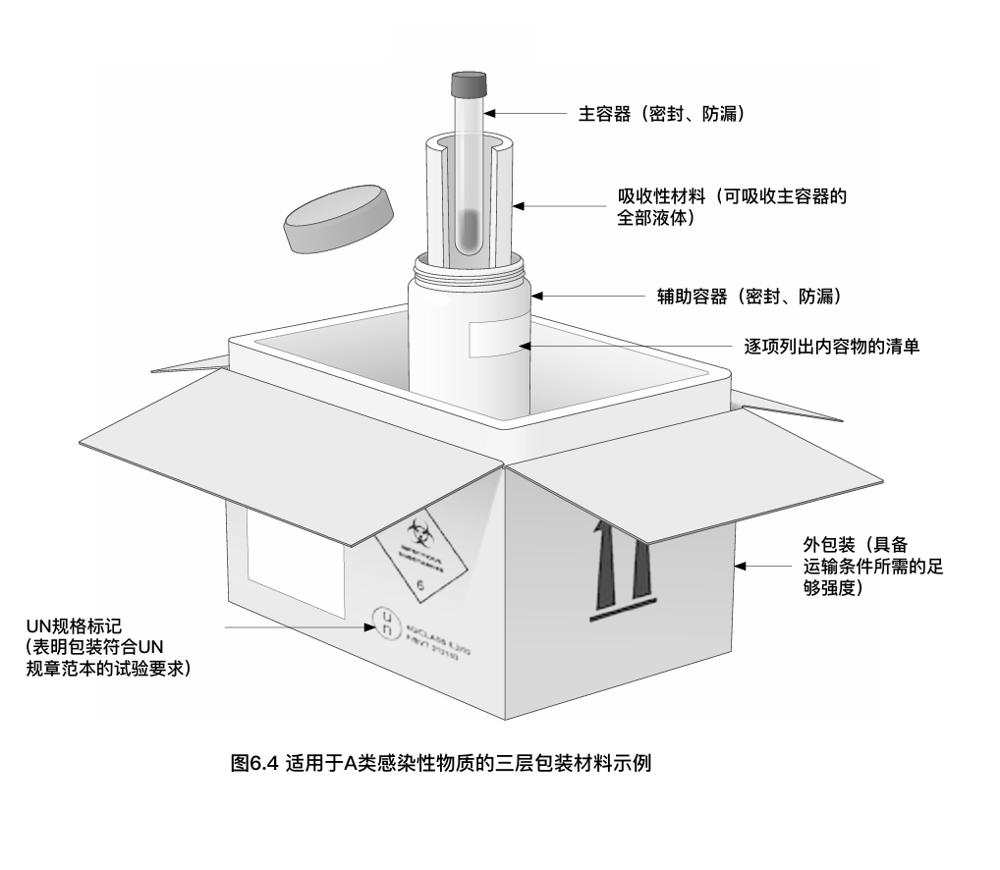

---
# 同时设置标题名称和顺序，order 越小越靠前，默认为 0
title: 《WHO生物安全手册-第四版》
order: 4

# 同时设置导航名称和顺序，order 越小越靠前，默认为 0
nav:
  title: 海外文件
  order:  5
---
# 实验室生物安全手册——第四版
## 致谢

### 首席协调员

KazunobuKojima博士，世界卫生组织，瑞士

### 科学贡献者

Allan Bennett先生，英国公共卫生署（世界卫生组织应用生物安全和培训合作中心），大不列颠及北爱尔兰联合王国

Stuart Blacksell教授，牛津大学/马希敦-牛津热带医学研究处，泰国

Marianne Heisz 女士，加拿大公共卫生署（世界卫生组织生物安全和生物安全保障合作中心）

Catherine Makison Booth博士，英国健康与安全执行局，大不列颠及北爱尔兰联合王国

Michelle McKinney女士，美国疾病预防控制中心（世界卫生组织生物安全和生物安全保障合作中心）；美国国立卫生研究院

Kathrin Summermatter博士，瑞士伯尔尼大学传染病研究所

### 项目管理

Lisa Stevens女士，世界卫生组织，法国

Rica Zinsky女士，世界卫生组织，瑞士

### 审核人——个人

Amadou AlphaSall博士，达喀尔巴斯德，塞内加尔

William Ampofo博士，加纳大学野口纪念医学研究所

ÅsaSzekely Björndal博士，瑞典公共卫生局

Christina Carlson博士，世界卫生组织，瑞士；美国疾病预防控制中心（世界卫生组织生物安全和生物安全保障合作中心）

Mike Catton博士，澳大利亚得·多尔蒂感染和免疫研究所，彼维多利亚感染性疾病参比实验室

Sébastien Bruno Francois Cognat博士，世界卫生组织，法国

Clarissa Damaso博士，里约热内卢联邦大学，巴西

FrancoisDiaz博士，世界动物健康组织，法国

Maureen Ellis女士，生物安全协会国际联合会，加拿大
David Franz博士，美国
Isabel Hunger-Glaser博士，瑞士生物安全专家委员会

Kevin Karem博士，美国疾病预防控制中心（世界卫生组织生物安全和生物安全保障合作中心）

Paul Meechan博士，美国疾病预防控制中心（世界卫生组织生物安全和生物安全保障合作中心）

Masayuki Saijo博士，日本国立感染症研究所

Rosemary Sang博士，肯尼亚医学研究所

Christina Scheel博士，美国疾病预防控制中心（世界卫生组织生物安全和生物安全保障合作中心）

Andrew Thompson先生，牛津大学，大不列颠及北爱尔兰联合王国

### 审核人——组织/协会/社会团体/政府部门

#### WHO内部
非洲地区办公室——Mamoudou Harouna Djingarey,Yahaya Ali Ahmed,Tieble Traore,Sheick Oumar Coulibaly,Belinda Louise Herring

美洲地区办公室——Jean-Marc Gabastou

东南亚地区办公室——Aparna SinghShah,Francis Yesurajan Inbanathan

欧洲地区办公室——Joanna Zwetyenga,Caroline Sarah Brown,Eugene Victor Saxentoff

东地中海地区办公室——Frank Konings,Amal Barakat,Amany Ghoniem,Humayun Asghar和Tarek Al-Sanoury,Heba Abdulridha,Rhizlane Selka

西太平洋地区办公室——VarjaGrabovac,OrlaCondell,Pakapak Ketmayoon,Karen Nahapetyan

WHO抗生素耐药办——Carmem Lucia Pessoada Silva

WHO应急预案处——Jaouad Mahjour

WHO新发和危险病原实验室网络办——Pierre Formenty

WHO食品安全、动物源性和食源性疾病办——Jorge Raul Matheu Alvarez,Amina Benyahia Chaieb,Kazuaki Miyagishima

WHO全球暴发预警和反应网——Patrick Anthony Drury

WHO全球感染性威胁预案部——Sylvie Briand,Tim Nguyen,Matthew Lim

WHO全球流感项目办——Magdi Samaan,Wenqing Zhang,Terry Gail Besselaar,Sandra Jackson

WHO全球疟疾项目办——Andrea Bosman,JaneA.Cunningham

WHO全球结核病项目办——Christopher Gilpin,Karin Weyer

WHO卫生体系和创新办——Ivana Knezevic,Tiequn Zhou,Hye-na Kang,Francis Gabriel Moussy

WHO艾滋病办——Meg Doherty,Lara Vojnov,Silvia Bertagnolio

WHO免疫、疫苗和生物学办——Mick Mulders,Fatima Serhan,Deepa Sharma,Varja Grabovac

WHO实验室网络办——MarkPerkins,KarinvonEije,MariavanKerkhove

WHO脊灰消除办——Daphne Moffett,Nicoletta Claudia Previsani,Ousmane(Madiagne) Diop,Harpal Singh

WHO公共卫生实验室强化办——Virginie Dolmazon, Céline Marie Joséphine Barnadas, José Guerra, Christopher John Oxenford,Evelyne Chaignat Wyssen,Lisa Louise Carter

WHO监管和资格预审办——Irena Prat,Mark Lanigan,Anita Sands

WHO研发蓝图–Vaseeharan Sathiyamoorthy

#### 外部

阿富汗生物安全协会、非洲实验室医学学会、美国生物安全协会,美国微生物学会,阿根廷生物安全委员会,国际生物安全和生物安全保障协会,科特迪瓦（捷克）生物安全保障协会,孟加拉生物安全和生物安全保障协会,肯尼亚生物风险管理协会,中亚和高加索地区生物安全协会,加勒比海公共卫生局,全球卫生保障中心——查塔姆研究所,欧盟,欧洲疾病预防控制中心,欧洲临床微生物和感染性疾病学会,联合国粮农组织,格鲁吉亚生物安全协会,全球健康保障议程——行动包预案3,希腊生物安全学会,印度医学研究理事会,墨西哥流行病学诊断与参比研究所（WHO实验室安全合作中心）,国际原子能局,国际生物安全和生物安全保障协调专家组,国际生物安全协会联盟,国际感染性疾病学会,国际微生物学会联合会,拉丁美洲微生物协会,马来西亚生物安全和生物安全保障协会,马尼帕尔大学高等教育学院（“卓越学院”视作大学）,墨西哥生物安全协会,摩洛哥生物安全协会,美国国立卫生研究院,荷兰遗传修饰委员会,荷兰国立公共卫生和环境研究所,巴基斯坦生物安全协会,葡萄牙实验室生物安全网络,西班牙生物安全协会,瑞典生物安全网络,美国健康和人类服务部,美国疾病预防控制中心（WHO生物安全和生物安全保障合作中心）——制剂和毒素探寻部,美国疾病预防控制中心（WHO生物安全和生物安全保障合作中心）——全球健康、实验室科学,世界动物健康组织。

### 技术编辑

Fiona Curlet女士
### 经费支持

本文件的编写和出版得到了加拿大全球事务部全球伙伴计划、美国国务院生物安全保障合约项目和美国国防部国防威胁降低局的经费支持。

## 术语表
可接受风险：考虑到计划开展活动的预期收益，可接受的、不影响工作继续进行的风险。

事故：导致实际伤害的意外事件，如感染、疾病、人身伤害或环境污染。

气溶胶：悬浮在空气中的液体或固体微粒，可被吸入下呼吸道（直径通常小于10微米）。

气溶胶/空气传播：因吸入气溶胶引起的感染传播。

产生气溶胶的操作：任何有意或无意使液体或固体微粒悬浮在空气中生成气溶胶的操作。

无菌技术：为有效防止污染而设计的条件和程序性措施。

生物因子：自然产生或经过基因修饰的微生物、病毒、生物毒素、感染性微粒或材料，可能对人类、动物或植物造成感染、过敏、中毒等危险。

生物安全柜（BSC）：为保护实验人员、实验室环境和/或实验材料而设计的外部封闭、内部通风的工作空间，空间内存在气溶胶危险。安全柜通过将特定工作区与其他实验室区域分隔开，和/或采用气流定向控制机制起到防护作用。排出的空气经过高效空气过滤器（HEPA）后再循环到实验室或进入建筑物的供暖、通风和空调系统。生物安全柜可分为不同的级别（I、II和III级)，提供不同级别的防护。

生物安全：为防止意外暴露于生物因子或防止其意外泄露而实施的防护原则、技术和实践。

生物安全委员会：作为独立的生物安全问题审查小组而成立的机构委员会，对高级管理层负责。生物安全委员会的成员构成应体现该组织覆盖的不同职业领域和科学专长。

生物安全官：指定监督机构或组织的生物安全（可能包括生物安全保障）工作的人员。履行这一职能的人员也可称为生物安全专员、生物安全顾问、生物安全主管、生物安全协调员或生物安全管理顾问。

生物安全规划管理：在机构层面，利用各种信息，包括机构政策、实践和流程指导文件、规划文件（培训、招聘、应急/事故响应）和记录材料（人员、物品清单、事故管理），制定、实施和监督生物安全工作。

生物安全保障：为保护、控制生物材料和/或相关设备、技能及数据，并落实相关责任而实施的原则、技术和操作。生物安全保障的目的是防止未经授权的接触、丢失、盗窃、滥用、转移或泄露。

校准：确立仪器测量值和已知标准值之间的关系，通过校正提高测量值的准确性。例如，移液器等实验室设备需要定期校准，以确保其性能正常。

认证：基于系统评估的正式文件，由第三方机构提供的某系统、人员或设备符合特定要求（如某特定标准）的证明。

操作规范（行为规范、伦理规范）：非立法规定的行为指南和操作标准，因被一个或多个组织和/或个人视为最佳实践而自愿采用。

传染性：生物因子通过直接或间接方式从一个人或动物传到另一个人或动物的能力。通常与称作“基本再生数（R0）”的流行病学指标相关，也可以用R0代表传染性。R0是指在全体易感的人群中，某感染个体所造成的继发感染的平均数。

（实验室事件的）后果：实验室操作过程中发生事件（暴露于生物因子和/或生物因子泄露)所造成的不同程度的损害结果。后果可能包括实验室相关感染、其他疾病或身体伤害、环境污染或生物因子的无症状携带。

防护：物理设计参数与操作实践相结合，保护人员、工作环境和社区免于生物因子暴露。术语“生物防护”也用于此语境中。

核心要求：世界卫生组织（WHO）《实验室生物安全手册》第四版中规定的一组最低要求，介绍了各种风险控制措施的组合。这些措施既是实验室生物安全的基础，也是其不可或缺的组成部分。它们反映了生物安全方面的国际标准和最佳实践，对于安全使用生物因子是十分必要的，即使在相关风险很小时也是必需的。

清除污染：通过化学和/或物理手段，将环境表面或物体上的活性生物因子或其他有害物质减少到预定水平。

消毒剂：能够消除物体表面或废液中的活性生物因子的制剂。由于消毒剂的性质、浓度、保质期以及消毒时间不同，其效果也不相同。

消毒：为进一步安全处理或使用，清除物体或环境表面的活性生物因子的过程。

飞沫：一种悬浮微粒，通常定义为直径超过10微米，容易从空气中沉降，从而导致附近物体表面污染。

两用物项：某些材料、信息和技术是有益的，但可能因不当使用而造成伤害。

应急/事件响应：处理突发或意外情况时（包括暴露于生物因子或生物因子泄露），需遵守的行为、操作程序和处理流程的总和。应急/事件响应的目的是防止感染或伤害，减少对设备或环境的损害，加快恢复正常运行。

地方病：一种在特定地区或人群中自然发生的疾病。

工程控制：在实验室或实验室设备的设计中内置的进行危险防护的风险控制措施。生物安全柜（BSC）和隔离器都是工程控制的形式，其作用是尽量减少生物因子暴露和/或意外泄漏的风险。

输入性疾病：一种通常不发生在特定地区的疾病，常从另一地区传入。也可以称为非地方性疾病。

暴露：个体靠近或接触生物因子并可能导致感染或伤害的事件。暴露途径可包括吸入、摄入、经伤口侵入和皮肤吸收，具体途径通常取决于生物因子的特性。然而，一些感染途径是实验室环境所特有的，在一般社区里并不常见。

良好的微生物学操作和程序（GMPP）：基本的实验室操作规范，适用于与生物因子相关的所有类型的实验室活动，包括在实验室需始终遵守的常规操作和无菌技术。该规范旨在保护实验室人员和社区免受感染、防止环境污染以及保护工作中所使用的设备及材料。

危险：可能对暴露其中的生物体、系统或（亚）人群造成不利影响的物体或情况。在实验室生物安全方面，危险的定义为可能对工作人员和/或人类、动物、广大社区和环境造成不利影响的生物因子。只有在考量危险造成损害的可能性及后果时，危险才能成为“风险”。

强化控制措施：世界卫生组织《实验室生物安全手册》中描述的一系列风险控制措施。如果风险评估结果表明正在处理的生物因子和/或将要用其进行的活动存在某种风险，而仅依靠核心要求不能将风险控制在可接受范围内，则可能需要在实验设施中采取这些措施。

灭活：通过破坏、抑制增殖或抑制酶活性来去除生物因子的活性。

事件：导致或可能导致实验室人员暴露于生物因子或生物因子泄漏到环境中的事件，该事件并不一定会造成实际的伤害。

感染剂量：引起宿主感染所需的生物因子的量，以生物体的数量表示。通常被定义为ID50，该剂量可导致50%的暴露个体感染。

感染性物质：运输中使用的术语，指任何含有能够导致人类和/或动物感染的生物因子的固体或液体材料。感染性物质可包括患者标本、生物培养物、医学或临床废弃物、或者生物制品（如疫苗）。

初始风险：在未采取风险控制措施的情况下，与实验室活动或程序相关的风险。

实验室相关感染：任何由于在实验室活动中暴露于生物因子而导致的或合理推定因此而导致的感染。事故后发生的人际传播可产生关联的二代病例。实验室相关感染也被称为实验室获得性感染。

（实验室事件发生的）可能性：指在实验室工作过程中事件（即暴露于生物因子和/或生物因子的泄露）发生的概率。

最高防护措施：世界卫生组织《实验室生物安全手册》第四版中描述的一组极为严格和详细的风险控制措施。在实验室工作中，如果风险评估显示将要进行的实验活动对实验室人员、广大社区和/或环境构成极高的风险，则有必要采取极高的保护措施。某些类型的生物因子的暴露或释放会引起灾难性的后果，尤其需要采取这些防护措施。

大健康：多部门交流与合作，共同设计和实施相关方案、政策、立法和研究，以取得更好的公共卫生成果的工作。与大健康尤其相关的工作领域包括食品安全、人畜共患病控制和遏制抗生素耐药。

病原体：能够引起人类、动物或植物疾病的生物因子。

个人防护装备（PPE）：工作人员穿戴的设备和/或服装，是防护生物因子的屏障，将暴露的可能性降至最低。PPE包括但不限于实验服、隔离衣、连体服、手套、防护鞋、安全眼镜、防护眼罩、普通口罩和防护口罩。

基本防护装置（设备）：指一个封闭的工作空间，在有气溶胶危险的活动中，为操作人员、实验室环境和/或实验材料提供保护。该装置通过将特定工作区与其他实验室区域分隔开，和/或气流定向控制机制起到防护作用。基本防护装置包括生物安全柜(BSCs)、隔离器、局部排气通风系统和通风工作空间。

繁殖：有目的地增加或扩增生物因子数量的行为。

预防性治疗：对可能发生的感染给予治疗，以预防感染或减轻感染的严重程度。在发生暴露之前或暴露后症状未出现时实施。

冗余：系统或部分系统的备份，在主系统出现故障时提供保护。例如，使用一系列的高效空气过滤器（HEPA），以防止实验室空气在排到室外的过程中，一个或多个过滤器出现故障。

剩余风险：实施精心选择的风险控制措施后，仍然存在的风险。如果剩余风险不可接受，则有必要采取额外的风险控制措施或停止实验室活动。

风险：事件发生的可能性及其造成危害（后果）的严重程度的组合。

风险评估：一个系统的过程，包括收集信息、评估工作场所有害物质暴露或释放的可能性及后果，并确定适当的风险控制措施以将风险降低到可接受的程度。

风险沟通：关于风险的系统的、交互式的信息和观点交换过程，参与者包括不同类型的所有相关人员，必要时还包括社区领导和官员。风险沟通是风险评估中必不可少、持续进行的环节，有助于清晰的了解风险评估的过程和结果，目的是为了正确的实施风险控制措施。风险沟通的决策，包括存在哪些风险、谁有风险以及如何控制风险，也应是整体风险沟通策略的重要组成部分。

风险控制措施：采取多种方法，包括沟通、评估、培训、以及物理和操作上的控制，使事故/事件发生的风险降低到可接受的水平。周期性风险评估决定了控制风险应采取的策略以及所需的风险控制措施的具体类型。

风险评价：是风险评估的一部分，指在预先确定的一系列条件下（如特定的实验室程序），权衡暴露于危险的可能性和潜在危险的严重程度。风险评价的目标是确定所评估的风险是否可接受，或者是否应采取进一步有针对性的控制措施预防或降低风险。

安全文化：由共同工作的个人和组织在开放和彼此信任的氛围中逐渐培养和发展出的一套价值观、信念和行为模式（无论在适用的操作守则和/或法规中是否有相关规定）。安全文化可以支持和强化实验室生物安全的最佳实践。

锐器：任何具有尖锐末端或边缘、能引起刺伤或划伤的物体或器具。在实验室里，锐器包括针头、带针头的注射器、刀片、手术刀或碎玻璃。

标准操作规程（SOPs）：一套有充分记录的、已确证的步骤说明，介绍如何按照机构政策、最佳实践和所适用的国际国内法规，以一种安全、及时、可靠的方式实施实验室操作和相关流程。

无菌：完全没有活性生物因子和孢子的状态。

灭菌：杀死和/或去除包括孢子在内的所有生物因子的过程。

传播：生物因子直接或间接地通过气溶胶、飞沫、体液、载体、水/食物或其他被污染的物品，从物体到生物体或在生物体之间转移。

确认：系统的书面确认，即满足规定要求足以确保预期结果。例如，为了证明一种材料已去污，实验室人员必须根据化学、物理或生物指标的检测限，测量残余的生物因子，以验证去污方法的稳定性和有效性。

验证：确认某一事物（产品、过程或体系）满足具体的规定要求。例如，应定期核实高压灭菌器的性能符合制造商的规定标准。

人畜共患疾病（人畜共患病）：人和动物之间自然传播的传染性疾病。

## 前言
《世界卫生组织（WHO）实验室生物安全手册》第一版于1983年出版。该手册鼓励各国接受并采用生物安全领域的基本概念，制定国家级的业务法规，使管辖区域内的实验室能够安全的处理致病性生物因子。从那时起，已经有许多国家利用该手册提供的专家指导，制定此类法规。第二版和第三版的《实验室生物安全手册》分别于1993年和2004年出版。在每一次版本更新中，WHO都通过阐述新出现的问题、技术和挑战以及提供最佳实践的指导，持续发挥其在国际生物安全领域的引领作用。

该手册此前的版本介绍了如何通过风险/危害级别以及生物安全/防护水平对生物因子和实验室进行分类。虽然这是处理和防护生物因子的一个逻辑起点，但也导致了一种误解，即生物因子的风险级别直接对应实验室的生物安全水平。事实上，特定情况下的实际风险不仅受到正在处理的因子的影响，还受到正在执行的程序和相关实验人员能力的影响。

第四版手册建立在第三版引入的风险评估框架之上。对风险进行彻底、循证、透明的评估，可以以个案为基础，使安全措施与使用生物因子的实际风险达到平衡。这样，各国就可以根据自身条件和优先次序，实施经济上可行且可持续的实验室生物安全和生物安全保障政策及实践。

## 第1节：简介
实验室生物安全和生物安全保障活动，是保护实验室工作人员和广大社区免遭由意外暴露或致病生物因子泄露带来的危害的根本措施。这些活动通过风险评估框架和建设安全文化来实施，目的是采取充分的措施使任何潜在的暴露于生物因子的可能性及暴露后的损害程度降到最低，以确保工作区域的安全。世界卫生组织（WHO）《实验室生物安全手册》早前版本(1-3)问世后，相关领域内的生物安全意识和专业知识有了很大的发展和提高，新技术如分子学方法的使用也已经取得了相当大的进步，减少了需要繁殖高滴度生物因子的诊断活动的数量。

对最近发生的实验室相关感染的回顾分析显示，其中大多数是人为因素导致的，而不是工程控制方面的问题(4,5)。导致潜在和已确认的生物因子暴露的因素包括，未使用个体防护装备（PPE）或防护装备使用不当(6,7)、忽视风险评估或评估不充分(8)、缺乏标准操作规程（SOPs）(9)、针刺伤(10,11)和/或人员培训不到位(12)。因此可以说，如果实验室的员工不称职，实验室的设计再优秀、工程再完善也无济于事。

更新国际实验室生物安全指导文件是生物安全全球化倡议的组成部分，重视在拥有广泛的金融、技术和监管资源的国家可以推行的原则和方法。世卫组织于2005年修订了《国际卫生条例》，帮助国际社会预防和应对可能跨境并威胁全球健康的紧急公共卫生风险(13)。条例要求所有196个世卫组织缔约国为潜在的疫情暴发和新发疾病做好充分准备，包括进行实验室早期诊断和确认以促进感染的预防和控制。生物安全和生物安全保障也是《国际卫生条例》的监测和评估框架应用的技术领域。这些都表明了安全可靠的实验室操作是遵守《国际卫生条例》和预防紧急公共卫生威胁的重要组成部分。本版手册旨为生物安全的可持续发展提供指导，内容包括国家监管系统、培训、最佳实践和风险评估框架，以及建立遵守《国际卫生条例》和促进国家能力建设的可靠的安全文化。

### 1.1预期适用范围

为确保实验室设施、安全设备和工作实践适合本地情况、与之相称且可持续，第四版世卫组织《实验室生物安全手册》（LBM4）采取了以生物安全风险和循证为基础的方法，而不是已规定好的方法。此外，手册强调“安全文化”的重要性，包括风险评估、良好的微生物学操作和程序（GMPP）及标准操作规程（SOPs），为人员进行适当的基础培训、进修和指导性培训，及时报告事件和事故，并进行适当的调查和纠错。这种新方法旨在促进实验室设计，使其在保持生物安全控制的同时，具有更高的可持续性。对于兽医学实验室来说，这种基于风险的方法，是最近修订的世界动物健康组织（OIE）关于兽医学实验室和动物设施中生物风险管理标准(14)的有益补充。第四版手册提供了基于风险、技术中立且具有成本效益的方法以确保生物安全，对资源有限的设施也提出了可行的实验室操作的指导。这种方法为全球各地公平的使用临床和公共卫生实验室检测奠定了基础，并且在不影响安全的前提下，增加了生物医学研究的机会，而这在抗击传染病暴发方面的作用已变得日益重要。

该手册还概述了生物安全保障的内容，该主题在另一份世卫组织指导文件(15)中有详细说明。手册中不包含动物病原体的信息，除非其可导致人畜共患病。动物病原体相关资料应参考管理兽医学实验室和动物设施生物风险的OIE标准(14)。

本出版物专门为在工作中接触生物因子的人员，或可能暴露于危害人类健康的潜在感染性物质的设施中的人员提供指导。本手册有助于促进在日常实验室操作和程序中建立安全文化。对建设或更新实验室设施的机构、制定或实施生物安全方案及国家级生物安全监督框架的国家，也有一定价值。

本手册的主要内容是实验室生物安全，包括管理、处理和防护对人类健康构成威胁的生物因子和材料。需要注意的是，对以下风险也应进行评估，包括1）与对植物、动物和/或环境有害的生物因子和材料有关2）与生物因子和材料无关的健康和安全风险因素，因为它们也存在于实验室环境中。LBM4中描述的以风险和询证为基础的生物因子和材料的生物安全和生物安全保障方法，也可应用于非生物危害的风险管理，如化学品、物理危害、不良人体工程学环境、过敏原、广泛的社会心理因素（如工作压力）以及对动物或环境构成实际或潜在威胁的生物危害（如携带绝育基因的节肢动物载体、对地方病或流行性生物因子更加敏感的转基因实验动物）。

LBM4中概述的指导材料的广泛应用，可以提供全面、综合的实验室生物安全和生物安全保障方法，促进实验室对生物因子和材料的负责任的使用。应参考相关指导文件和国际最佳实践(16)，以获得该领域的更多信息。

### 1.2如何使用实验室生物安全手册

本手册应作为国家现行规定和监管机制的补充，并用于地方的风险评估、控制和审查。因此，本材料涵盖如下领域：

- 风险评估、控制和审查，

- 生物安全的核心要求，

- 强化控制措施的选择，

- 高风险操作的最高防护措施，

- 感染性物质的转移和运输，

- 生物安全规划管理，

- 实验室生物安全

- 国际和国内生物安全监督

相关的专论也已经出版，这些材料提供了更详细的信息，有助于实施特定专题下的体系和策略。希望读者首先阅读本核心文件，需要更详细的信息时，可参考相关专论。这些专论包括：

- 生物安全规划管理(17)

- 风险评估(18)

- 生物安全柜和其他基本防护装置(19)

- 个体防护装备(20)

- 实验室设计和维护(21)

- 清除污染和废弃物管理(22)

- 暴发疫情准备与应对(23)

## 第2节：风险评估
如下所述，生物风险的控制，无论是在国家还是机构层面，都是通过实施风险评估获取信息的。风险评估这一术语用于描述一个分步实施的过程，包括评估工作中的危害造成的风险，并根据评估结果决定是否可以采取风险控制措施使风险降至可接受水平。风险是由危害引起伤害的概率以及损害的严重程度构成的组合。

在实验室生物安全中，危害就是指生物因子，其致病特性使其有可能对暴露的人类或动物造成伤害。暴露于生物因子所造成的伤害性质各不相同，可以造成个体感染、损伤或疾病，也可以导致人群中的疫情暴发（见框2.1）。.

| 框2.1                                                        |
| ------------------------------------------------------------ |
| 在实验室生物安全中，可能性是指暴露于生物因子和/或生物因子向实验室外泄漏的 可能性。后果指如果发生暴露，其结果的严重程度。包括实验室相关感染、无症状携 带、环境污染、疾病在周围社区传播、以及其他疾病或伤害。  因此，评估暴露或泄漏的结果时，导致感染发生的因素如传播途径、感染剂量和传染 性均需纳入考量。 |

值得注意的是，危害本身并不会对人类或动物构成风险。例如，一小瓶含有生物因子（如埃博拉病毒）的血液在实验室人员接触瓶中的血液之前不会对其造成风险。因此，与生物因子相关的真正风险不能仅通过确认其致病性来确定，还必须考虑到采用该生物因子进行操作的实验类型以及在何种环境下进行操作。为了保证工作人员和周围社区的安全，任何处理生物因子的机构都有义务对将要进行的工作进行风险评估，选择和应用合适的风险控制措施以将风险降低到可接受的水平。风险评估的目的是收集和评估信息，用这些信息证明是否需要相应的程序、流程和技术以控制存在的风险。对这些信息的分析可以提高实验室人员的能力，使他们对生物风险及其影响方式有更深入的了解。同时，还有助于创造共同的价值观、行为模式和安全意识，使实验室人员更有可能安全的开展工作，维护实验室的安全文化。

风险评估必须始终以标准化、系统化的方式进行，以确保它们在相同的情境下的可重复性 和可比性。因此，很多组织都提供了风险评估模板、检查清单或调查问卷，有步骤的识 别、评估和确定与现有危害相关的风险，随后，利用这些信息确定适当的风险控制措施 (24,25)。风险评估过程中的各种步骤构成了风险评估框架（图2.1）

图2.1说明了风险评估框架的步骤，而表2.1概述了评估周期的每个步骤中应考虑的主要问题。值得注意的是，并非所有因素都会以同样的方式影响相关风险，应认真考虑每个因素的作用。在进行风险评估时，必须记住风险不仅仅取决于生物因子的致病性，还取决于事件发生的可能性和后果——换言之，即在实验室操作过程中暴露于生物因子和/或生物因子泄漏的风险。

| 表2.1                    |                                                              |
| ------------------------ | ------------------------------------------------------------ |
| 1.收集信息（危害识别）   | 将要处理哪些生物因子？其致病特征是什么？  将要进行何种类型的实验室工作和/或程序？ 使用何种类型的设备？  具备何种类型的实验室设施？ 人员因素（例如人员的能力水平如何）？ 还有哪些其他因素可能会影响实验室操作（例如法律、文化、社会经 济、公众观念）？ |
| 2. 评估风险              | 暴露和/或泄漏是如何发生的？  n暴露和/或泄漏的可能性有多大？  n收集到的哪些信息对以上可能性的影响最大？  n暴露和/或泄漏的后果是什么？  n哪些信息/因素对后果的影响最大？  n活动的总初始风险有多大？  n什么是可接受风险？  n哪些风险是不可接受的？  n不可接受的风险是否可控，还是工作根本不应该继续？ |
| 3.制定风险控制策略       | 实施风险控制措施可利用的资源有哪些？ 哪些风险控制策略最适用于现有资源？ 是否有足够的资源确保获取并维持这些风险控制措施？ 在本地条件下，建议的控制策略是否可以实现、是否有效和可持续？ |
| 4.选择并实施风险控制措施 | 是否有任何国际国内法规要求实施规定的风险控制措施？ 当地有哪些可持续的风险控制措施？ 现有的风险控制措施是否足够有效，是否应联合采用多种风险控制措施 以提高有效性？ 选定的风险控制措施是否与风险控制策略一致？ 采取风险控制措施实施后的剩余风险是什么？目前的剩余风险是否可接受？ 是否需要、是否具备额外的资源以实施风险控制措施？ 选定的风险控制措施是否符合国际国内法规？ 工作是否已获得批准？ 风险控制策略是否已传达给相关人员？ 必要物品是否已纳入预算且已经购入？ 相关操作和维护程序是否已到位？ 工作人员是否已接受过适当的培训？ |
| 5.审查风险和风险控制措施 | 相关活动、生物因子、人员、设备或设施是否有任何变化？  是否有关于生物因子和/或相关过程的新知识？  从事件报告和事后调查中是否能够得到任何经验教训？是否需要据此进 行改进？ 是否确立了定期审查制度？ |

应该注意的是，世界各地的实验室都可能会遇到一些独特的挑战，这些挑战会影响风险评估框架内各个部分的实施方式。相关挑战包括：生物风险管理的组织水平和财力资源、缺乏可靠的电力供应、基础设施不足、恶劣天气、实验室人员配备不足和培训不足。此外，在高于实验室管理的层面，国家监管框架的状态也会影响风险识别和控制的方式，而遵守国家法规是重中之重。由于这些原因，风险评估的结果和所采取的风险控制措施在不同实验室、不同机构、不同地区以及不同国家之间会出现很大的差异。

以下各小节更详细的介绍了风险评估框架中每个步骤的活动，概述了风险评估最主要的组成部分和实施评估的关键考量。其他考虑事项和相关模板的详细信息，请参见《专论：风险评估》(18)。

### 2.1信息收集

进行风险评估的人必须收集和考虑各种不同的信息，以准确评估风险，并选择适当的风险控制措施，将实验室风险降低到可接受的水平。这些信息不仅包括识别所使用的生物因子的危害，还要考虑导致总体风险增加的程序和背景情况(26)。需收集的主要信息包括：

- 计划进行的实验室活动（例如程序、设备、动物实验、超声处理、气溶胶化和离心处理），

- 工作人员的能力，

- 即将用于操作的生物因子和潜在感染性物质的浓度和量，

- 潜在的传播途径，

- 生物因子的感染剂量，

- 生物因子的传染性，

- 生物因子感染的严重程度，

- 当地提供有效的预防性治疗或治疗措施的能力，

- 生物因子在实验室和外界环境中的稳定性，

- 实验室人员（如高危个体）的易感性，

- （具有人畜共患可能性的）生物因子的宿主范围，

- 生物因子在当地人群中的流行情况，

- 设备和建筑物（例如电力、建筑的基础设施及相关系统）的故障频率。

所有上述信息均提示需要对实验室中可能存在的风险进行更广泛的、多因素评估。所有与这些因素相关的信息都是很重要的，因为生物因子和相关活动的不同组合在某些情况下可能会比其他情况造成更大的风险。例如，培养一种经气溶胶传播的低感染剂量的生物因子，比培养一种仅能经口传播的高感染剂量的生物因子更加危险。又或者，在未流行某种生物因子的地区开展研究，比在其流行地研究具有更大的风险。

要记住，收集信息时还应说明实验室的环境特征，如将要开展工作的建筑物和实验区域的情况，这一点很重要。维护不当的建筑结构因功能（如废弃物处理或通风系统功能）受损或故障的可能性增高，可能会增加相关风险。地板和工作台面的裂缝会使实验室表面难以消毒，且可能导致滑倒、绊倒、跌倒和含有生物因子的物品掉落。

最后，还应考虑人为因素的信息，因为实验室人员的技能及其遵守既定的生物安全操作和程序（特别是GMPP）的能力，会对事件发生的可能性产生最重要的影响。即使是设计和建造最优的设施，或者是最精密的设备，也只有在使用者经过适当的培训和不断练习达到熟练之后，进行正确的操作，才能保证其安全。

#### 2.1.1关于新的或未知的生物因子的信息

在使用新的生物因子，或者标本的详细资料未知时，根据现有信息可能不足以进行全面的风险评估。在现场进行可能的疫情爆发调查时收集的临床标本即符合此种情况。在这种情况下，明智的做法是谨慎操作标本，把所有材料当作潜在的感染性物质处理。关于在疫情暴发时生物安全的更多信息，请参见《专论：暴发疫情准备和应对》(23)。

如有可能，应要求提供某些信息，以确定处理此类标本的相关风险，包括：

- 采集标本的患者的医疗数据，

- 流行病学数据（疾病严重程度和死亡率、疑似传播途径、其他暴发调查数据），

- 该标本的地理来源的信息。

如果发生病因不明的疾病暴发，可由WHO和/或有能力的国家主管部门制定并发布适宜的临时指南，说明如何安全处理标本。内容可包括标本如何运输，以及应实施的具体风险控制措施。

### 2.2风险评价

收集了关于即将开展的工作的所有可用信息后，需要使用这些信息来识别和评价现有风险。风险评价步骤的目标是：

- 确定暴露于生物因子和/或生物因子泄漏的可能性，确定此类事件的后果的严重程度，

- 确定以上可能性和后果对即将开展的工作的初始风险的影响，

- 根据收集到的风险评估信息，决定相关风险是否可接受；该决定必须经过论证并有完整记录。

如果风险评价为不可接受，则评估者应进入风险评估框架的第3步，制定适宜的风险控制策略，除非决定不开展这项工作。以下各小节概述了在此风险评价步骤中需考虑的主要事项。

#### 2.2.1确定可能性和后果

对收集到的信息进行评价应首先确定暴露于生物因子和/或生物因子泄漏的可能性、以及相关后果的严重程度。在进行综合考虑时，正是这些因素最终决定了现有情况的总体或初始风险。如框2.2所示。

| 框2.2                                                        |
| ------------------------------------------------------------ |
| 香烟烟雾是一种常见的危害。 暴露于香烟烟雾的可能性取决于个体情况。吸烟者本人的可能性最大，暴露于二手烟 者次之，而做好呼吸防护或处于无烟区的人最低。  暴露于香烟烟雾的后果包括轻微的恶心、呼吸道刺激、各种心脏和肺部疾病、癌症甚 至死亡。不同的后果取决于香烟的毒性、吸烟频率、暴露时间以及其他与人类易感性 相关的因素。  在评价与香烟烟雾有关的风险时，可能性和后果均应考虑。这个例子还显示，虽然吸 烟具有潜在的负面后果，但仍然有很多人吸，说明每个人对风险的评价和接受程度是 不同的。本节还概述了关于实验室生物因子操作的类似的风险评估过程，权衡了可能性和结果。 |

在实验室工作中，可增加暴露于生物因子和/或生物因子泄漏的可能性，和/或使后果更加 严重的因素见表2.2至2.4。 
感染剂量低的生物因子的暴露后果更为严重，因为引起实验室相关感染所需的生物因  子的剂量小。而低感染剂量并不影响暴露发生的可能性，这取决于其他与工作相关的因素 （表2.2）。

| 表2.2 影响事件发生可能性的因素                               |                                                              |
| ------------------------------------------------------------ | ------------------------------------------------------------ |
| 与事件发生的高可能性的相关因素                               | 基本原理                                                     |
| 与气溶胶化相关的实验室活动（如超声处理、均质 化、离心等）    | 当这些操作产生气溶胶时，通过吸入导致暴露的可能性会增加，气溶胶泄漏到周围环境的可能性也会增加，这样病原体就可能会污染实验室表面并传播到社区。 |
| 与利器相关的实验室活动                                       | 当实验活动涉及使用利器时，通过刺 穿伤口经皮暴露于生物因子的可能性增加了。 |
| 工作人员能力低                                               | 由于缺乏经验、理解不足或未能遵守 相关SOP和GMPP，不熟练的员工在实验室操作程序和流程中会出现错误， 更可能导致生物因子暴露或泄漏。 清洁和维护人员在靠近生物因子工作之前，必须接受培训。 |
| 环境稳定性高的生物因子                                       | 沉积在实验室表面的生物因子（例 如，技术不佳造成气溶胶或飞沫释放 后沉降所导致的污染）只要在环境中 保持稳定，即使看不到污染，也是意 外暴露的来源。 |
| 电力不足或供应障碍、实验室设施和建筑系统破旧、 设备故障、频繁恶劣天气以及昆虫和啮齿动物进入实 验室造成的损坏。 | 所有这些因素都可能导致用于降低生 物因子暴露和/或泄漏的可能性的生物 防护系统的部分破坏或完全失效。 |
| GMPP=良好的微生物学操作和程序；SOP=标准操作规程              |                                                              |

| 表2.3 事件发生后影响其后果的因素           |                                                              |
| ------------------------------------------ | ------------------------------------------------------------ |
| 与更严重的后果相关的因素（事件发生后）     | 基本原理                                                     |
| 低感染剂量                                 | 要使暴露的个体发生感染，必须存在一定数量 （浓度和量）的生物因子。即使是少量的低感 染剂量生物因子也可能导致实验室相关感染的 严重后果。  而且，暴露于大量病原体（大于感染剂量）可 能会导致更严重的感染表现。 |
| 高传染性                                   | 即使是一次暴露（导致病原携带或实验室相关 感染）也可能迅速由实验室人员或污染物传染 给很多人。 |
| 严重程度高、死亡率高                       | 暴露后的实验室相关感染更有可能导致感染者 的虚弱、生活质量损失或死亡。 |
| 有效的预防性治疗或治疗措施有限             | 实验室相关感染的症状或不良结局不能通过医 疗干预有效地预防、减少或消除。这也包括无 法进行医疗干预或应急反应能力有限的情况。 |
| 大量易感人群（包括面临高风险的实验室人员） | 易感人群数量越大，实验室相关感染就越有可 能迅速传播并感染更多的人。 |
| 非地方性疾病（如输入性疾病）               | 当病原体未在周围人群中流行时，该人群更有 可能对病原体易感，从而使实验室相关感染传 播到社区的可能性增加。 |

| 表2.4 与潜在事件的高可能性和更严重的后果均相关的因素 |                                                              |
| ---------------------------------------------------- | ------------------------------------------------------------ |
| 与潜在事件的高可能性和更严重的后果均 相关的因素      | 基本原理                                                     |
| 高浓度或大量的生物因子                               | 所处理物质中的生物因子越多，可接触的感染性颗粒就越多，暴露量就越有可能达到该因子 的感染剂量。  此外，暴露于更高浓度的病原中可能会导致更严重的感染、疾病或伤害。 |
| 空气传播                                             | 可通过空气传播的生物因子可能能够长时间在气溶胶中停留，并可能在实验室环境中广泛传播，增加工作人员接触该因子的可能。  此外，在暴露事件后，气溶胶化的生物因子可能被吸入并沉积在暴露个体的呼吸道黏膜上， 从而导致实验室相关感染。 |

#### 2.2.2确定初始风险

随后，收集到的信息必须用于确定在特定情况下风险的高低程度（例如风险的可能性和严重程度)。表2.5显示了一个风险评估矩阵，该矩阵是一个简化的示例，用来说明如何通过评估可能性和后果之间的关系，确定暴露于生物因子和/或生物因子泄漏的初始风险。在实际应用中比较二者的关系时，可能需要比表2.5所示更广泛或更复杂的数据来确定可能性和后果，但是在显示初始风险如何随这些独立因素而变化时，这是一个有用的工具。除这里介绍的方法外，还有其他方法可以确定初始风险并确定风险的优先次序，以采取相应的风险控制措施。各机构应采用最能满足自身需求的风险优先策略，同时认识到所选策略的局限性，关键的是要确保在风险优先排序过程中始终保持专业判断。

#### 2.2.3确定可接受的风险

评价了初始风险之后，有必要确定该风险是否可以接受，以使工作继续进行。如果不可接受，则如风险评估框架下一步所述，需要制定相应的风险控制策略，适当降低并可持续地控制这些风险。

重要的是，要承认永远不会有零风险，除非根本不开展工作。所以必须在开展工作和尽可能确保人员和社区安全、不发生生物因子暴露和/或泄漏之间寻求平衡。同样重要的是，认识到实验室正在进行的工作对卫生保健和全球卫生保障都有巨大的益处，因而存在一定程度的风险是合理的。确定可接受风险必须提供一个基准，初始风险必须降至该基准以下，工作才足以安全进行。

需要注意的是，除非根本不开展工作，否则风险永远不可能完全消除。因此，确定初始风险和/或剩余风险是可接受、可控还是不可接受，这是风险评价过程最重要的部分。

除国家立法和政策的规定外(27)，可接受风险必须由组织机构自己决定，以使其与机构的自身情况和资源相适应。必须考虑到组织风险，如合规风险（法律诉讼、罚款、被传唤）、安全保障风险（丢失或被窃）、环境风险（社会经济对社区健康和农业的影响），甚至是感知风险（对风险严重程度的主观判断或不确定性）。应认真对待工作人员的感知风险。还应避免工作人员自行引入风险控制措施。

认真考虑利益相关方（如政府部门、捐助者、审查/监督机构、公众和当地社区）对风险感知，特别是在实际风险很高的地方，这有助于减轻利益相关方的恐惧，否则他们可能会反对（如通过政治或行政手段）实验室发挥其正常功能。

### 2.3制定风险控制策略

一旦确定了可接受风险，就必须制定风险控制策略，将初始风险降低到可接受的程度，以使工作安全进行。如前所述，由于在操作中一般不可能消除风险，因此需要认真选择风险控制策略，根据现有资源对风险进行排序。要认识到获得可接受的低风险需要更多的资源，以实施和维持降低风险所需的风险控制措施。但是，不能在非必要的情况下提高可接受风险，作为增加资源的替代手段，以使现有资源能够满足必要的风险控制策略并提供适当防护。必须提供相关资源，否则不应继续开展工作。

可以采取很多不同策略降低和控制风险。通常，为了有效降低风险，可能需要同时采取多个风险控制策略。表2.6总结了最常见的风险控制策略和风险控制措施的实例。

良好的风险控制策略可以：

- 指出用于降低不可接受风险的控制措施的性质和总体方向，不必规定可采取的风险控制措施的类型,

- 可在当地条件下通过现有资源实现，

- 有助于尽量减少对正在开展的工作的阻碍（如处理利益相关方的感知风险）和确保获得支持（例如获得国际国内监管机构的批准），

- 符合组织的总体目的、目标和使命，促进成功（即加强公共卫生和/或健康保障）。

| 表2.6 降低风险的策略                                         |                                                              |
| ------------------------------------------------------------ | ------------------------------------------------------------ |
| 策略                                                         | 举例                                                         |
| 消除                                                         | 消除危害：  使用灭活的生物因子， 使用无害的替代品。 |
| 降低和替代                                                   | 降低风险： 用减毒或感染性较低的生物因子替代， 减少生物因子的用量/滴度，  改为危险性较小的程序，例如用聚合酶链反应代替培养。 |
| 隔离                                                         | 隔离危害：  有时可能难以降低或消除风险，特别是在临床环境中，因此，需要隔离 生物因子（如隔离在基本防护装置中）。 |
| 保护                                                         | 保护人员/环境：  采取工程控制措施（如BSC），  使用PPE，  为相关人员接种疫苗。 |
| 遵从                                                         | 已实施行政控制和有效的生物安全规划管理，例如：  工作人员遵守GMPP，  关于危害、风险和风险控制措施的良好沟通，  合适的培训，  明确的SOP，  已建立安全文化。 |
| BSC=生物安全柜；GMPP=良好的微生物学操作和程序；PPE=个体防护装备；SOP=标准操作规程 |                                                              |

### 2.4选择并实施风险控制措施

一旦制定了风险控制策略，就必须选择并实施风险控制措施，以实现风险控制策略。在某些情况下，所需风险控制措施的性质是由一套最低风险控制标准（如国际公认的最佳操作、国际国内法规）预先规定的。

然而在另一些情况下，根据所确定的风险的性质、可用资源和其他本地情况，可以采取多种风险控制措施，很好的实现风险控制策略。

必须记住，即使采取了符合策略的风险控制措施，仍然存在一定程度的风险。如果这种被称作剩余风险的风险仍然不可接受，则可能需要采取额外的或更有效的风险控制措施来实现风险控制策略，将风险控制在可接受的水平。通常，初始风险越高，为了将剩余风险降低到可接受水平以继续工作，所需要的风险控制措施的数量就越多。

然而，各种措施的相对有效性，也会影响需要多少风险控制措施以缩小剩余风险和可接受风险之间的差距。此外，联合使用多种风险控制措施降低剩余风险还有益于构建冗余，防止一种或多种选定的风险控制措施失效的情况。

以下各小节概述了为实现风险控制策略而选择和实施风险控制措施时需要考虑的关键因素。

#### 2.4.1选择风险控制措施

在选择实验室风险控制措施时，必须始终首先考虑国家法规和相关指南，以确保符合规定。可以通过检查、认证、审查和评估进行核实，并由国家指定的机构负责监督。

本小节的其余部分主要介绍国家规定的措施（可能有）以外的，实验室层面的风险控制措施的选择。

对大多数实验室活动来说，暴露和/或泄漏的可能性不大，后果从可忽略到中等严重不等。这意味着其初始风险较低或非常低，甚至在实施风险控制措施之前，往往就已经接近或低于可接受风险。国际生物安全指导文件和公认的最佳实践建议采用一套基本的生物安全原则、技术和操作作为风险控制措施，以确保所有工作的风险均低于可接受风险。因此，本手册提供了一套可以在任何处理生物因子的工作中实施的最低限度的风险控制措施。这些风险控制措施的组合统称为核心要求，包括工具、培训和在大多数实验室环境下安全工作所必需的物理性和操作性控制措施。这些要求将在第3节核心要求中作详细介绍。然而，需要注意的是，尽管风险较低，仍然需要推广GMPP，并定期审查实验室活动，以确保GMPP和所有核心要求得到有效实施。

大多数临床和诊断实验室的工作仅需要遵守核心要求就可以有效控制风险。

对初始风险较高的一类情况，除核心要求外，还需要选择额外的风险控制措施。表2.2至2.4显示了与事件发生的可能性和/或严重后果相关的因素实例。在这种情况下，为将剩余风险降低到可接受的水平而选择的额外风险控制措施，被视为强化控制措施。

需要强化控制措施的生物因子和程序可能各不相同，如中等风险的生物因子的少量培养和繁殖，有关耐药菌株的大规模工作，或是风险很高的对经气溶胶传播的人畜共患病原的动物研究。在处理导致暴露和/或泄漏的可能性增加，和/或引发严重后果的具体因素时，应采取适合且相称的强化控制措施；例如，有气溶胶相关风险的程序应采取有效捕获气溶胶的风险控制措施。因此，最合适的强化控制措施会由于正在处理的生物因子、进行的操作程序和潜在传播途径的不同而有很大差异。所有的强化控制措施都有其优缺点，在选择合适的措施时必须认真考虑，以缩小剩余风险和可接受风险之间的差距。

如果风险评价为高风险，则应进行成本效益分析以评估各种可选方案，如将工作外包（交给具有相应风险控制措施和资源的合适的机构)，并对可采取的能够加强实验室设施的强化控制措施进行详细评估。所选的风险控制措施在满足本地的需求时是最为有效的。

值得注意的是，虽然许多国家已经明确制定了风险控制措施的等级结构，但不能据此认为一种风险控制措施始终比另一种更好（如工程控制相对于个体防护装备）。

通常，应根据现有的有效性证据，通过经同行评审的研究或其他可靠的信息源，选择强化控制措施。如无可靠信息，则可能需要对风险控制措施进行内部验证。在可能的情况下，应考虑在采用同行评审的期刊上发表内部验证，以使其他人也能从此类研究的结论中获益，包括了解新信息、既往事件以及风险控制措施的有效性和所提供的保护。这些研究还有助于明确与特定设备或程序相关的暴露的可能性，以便在未来的信息收集活动中纳入这些信息，为风险评估框架的风险评价步骤提供资料。

第4节强化控制措施详细讨论了一些常用措施，包括它们在不同的当地条件下使用时的相对有效性。

在采取强化控制措施时，必须在选择后重新计算剩余风险，估计其是否已经有效地将剩余风险转化为可接受的风险。这就需要用下列问题重新评价剩余风险：

- 暴露/泄漏是否变得不太可能发生？

- 后果是不是变得不那么严重？

- 可能性和后果是否已减弱，剩余风险变得可接受了？

- 如果没有，是否有额外的风险控制措施？

- 在有/无某个风险控制措施时，工作是否可以继续？

- 谁有权决定接受剩余风险并批准工作继续进行？

- 应如何记录所选的风险控制措施和后续的工作批准？

在非常罕见的情况下，暴露和/或泄漏的可能性都会非常高。然而，如果发生了暴露和/或泄漏，更重要的是其导致严重后果的可能性。这类情况包括研究已在全球根除的病原体或传染性极强的动物病原体，这些病原体泄漏后可在易感人群中迅速传播，引起大规模恐慌，造成某些物种的大量个体死亡和/或生计受重创。如果生物因子是在液体培养基中繁殖，尤其是量特别大时，如果产生了感染性气溶胶（如在疫苗的开发研究中），则风险将进一步增加。在这种情况下，暴露和/或泄漏生物因子的初始风险非常高，如果必须开展工作，则需要一套非常专业、高效的风险控制措施，以使风险降低到可接受水平。这包括大量严格和复杂的操作实践、安全设备和设施设计标准，可以称为最高防护措施，在第5节最高防护措施中有更详细的介绍。由于在某些情况下有必要采取最高防护措施来提供最高级别的保护，以防止暴露或泄漏造成的最严重的后果，因此，此时评估有效的实施和维持最高防护措施的可行性，是一项极其重要和必要的工作。这一工作需要频繁而严格的核验相关程序、设备和实验室设施。定期审查还必须包括对正在进行的研究的分析，以确保其开展的理由充分合理，其科学效益超过了生物安全风险。

虽然本手册概述了常用的最高防护措施，但实施最高防护措施所需的专业且复杂的设施及相关专业知识在世界范围内仅有极少数实验室具备。

实施这种复杂的风险控制措施需要经验丰富的国际专家仔细斟酌，还需要包括政府在内的众多部门的协调合作。因此，不可能提供一套具体要求，使其适用于需要最高防护措施的各种情况。

以下示意图（图2.2）总结了表2.5（风险评估矩阵）中列出的风险，并将这些风险与可能需要的风险控制措施类型联系起来。它强调了以下内容：

- 大多数实验室活动可以按照核心要求安全开展，其风险水平为极低或低，

- 一些实验室活动需要采取强化控制措施，以安全控制相关风险，其风险水平是中到高，

- 极少的实验室工作需要采取最高防护措施，因为其风险极高，特别是存在会导致灾难性后果的风险。

#### 2.4.2实施风险控制措施

一旦选择了合适的风险控制措施的组合，就应获得必要的批准。应该对成本、可用资金、安装和维护工作、安全保障和相关安全标准进行适当的检查，以确保风险控制措施能够成为风险控制策略的有效组成部分，且现有实验室资源足以维持这些措施。每个操作实验室设备的人员都必须接受实验室各项风险控制措施所要求的正确操作程序培训，还可能需要编写或更新SOP。应考虑并确保所选择的风险控制措施不会将新的风险引入到工作中。例如，如果使用多层个体防护装备，则可能会由于灵活性降低而增加发生错误的可能性，如果PPE难以移除，又可能增加污染的可能性，这样就增加了暴露的总体风险。此外，还应考虑选定的风险控制措施的非生物性危险因素。例如，家具或设备的专业设计不应给工作人员造成人体工程学问题。

最后，风险控制措施一旦选好、获批和就位，如要使其正确实施和起效，就必须将有关其目的、功能和使用的信息传达给所有相关人员。沟通是生物安全和风险评估的重要组成部分。没有沟通，风险控制措施就不可能减少剩余风险。所有实验室工作人员都有责任遵循适用于他们的风险降低策略的适当操作和程序，并反馈其有效性。为使工作人员能够获得与实施风险控制措施和安全实验室操作相适宜的意识水平、培训和能力，至少需要向他们告知存在的危害（生物因子）、与所执行程序相关的风险，准确的沟通所采取的风险控制措施如何能最有效地降低这些风险。传统的生物安全培训以外的沟通和外展策略包括实验室专用的SOP、团队讨论、工作帮助和海报，以及通过简短的出版物（如小册子和讲义）、简报和电子邮件通知提高一般意识。

表2.7给出了一些实验室活动的基本示例，显示了风险控制措施的应用是如何影响剩余风险的。

**表2.7 实验室活动、初始风险和采取适当风险控制措施后的剩余风险示例**

| 程序                                                  | 初始风险   (可能性/后果） | 风险控制措施                          | 剩余风险 |
| ----------------------------------------------------- | ------------------------- | ------------------------------------- | -------- |
| 灭活痰标本的聚合酶链反应分析                          | 非常低  (不可能/可忽略）  | CR                                    | 非常低   |
| 痰标本涂片制备及镜检                                  | 低（不可能/中度）         | CR                                    | 非常低   |
| 在固体培养基上培养以进 行抗生素敏感性试验             | 中等（可能/中度）         | HCM（如CR加呼吸防护装备）             | 低       |
| 少量培养（<50mL）用 于菌株特性研究，包括耐药菌株      | 高（非常可能/中度）       | HCM（如CR加生物安全柜）               | 低/中等  |
| 大量培养（>10L），通 过气溶胶感染途径进行动物挑战研究 | 高（可能/严重）           | HCM（如CR加生物安全柜和呼吸防护装备） | 中等     |
| 已被全球根除的生物因 子，包含上述程序的研究仍在进行   | 极高（非常可能/严重）     | MCM                                   | 中等     |

CR=核心要求；HCM=强化控制措施；MCM=最高防护措施。

注：除非另有说明，上述情况中所考虑的生物因子，其感染剂量较低、通过气溶胶途径传播、且对现有治疗方 法敏感。

风险沟通的目标是帮助包括实验室人员在内的所有利益相关者参与风险降低方案的实施，使他们能够了解风险评估的方法、结果和风险控制措施的决策。风险沟通是非常重要的，可以使实验室人员在充分了解相关信息之后，就如何履行其在实验室中的职责做出明智的选择，也可以围绕有效的风险降低策略成功的建立安全文化。

此外，强有力的沟通实践有助于建立良好的报告机制，以报告相关事件、事故或低效的风险控制措施。风险沟通在协调实验室与外部利益相关者的关系中也发挥着重要作用，如维护与负责监管的主管部门和一般公众的关系。保持开放的沟通渠道也有利于未来开展评估。书面文件可以准确的保存风险评估的历史记录，还有助于向实验室人员传达评估结果，因而也是非常重要的。

### 2.5审查风险和风险控制措施

一旦开展了风险评估，就必须进行定期审查，并在必要时修订。这期间要考虑有关生物因子的新信息、实验室活动或设备的变化、以及可能需要采用的新的风险控制措施。必须确定合适的程序，不仅要确保风险控制措施的实施和可靠性，还要确保其可持续性。通过对相关过程和记录的检查、审核和审查，可以证实措施有效且已经进行了合适的培训，同时也为改进相关进程和加强安全保障提供了机会。该工作需要认真的研究实验室相关感染、事件、事故，以及文献综述和相关参考文献。

与初始风险评估一样，记录再评估结果对于保存相关决定的历史记录也是很重要的，有助于今后的审查和绩效评估。

因此，开展风险评估之后必须以与实验室工作风险相符的频率进行定期审查。通常，进行年度审查足矣，但是某些情况可能会促使开展特别审查，如生物安全事件，或实验室人员对现有风险控制措施的有效性和易用性的反馈。
当实验室活动、人员、过程和技术发生变化时，风险也会随之变化。

影响风险进而触发风险再评估的活动或事件包括：

- 生物因子变化，或出现关于当前生物因子的新信息，

- 人员变更，

- 程序和操作变更，

- 实验室设备变更，

- 国际、国内或地区的法规或指南变化，

- 国家或地区疾病现状变化（疾病流行或根除），

- 引进新技术，

- 实验室搬迁或改造，

- 事件、事故、实验室相关感染或任何确定有潜在伤害的事件，

- 发现或实施纠正/预防措施，

- 用户反馈，

- 定期审查。

授权再次开展评估后，下一步是返回风险评估流程的开始，收集与变更有关的新信息，重新评估各种风险，确定是否需要实施新的风险控制措施。在实验室的整个工作期间应持续进行这种周期性的风险评估。

## 第3节：核心要求
核心要求是用来描述风险控制措施组合的术语，这些措施既是实验室生物安全的基础，也是其不可分割的组成部分。本节概述的这些措施反映了生物安全的国际标准和最佳实践，即使在相关风险极小的地方，也是安全使用生物因子所必须的一套最低要求和考虑事项。这些要求全面且详细，因为它们是对所有实验室设施的最基本要求。但是，根据风险评估结果，还可能需要在这些核心要求之外，额外要求和考虑更有效的风险控制措施。第4节和第5节介绍了这些额外要求，分别是强化控制措施和最高防护措施，其目的是解决与更专业的工作和/或使用更危险的生物因子相关的更高的初始风险。对于诊断实验室和临床实验室中采用的大多数程序，遵循实验室核心要求就可以安全使用大多数生物因子。

核心要求包括一套操作性和物理性要素，二者结合，足以控制临床和诊断实验室中大多数生物因子的多数程序风险。如前所述，作为核心要求的内容实施的全部风险控制措施必须得到适当的管理，以确保安全的工作环境，详见第7节生物安全策略管理的介绍。

### 3.1良好的微生物学操作和程序

重要的是要认识到，GMPP可能是作为核心要求实施的最重要的风险控制措施。GMPP是指一组标准的操作和程序或一种操作规范的术语，适用于使用生物因子的所有活动类型，内容包括一般行为、最佳工作实践和技术程序，实验室人员应始终遵守GMPP，并以标准化的方式执行。标准化GMPP的实施有助于保护实验室人员和社区免受感染，防止环境污染，并为正在使用生物因子的工作提供产品保护（保护实验对象）。

GMPP是最基本的风险控制措施，目前已发现多数实验室伤害和实验室相关感染都是由于人为错误、实验技术不佳和设备使用不当而导致（4,28-30）。

实验室人员必须接受培训并熟练掌握GMPP，以确保安全的工作实践。GMPP应该作为对生物学、兽医学和医学学生的学术培训内容，纳入国家或机构的教学大纲。如果没有GMPP，即使存在其他的物理性风险控制措施，也无法充分控制风险。风险评估中确定有较高风险的工作，可能需要采取额外的操作和程序，如第4、5节中所述。但是，GMPP是始终适用的。GMPP包括一般行为、最佳实践和技术程序（如无菌技术），三者结合，有助于保护实验室人员和标本免于生物因子暴露和/或泄漏。

#### 3.1.1最佳实践

最佳实践描述了对促进安全工作实践和控制生物风险非常重要的行为。实验室最佳实践的例子总结如下。

- 绝不在实验室储存食物、饮料，或存放外套和袋子等个人物品。进食、喝水、吸烟和护肤化妆等活动只能在实验室外进行。

- 在实验室里，无论是否戴着手套，都一定不要把钢笔、铅笔或口香糖等物品放入口内。

- 处理完生物材料和/或动物后，或者在离开实验室前，或是在已知或认为手已经被污染时，要彻底洗手，最好使用流动的温水和肥皂。

- 确保绝不将明火或热源放置在易燃品附近，且明火或热源绝不能无人看管。

- 进入实验室前，应确保伤口或破损的皮肤已经遮盖好。

- 进入实验室前，应确保有足够的实验室设备和消耗品供应，包括试剂、个体防护装备和消毒剂，且这些物品应符合预期的活动要求。

- 确保将相关物资按照储存说明安全存放，以减少相关事故和事件，如溢洒、绊倒或跌倒。

- 确保所有生物因子、化学品和放射性物质都贴上了合适的标签。

- 使用隔离物（如塑料外壳）保护书面文件免受污染，尤其是可能需要从实验室中拿走的文件。

- 确保谨慎工作，不匆忙。疲劳时应避免工作。

- 保持工作区整齐、清洁，没有非必要的物品和材料。

- 禁止使用耳机，这会分散人的注意力，且会妨碍其听到设备或设施的报警声。

- 遮盖或取掉任何可能撕破手套、易污染或成为污染物的珠宝首饰。如果经常佩戴首饰或眼镜，应考虑对其进行清洁并去除污染。

- 在要进行的实验室程序没有特别要求时，不得使用便携式电子设备（例如移动电话、平板电脑、笔记本电脑、闪存驱动器、记忆棒、相机或其他便携式设备，包括用于DNA/RNA测序的便携式设备）。

- 将便携式电子设备存放在不容易被污染或成为污染物传播感染的区域。如果这类设备不可避免地要接近生物因子，则应确保用物理屏障进行保护，或是在带离实验室前去除污染。

#### 3.1.2技术程序

技术程序是GMPP的一个特殊子集，通过实验室技术的安全实施直接控制风险。正确执行这些技术程序，可以使工作中交叉污染（即其他标本、无菌物质/物体的污染以及表面污染）的可能性最小化，也有助于防止实验室人员暴露于生物因子。以下程序可以避免某些生物安全事件的发生。

避免生物因子的吸入

- 在处理标本时，采用良好的技术尽量减少气溶胶和飞沫的形成。包括避免强行将移液器枪头中的物质打到液体中、避免过度剧烈的混合和不小心翻转开口管。在用移液器枪头进行混合时，必须小心缓慢地进行。刚做完混合的试管在打开前，可以先短暂离心，以移除管盖上的液体。

- 避免将接种环或类似器材直接放入开放热源（火焰），因为这样可能会导致感染性物质的飞溅。如可能，应使用无需再次消毒的一次性接种环。或者，也可用封闭的电动微焚烧炉消毒金属接种环。

避免生物因子摄入及接触皮肤和眼部

- 在处理已知或合理预期含有生物因子的标本时，应始终佩戴一次性手套。一次性手套不得重复使用。

- 避免戴着手套的手与脸接触。

- 使用后以无菌的方式取下手套，并按照《专论：个体防护装备》(20)中所述的方法洗手。

- 在任何可能发生飞溅的操作中，如在混合消毒剂时，可通过屏蔽或其他方式保护口腔、眼部和面部。

- 保护头发，防止污染。

- 用合适的敷料覆盖破损皮肤。

- 禁止用嘴移液。

避免受伤时生物因子侵入

- 只要有可能，应该用塑料器皿代替玻璃器皿。

- 如果需要，应使用钝头或圆头剪刀，不用尖头剪刀。

- 如果必须使用玻璃器皿，请定期检查其完整性，如有破碎、裂缝或缺损，应及时丢弃。

- 使用安瓿瓶开启器安全处理安瓿瓶。

- 尽量使用钝头针、替代器具或特殊设计的利器安全装置，减少与针具使用相关的风险。但是需要注意，利器安全装置在处理不当时也会造成风险。

- 不要用带针头的注射器代替移液器。

- 永远不要夹、取或重新套上一次性注射器的针头。

- 将所有利器（例如针头、有针头的注射器、刀片、碎玻璃）放置在配有密封盖的防刺穿或耐穿刺容器中。处置容器必须是防/耐穿刺的，不得装满（最多装四分之三容量），不得重复使用，也不能丢弃在垃圾填埋场。

防止生物因子扩散

- 将标本和培养物丢弃在防泄漏容器中，将容器丢弃至专用垃圾桶前应把顶部封好。

- 在每个工作站放置垃圾桶，最好是不易破损（如塑料、金属）的材料。

- 定期清空垃圾桶，妥善处理废弃物。

- 确保所有废弃物都有合适的标签。

- 考虑用消毒剂浸泡过的衬垫/纱布打开试管。

- 如果发生材料溢洒，应在工作程序结束时用合适的消毒剂为工作台表面去除污染。

- 使用消毒剂时，应确保其对被处理的生物因子有效，并根据所使用的消毒剂种类，使其在废弃物上作用足够的时间。

### 3.2人员能力和培训

人为失误和技术不佳会损害最好的防护措施。因此，有能力和有安全意识的实验室人员应充分了解如何识别和控制实验室风险，他们对于预防实验室相关感染和/或其他事件是至关重要的。表3.1总结了必须为实验室人员开展的培训。

有效的安全方案首先需要实验室管理部门的行政和财务支持，确保将安全的实验室操作和程序纳入全体人员的培训中。

必须采取措施，确保员工阅读和理解相关指南，如设置签名页。实验室主管在对其直管人员的GMPP培训中发挥着主要作用。

### 3.3设施设计

以下列举的设施的设计特征是对所有处理生物因子的实验室的生物安全核心要求。

必须提供足够空间以安全的进行实验室工作、清洁和维护。

| 表3.1                           |                                                              |
| ------------------------------- | ------------------------------------------------------------ |
| 培训                            | 涵盖内容                                                     |
| 一般了解和意识培训              | 对全体人员的强制要求，需介绍：  实验室的布局、特点和设备  实验室操作规范  适用的本地指南  安全手册或操作手册  机构政策  本地和总体风险评估  法定义务  应急/事件响应程序 |
| 岗位培训                        | 根据工作职能确定的培训；工作名称相同而职责不同的人员，其培训要求可能不同  所有参与处理生物因子的人员都必须接受GMPP培训  必须进行能力和熟练程度评估，以确定是否需要其他特定培训，可以通过观察和/或资格鉴定确认  在独立开展工作之前必须核实人员对相关程序的熟练程度，可能需 要设立一段指导期  必须定期审查人员的工作能力，并开展进修培训  尽可能让相关人员及时了解新的程序、设备、技术和新知识的信息 |
| 安全和保障培训                  | 对全体人员的强制性要求：  认识到实验室中存在的危害及其相关风险  安全的工作程序  安全保障措施  应急准备和响应 |
| GMPP=良好的微生物学操作和程序。 |                                                              |

- 每个实验室房间必须配备专门的非手动开关的洗手盆，最好是靠近出口。

- 实验室必须是限制进入的区域。实验室的入口门应有门扇视窗（避免因开门而发生事故），符合适当的防火等级，且最好能自动关闭。

- 在处理和储存生物危害性材料的地方，门口必须贴上合适的国际生物危害警告符号。

- 实验室的墙壁、地板和家具表面必须光滑，易于清洁，防渗透，并能耐受实验室常用化学品和消毒剂的腐蚀。

- 实验室台面必须防水，耐消毒剂、酸、碱、有机溶剂和中等热度。

- 实验室家具必须适用。台面、柜子和设备之间以及其下的空间必须便于清洁。

- 实验室的灯光（照明）对所有活动来说都必须足够明亮。应有效地利用日光来节能。应避免出现令人不适的反射和眩光。应急照明必须足以允许安全停止工作并安全离开实验室。

- 实验室通风（包括加热/冷却系统，特别是风扇/分体式局部冷却空调器——尤其是改装后）应确保气流不会影响工作安全。必须考虑所产生的气流速度和方向，应避免猛烈的气流。自然通风时这些要求也适用。

- 实验室存储空间必须足以存放供现场使用的所有物品，防止在台面和过道堆放杂物。应考虑使用额外的长期存储空间，最好是位于实验室房间/空间之外的方便的地方。

- 必须提供相应的空间和设施，以安全处理和储存化学品和相关溶剂、放射性材料、压缩气体和液化气体。

- 必须在实验室外提供储存食品、饮料、个人物品、夹克和外套的设施。

- 必须在实验室外提供用餐场地。

- 急救设施必须可及，且装备齐全。

- 必须在实验室附近提供合适的废弃物去污染的方法，例如使用消毒剂和高压灭菌器。

- 在设计中必须考虑废弃物的管理。应根据风险评估，建立包含火灾、紧急电气事件和应急/事件响应设施的安全系统。

- 必须有可靠而充足的电力供应和照明，以保障安全撤离。

- 应根据本地的风险评估在设计中考虑相关的紧急情况，包括地理和气象环境。

- 必须考虑消防安全保障和洪水风险。

相关实验室核心要求和建议的更多信息，请参阅《专论：实验室设计和维护》(21)。

### 3.4标本的接收和保存

生物因子的安全处理在标本到达实验室以前就已经开始了。如果包装不当，实验室收到的感染性物质就会对人员构成安全风险。以下各小节介绍了在接收、存储和灭活标本时应采取的风险控制措施，这是生物安全核心要求的一部分。关于在到达实验室前（即在运输过程中）处理生物因子的感染控制要求，请参阅第6节“转移和运输”。

#### 3.4.1标本接收

实验室收到的标本必须附带足够的信息，以明确它是什么、何时何地采集或制备，以及将进行哪些检测和/或程序（如有）。

拆开和接收标本的人员必须接受以下各方面的充分培训：

- 了解相关危害，

- 如何根据上述GMPP采取必要的预防措施，

- 如何处理破损或泄漏的容器，防止接触生物因子，

- 如何处理溢洒和使用消毒剂控制污染。

收到标本时必须观察，确保其按照运输要求正确包装且完好无损。如果发现包装破损，应将包装放置在合适的可密封容器中。在打开前，应去除该容器表面的污染，并将其转移到合适的地点，如生物安全柜。应向发件人和快递员报告包装破损。

标本申请单或说明表必须单独放置，最好是在防水信封中，避免可能的损坏或污染。大量接收标本的实验室应考虑指定专门的房间或区域用以接收标本。

#### 3.4.2标本保存

标本必须储存在以下容器中：

- 具有足够的强度，完好无损，体积足以容纳标本，

- 正确使用盖子或塞子时可以防止泄漏，

- 由塑料制成（只要有可能），

- 包装外部未沾染任何生物材料，

- 正确贴标签、做标记和记录，以便识别，

- 由适合其存储类型的材料制成。

在液/气相氮中储存标本时必须谨慎。为了减少从液氮中取出时容器破裂的可能性，只能使用制造商特别指定的适合液氮低温存储的存储管。需要注意的是，液体和蒸汽可能进入密封不当或破裂的存储管，并可能在存储管取出时迅速膨胀，进而导致破裂和/或爆炸。进入液氮储存室时应佩戴隔热手套和围裙，且应佩戴面罩以防止飞溅。

#### 3.4.3标本灭活

采取任何标本灭活步骤都必须确证灭活方法的有效性，无论是在收到标本时，还是将标本转移到其他区域进行下一步操作（如PCR分析）之前。更多关于灭活的信息可参考《专论：清除污染和废弃物管理》(22)。

### 3.5清除污染和废弃物管理

应正确管理任何在实验室操作中已知或可能被生物因子污染的表面或材料，以控制生物风险。处理受污染的废弃物的生物安全核心要求是，在去除污染和/或处理之前，应首先识别并对受污染的材料进行分类。如果不能在实验室区域或现场去除污染，受污染的废弃物必须以经过批准的（即防泄漏）的方式包装，以便转移到其他具有去污染能力的设施完成处理。有关此过程的更多信息，请参见第6节转移和运输。

表3.2总结了实验室废弃物的不同分类及推荐的处理方法。

| 表3.2                                                   |                                                              |
| ------------------------------------------------------- | ------------------------------------------------------------ |
| 实验室废弃物分类                                        | 处理方法                                                     |
| 未受污染（非感染性）材料                                | 可重复利用或回收，或者作为一般城市废弃物处置                 |
| 受污染的利器（皮下注射针、手术刀、 刀具和碎玻璃）       | 必须收集在有盖的防刺穿容器中，并按感染性物质  处理           |
| 可重复使用或回收利用的受污染材料                        | 必须首先去除污染（使用化学或物理方法），然后进 行清洗，才可作为未受污染（非感染性）的材料进行 处理 |
| 需处理的受污染材料                                      | 必须在现场去除污染，或安全储存并运输到其他现场 去除污染或处置 |
| 需焚烧的受污染材料                                      | 必须在现场焚烧，或安全储存并运输到其他现场焚烧               |
| 进入污水排放系统的液体废弃物（包括 可能受到污染的液体） | 应首先去除污染，再排入污水管道                               |

各类废弃物的最终处置方法取决于材料的类型、所处理的生物因子、本地可用的去除污染的方法和去除污染的实验室操作指南。此外，可能还需要考虑非生物性危害，例如化学品或利器，以确保采取相应的风险控制措施，尽量减少这些非生物风险。

去除环境物体表面和/或材料的污染，必须首先确证采取的方法对所使用的生物因子是有效的，该方法必须适合所处理的材料和设备，以避免腐蚀或损坏。应出具说明该方法的效力和效率的证明，证实受污染的废弃物已被有效的去除污染。

以下各小节介绍了几个实验室最常见的去除污染的方法，以及确保其有效的用于控制生物风险的核心要求。这些方法包括化学和物理去污方法。详细信息可参见《专论：清除污染和废弃物管理》(22)。

#### 3.5.1化学消毒

化学消毒是一种去除污染的方法，即将化学或化学混合物应用于无生命表面或材料上，以灭活生物因子或将其数量减少到安全水平。使用消毒剂通常是表面去污的首选方法，然而，用消毒剂对地板、墙壁、设备和家具进行定期清洁不是生物安全的核心要求。消毒剂应在发生溢洒后使用，或在已知或怀疑已发生污染的地方使用。工作台上的工作结束后也应进行表面（或相关材料）消毒，且应纳入清洁制度进行定期消毒。消毒剂也可用于污染液体的去染。

由于商业消毒产品的数量和种类不断增加，必须根据其去除污染的效果和与设备/材料的适应性，认真选择消毒剂的配方，以满足实验室的具体需要。

严重污染的材料在去除污染前可能需要预先清洗（即清除污垢、有机物和污渍），因为许多消毒剂声称只对预先清洗过的物品有效。预清洗必须小心进行，应避免生物因子暴露和进一步扩散。

在选择消毒剂时，必须考虑三个重要因素，以达到最佳的生物风险防护效果：

- 实验室活动的内容范围（对待消毒的生物因子具有高特异性），

- 应用领域（如应用于液体或表面），

- 应用条件（接触时间、消毒剂浓度、使用温度和其他重要的影响因素，如血清或血液等有机负荷的存在）。

还应考虑化学消毒剂造成的非生物性危害，并采取适当的非生物性风险控制措施。例如，许多化学消毒剂可能对人类、动物和/或环境有害，或者可以造成火灾或爆炸的风险。因此，必须按照制造商的说明谨慎地选择、储存、处理、使用和处置化学消毒剂。在热带地区使用和储存这些化学品时需要特别小心，在这些地区，由于环境高温和暴露于阳光，化学品的保质期可能会缩短。应使用个体防护装备以减少相关人员暴露于化学危害和生物因子的可能性。关于个体防护装备要求的具体指导可参见制造商提供的安全数据表（也称为材料安全数据表）。关于化学消毒剂使用的详细信息可参见《专论：清除污染和废弃物管理》(22)。

#### 3.5.2高压灭菌

高压灭菌可以通过破坏或灭活生物因子为实验室材料和废弃物消毒，在正确使用时是最有效和最可靠的消毒手段。

高压灭菌通过压力下的湿热（蒸汽）高温（如121°C，134°C）破坏微生物。使用时要求达到足够高的温度，因为尽管大多数感染性生物因子加热至100°C时会被破坏，但也有一些耐热因子（如孢子）在此温度无法破坏。使用高压灭菌可以达到更高的温度和压力，并保持一段时间，足以使孢子灭活。

不同类型的废弃物通常需要不同的操作周期以达到合适的灭活温度。因此，实验室高压灭菌器应根据规定的标准选择，如预期用途、需要去除污染的废弃物的类型和数量。还应确证特定操作周期下的有效性。

高压灭菌器的主要部件是压力容器（或灭菌仓），可用阀盖或门密封。管道和阀门的排布可控制蒸汽进出。

在简单的设备中（图3.1），容器下部充满了水，可以通过电加热器产生蒸汽。该过程开始时产生的蒸汽会使仓内的空气通过排气阀排出。

高压灭菌器循环的保持时间、温度和压力可以决定灭活的效率。因此，高压灭菌器必须配备检查这些参数的系统。应维护一个书面日志，记录每个操作周期的日期、时间、操作者姓名、处理的废弃物的类型和大致数量。

由于空气是一种高效的绝缘体，因此必须有效地从仓内去除空气，以确保内部温度不受影响。可以通过预真空化过程，即向仓内重复注入蒸汽和排气，促使并加速空气置换和清除。这在处理多孔负载的情况下尤其重要，因为负载内部的空气很难排除。材料必须以空气和蒸汽都能渗透的方式包装，以便完全去除空气。滞留在物品内的空气袋（残余空气）会阻止物品与蒸汽接触，导致出现冷点，妨碍生物因子的完全灭活。因此，必须精确定义高压灭菌仓的装载标准，确保即使在最差条件下，也能够完全排除空气和使蒸汽渗透。

必须定期检查废弃物上的污染物是否已正常灭活。除了高压灭菌器监测的温度、压力和时间外，还应定期使用生物指示物证明灭活效果。由于其耐热特性，嗜热地杆菌孢子最常用于灭菌效果测试。使用生物指示物旨在证明高压灭菌器能够破坏微生物。实验室中使用的生物因子也可以作为废弃物污染灭活的生物指示物。

还有不同种类的化学指示物可用，从简单的指示物到多参数指示物，其对时间和温度的检查更为准确。相关测试条通常显示出特征性的、可识别的颜色变化，但并不一定证明废弃物污染已经完全灭活。它仅表明产品经历了制造商规定的某些处理条件。简单的化学指示物或高压灭菌指示胶带可以作为可视化控制措施，避免已处理和未处理材料之间的混淆。然而，这些指标并不提供任何关于特定温度持续时间或是否成功灭活的信息。关于高压灭菌器性能测试的指示物的类型和使用的更多信息，可以参见《专论：清除污染和废弃物管理》(22)。

在使用高压灭菌器时，必须采取下述一般安全措施。

- 高压灭菌器的操作和维护必须交给经过培训的、称职的人员。

- 必须提供高压灭菌器的操作说明。必须确定灭菌方案，包括应用领域（例如固体、液体）和需保持的参数（温度、压力、时间）。

- 还应提供装载计划（包括需要灭菌的产品的内容、数量、体积和质量信息）。必须避免大而笨重的材料、大型动物尸体、密封的耐热容器和其他阻碍热量传递的废弃物。

- 必须制定预防性维护计划，包括定期对高压仓、门密封件、仪表和控制器进行目视检查。这些工作应由有相应资质的人员完成。

- 必须使用可靠的蒸汽源提供适宜的饱和蒸汽，无水滴或化学物质污染，它们会妨碍高压灭菌器功能，还可能损坏高压灭菌器的管道或仓室。

- 放置在高压灭菌器中的废弃物或材料必须装在易于去除空气和热渗透性良好的容器中。

- 高压灭菌器的仓室必须松散装载，以使蒸汽能够均匀渗透。

- 有害化学废弃物（例如漂白剂）、汞或放射性废弃物不得放在高压灭菌器中处理。

- 操作人员在打开高压灭菌器时，即使灭菌器温度已降至适合打开仓室的水平，也必须穿戴合适的热防护手套、防护服和眼部防护装置。

- 应小心确保高压灭菌器的安全阀和排水管不会被废弃物中的纸张、塑料及其他材料、或是用来去除污染的材料堵塞。

- 为了清除不稳定的危害物质（例如病原体的孢子）的污染，高压灭菌器内的空气排放时必须配备合适的过滤器。

关于高压灭菌器的各种类型、确证有效性的方法、保养维护及说明书的更多信息可以参见《专论：清除污染和废弃物管理》(22)。

#### 3.5.3焚烧

如果由于受污染材料的体积过大或生物负荷增加而无法消毒或无法确证消毒效果，则可以使用替代的去除污染的方法。常用的灭活方法是焚烧，这也是一种处置机制，如处理动物尸体。

使用焚烧法必须得到当地公共卫生和空气污染管理部门的批准。焚烧炉必须适合被焚烧的材料，例如，通常用于焚烧纸张的焚烧炉不适合焚烧实验室废弃物。操作时必须实现完全燃烧，即全部烧成灰烬。

在使用焚烧坑时（例如在紧急情况下），有一点特别重要，就是要避免感染的可能性。因为燃烧分解释放气味、吸引有害生物的特点违背了焚烧处理的目的。

### 3.6个体防护装备

个体防护装备（PPE）是指人员穿戴的一系列服装和/或装备（如手套），可以在他们和正在处理的生物因子之间建立一道额外的屏障，通过减少暴露于生物因子的可能性，有效地控制风险。以下各小节介绍了按照生物安全核心要求必须使用的最常见的PPE。

在实验室中使用的任何PPE都必须正确穿戴，须对人员进行充分培训，确保他们正确和有效的使用PPE。PPE使用不当，例如未系紧实验服，则不能起到应有的保护作用。当穿戴多种PPE组合时，它们必须作用互补且保持适配。

需要注意的是，没有一种尺寸、类型和/或品牌是适合所有人的。应咨询实验室人员，并请其试穿试戴一系列用品，以找到最合适最有效的装备。当用户可以对舒适度和适配度提出意见时，佩戴PPE的依从性通常也会提高。

关于PPE的选择、确证、匹配度测试和其他考虑事项的详细信息可以参见《专论：个体防护装备》(20)。

#### 3.6.1实验服

在实验室必须穿着实验服，以防止个人衣物被生物因子喷溅或污染。实验服必须是长袖，最好有合身的袖口，穿着的时候需要系严。不能把袖子卷起来。外套必须足够长，可以盖住膝盖，但不能拖到地板上。

在可能的情况下，实验服应采用防溅布料，且实验服的前襟左右叠压。实验服可重复使用或一次性使用，如采用可重复使用的实验服，则必须由实验室或专业承包商清洗。清洗必须定期进行，在清洗前应考虑对明显受到污染的实验服做高压灭菌处理。

实验服只能在指定区域穿着。不使用时，应适当存放。不应挂在其他实验服外面，或挂在有个人物品的钩子或储物柜中。工作人员不能把实验服带回家。

#### 3.6.2鞋靴

在实验室内必须穿鞋，其设计必须尽量减少滑倒和绊倒，并能减少被坠落物体伤害和暴露于生物因子而受到伤害的可能性。鞋靴应能盖住脚面，合脚且舒适，使人员工作时不会疲劳或分心。

#### 3.6.3手套

在所有预期或可能无意中接触血液、体液和其他潜在感染性材料的程序中，都必须佩戴合适的一次性手套。不能消毒或重复使用手套，因为暴露于消毒剂和长时间佩戴会降低手套的完整性，减少对使用者的保护。每次使用前应检查手套是否完好无损。

不同用途或职业危害可能需要不同类型的手套，如热防护、防利器或防化学品。应提供各种尺寸，确保使用者能找到适合的手套，使其在实验操作的时候具有足够的灵活性。通常，丁腈、乙烯基和乳胶手套都可用于防护生物因子。需要注意的是，随着时间的推移，乳胶蛋白可能会引起过敏，选用低蛋白和无粉的手套可以减少过敏的发生。

#### 3.6.4眼部防护

当需要保护眼部、面部免受飞溅、物体撞击和人工紫外线辐射时，必须佩戴安全眼镜、防护眼罩、面屏（面罩）或其他防护装备。每次使用后都必须清洁眼部防护装备。如果受到喷溅，必须用合适的消毒剂去除污染。

个人视力矫正眼镜不能用作眼部防护，因为其不能覆盖眼部周围的皮肤，特别是头部两侧。有此类需要的人员必须购买专门的视力矫正安全眼镜。有些防护眼罩内部有凹槽，使用者可以里面佩戴个人眼镜。

#### 3.6.5呼吸防护

对生物因子的呼吸防护一般不作为核心要求的内容。当风险评估表明需要进行呼吸防护时，将其视为一种强化控制措施。然而，在某些情况下，基于对化学物质或过敏原等非生物危害的评估，也可能出去其他原因而要求进行呼吸防护。

### 3.7实验室设备

应根据GMPP有效的使用实验室设备，设备的安全使用可以尽量减少实验人员在使用和处理生物因子时发生暴露的可能性。

为了有效降低与设备相关的风险，实验室管理者必须确保提供充足的设备使用空间。必须为设备的运行和维护给予适当的预算支持，包括纳入设施设计的设备（附介绍其安全特性的说明）。所有操作或维护设备的人员都必须经过适当的培训，并且能够证明其业务的熟练程度。

必须保存相关记录，详细说明设备的使用、维护以及所进行的确证/校准程序及其结果。在某些情况下，还应保存以下记录：

- 设备情况清单（可包括设备的年龄、状况和功能的详细信息）

- 设备采购申请，

- 被授权购买、安装、校准、确证、认证、操作和维护设备的人员的联系方式，

- 计划外的维护或事件，

- 授权使用设备的人员的培训情况和熟练程度。

选定设备的设计、构建和安装必须使其易于操作，操作人员在维护、清洁、去除污染和进行认证时，能够尽可能避免或限制其接触生物因子。设备的制造材料必须防液体渗透（包括用于去污的化学物质）、耐腐蚀，构造必须满足工作任务的要求。设备不应有锋利的边缘和无保护的移动部件，以防止对工作人员造成职业危害。大型实验室设备的放置必须使实验室人员、标本和废弃物的实验流程流畅运行。设备的放置还须使其性能不受影响，例如，高压灭菌器必须位于通风良好的区域，因为它们会释放热量。常用的实验室设备，如培养箱、冷藏箱、冷柜和离心机，其摆放位置必须符合人体工程学，方便实验室人员使用，既要让工作在不过度拥挤的情况下进行，也要避免努力伸手才可触及的情况，否则会增加肌肉骨骼损伤的风险。

在使用前，必须判断设备是否符合使用目的，通常制造商的说明书中会有简要叙述。除非实验室SOP另有要求，否则必须始终遵守制造商的使用说明。

必须定期检查所有设备的完整性，发现潜在故障。设备发生任何故障都必须立即报告，进行维修和校准后才能够再次使用。在定期预防性维护和使用间歇，还必须定期核实其性能，以确保设备功能正常。

#### 3.7.1实验室专业设备

为了有效的降低生物风险，使用一些最常用的实验室设备时需遵循最佳实践。以下各小节中将介绍这些设备。

移液器

为了防止气溶胶产生，移液器不能用来吹空气或强制排出含有生物因子的液体/溶液。所有的移液器和/或移液器枪头都应配有棉塞，以减少对移液装置的污染。

作为GMPP的重要组成部分，所有人员都必须充分接受正确使用移液器的培训，以减少由气溶胶化和飞溅造成的污染风险，从而提高操作的安全性和质量。

为了避免可能从移液器枪头滴落的生物因子的进一步扩散，可以在工作台上放置吸收性材料，在使用后作为感染性废弃物处理。受污染的移液器或枪头可以完全浸在盛有合适的消毒剂的不易碎的容器中。如果采用化学消毒，应在清洗或处理前在消毒剂中浸泡合适的时间。移液器枪头通常可以高压灭菌，但移液器不太可能承受高压灭菌过程。

离心机

离心机必须按照制造商的说明操作和使用，由有资质的人员进行维修。如果离心机有安全桶，则必须使用安全桶。必须定期检查桶的密封圈是否完整，在出现裂纹时进行更换。

使用离心机时，必须将离心管的内容物填充到相同水平，并放置在离心机中相对的位置，确保离心机在运行过程中保持平衡。必须定期清洗和消毒离心机，或在泄漏后立即用合适的消毒剂去除污染。

冷藏箱和冰柜

如果要用冷藏箱和冰柜储存易燃溶液，那么它们必须是防火花的。必须将相应标识贴在冰箱门外侧。在处理低温储存的标本时，必须穿戴适当的个体防护装备，例如热防护围裙和手套，从液氮中取放标本时，必须保护面部和眼部。所有储存在冷藏箱和冰柜内的容器都必须有清晰的标签，以方便识别。必须定期维护和控制内容物清单。必须假定未标记的材料具有感染性，使用适当的废弃物处理渠道去除污染并丢弃。未标记的物品也应报告为未遂事故，因为这显示了SOP和风险评估的失败。

### 3.8应急/事件响应

即使是开展低风险工作并遵循所有的生物安全核心要求，事件仍有可能发生。为了减少生物因子暴露或泄漏的可能性或减轻此类事件的后果，必须制定应急计划，制定在可能出现的紧急情况下应遵循的具体的SOP，该SOP应与当前工作内容和本地环境相适应。工作人员必须接受关于这些程序的培训，并定期进修以保持相应能力。紧急情况可包括与化学事件、火灾、电气故障、辐射事件、虫害、洪水或工作人员个人健康问题（例如心脏病发作或昏倒）相关的事件。所有实验室设施都必须具有应对各类非生物危害的安全标准，并确保已采取了必要的非生物风险控制措施（例如火灾警报器、灭火器、化学淋浴器）。必要时应征询相关主管部门的意见。

必须配备内含瓶装洗眼液和绷带等医疗用品的急救包，这些用品应便于相关人员取用。必须定期检查，以确保医疗产品在有效期内，且有足够的储备。如果要使用管道供水的洗眼站，也应定期检查其功能是否正常。

所有事件都必须及时向合适的人员报告，通常是实验室主管。必须保留事故和事件的书面记录，有国家法规时需遵循相关法规。对发生的任何事件都必须及时报告和开展调查。事件调查结果必须用于更新实验室程序和应急响应方案。关于事件报告和调查的更多信息可参见第7节生物安全方案管理和《专论：生物安全规划管理》(17)。

#### 3.8.1生物溢洒的响应

溢洒处理工具包（包括消毒剂），必须方便人员取用。根据溢洒的规模、位置、浓度和/或溢洒量，可能需要不同的操作指南。必须为实验室制定溢洒清洁和去除污染的书面程序，并由经过适当培训的人员执行。

如果溢洒发生在初始风险很高的地方（由于大量气溶胶形成、大量/高浓度液体溢洒、和/或所涉及的生物因子具有高致病性），则应遵循以下操作指南：

- 工作人员必须立即撤离受影响的区域。

- 暴露者应立即转诊进行医疗评估。

- 发生溢洒的房间一段时间之内不能进入，等待气溶胶排出，较重的颗粒沉降下来。如果实验室没有中央排气系统，则应延迟准入时间。

- 必须张贴禁止进入的标志。

- 事件发生后，必须尽快通知实验室主管和生物安全官。

- 经过必要的时间后，必须开始去除污染。根据溢洒的规模，有些情况可能需要生物安全官等管理者的帮助或监管。

- 溢洒清理可能需要用到合适的防护服和呼吸防护措施。

更多关于溢洒处理的信息可以参见《专论：清除污染和废弃物管理》(22)。

### 3.9职业健康

雇用机构须负起责任，通过实验室主任的工作，确保实验室人员的健康状况得到充分的检查和报告。其目的是提供一个安全的工作环境，包括实施预防措施（例如接种疫苗）和监测雇员健康，采取适当措施防止职业暴露、职业相关疾病或发生影响雇员安全、健康和幸福的任何其他事情。

可能需要实验室人员进行体检或提供健康状况信息，以确保他们在实验室工作是安全的。员工全部的健康状况信息都必须保密。实现相关目标的活动实例可参见《专论：生物安全规划管理》(17)。

## 第4节：强化控制措施
对于大多数程序来说，核心要求足以使其风险保持在可接受的水平。但是，在风险评估期间，可能会发现一种情况，即要想将初始风险降低到可接受的水平，需要采取一种或多种强化控制措施，这些措施超出了核心要求中包含的措施。

解决某一类型的风险可以采取许多不同的风险控制措施，应根据本地情况选择最合适和最有效的措施。如果存在相关国家法规，则可能会有强制性的、预先确定的风险控制措施清单。除此之外，风险控制措施是否合适必须根据风险评估判断。例如，由于采用气溶胶生成程序而导致暴露可能性较高的实验室程序，需要采取减少气溶胶形成和/或促进吸附的风险控制措施。风险控制措施的有效性，或者其降低剩余风险的能力，应通过权衡可用资源（用于购买、安装和维护风险控制措施）、人员能力和实施的可行性来确定。

以下各小节重新讨论了第3节核心要求中描述的实验室操作的每个基本要素。概述了在这些领域中，除核心要求之外，还可能需要的其他程序、功能特点、风险控制措施、设备和考虑事项。但应该指出的是，与核心要求不同，这里讨论的各个要素的风险控制措施和考虑事项可能并不适用于所有实验室，应根据本地风险评估的结果仔细选择和使用。

### 4.1操作实践和程序

无论采用何种额外的强化控制措施，GMPP都始终是执行所有工作的基础。但是，根据所确定的风险，可以考虑以下附加实践。

- 制定相关指南，限定某些区域只有接受过培训的个人和/或指定人员才能进入。

- 为某些人员制定特殊准入条件，即进入实验室的先决条件，如接种特定疫苗。

- 可能需要使用基本防护装置（如生物安全柜）处理生物因子，同时还可能需要采取呼吸防护。

### 4.2人员的能力和培训

对于需要采取强化控制措施的任何程序、生物因子、系统或设备，都需要进行额外培训。

培训应包括相关指南中规定的能力（包括在需要时完成维护）和发生事件或风险控制措施失败时的紧急操作能力。

在采取强化控制措施执行相关程序时，建议指定一段指导期，直到工作人员能够胜任为止。在其独立工作之前，必须评估和记录其执行相关程序的能力。必须定期审查相关人员的能力，以确保其始终遵守最佳实践。

### 4.3设施设计

在某些情况下，实验室设施需要容纳额外的内置强化控制措施（工程控制），和/或进行特定设计，使其具备容纳强化控制措施的能力，同时要促进这些措施的安全操作和相关实验室指南的实施。根据风险评估的结果，与设施设计相关的强化控制措施可包括：

- 将实验室房间/空间与楼内往来不受限制的开放区域进行物理隔离，减少未直接参与实验室工作的路过人员的暴露风险。

- 实验室和周围建筑之间的物理隔离可以通过前厅设计或将实验室设置在走廊尽头实现。在某些情况下会使用单独建筑作为强化控制措施。

- 关闭并密封窗户。

- 如果选择气体消毒作为清除污染和废弃物管理的强化控制措施，则需要加强实验室房间/空间的气密性。可以通过密封整个实验室和/或实验室的进出通道来实现，以防止有害气体逃逸。

- 合理设置实验室废气的排放气流，减少任何人、动物或外部环境暴露于废气的可能性，例如，在远离进气口的地方排出废气。或者，可以在排气前对气体进行过滤。也可二者兼备。

- 在现场设置空间处理实验室废弃物，或提供专用空间安全存储实验室废弃物，直到能够将其运离现场进行去污染处理。

可能需要更多的实验室设施设计标准，使设施能够容纳生物安全保障风险控制措施。关于这些措施的信息，请参见《专论：实验室设计和维护》(21)。

### 4.4标本的接收和储存

标本的接收和储存可能需要的强化控制措施包括：

- 在基本防护装置内和/或佩戴额外的PPE的情况下，打开标本（从其转移或运输容器）。

- 对存储区域采用更严格的限制访问规定。

- 开发额外的内部转移和运输机制。

### 4.5清除污染和废弃物管理

采取强化控制措施的程序所产生的废弃物最好在现场或实验室附近去除污染，以将废弃物在运输过程中暴露或泄漏的风险降到最低。

如果无法在现场去除污染，则必须对固体废弃物进行适当的包装和储存（如需要），并尽快转移至其他具有去除污染能力的设施。如果必须将感染性废弃物从实验室移走并去除污染和处置，其必须首先符合所有适用的运输法规。应考虑使用密封和防漏的容器转运废弃物。

关于废弃物管理的详细信息可参见《专论：清除污染和废弃物管理》(22)。有关感染性物质运输的更多信息，请参见第6节转移和运输。

### 4.6个体防护装备

强化控制措施可能包括专用的PPE和/或核心要求中PPE的特别操作指南，有助于进一步降低已识别的风险。

#### 4.6.1实验服

穿着实验服是核心要求的内容，然而，还应考虑以下额外内容：

- 可以穿着前襟叠压的实验服，为防止飞溅和溢洒提供额外保护。

- 可以使用其他防护服，如隔离衣、手术服和连体服。

- 如果某些程序不能忽略大面积飞溅的可能，可以穿戴额外的防水围裙、实验服和/或一次性套袖。

- 重复使用的物品可以在清洗前用合适的程序去除污染（如高压灭菌）。

- 可以穿手术服或其他专用的实验室防护服，以防止污染个人衣物。

#### 4.6.2鞋靴

如果有防止交叉污染的要求，则可能需要在进入实验室前更换和/或覆盖鞋靴。

#### 4.6.3手套

某些活动可能需要额外的手套（例如双层手套，用于处理非常热或非常冷的物品的隔热手套，用于动物工作的耐咬手套或用于操作某些危险化学品的防化手套）。相关活动可包括动物相关工作、接触浓缩废液或用两步法去除污染的工作。

必须提供合适的尺码范围，以确保多层手套能够相互搭配。值得注意的是，戴多层手套会降低手部灵活性，从而由于无法灵活处理标本而增加暴露的可能性。必须在风险评估的过程中考虑到这一点，并将其纳入培训。

#### 4.6.4眼部防护

需要保护眼部的情形与核心要求中描述的相同。然而，如果要佩戴眼部防护装备，则需要与呼吸防护装备相容。

#### 4.6.5呼吸防护

呼吸防护装备是PPE的一种，旨在保护佩戴者，使其不会吸入环境空气中可能存在的含有生物因子和/或有其他呼吸危害的微粒。呼吸防护可以作为BSC工作的替代或补充，保护人员免受气溶胶危害。然而，因为这种设备只保护佩戴者，因此在使用前，必须仔细考虑使用呼吸防护装备要解决的风险再做决定。在这种情况下，可能需要采取其他措施，以确保面临暴露风险的其他实验室人员和/或当地环境也得到保护。

呼吸防护装备有多种类型和等级，如何选择取决于即将进行的工作和必须佩戴该装备的实验室人员（见下文各小节）。最重要的是，需根据风险评估的结果认真选择呼吸防护装备。必须由经过培训的人员使用，以确保装备合适且使用得当。在使用呼吸防护装备时，必须考虑以下因素。

- 其防护等级必须与已确定的风险相匹配，使用它必须足以将暴露降至安全水平（通过过滤感染性微粒），以保护佩戴者的健康。

- 在佩戴呼吸防护装备时，佩戴者必须能够自如工作，且无额外风险。

- 必须按照制造商的说明正确佩戴。

- 装备必须适配且适合佩戴者，可能需要为不同的实验室人员和/或程序采购不同类型和品牌的呼吸防护装备。

- 对于可重复使用的呼吸防护装备，使用后必须用合适的方法去除污染，并妥善储存和维护。

- 呼吸防护装备必须与佩戴的任何其他PPE互补。这在同时使用眼部防护装备时尤为重要。

呼吸器

呼吸器是一种过滤装置，可以清除被吸入空气中的污染物。值得注意的是，防止气溶胶化的生物因子吸入的呼吸器需要具备微粒过滤器，而带有气体过滤器的呼吸器不一定能防止生物因子感染。

不同的呼吸器可提供不同程度的保护。指定防护因数显示了呼吸器所提供的防护的数字等级。例如，如果使用得当，防护因数为10的呼吸器将使佩戴者的暴露量至少降低10倍。

指定防护因数取决于呼吸器的类型、材料的过滤效率和适配性。因为测试方式不同，各国的指定防护因数可能不同。

适配测试是指检查面罩是否与佩戴者的面部特征相匹配的方法。由于许多呼吸器的效果依赖于面罩与佩戴者面部的有效密封，因此必须尽可能进行适配测试。测试时可以使用定量颗粒计数装置或苦味和甜味化学品定性喷雾剂，以验证呼吸器是否与佩戴者面部充分贴合。该测试还有助于识别不应使用的不合适面罩。

如果呼吸器不合适，就不能为佩戴者提供所需水平的防护。随着时间的推移必须检查呼吸器，确保在多次使用后不会因为变形而破坏与面部的贴合度和/或出现过滤器堵塞。只有当佩戴者的面部密封处未佩戴首饰时，呼吸器才能提供有效的保护。呼吸防护装备也可以设计为不依赖面部密封性的样式。然而，这需要通过供气来提供正压，而且购买和维护这种装备也更昂贵。更多关于适配测试的信息可以参见《专论：个体防护装备》(20)。

外科口罩

外科口罩的主要用途是保护患者和临床区域免受佩戴者鼻腔和口腔中的生物因子的危害。在保护佩戴者方面，可以提供有限的飞溅和飞沫防护。因此，外科口罩不属于呼吸防护装备。如果风险评估有要求，则应考虑使用合适的呼吸防护装备。

关于呼吸器和其他形式的呼吸防护装备的进一步信息可参见《专论：个体防护装备》(20)。

### 4.7实验室设备

在高风险程序中使用的设备，可能需要给予特别的考虑。包括：

- 为现有设备增加额外的防护配件，例如，离心机中的安全桶或防护转子，

- 指定现有设备仅用于高风险任务，以避免交叉污染，

- 使用额外的专用安全设备提供对感染性气溶胶的防护。

控制较高的气溶胶风险最常用的设备是基本防护装置，如生物安全柜。除了减少操作人员对气溶胶的暴露外，这些措施还可以将高风险的、产生气溶胶的工作或设备与实验室的其他区域隔离开。

有几种不同类型的生物安全柜。还有一些其他的非标准的基本防护装置也已投入使用，其原因包括成本、便携性和定制设计的要求。表4.1概述了一些常见类型的基本防护装置。关于生物安全柜和其他防护设备的类型、功能和使用的更多信息可以参见《专论：生物安全柜和其他基本防护装置》(19)。

### 4.8应急/事件响应

如果发生事件或生物因子暴露的风险较高，则可能需要考虑以下事项。

- 计划并寻求可能需要的暴露后预防和治疗用药的货源。

- 紧急淋浴。虽然其主要用于处理对化学危害的暴露，但也有助于对可能接触过大量生物因子的人员进行消毒，例如，在动物处理过程中的暴露。

- 对正常工作时间以外的实验室工作也要进行监督。方法包括使用伙伴系统或特殊设备，如果设备检测到操作人员跌倒或保持静止达到了一定时间（提前设定），可以向指定人员报警（如安全保障人员）。

### 4.9职业健康

除了核心要求中概述的措施外，还可能需要采取以下强化控制措施，以确保员工的健康和安全。

对所有采用强化控制措施的实验室人员进行体检，以确定他们在执行工作时没有健康状况的风险。体检内容包括详细的病史和有职业针对性的检查，并应予以记录。

医生应提供一张医疗联系卡，注明通过医学检查后的紧急联络人信息，以备在医生工作时间以外突发疾病时联系。

| 表4.1              |                                                              |
| ------------------ | ------------------------------------------------------------ |
| 基本防护装置的类型 | 特点                                                         |
| Ⅰ级生物安全柜      | 前开式机柜，内循环气流，旨在保护操作人员和环境免受感染性气 溶胶的影响。  简单的气流设计使其在大多数实验室情况下都能保持良好性能。如果规定更高的气体流入率，它们在某些情况下可能比其他类型的生 物安全柜表现更好。  排放的空气可以在经过合适的过滤器（如HEPA过滤器）后排放或 再循环到实验室。 |
| II级生物安全柜     | 有几种不同的II级生物安全柜，每一种的气流走向和/或机制略有不 同。对这些设备的简要介绍可参见《专论：生物安全柜和其他基本 防护装置》。  实验室设施中最常用的生物安全柜之一，是II级A2型或同等的欧洲 标准的型号（CEN12469）。这些前开式机柜具有复杂的气流模 式，将流入的空气与内部过滤后向下流动的空气混合。其不仅为使 用者和环境，也为工作表面的材料（如细胞培养物）提供了保护。  II级生物安全柜的复杂气流意味着其性能很容易受到机柜位置、房 间通风率、压差等因素的影响。因此，在产品保护（保护实验对 象）不是主要考虑因素时，I级生物安全柜可能是一个更可持续的 选择，因为其设计简单且对使用者的保护能力强。  工作区的空气排放应通过合适的过滤器。这种空气可以再循环到室 内，也可以通过由套管/伞形罩连接的专门通道排放到建筑外部， 或通过建筑物的加热、通风和空调排气系统排出。 |
| Ⅲ级生物安全柜      | Ⅲ级生物安全柜前面封闭，能将被处理材料和操作人员/环境完全 隔离。通过安装在机柜接口上的强力橡胶手套进入工作台面。  III级安全柜是密封的，进气和排气都经过过滤（用HEPA或其他同 等过滤器），机柜内保持高换气率。气流由机柜外部的专用排气系 统维持，使机柜内部相对于外部空间处于负压之下。  其他配件，如传递箱、浸泡槽或高压灭菌器，可用将材料带入柜中，和/或在使用后先去除污染再从柜中取出。 |
| 隔离器             | 负压柔性薄膜隔离器是一种独立的基本防护装置，可以为用户提供 针对生物危害材料的高度防护。其灵活性和定制设计意味着隔离器 可以根据不同目的调整使用。它们通常用来放置受感染的动物。硬质隔离器系统虽然更容易受到压力变化的影响，但目前使用也非常广泛。  工作空间完全封闭在一个悬在框架上的透明封套中。可以通过集成 带袖手套或内部的“半服”从外部接触工作空间。隔离器内部压力保 持低于大气压。  入口的空气需要经过一个过滤器，出口的空气需要通过一个或两个 过滤器，因此无需将废气排出建筑物外。  需要有效的压力监测器，以确保正常运行。可使用传递箱、浸泡槽 或快速转移接口进行工作材料的移入、移出和去除污染。 |
| 局部排气通风装置   | 对于某些操作，控制由程序产生的气溶胶，使用通风工作站就足够 了。可以通过将一个正面敞开的盒子连接到一个附在风扇上的高效 空气过滤器来实现，风扇可提供内部气流。然而，除非是专门为生物防护工作而设计，否则其性能可能不如BSC。 |
|                    | BSC=生物安全柜；HEPA=高效空气过滤器。                        |

## 第5节：最高防护措施
大多数实验室工作按照核心要求或采取强化控制措施就可以进行。然而，在特殊情况下，风险评估可能显示有必要使用采取最高防护措施的设施，以控制对人员和社区的极高风险。只有在暴露可能性很高的工作中，使用可导致最严重后果的生物因子时，才需要这样的设施。包括使用一旦释放会对人员或社区造成严重健康风险的生物因子，如具有高度传染性且所导致疾病尚无有效治疗措施的生物因子，或有证据显示具备大流行潜力的生物因子。

使用最高防护措施的实验室，以前被称为四级生物安全防护实验室（BSL4/P4）(3)，是为实验室人员、社区和环境提供最高级别防护的实验室。这样的实验室在全球范围内非常少见，因为其建造、运行和维护都非常昂贵，而且多数工作都无需用到。通常，这类实验室必须遵守非常详尽的国家法规和指南，在获准运营之前既是如此。它们还会定期接受众多的监管检查。本节仅对此类设施进行基本介绍。更多信息请参见《专论：实验室设计和维护》(21)。然而，这类实验室的复杂性和多变性是无法在一个指导文件中详细说明的。可以查阅相关的国家指导文件（如果有）获取更多信息。

采取最高防护措施的实验室可采用两种实验室设计。第一种是有生物安全柜序列的设施（安全柜型实验室），所有工作均在负压实验室内的三级BSC封闭系统中进行。第二种是操作人员穿着正压防护服，使用前开式BSC，也是在负压实验室内工作。

### 5.1操作实践和程序

核心要求和/或强化控制措施中描述的操作和程序也适用于最高防护措施，但应增加以下要求：

- 在进入和离开实验室之前，需要更换全部衣物和鞋子。

- 工作人员须接受在人员受伤或疾病状况下的紧急撤离程序的培训。

- 不允许单独工作。

- 最高防护措施实验室的工作人员和实验室外的辅助人员之间，必须建立常规和紧急联络的通讯方法。

- 必须采取方法，对实验室内工作人员的活动进行可视化监测和记录。

### 5.2人员能力和培训

在这种设施中，由于使用可导致严重后果的生物因子而初始风险极高，应该仅允许训练有素的专业实验室人员开展采取最高防护措施的工作。工作人员必须具备适当水平的实验室经验，必须制定专门且深入的职前培训方案，工作人员必须接受严格的监督和指导，直到认为其具备了合适的能力，或现有人员对新引入的所有流程和程序都已相当熟练。培训应包括基于情景的应急响应和定期进修培训。

### 5.3设施设计

采取最高防护措施的实验室的设计特征包括：高效的基本防护系统（表5.1）、特别的入口和通道特征（表5.2）以及专用的供暖、通风和空调系统（表5.3）。具体采用哪些特征则取决于风险评估。

建议将采取最高防护措施的实验室设置于单独的建筑内，或至少应位于安全的建筑内部清晰划定的区域内。

| 表5.1                                                        |                                                              |
| ------------------------------------------------------------ | ------------------------------------------------------------ |
| III级安全柜序列或负压隔离器实验室                            | 防护服型实验室                                               |
| 具有完全封闭的柜体屏障系统，在负压下工作，将生物材料与周围的实验室环境隔离。  机柜/隔离器配有进气和排气过滤器、进入 接口如双门高压灭菌器、熏蒸室和/或浸泡 槽。  更多信息请参见《专论：生物安全柜和其他 基本防护装置》。 | 需要有外部空气供应的正压防护服，在操作 者和生物材料之间形成屏障。  工作在I级或II级BSC中进行。基本防护装置 可用于小型动物，如果无法使用（例如处理 大型动物），则必须将整个实验室作为基本 防护设施。   更多信息请参见《专论：实验室设计和维护》。 |
| 实验室必须能够用气体去除污染（例如熏蒸），以便对实验室和专业设备进行定期服务和维护。 |                                                              |
| BSC=生物安全柜。                                             |                                                              |

| 表5.2                                                        |                                                              |
| ------------------------------------------------------------ | ------------------------------------------------------------ |
| III级安全柜序列或负压隔离器实验室                            | 防护服型实验室                                               |
| 在进入安全柜型实验室时，工作人员必须脱去 所有个人服装，穿戴专用的实验室服装（如  手术服和连体服）和专用的PPE。 | 穿上专用的实验室服装（如手术服）和正压 服之前，必须脱去所有个人服装。  操作人员通常经过化学淋浴间出入实验室。 离开实验室时，化学淋浴可以为操作员的服 装去除污染。 |
| 人员和物资的进出必须经过气闸或传递系统。必须提供接入口，如熏蒸室、装有有效消毒剂的浸 泡槽、或带有联锁门和消毒系统的传递箱，以便将标本、材料或动物转移到基本安全防护实验室 或从中移出。工作人员应先洗澡，再穿上自己的衣服离开。 |                                                              |
| PPE=个体防护装备。                                           |                                                              |

| 表5.3                                                        |                                                              |
| ------------------------------------------------------------ | ------------------------------------------------------------ |
| III级安全柜序列或负压隔离器实验室                            | 防护服型实验室                                               |
| 必须配备专用的房间供气和排气系统，由建 筑管理或同等系统持续监控。  实验室设施 （包括三级BSC或负压隔离器） 的供气设计应防止由于潜在的空气回流而引 起生物因子释放。  从III级生物安全柜或负压隔离器排出的气 体，在排到室外前，需经过两个独立串联的 HEPA过滤器。第二个过滤器可以作为备用 过滤器，以防基本过滤器出现故障。  工作中，安全柜或隔离器相对于周围环境必 须始终保持负压。当系统出现故障时，应有 适当的警报通知实验室人员。 | 配备专用的房间供气和排气系统，由建筑管 理或同等系统持续监控。  通风系统的设计必须能够控制和保持所需要 的压差。必须采取合适的控制措施防止实验 室压力上升，确保设施内处于负压状态。  必须监测防护服型实验室的内部压差，以及 实验室与毗邻区域间的压差。  当工作人员身着防护服时，必须连接气源， 为其提供清洁的空气。  可能有必要对呼吸的空气进行HEPA过滤， 这取决于所使用的系统，且必须进行监测。  从防护服型实验室排出的气体，在排到室外 前，需经过两个独立串联的HEPA过滤器。 这样，第二个过滤器可以作为备用过滤器， 以防基本过滤器出现故障。 |
| 如有必要，应按照污染高低的顺序依次设计和控制压差。  根据风险评估结果（例如无动物、无危险化学品），排出的气体可以在安全柜型实验室或防护 服型实验室内进行再循环。   所有的HEPA过滤器必须至少每年进行一次检测和认证。需要定期更换未设计为可扫描检测  (确定是否有泄漏的功能测试）的过滤器。关于过滤器检测或更换间隔的所有决定必须基于风 险评估，且必须记录在SOP中。HEPA过滤器的外罩设计应允许移除前在原地去除污染。也可 以将过滤器放入密封的不透气的主容器中，以备随后去除污染和∕或焚毁。   必须为所有关键安全设备（需要持续工作以保持安全）提供应急电源和专用供电线路。  在发生通风故障时，应通过合适的警报通知实验室人员。 |                                                              |
| BSC=生物安全柜；HEPA=高效空气过滤器；SOP=标准操作程序。      |                                                              |

### 5.4标本接收和储存

离开或到达的标本必须遵循国际国内相关法规运输。收到标本后，必须由经过专门培训的人员在实验室内打开和处理。必须将标本安全储存在专用冷藏箱、冷柜和液氮中，只有授权人员才能使用。必须保留严密的标本库存和转移清单。

### 5.5去除污染和废弃物处理

所有废弃物离开实验室前都必须经过处理，以彻底去除污染，使其不再具有感染威胁。对离开实验室的材料的消毒和去除污染方法应该在每次使用时都进行确证，以证明其有效性。

在最终排放之前，必须使用热处理或化学处理法为来自防护服区域、去污仓、防护服淋浴区和安全柜序列（BSC或隔离器)的所有废水去除污染。随后，可能还需要将废水的pH值校正至中性，并调整到合适的温度再排放。

实验室区域必须有双门传递型高压灭菌器。对于无法承受蒸汽灭菌的设备和物品，必须提供其他去除污染的方法，例如气闸熏蒸室。

安全防护排水管应仅在风险评估显示需要时安装，例如处理大型动物的设施。

关于去除污染最佳实践的更多信息，请参见《专论：清除污染和废弃物管理》(22)。

### 5.6个体防护装备

在防护服型实验室系统中，防护服必须能够耐受与实验室中使用的设备、化学品和其他材料的接触，并能够使操作人员安全执行任务和接触任何动物物种。应制订详细的安全使用防护服的SOP，让操作人员接受如何正确执行SOP的培训并实践。

需要建立有效的维护系统，包括防护服的清洁、消毒、检查、更换、维修和测试。应通过风险评估确定测试的频率。在使用防护服之前，必须对防护服的完整性进行目视检查和压力测试。

### 5.7实验室设备

需要最高防护措施的高风险任务中，只能使用专用的实验室设备。这些设备必须能够耐熏蒸，或者在实验室常规熏蒸期间，能够将其包裹或移动到实验室内气密的、无熏蒸区域。

必须尽可能避免使用利器。如果无法避免，则必须制订并执行具体而详细的SOP，且需要对如何在防护系统中使用利器进行大量培训。

### 5.8应急/事件响应

由于采取最高防护措施的设施（无论是安全柜型和防护服型）在工程、设计和施工方面的复杂性，应单独制订详细的应急/事件响应工作手册，并在训练中测试和完善。

与核心要求和强化控制措施一样，必须设计制定应急方案。对于采取最高防护措施的设施而言，该方案将更为复杂。在编写这一方案的过程中，国家和地方卫生主管部门应当积极合作，其他应急服务机构，例如公安、消防和定点收治医院也应参与其中。

### 5.9职业健康

除了核心要求和强化控制措施中概述的风险控制措施外，还必须建立一个在紧急情况下能够提供24小时帮助的系统。

工作政策应确保在实验室内一次性工作的时长保持在最低限度，以防止身体和/或精神疲劳。由于所处理的生物因子的性质，在实验室遭受的损伤，尤其是经皮损伤（如针刺或感染动物咬伤)，可能因出现继发感染而带来更高的风险。必须立即报告此类事件，并采取适当的急救和/或预防性治疗措施。根据事件的不同，工作人员应在公认的观察期内监测并记录体温和任何出现的症状，例如头痛、发热和周身不适。如果发现体温升高或出现疾病特异性症状，应为其安排医疗咨询和支持，将其转移到合适的医疗机构隔离并接受治疗。

## 第6节：转移和运输
通常有必要在实验室内、实验室或各个设施之间运送已知或预计含有生物因子的标本、生物材料或废弃物。在某些情况下，可能需要将材料运送到其他城市、地区甚至其他国家的实验室，以进行进一步检测、处理或储存。出于运输目的，实验室中可能含有生物因子的材料被称为感染性物质，包括培养物、患者或动物标本、感染的身体部位或器官以及生物制品，如减毒活疫苗或类似治疗产品。转基因生物体如果能够引起人类或动物感染，也归于此类。

根据来源、目的地和/或使用的运输方式，感染性物质的运输可能受到各国和/或国际法规的约束。参与该过程的独立运营商（如快递员、航空公司或物流服务公司）也可能要求附加运输协议。无论适用何种法规，其目的都是减少感染性物质暴露和/或泄漏的可能性，以保护人员、社区和/或周围环境。

在实验室内或实验室之间转移或运输感染性物质时，应始终尽可能减少掉落、溢洒、碰撞或类似事件的可能性。以下各节介绍了在转移或运输感染性物质时要考虑的主要事项。

### 6.1实验室内转移

在实验室内移动感染性物质，例如从BSC到培养箱，应该遵循相关的GMPP，以防止交叉污染和意外溢洒事件。可以考虑的其他措施包括：

- 使用密封容器，如带螺旋盖的试管。应避免使用卡扣盖，因为其不够安全。

- 使用可以有效清洁和消毒的、由光滑防渗漏的材料（例如塑料或金属）制成的深边防漏托盘或盒子。也可以选择可锁闭的塑料容器和存储容器。

- 如果使用支架、小瓶或试管，为了更稳定的运输，可以使用手推车，因为如果工人绊倒或跌倒，手推车不太可能导致多个容器溢洒。

- 如果使用手推车，应确保装载方式可以防止物品掉落，例如，固定负载物、使用某种形式的护栏或将四周加高。

- 转移过程中发生溢洒时，确保可以随时使用溢洒处理工具包，且相关人员已经过使用培训。

### 6.2建筑物内转移

除上述考虑事项外，同一建筑物内的各个房间、部门或实验室之间转移感染性物质，还必须以尽量减少使用公共区域和公共通道的方式规划、组织和实施。

转移容器必须贴有适当的标签，以识别其内容物，离开实验室前应对其表面进行消毒。如果所处理的生物因子具有较高的感染性，则应在容器上使用生物危害标识作为强化控制措施(31)。

#### 6.2.1气动管道传输系统

气动管道传输运输系统是一种管道网络，可以使用压缩空气在建筑物或园区内移动圆柱形容器。它可以提供一种安全、高效和快速的方法，在现场运输含有感染性物质的标本。在接收和发送点使用该系统的人员必须接受合适的使用培训，了解所有相关风险。发送者必须能够确定标本是否适合通过此种方法运输，包括了解在系统中运输的适当尺寸/重量/形状，确定标本是否经过适当包装/盛放，以防止感染性物质在运输过程中暴露或泄漏。

### 6.3同一现场的建筑物之间的转移

在建筑物之间转移感染性物质时，所用容器及其外包装需考虑的事项简要介绍如下，目的是尽量减少泄漏的风险。

- 可密封塑料袋、带螺旋盖的塑料管和可锁闭的塑料容器均可用于在建筑物之间转移感染性物质。

- 图6.1为运输过程中的可用容器示例。

- 应考虑第6.4.3小节中所述的冗余包装。

- 如果有渗漏，应在包装层之间使用吸附性材料吸收所有感染性物质。

- 最外层的运输容器应为刚性容器，根据可用资源不同，会有很大的差异。在同一地点的建筑物之间运输感染性物质，可以选择塑料箱或小型塑料冷藏箱（图6.1），因为它们比较安全且容易去污。

- 包装上的标签应能清楚识别发送人、接收人和包装内容物。在合适的时候还应包含生物危害标识。

- 必须为参与物质转移的人员提供适当的培训，加强其相关意识，使其了解物质转移过程中存在的风险以及如何安全地降低风险。

- 溢洒处理工具包必须可以随时取用，且相关人员已接受使用培训。

- 在转移物质前必须通知接收人。

### 6.4感染性物质在现场外的运输

在某些情况下，感染性物质必须运离现场进一步处理、储存或处置。包括在同一机构的各个现场之间以及从一个机构到另一机构的运输。场外运输过程中面临危险的人不仅包括参与运输者，还包括与运输过程有交集的公众。因此，确保感染性物质得到安全的控制和处理是地方、国家和/或国际主管机构都十分关注的问题。相关国际国内机构已经制定了多种不同的国家和国际运输条例，以规范感染性物质的包装、标签、标记和文件记录，尽量减少在运输过程中发生暴露和/或泄漏的可能性。大多数国家都根据《联合国关于危险货物运输的建议书-规章范本》(32)编写了相关法规，由独立的合规管理机构或国家主管部门进行监督。

出于运输目的，这些法规将（可能）含有生物因子的材料归为危险品，属于“毒性物质和感染性物质”一类，随后又根据对病原体的风险评估，进一步将感染性物质分为多个亚组，并分别规定了不同的操作程序。

运输中可能还需要遵守其他法规，这取决于所使用的运输方式、是否还有其他危险货物、以及起运国和/或货物接收国是否有其他本国法规，包括办理进出口许可证（如适用）。

以下各节简要介绍了可能适用于感染性物质现场外运输的法规、分类和安全控制措施。更多详细信息，请参阅参考文献部分列出的文件。

#### 6.4.1感染性物质的运输规定

关于感染性物质运输的大多数规定都以联合国规章范本(32)为基础。该范本每两年审核一次，应定期查阅以确保关于感染性物质的包装、标签、标记和运输的实验室操作指南符合现行规定。但是，由于范本的规章无意取代任何国家或地方要求，且各国之间可能存在差异，因此应始终首先查询本国的运输规定。

感染性物质运输的其他国际规定包括运输协议范本，空运(33,34)、海运(35)和陆运(36,37)的规定不同。如无相关国家要求，则应遵守这些运输协议。如存在多个相关规定，则须遵守更严格的。如果感染性物质与其他危险品（包括干冰或液氮等制冷材料）一起运输，则可能还适用其他规定或要求。此外，还应考虑进出口要求，以及其他国际协议的适用情况，例如材料转移协议（如适用）(38)。

归根结底，熟悉并确保遵循与感染性物质运输相关的全部法规和/或法规的变更信息，这是感染性物质的发送人员（通常称为“托运人”）的责任。托运人必须在装运流程开始之前咨询相关主管部门，以确定其是否能够遵守相关要求。

参与任何危险品（包括感染性物质）运输环节的所有人员都必须接受适用法规的培训，并达到与其工作职责相称的熟练程度。

培训内容包括一般了解和相关意识，包装、标签和材料记录方面的能力培训，以及安全培训，如处理危险品避免不良事件的最佳实践和应急/事件响应信息。对于某些类型的感染性物质，法律上可能要求正式认证，以证明相关人员在这些领域的能力。

#### 6.4.2感染性物质的分类

出于运输目的，可以根据所含（或疑似含有）生物因子的致病性，将感染性物质（培养物、人类或动物标本、减毒活疫苗等生物产品、感染性转基因生物体或医疗/临床废弃物）进一步细分为以下几类：A类、B类和豁免人类/动物标本。每个类别都有相应标识，包括合适的运输名称和/或唯一的四位数联合国编号(32)，可用于明确识别生物因子的物质成分和危害性质，指明需遵守的具体运输要求。

下文简要介绍了感染性物质的分类，概括了可采取的物理和程序性风险控制措施。图6.2展示了总结各种类别及特征的流程图。有关运输要求的具体信息，可参见WHO的感染性物质运输指导(39)，或根据运输条件在适用的规定和协议中查询。

A类和B类感染性物质

A类和B类感染性物质是将生物因子（或含有生物因子的材料）运出实验室现场时使用的两种最重要的分类。这两种分类之间的主要区别在于如果运输中发生事件，被所运输的生物因子感染的后果（后果的严重性）不同。

A类感染性物质是指已知含有，或合理预期含有会给健康的人或动物造成永久残疾、危及其生命或是致命的生物因子的任何材料。就运输而言，这些物质具有最高的生物安全和生物安全保障风险，因此需采取的风险控制措施最多，包括规定的三层包装结构、严格的标签标准和详细的文件记录过程。所有参与A类感染性物质运输的人员，都必须获得由相关法规规定的机构的正式认证。

A类生物因子的清单可参见感染性物质运输的相关规定(32-37)和WHO关于该主题的指导文件(39)。

然而，这些生物因子的清单并非详尽无遗，也不包括性质未知的新发病原体。在这种情况下，分类必须基于现有的临床证据、本地流行情况、感染性物质的来源和合理的医学判断。如果对物质是否符合A类标准存在任何疑问，则必须将其视为A类物质运输。

B类感染性物质是指含有能够导致人类或动物感染的生物因子，但不符合A类标准的任何材料。这些物质也受到严格监管，包括三层包装、特殊标签和文件记录。然而，从适用的相关国家法规来看，其标准通常不如A类感染性物质严格。

表6.1概括了运输A类和B类感染性物质时对分类、标识、包装、标签和文件记录的主要要求。

**表6.1 感染性物质运输的分类、包装、标签和文件记录总结**

|                                       | A类                                                          | B类                                                          |
| ------------------------------------- | ------------------------------------------------------------ | ------------------------------------------------------------ |
| 定义                                  | 含有已知或合理预期会造成永久残疾、感 染危及生命或致命疾病的生物因子 | 含有能够导致易感的人或动物感染的生物因子， 但不符合列入A类的标准 |
| 标识符（联合国编号和 正确的运输名称） | UN2814：A类感染性物质（影响人类 或人畜共患的感染性物质） n UN2900：A类感染性物质（仅影响动 物） n UN3549：A类固体医学废弃物 | UN3291：B类临床或医学废弃物 UN3373：B类感染性物质（适用于所有其他物 质或材料，包括人类或动物材料、培养物和生物 产品） |
| 文件记录                              | 逐项列出内容物的清单（置于辅助容器 和外包装之间） n 托运人和收货人的姓名和地址 n 危险品运输文件（危险品报关单） n 根据联合国规章范本的要求（例如空运 的航空货运单）或相关国家法规（例如 进出口许可证）可能需要的额外文件 | 逐项列出内容物的清单（置于辅助容器和外包装 之间）  托运人和收货人的姓名和地址   根据联合国规章范本的要求（例如空运的航空货 运单）或其他国家要求（例如进出口许可证）可能需要的额外文件 |
| 包装                                  | 三层包装需符合联合国规章范本中包装 规范P620的要求 n 包装必须显示联合国的规范标识，表明 其符合A类感染性物质包装的试验要求 | UN3291：可以采用单层包装，前提是：有足够 的吸收性材料吸收全部运输液体；包装防漏；或 任何利器均置于防刺穿包装内   UN3373：要求三层包装（如采用航空运输，外 包装或辅助容器必须是刚性的），符合联合国包 装规范P650的要求 |
| UN=联合国。                           |                                                              |                                                              |

豁免的人类（或动物）标本

来自患病的人或动物，含有感染性生物因子的可能性很小的物质或材料（即临床标本）被定义为豁免人类或动物标本。这意味着其免于适用A类和B类感染性物质的许多严格标准，特别是在标记、标签和文件记录方面。然而，运输的豁免标本仍然需要使用三层包装系统进行冗余包装，包括具有足够强度的主要包装、辅助和外部包装。

豁免标本的三层包装必须能够防止内部的任何一点或全部液体材料泄漏，应在外部清楚地标明“豁免人类标本”
或“豁免动物标本”。如果豁免标本与符合其他危险货物类别标准的物质一起运输，如干冰或其他感染性物质，
则必须遵守与这些物质相关的规定。

排除情况

已知从实验室现场运出的某些生物材料不含，或极不可能含有任何生物因子。此类材料不受任何包装、标记、
标签或文件记录规定的约束。这些排除情况包括：

- 已知不含感染性物质的材料，

- 材料中的生物因子已被破坏或失活，

- 材料中的生物因子对人类或动物没有致病性，

- 运输用于分析的干血斑或便潜血标本，

- 没有重大健康危害的环境标本，

- 用于移植或输血的物品。

6.4.3感染性物质的三层包装

使用冗余包装是控制感染性物质泄漏或防止包装破坏的常用方法，以减少运输过程中暴露和/或泄漏的可能性。对于前几节所述的三类感染性物质，通常建议并规定全部采用三层包装系统。

三层包装系统由三层构成（见图6.3示例)。装载感染性物质的主容器c必须防水、防漏并根据内容物贴上合适的标签。主容器外必须包裹足量的吸收性材料，以便在发生泄漏时吸收其内容物。如果将多个主容器包装在一起，则必须使用缓冲材料防止它们之间相互接触。

防水、防漏的辅助容器用来封装并保护主容器。多个包装好的主容器可以同时放在一个辅助容器中。某些规定对感染性物质包装的体积和重量也进行了限定。

第三层包装用于保护辅助容器在运输过程中免受物理性损坏。在第二和第三层之间，必要时可以使用干冰或液氮等冷却剂。此类冷却剂也被归为危险品，可能需要遵守适用规定中介绍的一些附加要求。例如，在使用干冰时，第三层包装必须能够释放二氧化碳气体以防止爆炸。按照当前适用规定的要求，必须提供标本资料表、相关证明和其他识别或描述感染性物质、注明发货人和收货人信息的资料，以及任何其他需要的文件。

三层包装系统的外包装也必须有合适的标记和标签，提供有关包装内容物危害的正确信息，包括感染性物质和可能存在的其他任何危险品，如干冰。可能还需要一般的装运信息，如感染性物质的发货人和收货人，以及操作信息，如包装箱上的方向箭头。根据运输物质的分类和运输方式，三层包装组成的要求也可能不同，必须查询适用法规，以确保使用正确的材料。

关于A类和B类感染性物质的具体运输要求的详细信息，联合国规章范本的“包装规定”部分给出了指导。规定了各类危险品必须使用的包装组件，以及批准使用的材料必须符合的标准。感染性物质有两种不同的包装规范。P620适用于所有A类感染性物质（编号UN2814和UN2900）的装运。它对基本的三层包装系统提出了附加要求，包括必须符合的严格的包装试验标准，以证明其能够承受内部压力而不泄漏，且能够承受跌落、堆叠甚至环境条件改变（如遇水和极端温度）。P620还介绍了含有干冰运输时的额外包装要求。A类感染性物质的包装材料如图6.4所示。

P650是更基本的三层包装系统，适用于其他类别的感染性物质——B类（图6.5)或豁免的人类和动物标本的运输。在某些情况下，尽管没有A类感染性物质的包装要求严格，符合P650的包装也必须进行跌落试验和内部压力试验。

## 第7节：生物安全规划管理
生物风险的有效管理需要国家和机构两级措施的支持。正如国家政府和相关主管部门必须评估生物风险并实施全国监管框架来控制这些风险一样，处理生物因子的机构也有义务评估其设施中存在的生物风险，并采取适当的风险控制措施来保护其工作人员、所在社区及环境。

国家实施的管理生物风险的结构化监督体系（例如监管框架）可以告知并指导各机构通过何种机制履行相关义务。而具体机构的风险评估可以进一步促进选择和实施合适的风险控制措施及缓解策略，将风险降低到可接受的水平。对这一过程的管理要求机构制定相应的生物安全方案：一套由机构的高级管理层监督并不断改进的工具、信息和相关行动。

对系统的生物安全方案的有效管理，需确保开展以下活动。

- 高级管理层承诺适当处理和管理与正在使用的生物因子相关的风险。

- 与工作活动相关的所有风险均已识别、了解并控制在可接受、可实现的水平。

- 控制风险所必需的操作和程序均已到位并定期监控，确保其持续、有效且适用。

- 已制定对人员的生物安全操作和生物安全保障意识适宜的培训框架。

- 明确规定并使所有人员了解其角色和职责。

- 与实验室生物安全有关的活动及其相关政策和规范，符合国际国内相关指南和规定。

生物安全方案通常是机构的总体安全方案（即全面评估和处理机构内所有类型的卫生和安全风险的方案）的一部分。

然而，生物安全方案是否独立以及组织的治理结构对它的管理方式，主要取决于设施的规模和复杂性。例如，如果风险很高，或使用生物材料进行复杂或类型广泛的活动，则可能有必要制定独立的生物安全方案。

本节概述了生物安全方案的基本要素，以及如何在机构层面管理这些要素。组织的规模和复杂性决定了生物安全方案的细节，而在强大的生物安全文化的基础上，这些基本要素为最有效的生物安全方案提供了坚实的框架。

关于如何成功实施和管理生物安全方案的其他信息和指导，请参阅《专论：生物安全规划管理》(17)。

### 7.1生物安全文化

生物安全文化是由整个组织中努力支持或改进实验室生物安全最佳实践的每个人，在开放和信任的环境中逐步形成和发展起来的一系列价值观、信念和行为模式。这种文化对于生物安全方案的成功至关重要，它建立在组织内所有成员的互信和积极参与之下，并得到组织管理层的明确承诺。生物安全文化的建立和维护为制定成功的生物安全方案奠定了基础。

### 7.2生物安全政策

机构的生物安全政策是介绍生物安全方案的范围、目的和目标的文件。生物安全政策的制定表明了组织内部对生物安全的重视和承诺。

### 7.3角色分配及职责

虽然制定和管理生物安全方案的责任（包括明确并分配角色和职责）在于组织的高级管理层，但是机构内所有可能接触生物因子人员都有责任积极参与生物安全方案的实施。应该为管理者、科学、技术和行政人员制定接替计划，确保关于机构安全、有保障运行的关键知识不仅由一人掌握（以防此人离开或因故无法履行职责）。

以下各小节概述了为成功管理生物安全方案而应分配给工作人员的各种角色和职责。

#### 7.3.1高级管理层

高级管理层负责制定相关政策和指南，持续支持生物安全方案。他们负责确保为该方案提供资金支持，监督方案的执行以及持续审查方案的各个组成部分。

#### 7.3.2生物安全委员会

生物安全委员会是一个机构委员会，作为生物安全问题的独立审查小组设立，对高级管理层负责。生物安全委员会的成员构成应体现该组织覆盖的不同职业领域和科学专长。

#### 7.3.3生物安全官

应任命一名生物安全官，就生物安全问题为员工和管理层提供建议和指导。生物安全官的知识和发挥的作用是制定、实施、维持并不断改进生物安全和生物安全保障方案的关键。生物安全官应经过充分的培训，具备充足的经验，使他们能够胜任这一角色，还应为他们分配足够的时间和资源，以有效地开展工作。然而，根据实验室的规模和性质，生物安全官可以是聘用人员，也可以兼职。

#### 7.3.4实验室人员和辅助人员

机构内所有有权进入实验室区域或接触设施内的生物因子的人员，都有责任支持生物安全方案并做出自己的贡献。实验室主任/主管负责实施和促进生物安全，以确保设施内所有员工、聘用人员和访客的安全，并保护公众和环境，使其免遭实验室相关工作所产生的危害的影响。实验室人员和辅助人员应负责在日常工作中践行生物安全。

### 7.4生物安全手册

生物安全手册是机构专用的、所有介绍生物安全方案基本要素的文件的合集。可以包括政策、支持性方案和计划信息、以及机构特有的SOP。

### 7.5生物安全和生物安全保障风险评估

生物安全方案的主要目标是有效管理生物风险和生物安全保障风险。进行风险评估是实现这一目标的基本活动。生物安全/生物安全保障风险评估是收集和评估相关信息的系统过程，可以识别危害、确定相关风险并制定适当的风险控制策略，这些策略的实施可将风险降低至可接受的水平。

有关如何进行风险评估的更多具体信息，请参阅第2节风险评估。相关模板和更多指导也可以参见《专论：风险评估》(18)和《专论：生物安全规划管理》(17)。

### 7.6支持性方案和计划

生物安全和生物安全保障风险评估的结果将为选择风险控制措施提供信息，而这些措施可以处理已识别的风险。正确执行这些措施，必须通过制定和管理若干支持性方案或系统来完成。工作人员需要通过生物安全手册了解这些细节，内容可包括：

- 生物安全保障计划和实验室门禁系统，

- 职业健康方案，

- 人员管理和培训规划，

- 制定SOP，

- 设施设计计划，

- 实验室设备采购、安装和维护计划，

- 清除污染和废弃物管理系统，

- 应急/事件响应，

- 记录和文件管理系统，

- 库存控制计划，

- 沟通计划。

应在高级管理层的领导下，在相关专家（例如生物安全官、生物安全委员会、工程师、设施管理者）的支持下，制定和批准这些支持性方案和计划。

《生物安全手册》及各个支持性方案和计划的介绍和主要考虑事项可参见专论《生物安全规划管理》(17)。需纳入这些计划的主要风险控制策略可参见第3节核心要求、第4节强化防护措施和第5节最高防护措施。

### 7.7报告和审查

生物安全方案是动态的，需要定期评估和采用灵活的策略，以保证持续不间断的改进。必须定期审查生物安全方案，确保其始终适用、充分且有效。要做到这一点，机构必须有记录保存和审查的系统，且这些系统必须具有以下各小节概述的功能。

#### 7.7.1事件报告和调查

对实验室中可能发生的事件的类型和严重程度的评估，可以为指导应急响应和未来准备工作的范围和性质提供关键信息，这些事件包括未导致暴露或泄漏的事件（未遂事件）。

对所有事件报告进行详细审查是生物安全规划管理的重要组成部分，因为其提供了什么有效什么无效的信息。它还提供了分析事件根本原因的机会，以确定增加事件（或未遂事件）发生可能性的任何潜在因素。事件调查的结果应用于更新和改进应急响应方案，这也是一个培训经验教训的机会，以防止未来发生类似事件。

#### 7.7.2审核和检查（内部和外部）

许多实验室采取合作检查的方案，由实验室人员直接负责定期进行自我审核（自我评估），同时，与生物安全官和/或生物安全委员会成员合作进行频率较低但更深入的评价。在某些情况下，实验室也可能接受外部审核和/或检查，例如，在国家监管框架或国际指导方案规定的认证过程中进行外部审核。这些评估可提供关于生物安全方案有效性的信息，可以分析相关结果，以确定可能需要解决的不足。

#### 7.7.3其他报告

除了事件报告和实验室评估外，生物安全方案还可以记录和审查其他信息，如训练、演习和员工调查的结果，以发现其他改善生物安全的机会。

关于改进和审查生物安全方案的更多指导和模板，可参见《专论：生物安全规划管理》(17)。

## 第8节：实验室生物安全保障
实验室生物安全保障是指单位和个人为防止实验室内处理的生物因子丢失、被窃、滥用、转移或有意释放而采取的安全措施。应对实验室生物安全保障风险与生物安全风险管理在许多方面是相似或互补的。有效的生物安全实践是实验室生物安全保障的基础，生物安全保障风险控制措施必须成为机构的生物安全规划管理不可或缺的组成部分。

在实施生物安全保障政策和程序方面存在许多挑战和注意事项。例如，很多需要防范的生物因子就存在于自然环境中。另外，需关注的生物因子可能使用量极少，或可能具有自我复制能力，因此难以检测或可靠量化。在某些情况下，量化过程本身也可能带来生物安全和生物安全保障风险。此外，虽然这些生物因子存在被恶意使用的可能，但其在许多合法和无害的诊断、商业活动、医疗及研究中的应用是非常有价值的。因此，必须正确评估潜在的生物安全保障风险，制定适当的风险控制措施以减少风险，同时不妨碍科学的进程与进步。这些措施应符合相关的国家标准和监管程序，并与所应对的风险相称。

要做到这一点，应采取类似生物安全风险评估框架的方法，重点关注生物安全保障，以确定机构是否拥有可能吸引他人恶意使用的生物因子。生物安全保障风险评估的深度应与已识别的风险相称。对于大多数实验室来说，生物安全保障风险评估通常可以与生物安全风险评估相结合，而不是一项独立的活动。

与生物安全一样，生物安全保障风险评估过程也包括制定相应策略，通过选择和实施生物安全保障风险控制措施来管理相应风险。应根据机构的要求，制定实验室生物安全保障方案，以准备、实施、监督和审查这些过程。在很多情况下，还可以与生物安全规划管理工作相结合。而当确定的生物安全保障风险较严重和/或数量大时，则可能需要制定独立的方案。

下一小节简要介绍了实验室生物安全保障方案的一些关键要素，包括风险评估框架。有关实施风险评估的详细信息，请参见《专论：风险评估》(18)。关于实验室生物安全保障的详细信息，请参阅世卫组织出版物：《生物风险管理·实验室生物安全保障指导》(40)。

### 8.1生物安全保障风险评估

生物安全保障风险评估框架与前述的生物安全风险评估框架相同。

#### 8.1.1收集信息

收集以下方面的信息：现有生物因子的类型、存放位置、因处理因子或其他原因（如服务和维护）需进入实验室区域的人员、生物因子的负责人信息。

#### 8.1.2评估风险

根据评估收集的信息确定某人接触特定生物因子的可能性，以及蓄意释放生物因子的后果的严重性。比较可能性及后果两个因素，确定总体/初始风险。

#### 8.1.3制定风险控制策略

确定开展与已识别的生物因子相关的工作所需的最低安全保障标准（即可接受风险）。

#### 8.1.4选择并实施风险控制措施

生物安全保障风险控制措施包括程序性和物理安全系统。风险评估结果应对风险控制措施所防范的威胁有明确的定义，并阐明对物理安全系统的性能要求。生物安全保障风险控制措施将在本节后部进行更详细地介绍。

评估员工是否称职、开展针对安全保障的培训和严格遵守保护病原体的程序都是加强实验室生物安全保障的方法。

#### 8.1.5审查风险和风险控制措施

生物安全保障方案的成功运行应通过定期训练和演练来验证。还应制定本机构的实验室生物安全保障操作指南，以确定、报告、调查和补救实验室生物安全保障的漏洞。必须界定公共卫生和安全保障主管部门在安全保障事件中的参与度、角色和责任。

必须通过定期评估弱点、威胁和生物安全保障风险，以及定期审查和更新相关程序来开展并维持上述工作。应将确定是否符合程序的检查，以及关于角色、责任和补救措施的明确说明，纳入实验室生物安全保障方案。

### 8.2库存管理

有必要制定综合性的责任制方案，以实现对危险生物因子的充分掌控，防止盗窃和/或滥用。实现这一目标的程序之一是编制详细的库存清单，内容包括生物因子的介绍、数量、储存位置、用途、负责人、内部和外部转移文件以及材料的灭活和/或处置信息。建议定期审查清单，任何不符之处均应调查和解决。

生物因子的清单应是最新、完整和准确的，因而需要定期更新，以保持适当的控制和责任制。

### 8.3信息控制

必须通过相关流程和程序来保护实验室中可能被恶意使用的敏感信息的机密性和完整性。在生物安全保障方案的范围内，识别、标记和保护敏感信息，防止未经授权获取信息是十分重要的。敏感信息包括研究数据、诊断结果、动物实验信息、关键人员名单（例如IT和生物安全联系人）、安全保障计划、访问代码、密码、存储位置和生物因子清单。必须严格禁止与未经授权的个人共享敏感信息。

机密：信息受到保护，不允许未经授权获取、意外获取和/或传播。

### 8.4人员控制

生物安全保障中任何程序性控制措施的有效性最终都取决于人员的培训、能力、可靠性及是否协同一致。适宜的人员管理对实验室的良好运行至关重要，可以确保日常操作和程序由合适的人员以可靠和值得信任的方式执行。除实验室人员外，还必须建立访客和其他外部人员对实验室访问的请求和批准流程，确保访问需求合理，同时还要遵守适当的审查和护送程序。

根据风险评估结果，除生物安全培训外，还应对全体人员进行实验室生物安全保障培训。此类培训应帮助工作人员了解保护生物因子的必要性，了解已实施的具体生物安全保障措施的基本原理，应包括对相关国家标准和机构特有程序的介绍，还应说明工作人员在日常和紧急情况下与安全保障相关的角色和责任。并非所有职位都存在相同程度的生物安全保障风险，因此具体的培训及要求应与其相应的风险相称。应为管理者、科学、技术和行政人员制定接替计划，确保关于机构安全有保障的运行的关键知识不仅由一人掌握，以防此人离开或因故无法履行职责。必须为解雇或离职人员设立书面程序（包括移交其对库存物品及设备的责任、收回实验室财产、取消访问权等）。在实施人员管理方案时应纳入的程序包括：制定雇佣前合格性评估的详细说明，制定相关程序确保只有经批准的个人才能接触有安全风险的生物因子，控制密钥、组合密码、代码、钥匙卡或口令共享。

### 8.5物理性安全保障控制

物理性安全保障对策用于防止外部不法分子（即非设施中合理存在的具有不良企图的人，如犯罪分子、恐怖分子和极端分子/（政治）积极分子）未经授权进入，也将来自内部的、访问实验室特定资产无需申请的人员（即设施中合理存在的人员，如员工和经批准的访客）的威胁降至最低。物理性安全保障系统不仅可以促进生物安全保障目标的实现，还通过限制人员进入实验室和其他潜在的危险区域，直接为生物安全提供支持。

有效的物理性安全保障系统包含多种要素，它们可以加强设施阻止、发现、评估、延迟、响应和从安全事件中恢复的能力。

这些要素包括设置边界、访问控制、入侵监测、预警评估和响应，且通常是分级的。分级保护系统会逐步增加安全级别，围绕设施资产形成基于风险的分级保护层。对于一旦丢失、被窃、损坏和/或未经授权使用，将会对国家甚至国际安全和/或员工、公众和环境的健康和安全产生最严重的破坏性影响的资产，应给予最高级别的保护。此外，应在对特定现场进行生物安全保障风险评估后，再选择和实施这些要素，以确保其实用、可持续，且与已识别的风险相称。

### 8.6运输控制

生物因子的转移必须符合第6节转移和运输中概述的国际国内包装、标记、标签和文件记录的规定。对该过程的控制应与所运输的生物因子的生物安全保障风险（由评估得到）相称，以确保在生物安全保障方案下开展适当监督。

相关程序包括确保生物因子从合法供应商处订购，由经过认可的快递员送达预定目的地。应写明托运人、承运人和收货人各自的责任，使其各司其责，确保生物安全风险得到控制。将物品从安全区域移走的那一刻起，风险就会持续存在，因为运输中将有越来越多的人可以接触到这些物品。

转移应由责任方预先安排和批准，根据生物安全保障风险评估结果，在必要时可使用监管链文件（或同等文件）进行准确记录。必须及时更新库存信息，以反映标本的出入，包括内部和外部转移。

### 8.7应急/事件响应

虽然存在预防或风险控制措施，但即使是准备最充分的实验室，也可能发生意外或人为事件和紧急情况。有效的事件响应是一种风险控制策略，可通过对潜在事件（如清单中发现不符之处、生物因子丢失或实验室出现未经授权的人员）的规划和准备，减轻未知事件的后果，还有助于发现问题、开展沟通、评估、响应并从实际事件中恢复。应编写并遵守事件响应操作指南，确保正确的报告、促进事件调查、分析根本原因、采取纠正措施和改进流程。

在规划和准备阶段，还可以通过演习和练习检验对模拟事件或紧急情况的响应。这样有助于发现不足之处和其他可以改进的机会。响应计划应至少每年审查并更新一次，应使用通过演习、事件报告和相关调查所获得的信息，对计划进行必要的调整和改进。

### 8.8新兴生物风险

新兴生物风险来自转基因微生物、合成生物学、功能获得性研究、干细胞研究、基因编辑和基因驱动。生命科学研究的进展与植物、动物和人类健康的改善密不可分。促进负责任、安全、有保障的高质量生命科学研究，可以加强全球卫生保障，有助于经济发展、循证决策和增强公众对科学的信任和信心。然而，各国、各实验室和科学家们也必须考虑由相关事件和/或潜在的生命科学研究滥用带来的风险，应选择合适的风险控制措施，尽量减少这些风险，进行必要且有益的生命科学研究。

在风险评估中考虑与生命科学相关的伦理问题时，没有适合于所有国家、机构或实验室的单一的解决方案或系统。各个国家或机构在评估其是否已建立了相应的系统和操作体系，应对由事件或潜在的生命科学研究滥用所造成的风险时，需根据本国国情和具体背景来决定哪些措施是最为合适的。

不专用于任何特定问题或技术（转基因微生物、受关注的两用性研究、合成生物学、功能获得性研究、干细胞、基因编辑和基因驱动），无论涉及哪种技术，均使用同一个框架评估和管理风险。

在使用目前已知信息有限的新兴技术进行研究时，科学界必须做到：

- 推行健全卓越的文化，以开放、诚实、可靠、负责为特色；这种文化是对事故和滥用的最佳防护，也是科学进步与发展的最佳保障；

- 为生命科学领域新兴技术的生物安全/生物安全保障的监督和风险评估过程提供指导，随着时间的推移获得更多信息后，致力于更好地了解其风险和生物安全/生物安全保障的需求；

- 监测和评估某些生物技术的科学、伦理和社会影响，在必要时监测这些技术的发展及其与科学和临床实践相结合的工作。

### 8.9值得关注的两用性研究

基于目前的理解，值得关注的两用性研究是指所提供的知识、信息、产品或技术，可能被直接滥用，从而对公众健康和安全、农作物及其他植物、动物和环境构成重大威胁并产生潜在不良后果的生命科学研究。

在制定实验室生物安全保障方案时，必要时应考虑对生物因子、设备和技术的两用性的认识。实验室应对此类因子和实验（如转基因）的两用性负责，根据相关国家指南，决定采取哪些合适的生物安全保障措施，保护其免遭未经授权获取、丢失、盗窃、滥用、转移或故意泄漏。生物科学技术滥用是一种全球性威胁，应在实验室生物安全保障工作中做好平衡，以便能够合法的获取相关临床材料和开展重要研究。

## 第9节：国际国内生物安全监督
生物安全和生物安全保障是在全球范围内保护人类健康免受危险生物因子危害的工作核心。其与动物卫生、环境保护和防止生物因子滥用密切相关。生物安全这一术语是用来描述防止生物因子意外暴露和/或泄漏的各种操作、技术和防护原则的集合。由于全球化、技术进步以及通讯、运输和贸易的迅速增长，生物安全的重要性与日俱增。与国际范围内新发高度传染性疾病暴发有关的风险，也强调了采取有效的措施，预防、发现和应对疫情暴发及《国际卫生条例》(13)中规定的其他公共卫生危害的重要性。有关疫情中的生物安全和生物安全保障的更多信息，请参阅《专论：疫情准备与恢复能力》(23)。

在这种情况下，生物医学实验室发挥着关键作用，它们可以确保生物因子在设备齐全的设施中按照最佳实践识别、安全保存和控制。这些实验室通常还在生物风险能力建设、促进建立负责任的文化和保护所有利益相关方的健康方面发挥着重要作用。正因如此，对生物风险的有效控制常常需要从国家级开始。

通常，由国家主管部门制定相关政策、法律、法规和/或指导文件，规定实验室若要获准运转，必须实施的风险控制措施的类型。在这种情况下，国家一般会建立监督系统以确保实验室遵守相关法规。重要的是，相关规定应在保证国内风险降低和给予实验室充分的灵活性之间取得平衡，实验室应在其能力范围内持续运行，继续造福于所服务的社区。快速疾病诊断、创新治疗和有关生物因子的新知识是加强地方和全球卫生保健的重要活动，应始终优先考虑。

国家生物安全法规的制定始于风险评估——系统化的收集和评估信息的过程，为制定基于风险和证据的监管框架提供支持。实验室风险评估可以确定与工作相关的生物风险，进而选择合适的风险控制措施。国家级风险评估的步骤与本手册中介绍的实验室风险评估的步骤类似。

然而，在国家层面评价发现的风险和确定优先次序，其方法可能有所不同，因为各国政府必须考虑更广泛的因素。这些因素包括对公共卫生的潜在影响、国家大小、位置、资源，甚至是一般公众可接受的风险。

国家层面的风险评估需考虑生物因子在人类或动物种群中引起感染和/或疫情的可能性，以及这种感染可能导致的社会、经济和/或卫生后果。

国家可以指定相关主管部门，建立监督机制对利益相关方执行和遵守法规的情况进行监控。总而言之，相关工具和流程共同构成了国家生物安全监管框架，在多数情况下，也是生物安全保障监管框架。这一框架可能仅用于生物安全和生物安全保障，更常见的情况下，它通常是一般人口健康、大健康、职业健康、安全和/或安全保障等大框架的一部分。

各国通过监管框架管理实验室运行的方式差别巨大。有些国家进行高度监管，有生物安全和生物安全保障的详细立法，包括建立有明确责任和相关流程的利益相关者网络；而另一些国家则缺乏关于实验室生物安全和生物安全保障的监管指导。各国可能面临的挑战一方面是资源有限，另一方面是新发疾病和先进技术的使用（或误用、滥用），因而在国家层面控制生物风险需要考虑本国的具体情况，制定最适合本国的方法。虽然本手册未详述相关内容，但已存在许多国际倡议、相关团体和指导文件，旨在协助各国制定最合适和最有效的框架，以控制其生物安全和生物安全保障风险(41,42)。

总的来说，国家主管部门可采取三种常见的方式评估风险和应用监管框架。每种方式都使用各自的分类系统，将生物因子和与之相关的工作归为不同类别，分别适用不同的法规。许多国家综合采用这三种方式处理本国发现的风险，覆盖超出公共卫生领域、延伸到其他各种部门的多种处理生物因子的活动。表9.1是这三种方式的一览表。

| 表9.1          |                                                              |
| -------------- | ------------------------------------------------------------ |
| 方式           | 方法                                                         |
| 基于活动       | 制定适用于使用生物因子的工作类型（而非生物因子本身）的法规。例 如，针对所有涉及重组DNA的工作而制定的法规。 |
| 基于清单       | 制定一套或多套国家法规及其所适用的所有生物因子的清单。       |
| 风险或危害分级 | 根据每种因子的基本特征和流行病学概况，将生物因子分为“危险”或  “危害级”。危险或危害级别越高，该因子在本国的人群或动物中引起感 染并传播的可能性越高，和/或对个人和公众健康造成的后果越严重（如 发生）。针对各种危险或危害级别制定适用法规。1-4级危险级别的传统定义见脚注1。 |

无论采用何种方式，对生物因子和/或与其相关的工作的分类不是一成不变的，也不应普遍适用于每个地区。分类方法可能因不同的背景因素（例如地理、时间、过程）而有所不同，因此应避免将一个国家的分类系统应用于另一个国家，因为这样可能会造成困惑，进而导致风险控制措施不足或过剩。

此外，如果国家监管框架要保持灵活性，及时反映与监管的病原体及活动相关的知识更新和技术进步，就必须定期审查和更新分类系统，从而进一步更新监督手段（例如法规、政策、标准、指南）。

虽然本手册主要侧重于机构层面的生物安全技术和医学/科学方面的问题，但首先必须认识到国际国内的生物安全监督会对实验室层面的生物安全实践产生重要影响。实验室管理层需要了解并遵守所有适用其工作的管理规定。同等重要的是，制定或审查国家生物安全监管框架的主管部门，应充分了解该框架对实验室工作的影响。因此，国家和实验室层面的利益相关者之间的沟通是非常重要的，可以确保双方充分了解利用生物因子的重要性和风险、采取合适的风险控制措施、履行相关国际国内义务(43,44)、并在国家生物安全承诺的基础上发展安全文化。

1危险度1级（无风险或个体和群体危险低）：不太可能引起人或动物疾病的微生物。危险度2级（个体危险中等，群体危险低）：病原体能够使人或动物致病，但对实验室工作人员、社区人群、牲畜或环境不易导致严重危害。实验室暴露可能会引起严重感染，但存在有效的预防和治疗措施，疾病的传播风险有限。危险度3级（个体危险高，群体危险低）：病原体通常能引起人或动物的严重疾病，但一般不会发生从感染个体向其他个体的传播，存在有效的预防和治疗措施。危险度4级（个体和群体危险均高）：病原体通常能引起人或动物的严重疾病，并且很容易发生个体之间的直接或间接传播，一般没有有效的预防和治疗措施。来源：《世卫组织实验室生物安全手册》第3版（2004年）。

## 参考文献
参考文献

1. 世界卫生组织.实验室生物安全手册（第一版）。日内瓦：世界卫生组织；1983年。

2. 世界卫生组织.实验室生物安全手册（第二版）。日内瓦：世界卫生组织；1993年。

3. 世界卫生组织.实验室生物安全手册（第三版）。日内瓦：世界卫生组织；2004年。(https://apps.who.int/iris/handle/10665/42981,2022年12月17日获取2022)

4. Wurtz N,Papa A,Hukic M,Di Caro A,Leparc-Goffart I,Leroy E,et al.Survey of laboratory-acquired infections around the world in biosafety level 3 and4 laboratories. Eur J Clin Microbiol Infect Dis.2016 Aug;35(8):1247-58.doi: 10.1007/s10096-016-2657-1

5. Choucrallah D,Sarmiento L,Ettles S,Tanguay F,Heisz M,Falardeau E.Surveillance of laboratory exposures to human pathogens and toxins:Canada 2018.CanCommunDisRep.2019Sep5;45(9):244-51.doi:10.14745/ccdr. v45i09a04

6. Sejvar JJ,Johnson D,Popovic T,Miller JM,Downes F,Somsel P,et al.Assessingthe risk of laboratory-acquired meningococcal disease J Clin Microbiol.2005Sep;43(9):4811-4.doi:10.1128/JCM.43.9.4811-4814.2005

7. Barry M,Russi M,Armstrong L,Geller D,Tesh R,Dembry L,et al.Brief report : treatment of a laboratory-acquired Sabiá virus infection.N Engl J Med.1995 Aug3;333(5):294-6.doi:10.1056/NEJM199508033330505

8. Bouza E,Sanchez-Carrillo C,Hernangomez S,Gonzalez MJ. Laboratory-acquired brucellosis: a Spanish national survey.J Hosp Infect.2005 Sep;61(1):80-3.doi: 10.1016/j.jhin.2005.02.018

9. Ergonul O,Celikbas A,Tezeren D,Guvener E,Dokuzoğuz B.Analysis of risk factors for laboratory-acquired brucella infections .J Hosp Infect.2004 Mar;56(3):223-7.doi:10.1016/j.jhin.2003.12.020

10. Hsu CH,Farland J,Winters T,Gunn J,Caron D,Evans J.Laboratory-acquired vaccinia virus infection in a recently immunized person--Massachusetts,2013.MMWR Morb Mortal Wkly Rep.2015May1;64(16):435-8.

11. Kortepeter MG,Martin JW,Rusnak JM,Cieslak TJ,Warfield KL,Anderson EL,et al.Managing potential laboratory exposure to ebola virus by using a patient biocontainment care unit. Emerg Infect Dis. 2008Jun; 14(6):881-7.doi:10.3201/eid1406.071489

12. Lim PL,Kurup A,Gopalakrishna G,Chan KP,Wong CW,Ng LC,et al.Laboratory-acquired severe acute respiratory  syndrome.N Engl J Med.2004 Apr22;350(17):1740-5.doi:10.1056/NEJMoa032565

˛13. 《国际卫生条例（2005）》第三版。日内瓦：世界卫生组织；2016年。(https://apps.who.int/iris/handle/10665/246107,2022年12月19日获取2022)。

14. Biosafety and biosecurity :standard for managing biological risk in the veterinary laboratory and animal facilities. In: Manual of diagnostic tests and vaccines for terrestrial animals,8th edition. Paris: World Organisation for Animal Health(OIE);2018(https://www.oie.int/fileadmin/Home/eng/Health_standards/
    tahm/1.01.04_BIOSAFETY_BIOSECURITY.pdf,accessed6December2019).

15. 生物风险管理。实验室生物安全指导文件：世界卫生组织；2006(https://apps.who.int/iris/handle/10665/69390,2022年12月16日获取)。

16. WHO Global Plan of Action on Workers’ Health (2008-2017): Baseline for Implementation. Geneva: World Health Organization;2013(https://apps.who.int/iris/handle/10665/341021,accessed16December2022).

17. 生物安全规划管理。日内瓦：世界卫生组织；2023年（实验室生物安全手册，第四版和相关专论）。

18. 风险评估。日内瓦：世界卫生组织；2023年（实验室生物安全手册，第四版和相关专论）。

19. 生物安全柜和其他基本防护装置。日内瓦：世界卫生组织；2023年（实验室生物安全手册，第四版和相关专论）。

20. 个人防护装备。日内瓦：世界卫生组织；2023年（实验室生物安全手册，第四版和相关专论）。

21. 实验室设计和维护。日内瓦：世界卫生组织；2023年（实验室生物安全手册，第四版和相关专论）。

22. 清除污染和废弃物管理。日内瓦：世界卫生组织；2023年（实验室生物安全手册，第四版和相关专论）。

23. 暴发疫情准备与应对。日内瓦：世界卫生组织；2023年（实验室生物安全手册，第四版和相关专论）。

24. The International Federation of Biosafety Associations Laboratory biosafety and biosecurity risk assessment technical guidance document. Albuquerque: Sandia National Laboratories;2014(https://www.biosecuritycentral.org/resource/training-materials/biorisk-assessment-technical-guidance/,accessed16December2022).

25. Responsible life sciences research for global health security. Geneva: World Health Organization;2010(https://apps.who.int/iris/bitstream/handle/10665/70507/WHO_HSE_GAR_BDP_2010.2_eng.pdf?sequence=1,accessed6December2019).

26. Renn O.White Paper on risk governance: toward an integrative framework. In: Renn O,Walker KD, editors. Global risk governance. Dordrecht: International Risk Governance Council;2008.doi:10.1007/978-1-4020-6799-0_1.

27. Laboratory safety guidance. Washington,DC: Occupational Safety and HealthAdministration, US Department of Labor;2011(https://www.osha.gov/sites/default/files/publications/OSHA3404laboratory-safety-guidance.pdf,accessed16 December2022).

28. Pedrosa BS,Cardoso, TA.Viral infections in workers in hospital and research laboratory settings: a comparative review of infection modes and respective biosafety aspects.Int J Infect Dis.2011Jun;15(6):e366-76.doi:10.1016/j.ijid.2011.03.005

29. Siengsanan-Lamont J,Blacksell SD. A review of laboratory-acquired infections in the asia-pacific: understanding risk and the need for improved biosafety for veterinary and zoonotic diseases.Trop Med Infect Dis.2018Mar26;3(2):36.doi: 10.3390/tropicalmed3020036

30. Kimman TG,Smit E,Klein, MR. Evidence-based biosafety: a review of the principles and effectiveness of microbiological containment measures. Clin Microbiol Rev.2008 Jul;21(3):403-25.doi:10.1128/CMR.00014-08

31. Baldwin CL,Runkle RS.Biohazards symbol: development of a biological hazards warning signal. Science. 1967 Oct13;158(3798):264-5.doi:10.1126science.158.3798.264

32. United Nations. Recommendations on the transport of dangerous goods: model regulations, 21st revised edition. New York,Geneva: United Nations;2019(https://www.unece.org/trans/danger/publi/unrec/rev21/21files_e.html,accessed13 November2020).

33. Technical instructions for the safe transport of dangerous goods by air(Doc9284),2017-2018 edition. Montreal: International Civil Aviation Organization;2017(https://www.icao.int/safety/DangerousGoods/AddendumCorrigendum%20to%20the%20Technical%20Instructions/Doc%209284-2017-2018.AddendumNo2.en.pdf,accessed6December2019).

34. Infectious substances shipping guidelines, 15th edition (2019/2020). Montreal, International Air Transport Association; 2019

35. IMDG code.International maritime dangerous goods code: incorporating amendment 39-18. 2018 edition. London: International Maritime Organization;2018(https://www.imo.org/en/publications/Pages/IMDG%20Code.aspx,accessed16 December2022).

36. ADR,applicable as from 1 January 2019. European agreement concerning the international carriage of dangerous goods by road, Volumes I and II.New York and Geneva: United Nations;2019. (http://www.unece.org/trans/danger/publi/adr/adr2019/19contentse.html,accessed6December2019).

37. Regulation concerning the international carriage of dangerous goods by rail(RID). Berne: Intergovernmental Organisation for International Carriage by Rail;2019.(https://otif.org/en/?page_id=1105,accessed6December2019).

38. Nagoya protocol on access to genetic resources and the fair and equitable sharing of benefits arising from their utilization to the convention on biological diversity. Montreal: Secretariat of the Convention on Biological Diversity;2014(https://www.cbd.int/abs/doc/protocol/nagoya-protocol-en.pdf,accessed6December2019).

39. Guidance on regulations for the transport of infectious substances 2021-2022. Geneva: World Health Organization; 2021(WHO/WHE/CPI/2019.20)(https://iris.who.int/handle/10665/339825?search-result=true&query=guidance+on+transport+infectious+substances+2021&scope=%2F&rpp=10&sort_by=score&order=desc,accessed10November2023).

40. Biorisk management. Laboratory biosecurity guidance. Geneva: World Health Organization; 2006(https://apps.who.int/iris/handle/10665/69390,accessed16December2022).

41. WHO guidance on implementing regulatory requirements for biosafety and biosecurity in biomedical laboratories– a stepwise approach . Geneva: World Health Organization; 2020(https://apps.who.int/iris/bitstream/handle/10665/332244/9789241516266-eng.pdf?sequence=1&isAllowed=y,accessed15June2020)

42. An analytical approach: biosafety and biosecurity oversight framework[e-learning course]. Government of Canada;2020(https://www.canada.ca/en/public-health/services/laboratory-biosafety-biosecurity/analytical-approach.html,accessed20April2020[subscription required])

43. The Biological Weapons Convention. Convention on the Prohibition of the Development, Production and Stockpiling of Bacteriological (Biological) and Toxin Weapons and on their Destruction. United Nations; 1975(https://front.un-arm.org/wp-content/uploads/2020/12/BWC-text-Chinese.pdf,accessed16December2022).

44. International Organization for Standardization(ISO)[website](https://www.iso.org/home.html,accessed6December2019). (https://www.iso. org/home.html, accessed 6 December 2019).

45. Biosafety in microbiological and biomedical laboratories, 5th edition. Washington,  DC: US Department of Health and Human Services; 2009 (https://www.cdc.gov/labs/pdf/CDC-BiosafetyMicrobiologicalBiomedicalLaboratories-2009-P.PDF, accessed 6 December 2019)

## 更多信息
Biological safety cabinet (BSC)1: Introduction [Biosafety video series]. Geneva: World Health Organization; 2019 (https://youtu.be/KHCT9OJqxPo,accessed6 December 2019).

Biological safety cabinet(BSC)2: Preparatory steps [Biosafety video series]. Geneva: World Health Organization; 2019(https://youtu.be/4DoHJS8JL4U,accessed6 December2019).

Biological safety cabinet(BSC)3: Best practices for safe usage [Biosafety video series]. Geneva: World Health Organization;2019(https://www.youtube.com/watch?v=18QEJUA9XBs,accessed6December2019). 

Biological safety cabinet (BSC)4: Incident management [Biosafety video series].Geneva: World Health Organization; 2019(https://www.youtube.com/watch?v=aS_TCZTCcsI,accessed6December2019).

Good microbiological practices and procedures (GMPP)1: personal protective equipment(PPE)[Biosafety video series]. Geneva: World Health Organization;2019(https://youtu.be/Cuw8fqhwDZA,accessed6December2019).

Good microbiological practices and procedures (GMPP)2: pipettes [Biosafety videoseries]. Geneva: World Health Organization;2019(https://youtu.be/-zeCI8ESrpU,accessed6December2019).

Good microbiological practices and procedures(GMPP)3: sharps [Biosafety video series]. Geneva: World Health Organization;2019(https://youtu.be/yqX8hhzX7xU,accessed6December2019).

Good microbiological practices and procedures(GMPP)4: surface decontamination [Biosafety video series]. Geneva: World Health Organization;2019(https://youtu.be/b0PtPEnNakc,accessed6December2019).

Good microbiological practices and procedures(GMPP)5: autoclaves [Biosafety video series]. Geneva: World Health Organization;2019(https://youtu.be/Yfc1yjEuuhE,accessed6December2019).

Good microbiological practices and procedures(GMPP)6: workflow [Biosafety video series]. Geneva: World Health Organization;2019(https://youtu.be/TeYA2KqIU5k,accessed6December2019).

Good microbiological practices and procedures(GMPP)7: transport [Biosafety video series]. Geneva: World Health Organization;2019(https://youtu.be/RC9QHf2wdX0,accessed6December2019).

